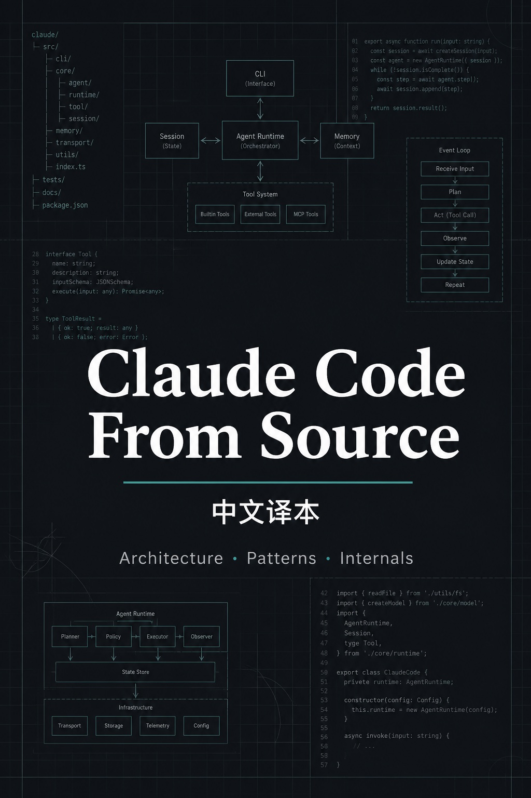

# Claude Code From Source（中文译本）



从源码出发，拆解 Claude Code 的生产级智能体架构。

本仓库是 [Claude Code from Source](https://claude-code-from-source.com/) 的**非官方中文翻译**。

[前言](PREFACE.md) · [第一章](chapter-01/README.md) · [术语表](GLOSSARY.md) · [原文](https://claude-code-from-source.com/)

## 本地预览

```bash
npm install
npm run serve
```

生成静态站点并校验：`npm run verify`。在线阅读：https://darion-yaphet.github.io/claude-code-from-source/
