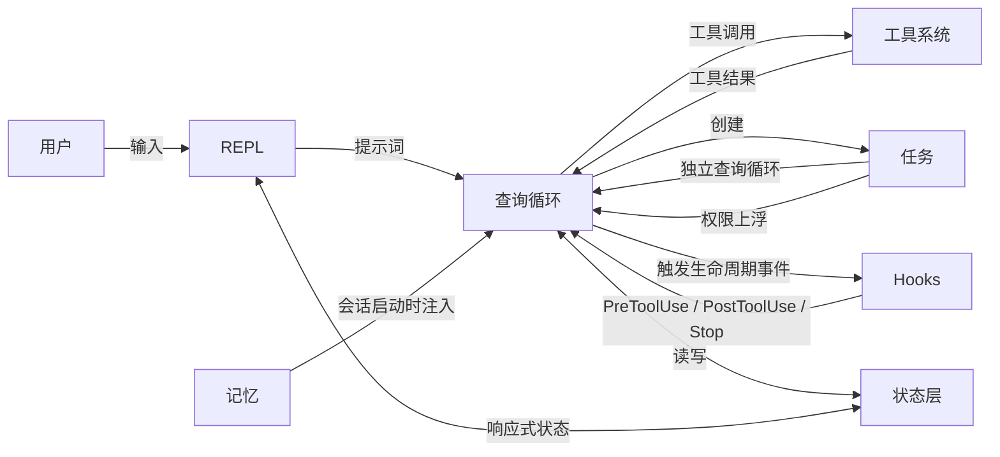
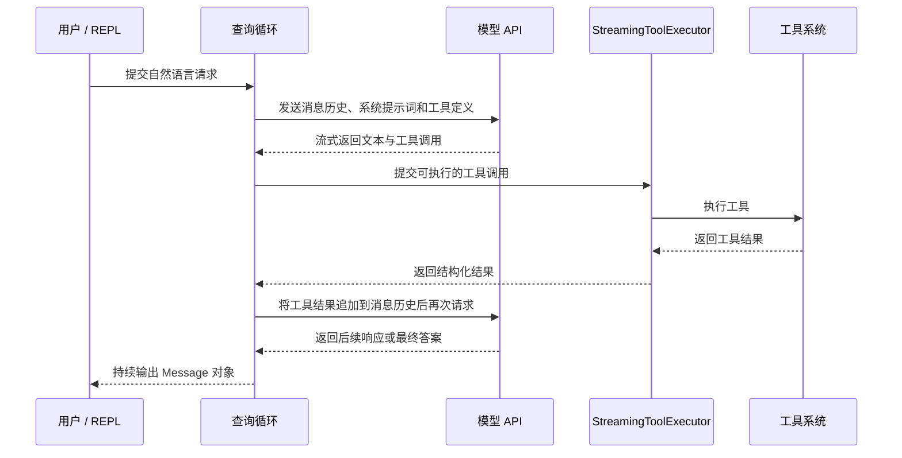
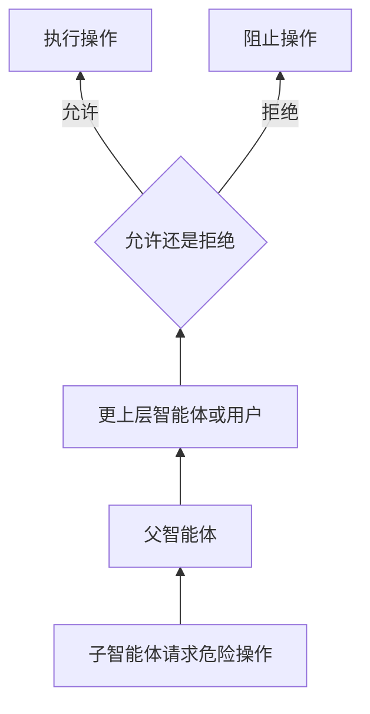
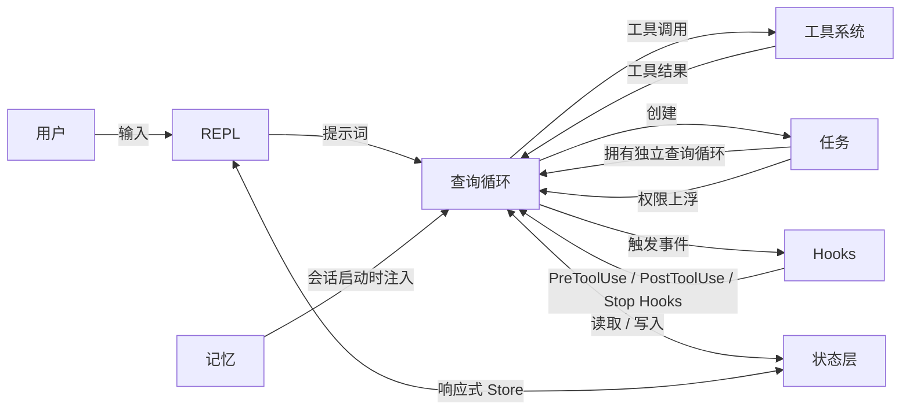

# 第一章：AI 智能体的架构

> 原文：[Ch 1. The Architecture of an AI Agent](https://claude-code-from-source.com/ch01-architecture/)


## 你正在看到什么

传统的命令行工具，本质上是一个函数。它接收参数、执行工作，然后退出。

`grep` 不会自行决定顺便再运行一次 `sed`。`curl` 也不会根据自己下载到的内容，主动打开某个文件并对其进行修改。它们遵循的契约非常简单：

> 一条命令，一项操作，产生确定性的输出。

智能体式命令行工具打破了这份契约中的每一个部分。

它接收一段自然语言提示词，决定应该使用哪些工具，按照当前情境所要求的任意顺序执行这些工具，评估执行结果，然后不断循环，直到任务完成，或者用户要求停止。

这里的“程序”不再是一组固定排列的指令，而是一个围绕大语言模型运行的循环。语言模型在运行时生成自己的指令序列。

工具调用构成了系统的副作用，模型的推理过程则构成了系统的控制流。

Claude Code 是 Anthropic 对这一理念的生产级实现。它是一个由将近两千个 TypeScript 文件组成的单体应用，把终端变成了一套由 Claude 驱动的完整开发环境。

Claude Code 已经交付给数十万名开发者使用，这意味着其中的每一个架构决策都会产生真实世界的后果。

本章将帮助你建立理解整个系统所需的心智模型。

整个系统可以由六个抽象概念来描述，一条统一的数据流将它们连接在一起。一旦你真正理解了从用户按键到最终输出之间的“黄金路径”，后续每一章都可以看作是对这条路径中某一个环节的放大观察。

接下来的内容是一种事后回顾式的拆解。

这六个抽象并不是项目开始时就在白板上提前设计好的。它们是在向大量用户交付一个生产级智能体的过程中，在各种现实压力之下逐渐形成的。

理解这些抽象现在实际是什么样子，而不是想象它们最初是如何规划的，能够帮助你对本书后续内容建立正确预期。

---

## 六个关键抽象

Claude Code 建立在六个核心抽象之上。

除此之外的所有部分，包括四百多个工具类文件、分叉维护的终端渲染器、Vim 模拟层和成本追踪器，都是为了支持这六个抽象而存在的。

原文提供了一张可拖动、可悬停并可点击的交互式关系图（见 [原文交互版](https://claude-code-from-source.com/ch01-architecture/)）。转换为静态 Markdown 后，可以将其概括为下面的关系：



其中：

- **QL**：Query Loop，查询循环
- **TS**：Tool System，工具系统
- **TK**：Tasks，任务
- **SL**：State Layer，状态层
- **HK**：Hooks，生命周期钩子
- **MM**：Memory，记忆
- **U**：User，用户
- **R**：REPL，交互式命令行环境

下面分别介绍每个抽象负责什么，以及它为什么存在。

### 1. 查询循环

相关文件：

```text
query.ts
```

代码规模约为 1,700 行。

查询循环是一个异步生成器，也是整个系统的心跳。

它会流式接收模型响应、收集工具调用、执行工具、把工具结果追加到消息历史中，然后再次循环。

所有交互方式最终都会经过这一个函数，包括：

- REPL 交互模式
- SDK 调用
- 子智能体
- 无界面的 `--print` 模式

查询循环会持续产出供 UI 消费的 `Message` 对象。

它的返回类型是一个名为 `Terminal` 的可辨识联合类型。这个类型能够精确表达查询循环为什么停止，包括：

- 正常完成
- 用户中止
- Token 预算耗尽
- Stop Hook 介入
- 达到最大轮次
- 出现不可恢复错误

系统选择生成器模式，而不是回调函数或事件发射器，是因为生成器天然具备以下优势：

- 自然的背压机制
- 清晰的取消方式
- 类型化的终止状态

第 5 章将完整介绍查询循环的内部实现。

### 2. 工具系统

相关文件和目录：

```text
Tool.ts
tools.ts
services/tools/
```

工具是智能体能够在外部世界中执行的任何动作，例如：

- 读取文件
- 运行 Shell 命令
- 编辑代码
- 搜索网络

这个定义听起来很简单，但背后隐藏着相当复杂的机制。

每一个工具都实现了一套内容丰富的接口，覆盖以下方面：

- 工具身份
- 输入 Schema
- 执行逻辑
- 权限
- 渲染方式

工具并不只是函数。

每个工具还携带自己的：

- 权限判断逻辑
- 并发声明
- 进度报告机制
- UI 渲染逻辑

系统会把工具调用划分为可并发执行的批次和必须串行执行的批次。

流式执行器甚至会在模型尚未完成整段响应之前，就开始执行那些被声明为并发安全的工具。

第 6 章将介绍完整的工具接口与执行流水线。

### 3. 任务

相关文件和目录：

```text
Task.ts
tasks/
```

任务是后台工作单元，主要用于承载子智能体。

任务遵循下面的状态机：

```text
pending
   ↓
running
   ↓
completed | failed | killed
```

也就是：

```text
等待中
   ↓
运行中
   ↓
已完成 | 已失败 | 已终止
```

`AgentTool` 会启动一个新的 `query()` 生成器，并为它配置独立的：

- 消息历史
- 工具集合
- 权限模式

任务赋予了 Claude Code 递归执行能力。

一个智能体可以把工作委派给子智能体，子智能体还可以继续向更深层的子智能体委派任务。

### 4. 状态

状态系统分为两个层级。

系统首先使用一个可变单例：

```text
STATE
```

这个单例保存大约 80 个会话级基础设施字段，例如：

- 当前工作目录
- 模型配置
- 成本追踪
- 遥测计数器
- 会话 ID

它会在程序启动时设置一次，之后通过直接修改来更新，不具备响应式能力。

系统还使用了一个最小化的响应式 Store。

这个 Store 只有约 34 行代码，整体形态类似 Zustand，用于驱动 UI，包括：

- 消息
- 输入模式
- 工具审批
- 进度指示器

这种分离是刻意设计的。

基础设施状态很少变化，不需要在每次变化时触发 UI 重新渲染。UI 状态则会持续变化，因此必须具备响应式能力。

第 3 章将深入讲解这种双层状态架构。

### 5. 记忆

相关目录：

```text
memdir/
```

记忆是智能体跨会话保留的持久上下文。

它分为三个层级：

1. **项目级记忆**  
   保存在代码仓库中的 `CLAUDE.md` 文件。

2. **用户级记忆**  
   保存在：

   ```text
   ~/.claude/MEMORY.md
   ```

3. **团队级记忆**  
   通过符号链接等方式共享。

在会话启动时，系统会扫描所有记忆文件，解析 Frontmatter，然后由一个大语言模型判断哪些记忆与当前对话相关。

记忆机制使 Claude Code 能够“记住”：

- 代码库约定
- 架构决策
- 调试历史

### 6. Hooks

相关文件和目录：

```text
hooks/
utils/hooks/
```

Hooks 是用户定义的生命周期拦截器。

它们会在 4 种执行类型中的 27 个不同事件上触发。

这 4 种执行类型包括：

- Shell 命令
- 单次 LLM 提示词
- 多轮智能体会话
- HTTP Webhook

Hooks 可以执行以下操作：

- 阻止工具执行
- 修改工具输入
- 注入额外上下文
- 直接短路整个查询循环

权限系统本身也有一部分通过 Hooks 实现。

例如，`PreToolUse` Hook 可以在交互式权限确认框出现之前，直接拒绝一次工具调用。

---

## 黄金路径：从按键到输出

现在跟踪一次完整请求在系统中的运行过程。

用户输入：

```text
add error handling to the login function
```

中文意思是：

```text
为登录函数添加错误处理
```

随后用户按下回车。

原文提供了一个可播放、可逐步执行和可重置的交互式动画（见 [原文交互版](https://claude-code-from-source.com/ch01-architecture/)），展示一次完整请求如何在大约 3.2 秒内经过以下组件：

- 用户 / REPL
- 查询循环
- 模型 API
- `StreamingToolExecutor`
- 工具系统

转换为静态 Markdown 后，可以使用下面的时序图表达：



观察这条流程时，有三件事情尤其值得注意。

### 第一，查询循环是生成器，而不是回调链

REPL 使用 `for await` 从查询循环中主动拉取消息。

这意味着系统天然具备背压能力。

如果 UI 来不及处理输出，生成器就会暂停。消费者按照自己的处理速度主动拉取数据，不需要再额外搭建复杂的流量控制机制。

这是一个经过刻意权衡的选择，系统没有使用事件发射器，也没有使用可观察流。

### 第二，工具执行与模型流式输出相互重叠

`StreamingToolExecutor` 不会等待模型生成完整响应后，才开始执行工具。

对于并发安全的工具，它可以提前开始执行。

例如，一次 `Read` 调用可能在模型仍在生成后续响应时，就已经完成并返回了结果。

这是一种推测执行。

在极少数情况下，模型最终完成的输出可能使先前的工具调用失效。出现这种情况时，工具结果会被丢弃。

### 第三，整个循环可以重新进入

当模型生成工具调用时，工具结果会被追加到消息历史中。

随后，查询循环会带着更新后的上下文再次调用模型。

系统不存在一个单独的“工具结果处理阶段”，所有步骤都发生在同一个循环内。

模型通过不再生成新的工具调用，来表示自己已经完成任务。

---

## 权限系统

Claude Code 能够在你的机器上运行任意 Shell 命令。

它能够：

- 编辑文件
- 创建子进程
- 发起网络请求
- 修改 Git 历史

如果没有权限系统，这将是一场安全灾难。

系统定义了七种权限模式，按照从最宽松到最严格的顺序排列如下：

| 模式 | 行为 |
|---|---|
| `bypassPermissions` | 允许一切操作，不执行任何检查，仅供内部或测试使用 |
| `dontAsk` | 允许所有操作，但仍然记录日志，不向用户弹出确认 |
| `auto` | 由基于对话记录的 LLM 分类器决定允许或拒绝 |
| `acceptEdits` | 文件编辑自动批准，其他修改类操作仍需确认 |
| `default` | 标准交互模式，由用户审批每一个操作 |
| `plan` | 只读模式，阻止所有修改操作 |
| `bubble` | 将权限决策升级给父智能体，主要用于子智能体模式 |

当一次工具调用需要权限时，系统会沿着严格的权限解析链进行判断。

原文提供了一个交互式权限解析器（见 [原文交互版](https://claude-code-from-source.com/ch01-architecture/)），可以选择工具类型、权限模式和 Hook 规则，然后查看最终解析结果。

静态 Markdown 可以将示例选项整理如下。

### 工具类型示例

```text
写入文件
```

### 权限模式示例

```text
default
```

### Hook 规则示例

```text
存在匹配的 Hook
```

### 解析结果示例

```text
标准交互模式，由用户审批每一个操作。
```

### 原文提供的预设场景

- `auto` 模式下读取文件
- `plan` 模式下执行 `Bash rm`
- 使用 Hook 覆盖规则写入文件
- `default` 模式下调用 MCP 工具
- 完全自动的 `dontAsk` 模式下运行 Bash
- 被 Hook 阻止的文件写入

权限模式再次按宽松程度列出如下：

| 顺序 | 模式 | 说明 |
|---:|---|---|
| 1 | `bypassPermissions` | 所有操作都允许，不检查，仅限内部或测试 |
| 2 | `dontAsk` | 所有操作都允许并记录日志，不向用户询问 |
| 3 | `auto` | LLM 对话记录分类器决定允许或拒绝 |
| 4 | `acceptEdits` | 文件编辑自动批准，其他修改操作需要确认 |
| 5 | `default` | 标准交互模式，用户批准每项操作 |
| 6 | `plan` | 只读，禁止所有修改 |
| 7 | `bubble` | 将决策上交给父智能体 |

### `auto` 模式

`auto` 模式值得特别关注。

它会发起一次独立的轻量级 LLM 调用，根据当前对话记录对工具调用进行分类。

分类器会看到工具输入的压缩表示，并判断这项操作是否与用户提出的要求一致。

正是这种模式使 Claude Code 能够进行半自主工作：

- 常规操作自动批准
- 看起来偏离用户意图的操作被标记出来

### 子智能体的 `bubble` 模式

子智能体默认使用 `bubble` 模式。

这意味着子智能体不能自行批准自己的危险操作。

权限请求会向上传递给父智能体，最终也可能继续传递给用户。

这种机制可以防止子智能体在用户完全没有看到的情况下，静默执行破坏性命令。



---

## 多提供商架构

Claude Code 可以通过四条不同的基础设施路径与 Claude 通信。

对于系统的其余部分而言，这些差异是透明的。

原文中的交互式架构图（见 [原文交互版](https://claude-code-from-source.com/ch01-architecture/)）可以转换为下面的 Mermaid 图：

```mermaid
flowchart TB
    DA[Direct API<br/>API Key 或 OAuth]
    BR[AWS Bedrock<br/>AWS 凭据与 SSO]
    VX[Google Vertex AI<br/>Google 身份认证]
    FD[Foundry<br/>自定义身份认证]

    DA --> FAC[getAnthropicClient()]
    BR --> FAC
    VX --> FAC
    FD --> FAC

    FAC --> SDK[Anthropic SDK<br/>无论提供商是谁，都暴露统一接口]
    SDK --> CM[callModel()<br/>带重试的流式 API 请求]
```

其中的关键洞察是，Anthropic SDK 为每个云服务提供商都提供了包装类。

这些包装类对外暴露的接口，与直接连接 Anthropic API 时使用的客户端接口相同。

`getAnthropicClient()` 工厂函数会：

1. 读取环境变量和配置
2. 判断应该使用哪个提供商
3. 创建相应客户端
4. 返回客户端实例

从这一刻开始，`callModel()` 以及所有其他调用方都会把它当作一个通用的 Anthropic Client。

提供商的选择会在程序启动时完成，并保存到 `STATE` 中。

查询循环从来不会检查当前激活的是哪一个提供商。

这意味着，从 Direct API 切换到 Bedrock，只是一次配置变更，而不是一次代码变更。

下面这些部分完全不需要感知提供商差异：

- 智能体循环
- 工具系统
- 权限模型

它们都是提供商无关的。

---

## 构建系统

Claude Code 既作为 Anthropic 的内部工具发布，也作为公开的 npm 软件包发布。

同一个代码库同时服务于这两种发行方式，由编译期 Feature Flag 控制最终包含哪些功能。

```javascript
// 由功能开关保护的条件导入
const reactiveCompact = feature('REACTIVE_COMPACT')
  ? require('./services/compact/reactiveCompact.js')
  : null
```

`feature()` 函数来自 `bun:bundle`，也就是 Bun 内置的 Bundler API。

在构建时，每个 Feature Flag 都会被解析为布尔字面量。

随后，打包器会执行死代码消除。

如果某个开关为 `false`，相应的 `require()` 调用会被彻底移除：

- 模块不会被加载
- 模块不会进入打包产物
- 模块不会被发布

整个代码库一直使用同一种模式：

> 在顶层使用 `feature()` 条件保护一个 `require()` 调用。

这里特意使用 `require()`，而不是 `import`。

原因是，当条件为 `false` 时，打包器可以完整移除动态 `require()`。

动态 `import()` 则无法被同样处理，因为它会返回一个 Promise，而打包器必须保留这个 Promise 所对应的结构。

这里还有一件颇具讽刺意味的事情。

早期 npm 版本发布的 Source Map 中包含 `sourcesContent`。

`sourcesContent` 保存了完整的原始 TypeScript 源代码，其中也包括只供内部使用的代码路径。

Feature Flag 成功从运行时产物中移除了这些代码，却没有把源代码从 Source Map 中移除。

Claude Code 的源代码正是因此变得可以被公开阅读。

---

## 各部分如何连接

六个抽象共同构成了一张依赖关系图。



记忆会作为系统提示词的一部分进入查询循环。

查询循环驱动工具执行。

工具结果以消息形式返回查询循环。

任务是递归的查询循环，同时拥有相互隔离的消息历史。

Hooks 会在预先定义的节点拦截查询循环。

状态会被所有部分读取和写入，响应式 Store 则在状态层与 UI 之间建立桥梁。

查询循环与工具系统之间的环形依赖，是整个系统最具代表性的特征：

```text
模型生成工具调用
        ↓
工具执行并产生结果
        ↓
结果被追加到消息历史
        ↓
模型看到结果并决定下一步
        ↓
继续生成工具调用或结束任务
```

这个循环会一直继续，直到出现以下任一条件：

- 模型停止生成工具调用
- Token 预算耗尽
- 达到最大轮次
- 用户中止

这些抽象也构成了后续各章之间的联系。

从输入到输出的黄金路径，是贯穿整本书的主线：

- 第 2 章追踪系统如何启动，直到这条路径具备执行条件
- 第 3 章解释这条路径所读写的双层状态架构
- 第 4 章介绍查询循环所调用的 API 层
- 后续每一章都会放大观察刚才端到端路径中的某一个部分

---

## 将这些模式应用到自己的系统中

如果你正在构建一个智能体系统，也就是任何由 LLM 在运行时决定采取哪些行动的系统，那么 Claude Code 架构中的以下模式都具有迁移价值。

### 生成器循环模式

使用异步生成器实现智能体循环，不要使用回调函数或事件发射器。

生成器能够提供：

- 自然的背压能力，消费者按照自己的速度拉取数据
- 清晰的取消方式，可以对生成器调用 `.return()`
- 用于表达终止状态的类型化返回值

它解决的问题是，在基于回调的智能体循环中，人们很难确定循环什么时候真正“结束”，也很难确定它为什么结束。

生成器使终止成为类型系统中的一等概念。

### 自描述工具接口

每一个工具都应该自行声明：

- 自己是否支持并发安全执行
- 自己需要什么权限
- 自己应当如何渲染

不要把这些逻辑放进一个“了解所有工具”的中央编排器。

这一模式解决的问题是，中央编排器最终会变成一个“上帝对象”。每增加一个工具，都必须修改中央编排器。

自描述工具可以近似线性扩展。

增加第 N+1 个工具时，不需要修改前面已经存在的任何工具。

### 分离基础设施状态与响应式状态

并非所有状态都应该触发 UI 更新。

下面这些内容适合放在普通的可变对象中：

- 会话配置
- 成本追踪
- 遥测信息

下面这些内容适合放进响应式 Store：

- 消息历史
- 进度指示器
- 审批队列

这一模式解决的问题是，如果让所有状态都具备响应式能力，就会为那些只在启动时变化一次、随后被读取上千次的状态增加订阅开销和额外复杂度。

双层状态架构分别匹配了两种不同的访问模式。

### 使用权限模式，而不是零散权限检查

定义少量具名权限模式，例如：

```text
plan
default
auto
bypass
```

让所有权限决策都通过当前模式统一解析。

不要在各个工具实现中散落下面这样的判断：

```javascript
if (isAllowed) {
  // ...
}
```

这一模式解决的是权限执行不一致的问题。

当所有工具都经过相同的模式化权限解析链时，只要知道当前激活的是哪种模式，就可以推断整个系统的安全状态。

### 通过任务实现递归智能体架构

子智能体应该是同一个智能体循环的新实例，并拥有自己的消息历史。

不要为子智能体单独编写一套特殊代码路径。

权限升级通过 `bubble` 模式向上传递。

这一模式解决的是子智能体逻辑逐渐偏离主智能体循环的问题。

一旦两套路径发生分化，它们在行为和错误处理方式上就容易出现细微而危险的差异。

如果子智能体运行的仍然是同一个循环，它就会自动继承主循环的全部保证。

---

## 本章要点

Claude Code 的架构可以归纳为以下核心结构：

1. 一个异步生成器实现的查询循环负责驱动整个系统。
2. 工具是自描述对象，而不只是普通函数。
3. 子智能体通过任务创建新的查询循环实例。
4. 基础设施状态与 UI 响应式状态被明确分离。
5. 记忆在会话启动时被选择并注入系统提示词。
6. Hooks 在生命周期节点拦截、修改或终止执行。
7. 所有危险副作用都通过统一的权限模式解析。
8. 模型、工具结果和消息历史构成一个持续重新进入的闭环。

系统最核心的循环是：

```text
模型决定行动
   ↓
工具执行行动
   ↓
系统返回结果
   ↓
模型根据结果决定下一步
```

理解这条循环，就拥有了阅读 Claude Code 其余架构的钥匙。
