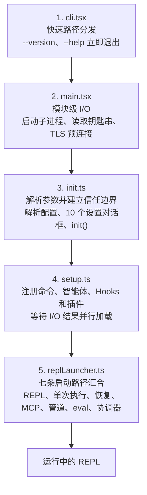

# 第二章：快速启动：引导流水线

> 原文：[Ch 2. Starting Fast — The Bootstrap Pipeline](https://claude-code-from-source.com/ch02-bootstrap/)


如果说第 1 章提供了 Claude Code 的架构地图，那么本章展示的，就是它抵达可工作状态时所走的路线。

六个核心抽象中的每一个组件，包括查询循环、工具系统、状态层、Hooks 和记忆系统，都必须在用户看到光标之前完成初始化。

留给这一切的时间预算只有：

> **300 毫秒。**

300 毫秒是人类通常会把一个工具感知为“即时响应”的临界点。超过这个时间，命令行工具就会显得迟钝；如果慢得太多，开发者甚至会停止使用它。

本章介绍的一切设计，都是为了让启动时间保持在这条临界线以内。

引导过程必须完成四件事：

1. 验证运行环境；
2. 建立安全边界；
3. 配置通信层；
4. 渲染用户界面。

而且，这四件事都必须在 300 毫秒之内完成。

其中的架构洞察在于：这四项工作可以部分重叠执行，可以经过精心排序，也可以大胆删减。通过这些手段，即使面对如此复杂的系统，也能把启动过程压进一个看起来几乎不可能实现的时间预算中。

> **方法说明**
>
> 本章中的时间数据都是近似值，来源于代码库自身的性能分析检查点。它们代表现代硬件上典型的热启动耗时。冷启动会更慢。
>
> 与绝对数值相比，更重要的是各操作之间的相对结构：哪些操作能够重叠，哪些操作会阻塞，以及哪些操作被推迟执行。

---

## 流水线的整体形态

启动流水线分布在五个文件中，并按照固定顺序执行。

每经过一个文件，系统都会进一步缩小后续工作所需处理的范围。



五个文件的职责如下：

| 顺序 | 文件 | 主要职责 |
|---:|---|---|
| 1 | `cli.tsx` | 快速路径分发，处理 `--version`、`--help` 等无需完整启动的命令 |
| 2 | `main.tsx` | 在模块求值阶段启动耗时 I/O，例如子进程、钥匙串读取和 TLS 预连接 |
| 3 | `init.ts` | 解析参数、解析配置并建立信任边界 |
| 4 | `setup.ts` | 注册命令、智能体、Hooks、插件和其他能力 |
| 5 | `replLauncher.ts` | 根据运行模式选择入口并启动界面或无界面查询循环 |

每个文件只完成将控制权交给下一个文件之前所必需的最少工作。

- `cli.tsx` 会尽量在导入任何重量级模块之前直接退出；
- `main.tsx` 会在模块求值期间，通过副作用提前启动耗时操作；
- `init.ts` 负责解析配置并建立信任边界；
- `setup.ts` 负责注册系统能力；
- `replLauncher.ts` 选择正确的入口并启动用户界面。

Claude Code 使用了三种并行策略来提高启动速度。

### 1. 模块级子进程分发

在模块求值期间，以副作用的形式发起钥匙串读取和 MDM 读取。

这些子进程会在其余约 135 毫秒的静态模块导入过程中并行运行。

### 2. Setup 阶段的 Promise 并行

下列工作会尽可能并行执行：

- Socket 绑定；
- Hook 快照生成；
- 命令加载；
- 智能体定义加载。

### 3. 首次渲染后的延迟预取

所有用户在输入第一条消息之前并不需要的数据，都会等到提示符已经显示之后再加载，例如：

- Git 状态；
- 模型能力；
- AWS 凭据。

还有第四种策略不太显眼，但同样重要：

### 4. 使用动态导入推迟模块求值

代码库至少在十几个位置使用下面的形式：

```javascript
await import('./module.js')
```

这样可以避免在真正需要模块之前就加载它。

例如：

- OpenTelemetry 只有在遥测初始化时才加载；
- 约 400 KB 的 OpenTelemetry 代码和约 700 KB 的 gRPC 代码不会进入普通启动路径；
- React 组件只有在需要渲染时才加载。

每一次动态导入都在交换两种性能：

- **冷路径延迟**：第一次使用时必须执行模块求值；
- **热路径速度**：启动时无需为可能永远不会使用的模块付出成本。

---

## 阶段 0：快速路径分发（`cli.tsx`）

进程进入的第一个文件是 `cli.tsx`。

它只有一个任务：

> 判断是否真的需要执行完整的引导流水线。

许多调用只需要返回一个具体结果，不需要加载整个系统，例如：

```bash
claude --version
claude --help
claude mcp list
```

对于这些命令，加载 React、初始化遥测、读取钥匙串以及建立工具系统，都是纯粹的浪费。

这里采用的模式是：

1. 检查 `argv`；
2. 只动态导入当前需要的处理器；
3. 在系统其余部分加载之前直接退出。

```javascript
// 快速路径模式的伪代码
if (args.length === 1 && args[0] === '--version') {
  const { printVersion } = await import('./commands/version.js')
  await printVersion()
  process.exit(0)
}
```

系统中大约有十几条快速路径，覆盖：

- 版本信息；
- 帮助信息；
- 配置管理；
- MCP 服务器管理；
- 更新检查。

具体有多少条路径并不重要，真正重要的是这种模式。

每一条快速路径都只会：

1. 动态导入一个模块；
2. 调用一个函数；
3. 退出进程。

代码库的其余部分根本不会被加载。

这也是引导过程中反复出现的一条原则：

> **通过更准确地了解用户意图，减少系统需要完成的工作。**

`argv` 数组揭示了用户的意图。

如果用户意图非常明确且范围狭窄，那么执行路径也应该同样狭窄。

如果没有任何快速路径匹配，`cli.tsx` 就会继续导入完整的 `main.tsx`，真正的启动流程由此开始。

---

## 阶段 1：模块级 I/O（`main.tsx`）

当 `main.tsx` 被导入时，它在模块作用域中的副作用会立刻执行。

这些操作发生在文件中的任何函数被调用之前。

这是整个引导流水线中对性能影响最大的一项技术。

```javascript
// 这些操作在模块导入时运行，而不是在函数调用时运行
const mdmPromise = startMDMSubprocess()
const keychainPromise = readKeychainCredentials()
```

当 JavaScript 引擎继续对 `main.tsx` 及其传递依赖进行求值时，这两个 Promise 已经开始执行。

整个模块求值过程大约需要 138 毫秒。

与此同时：

- MDM（Mobile Device Management，移动设备管理）子进程正在检查组织安全策略；
- 钥匙串读取操作正在获取已经保存的凭据。

这两项操作都属于 I/O 密集型任务。

如果不提前启动，它们就会在关键路径上依次串行执行。

这里的核心洞察是：

> **模块求值并不是空闲时间，它可以和 I/O 操作重叠使用。**

等到 `main.tsx` 导出的函数第一次真正被调用时，这些 Promise 往往已经执行完成。

采用这种技术，需要在相关文件中有控制地绕过 ESLint 对以下行为的限制：

- 顶层 `await`；
- 模块作用域副作用。

代码库还专门为 `process.env` 的访问方式编写了自定义 ESLint 规则。

这条规则允许在模块作用域中执行经过控制的副作用，同时阻止其他位置出现不可控的副作用。

---

## 阶段 2：解析与信任（`init.ts`）

`init()` 函数经过了记忆化处理。

多次调用它是安全的，并且每次都会返回相同的结果。

这一点非常重要，因为多个不同入口都可能调用 `init()`，例如：

- REPL 模式；
- Print 模式；
- SDK 模式。

记忆化机制可以保证初始化过程实际只执行一次。

`init()` 会完成以下工作：

1. 使用 Commander 解析命令行参数；
2. 从多个来源加载配置；
3. 到达整个启动流水线中最重要的边界。

配置来源包括：

- 全局设置；
- 项目设置；
- 环境变量。

这个最重要的边界就是信任边界。

---

## 信任边界

在信任边界建立之前，系统只能在受限模式下运行。

信任边界建立之后，系统的完整能力才会开放。

之所以需要这条边界，是因为 Claude Code 会读取环境变量，而环境变量可能已经被恶意污染。

原文用一张交互图展示了信任边界前后的工作（见 [原文交互版](https://claude-code-from-source.com/ch02-bootstrap/)）。

整理为静态 Markdown 后如下。

### 信任之前

1. TLS Socket 预连接；
2. 加载环境变量；
3. 检查快速路径，例如 `--version`、`--help`；
4. 启动子进程，例如读取 Git 状态；
5. 读取钥匙串；
6. 此时尚未访问用户数据。

### 信任边界中的操作

- 接受服务条款；
- 登录或身份认证；
- “信任此设备”提示；
- 设置对话框，共 10 个。

### 信任之后

1. 解析 CLI 参数；
2. 解析配置；
3. 加载命令、智能体和 Hooks；
4. 初始化 MCP 服务器；
5. 构建系统提示词；
6. 启动 REPL 或单次执行模式；
7. 完整初始化继续进行。


信任边界并不是要求用户信任 Claude Code。

它真正要解决的问题是：

> **Claude Code 是否可以信任当前运行环境。**

恶意的 `.bashrc` 文件可以设置 `LD_PRELOAD`，从而向每一个子进程中注入代码。

信任对话框确保用户明确同意在当前目录中运行 Claude Code，因为这个目录可能由其他人配置过。

系统中共有十种不同的信任敏感操作。

在用户接受信任对话框之前，只允许运行安全操作，例如：

- TLS 证书配置；
- 主题偏好设置；
- 遥测退出设置。

在信任建立之后，系统才会：

- 读取可能具有危险性的环境变量；
- 执行 Git 命令；
- 应用完整的环境配置。

可能具有危险性的环境变量包括：

```text
PATH
LD_PRELOAD
NODE_OPTIONS
```

---

## `preAction` Hook

Commander 的 `preAction` Hook 是整个架构中的关键枢纽。

Commander 可以只解析命令结构，而不立即执行任何操作。

命令结构包括：

- Flag；
- 子命令；
- 位置参数。

`preAction` Hook 会在解析完成之后、匹配到的命令处理器运行之前触发。

```javascript
program.hook('preAction', async (thisCommand) => {
  await init(thisCommand)
})
```

这种分离带来了一个重要结果：

- 由 `cli.tsx` 在 Commander 加载之前处理的快速路径命令，不需要承担 `init()` 的成本；
- 只有真正需要完整运行环境的命令，才会触发初始化。

---

## 阶段 3：设置（`setup.ts`）

`init()` 完成之后，`setup()` 会注册系统需要的全部能力。

原文中的时间图显示，Setup 阶段的大部分操作都在并行执行（见 [原文交互版](https://claude-code-from-source.com/ch02-bootstrap/)）。

| 操作 | 约耗时 |
|---|---:|
| 加载命令 | 10 ms |
| 加载智能体 | 8 ms |
| 加载 Hooks | 10 ms |
| 加载插件 | 10 ms |
| 初始化 MCP | 17 ms |

总墙钟时间约为：

```text
25 ms
```

如果完全串行执行，总耗时大约会达到：

```text
70 ms
```

可以把这组并行关系表示为：

```text
0ms       5ms       10ms      15ms      20ms      25ms      30ms
│─────────│─────────│─────────│─────────│─────────│─────────│

命令加载：  [──────────]                         10ms
智能体加载：[────────]                            8ms
Hook 加载： [──────────]                         10ms
插件加载：  [──────────]                         10ms
MCP 初始化：[─────────────────]                  17ms

并行墙钟时间：约 25ms
完全串行时间：约 70ms
```

命令、智能体、Hooks 和插件都会在条件允许时并行注册。

Setup 阶段是系统发生状态转换的地方。

在它之前，系统只是：

> “我知道自己的配置是什么。”

在它之后，系统变成：

> “我已经拥有全部可用能力。”

Setup 完成之后：

- 每一个工具都已经注册；
- 每一个 Hook 都已经连接；
- 系统已经能够处理用户输入。

### 安全 Hook 快照

Setup 阶段还会处理安全 Hook 快照。

Hook 配置只会从磁盘读取一次，然后被冻结为不可变快照。

在当前会话的剩余时间里，系统始终使用这份快照。

如果之后磁盘上的 Hook 配置文件发生变化，系统会忽略这些变化。

这样可以防止攻击者在会话启动之后修改 Hook 规则。

对于权限决策而言，这份被冻结的快照是唯一可信的数据源。

---

## 阶段 4：启动（`replLauncher.ts`）

七条不同的代码路径最终都会汇合到 `replLauncher.ts`：

1. 交互式 REPL；
2. Print 模式，即 `--print`；
3. SDK 模式；
4. Resume 模式，即 `--resume`；
5. Continue 模式，即 `--continue`；
6. Pipe 模式；
7. Headless 无界面模式。

启动器会检查 `init()` 生成的配置，然后把控制权分发给正确的入口。

下面两个例子展示了这些启动路径之间的差异。

### 交互式 REPL

这是最标准的使用场景。

启动器会：

1. 挂载 React/Ink 组件树；
2. 启动终端渲染器；
3. 进入事件循环。

用户随后会看到输入提示符，并可以开始输入。

### Print 模式（`--print`）

该模式会从 `argv` 中读取一条提示词。

启动器会：

1. 创建一个没有 React 组件树的无界面查询循环；
2. 运行查询循环直到结束；
3. 将输出以流式方式写入 `stdout`；
4. 退出进程。

两种模式使用的是同一个智能体循环，只是展示方式不同。

这里最重要的细节是：

> **全部七条路径最终都会调用 `query()`。**

它们使用的是第 1 章介绍的同一个智能体循环。

启动路径决定的是循环如何呈现：

- 交互式终端；
- 单次执行；
- SDK 协议。

它不会改变查询循环实际做什么。

这种汇合结构使系统更加容易测试，也更加可预测。

无论用户通过哪种方式启动 Claude Code，核心行为都保持一致。

```mermaid
flowchart TD
    A[交互式 REPL] --> Q[query()]
    B["--print"] --> Q
    C[SDK 模式] --> Q
    D["--resume"] --> Q
    E["--continue"] --> Q
    F[Pipe 模式] --> Q
    G[Headless 模式] --> Q

    Q --> O[根据入口选择不同输出形式]
```

---

## 启动时间线

完整流水线的时间结构如下。

原文给出的总体对比为（交互时间线见 [原文交互版](https://claude-code-from-source.com/ch02-bootstrap/)）：

```text
串行执行：约 800ms
并行执行：约 240ms
性能提升：约 70%
```

### 主要阶段

| 阶段 | 图中耗时 |
|---|---:|
| 快速路径检查 | 5 ms |
| 模块加载 | 80 ms |
| `init()` | 15 ms |
| `setup()` | 35 ms |
| 第一次 API 调用 | 110 ms |

### 重叠执行的并行 I/O

| 并行操作 | 图中耗时 |
|---|---:|
| 获取 Git 状态 | 50 ms |
| 读取 `CLAUDE.md` | 25 ms |
| TCP 与 TLS 预连接 | 80 ms |

可以用下面的静态时间线近似表达：

```text
时间          0ms        50ms       100ms      150ms      200ms     240ms
              │──────────│──────────│──────────│──────────│─────────│

主要阶段
快速检查      [5ms]
模块加载          [────────────── 80ms ──────────────]
init()                                             [── 15ms ──]
setup()                                                [──── 35ms ────]
首次 API 调用                                             [──────── 110ms ────────]

并行 I/O
Git 状态       [──────── 50ms ────────]
CLAUDE.md      [─── 25ms ───]
TCP+TLS        [────────────── 80ms ──────────────]
```

关键路径会经过：

1. 模块求值；
2. Commander 参数解析；
3. `init()`；
4. `setup()`。

其中，模块求值是耗时最长的单个阶段，约为 138 毫秒。

MDM 和钥匙串读取等并行 I/O 会与模块求值重叠，通常在系统真正需要它们之前就已经完成。

---

## 性能预算

| 阶段 | 时间 | 执行内容 |
|---|---:|---|
| 快速路径检查 | 约 5 ms | 检查 `argv`，条件允许时提前退出 |
| 模块求值 | 约 138 ms | 导入模块树，同时发起并行 I/O |
| Commander 解析 | 约 3 ms | 解析 Flag 和子命令 |
| `init()` | 约 14 ms | 解析配置并建立信任边界 |
| `setup()` | 约 35 ms | 加载命令、智能体、Hooks 和插件 |
| 启动与首次渲染 | 约 25 ms | 选择路径、挂载 React、完成第一次绘制 |
| **总计** | **约 240 ms** | **低于 300 ms 预算** |

在现代机器上，总启动时间大约为 240 毫秒。

这意味着在 300 毫秒预算以内，还保留了约 60 毫秒余量。

冷启动时，例如机器刚刚重启、操作系统缓存为空，模块求值可能增加到 200 毫秒以上，使总时间更接近预算上限。

---

## 迁移系统

在 `init()` 期间，还会运行一个值得简要介绍的子系统：

> Schema 迁移系统。

Claude Code 会把配置和会话数据保存在本地文件及目录中。

当不同版本之间的数据格式发生变化时，系统会在启动阶段自动执行迁移。

每一个迁移都是一个带版本号的函数。

系统会：

1. 检查当前 Schema 版本；
2. 找出最高的迁移版本；
3. 按顺序执行所有尚未完成的迁移；
4. 更新当前版本号。

所有迁移都具备两个特点：

- 幂等；
- 执行速度快。

这些迁移只处理较小的本地文件，而不是大型数据库。

整个迁移过程通常可以在 5 毫秒以内完成。

如果某个迁移失败，系统会：

1. 记录错误；
2. 继续启动。

对于本地配置而言，系统选择：

> **可用性优先于严格一致性。**

---

## 启动过程对系统设计的启示

引导流水线本质上是一场不断缩小范围的练习。

每个阶段都在减少后续仍然存在的可能性。

### 阶段 0

从：

> 任意一种 CLI 调用

缩小为：

> 是否需要完整引导。

### 阶段 1

从：

> 所有内容都必须加载

缩小为：

> 在加载过程中与 I/O 并行执行。

### 阶段 2

从：

> 未知且不可信的运行环境

缩小为：

> 已信任、已配置的运行环境。

### 阶段 3

从：

> 尚未具备任何能力

缩小为：

> 所有能力均已完成注册。

### 阶段 4

从：

> 七种可能的运行模式

缩小为：

> 一条具体启动路径。

当 REPL 完成渲染时，所有关键决策都已经作出。

查询循环接收到的是一个完全配置好的运行环境。

此时不会再有以下歧义：

- 当前处于什么模式；
- 哪些工具可用；
- 应当应用哪些权限。

300 毫秒预算不仅是一个性能目标。

它还是一种强制约束，防止引导系统逐渐退化为懒初始化架构。

在懒初始化架构中，关键决策可能被无限推迟，并散落到整个代码库的各个角落。

而严格的启动预算迫使系统在一个清晰、集中且可追踪的流水线中完成这些决策。

---

## 应用这些设计

如果你正在设计自己的启动系统，Claude Code 的引导流水线提供了以下可以迁移的模式。

### 让 I/O 与初始化重叠

在真正需要耗时操作之前，就提前启动它们，例如：

- 创建子进程；
- 读取凭据；
- 执行网络检查。

可以在模块求值阶段发起这些操作。

JavaScript 引擎无论如何都需要执行同步模块加载，因此可以利用这段时间并行完成 I/O。

推荐模式如下：

```javascript
const promise = startSlowThing()

// 继续执行其他初始化工作

const result = await promise
```

在文件顶部发起操作，在真正使用结果的位置等待它。

### 尽可能早地缩小范围

引导流水线中的五个文件共同形成了一个漏斗。

每一个阶段都会排除后续阶段不再需要执行的工作。

快速路径分发是最明显的例子，但这条原则适用于任何系统。

如果在参数解析阶段就可以判断某条代码路径没有必要执行，那么就直接跳过它。

### 明确建立信任边界

如果你的应用需要读取自己无法控制的运行环境，例如：

- 环境变量；
- 配置文件；
- Shell 设置；

那么应该明确划分两类操作：

1. 用户同意之前可以安全读取的内容；
2. 只有获得用户同意之后才能读取的内容。

信任边界可以阻止一类攻击：恶意环境在用户有机会评估它之前，就已经污染了应用程序。

### 对初始化函数进行记忆化

让初始化过程具备幂等性。

多次调用初始化函数时，应返回相同结果，而不是重复执行初始化工作。

当多个入口都可能触发初始化时，这种设计可以消除顺序相关的 Bug。

记忆化模式本身很简单，却能消灭整整一类重复初始化问题。

### 在让出控制权之前捕获早期输入

在事件驱动系统中，如果用户输入在初始化期间到达，它可能会丢失。

Claude Code 会在任何异步工作开始之前，就从 `argv` 中捕获初始提示词。

这样可以确保下面的命令不会因为初始化时间比预期更长，而丢失用户输入：

```bash
claude "fix the bug"
```

中文含义是：

```text
claude "修复这个 Bug"
```

---

## 本章总结

Claude Code 的启动性能并不是来自某一个神奇优化，而是来自一组彼此配合的架构选择：

1. 使用快速路径避免不必要的完整启动；
2. 在模块求值期间提前发起 I/O；
3. 使用 Promise 并行注册系统能力；
4. 将非关键数据推迟到首屏渲染之后加载；
5. 使用动态导入缩减启动模块；
6. 在完整初始化前建立明确的信任边界；
7. 让多个运行入口最终汇合到同一个 `query()` 循环；
8. 通过严格的 300 毫秒预算，迫使初始化保持集中和清晰。

整条流水线可以压缩为：

```text
识别用户意图
      ↓
尽早跳过无关工作
      ↓
让 I/O 与模块加载重叠
      ↓
建立信任并解析配置
      ↓
并行注册全部能力
      ↓
选择唯一启动路径
      ↓
显示提示符
```

Claude Code 用大约 240 毫秒完成了这一过程。

对于一个拥有查询循环、工具系统、权限控制、Hooks、记忆、插件和多种运行模式的生产级智能体而言，这不是简单的“启动很快”。

它更像是一场经过精密编排的百米接力：每一棒都只跑自己必须跑的距离，并在最合适的瞬间把控制权交给下一棒。
