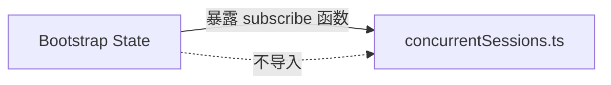
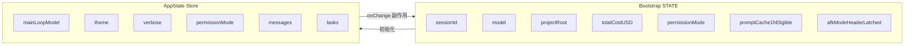
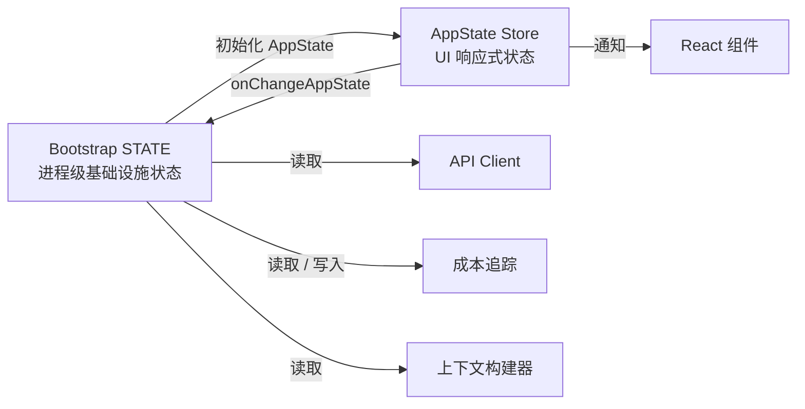
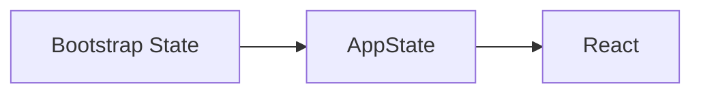
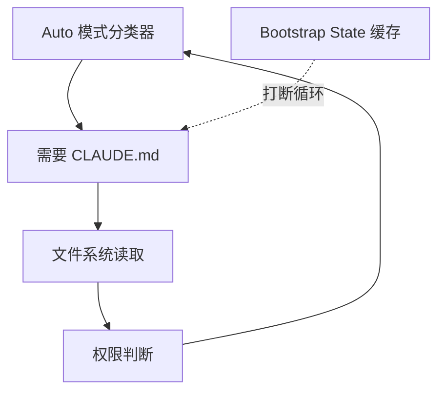
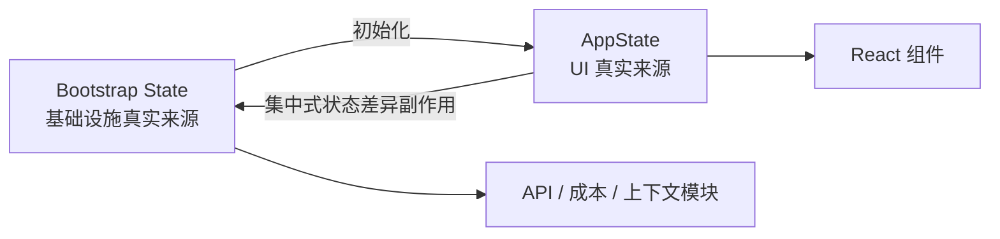

# 第三章：状态：双层架构

第 2 章追踪了 Claude Code 从进程启动到首次渲染的完整引导流水线。

在这一过程结束时，系统已经拥有一个配置完整的运行环境。

但这个环境究竟配置了什么？

- 会话 ID 保存在哪里？
- 当前模型保存在哪里？
- 消息历史保存在哪里？
- 成本追踪器保存在哪里？
- 权限模式保存在哪里？
- 状态究竟应该存在什么地方？
- 为什么它必须存在那里？

每一个长期运行的应用，最终都会面对这些问题。

对于简单的命令行工具，答案很直接：在 `main()` 中定义几个变量即可。

但 Claude Code 并不是一个简单的命令行工具。

它同时具备以下特征：

- 它是一个通过 Ink 渲染的 React 应用；
- 单个进程可能持续运行数小时；
- 插件系统可能在任意时刻加载；
- API 层必须根据缓存的上下文构建提示词；
- 成本追踪器需要跨进程重启恢复；
- 数十个基础设施模块需要读写共享数据，但又不能相互导入。

最直接的方案是使用一个全局 Store，但这种方案会立刻失败。

如果成本追踪器和驱动 React 重新渲染的状态共用同一个 Store，那么每次 API 调用都会触发整棵组件树的协调与比较。

而基础设施模块，例如：

- 启动引导；
- 上下文构建；
- 成本追踪；
- 遥测；

都不能依赖 React。

这些模块可能：

- 在 React 挂载之前运行；
- 在 React 卸载之后运行；
- 在根本不存在组件树的环境中运行。

如果把所有状态都放进一个能够感知 React 的 Store，就会在整个模块导入图中制造循环依赖。

Claude Code 使用一套双层架构来解决这个问题：

1. 一个可变的进程级单例，用于保存基础设施状态；
2. 一个极简响应式 Store，用于保存 UI 状态。

本章将解释这两个层级、连接它们的副作用系统，以及依赖这套基础设施的其他子系统。

后续章节都会默认你已经理解：

> 状态保存在哪里，以及为什么它必须保存在那里。

---

## 3.1 引导状态：进程级单例

### 为什么使用可变单例

引导状态模块位于：

```text
bootstrap/state.ts
```

它是在进程启动时创建的一份可变对象：

```typescript
const STATE: State = getInitialState()
```

在这行代码上方的注释写着：

```text
AND ESPECIALLY HERE
```

而在类型定义上方两行，还有另一条注释：

```text
DO NOT ADD MORE STATE HERE - BE JUDICIOUS WITH GLOBAL STATE
```

中文大意是：

```text
尤其不要随便在这里添加状态。
不要继续往这里增加更多状态，使用全局状态时务必谨慎。
```

这些注释带着一种鲜明的语气：工程师们显然已经亲身付出过“全局对象失去治理”所带来的代价。

在这里，可变单例是正确选择，主要有三个原因。

### 原因一：必须在所有框架初始化之前可用

引导状态必须在以下事件之前就可以访问：

- React 挂载之前；
- 响应式 Store 创建之前；
- 插件加载之前。

只有模块作用域初始化，才能保证模块在被导入时状态就已经存在。

### 原因二：这些数据天然属于进程作用域

这一层保存的数据包括：

- 会话 ID；
- 遥测计数器；
- 成本累计值；
- 已缓存路径。

对于这些数据而言，并不存在有意义的：

- “前一个状态”；
- 差异比较；
- 订阅者通知；
- 撤销历史。

它们只需要在当前进程生命周期中被读取和修改。

### 原因三：该模块必须是依赖图中的叶节点

`bootstrap/state.ts` 必须保持为模块依赖有向无环图中的叶节点。

它不能导入：

- React；
- UI Store；
- 任何服务模块。

否则就会形成循环依赖，并破坏第 2 章介绍的启动顺序。

通过只依赖少量工具类型和 `node:crypto`，这个模块可以被系统中的任何位置安全导入。

---

## 大约 80 个字段

`State` 类型包含大约 80 个字段。

抽取其中一部分，可以看出这一层状态覆盖的范围非常广。

### 身份与路径

包括：

```text
originalCwd
projectRoot
cwd
sessionId
parentSessionId
```

其中，`originalCwd` 会在进程启动时：

1. 通过 `realpathSync` 解析真实路径；
2. 执行 NFC Unicode 规范化；
3. 之后不再发生变化。

### 成本与指标

包括：

```text
totalCostUSD
totalAPIDuration
totalLinesAdded
totalLinesRemoved
```

这些值会在整个会话期间单调累加，并在进程退出时持久化到磁盘。

### 遥测

包括：

```text
meter
sessionCounter
costCounter
tokenCounter
```

这些字段保存 OpenTelemetry 相关句柄。

它们全部允许为 `null`，因为在遥测系统完成初始化之前，这些对象还不存在。

### 模型配置

包括：

```text
mainLoopModelOverride
initialMainLoopModel
```

当用户在会话中途切换模型时，系统会设置 `mainLoopModelOverride`。

### 会话标记

包括：

```text
isInteractive
kairosActive
sessionTrustAccepted
hasExitedPlanMode
```

这些布尔值用于控制当前会话生命周期内的行为。

### 缓存优化

包括：

```text
promptCache1hAllowlist
promptCache1hEligible
systemPromptSectionCache
cachedClaudeMdContent
```

这些状态主要用于：

- 避免重复计算；
- 避免不必要地破坏提示词缓存。

---

## Getter / Setter 模式

`STATE` 对象本身从不直接导出。

所有访问都必须经过大约 100 个独立的 Getter 和 Setter 函数。

```typescript
// 伪代码，用于展示这种模式
export function getProjectRoot(): string {
  return STATE.projectRoot
}

export function setProjectRoot(dir: string): void {
  STATE.projectRoot = dir.normalize('NFC')
}
```

所有路径 Setter 都会执行 NFC 规范化。

这可以防止 macOS 上出现 Unicode 表示不同、肉眼看起来却相同的路径不匹配问题。

这种访问模式提供了几项保证：

- 封装内部状态；
- 对每一个路径执行 NFC 规范化；
- 进行类型收窄；
- 隔离启动引导层。

它的代价是代码比较冗长：

> 约 80 个字段，需要约 100 个访问函数。

但在一个无意中的状态修改就可能破坏 50,000 Token 提示词缓存的代码库中，显式性比简洁性更重要。

---

## Signal 模式

引导状态模块不能导入事件监听者，因为它必须保持依赖图叶节点属性。

因此，系统使用了一个名为 `createSignal` 的极简发布 / 订阅原语。

`sessionSwitched` Signal 只有一个消费者：

```text
concurrentSessions.ts
```

该模块使用它来保持 PID 文件同步。

Signal 通过下面的方式暴露：

```typescript
onSessionSwitch = sessionSwitched.subscribe
```

调用方可以自行注册监听器，而引导状态模块无需知道订阅者是谁。



引导状态只负责发出信号，不负责认识监听者。

---

## 五个粘性锁存器

引导状态中最微妙的字段，是五个遵循相同模式的布尔锁存器。

它们的共同特征是：

> 某项功能一旦在会话中首次启用，对应标记会在整个会话剩余时间内一直保持为 `true`。

这些锁存器全部服务于同一个目标：

> **保护提示词缓存。**

Claude API 支持服务端提示词缓存。

当连续请求拥有相同的系统提示词前缀时，服务器可以复用之前已经完成的计算。

但是缓存 Key 不只取决于提示词正文，还包含：

- HTTP Header；
- 请求体字段。

如果第 N 次请求中存在某个 Beta Header，而第 N+1 次请求中该 Header 消失，即使提示词内容完全相同，缓存仍然会失效。

对于一个超过 50,000 Token 的系统提示词来说，缓存未命中的成本非常高。

### 双层状态交互概览



| 属性 | Bootstrap STATE | AppState Store |
|---|---|---|
| 实现形式 | 可变单例 | 响应式 Store |
| 可用时间 | React 挂载之前 | Provider 挂载之后 |
| 规模 | 约 80 个字段 | 约 150 个以上 UI 字段 |
| 访问方式 | Getter / Setter | `getState`、Updater、Subscribe |
| 主要消费者 | API Client、成本追踪器、上下文构建器 | React 组件、集中式副作用 |
| 持久化 | 进程退出处理器 | `onChange` 写入磁盘 |
| 依赖属性 | DAG 叶节点 | 可以导入代码库中的各种类型 |

### 五个锁存器

| 锁存器 | 防止的问题 |
|---|---|
| `afkModeHeaderLatched` | 防止使用 `Shift+Tab` 切换自动模式时，让 AFK Beta Header 反复出现和消失 |
| `fastModeHeaderLatched` | 防止进入和退出快速模式冷却期时，让 Fast Mode Header 反复切换 |
| `cacheEditingHeaderLatched` | 防止远程 Feature Flag 变化破坏所有活跃用户的缓存 |
| `thinkingClearLatched` | 在确认发生缓存未命中，例如空闲超过 1 小时后触发；防止重新启用 Thinking Block 破坏刚刚重新预热的缓存 |
| `pendingPostCompaction` | 一次性消费的遥测标记，用于区分“上下文压缩导致的缓存未命中”和“TTL 到期导致的缓存未命中” |

这五个锁存器都使用三态类型：

```typescript
boolean | null
```

其含义是：

| 值 | 含义 |
|---|---|
| `null` | 尚未评估 |
| `true` | 已经锁存开启 |
| `false` | 当前未开启，但仍可能在后续首次启用 |

一旦某个锁存器被设置为 `true`，就永远不会再返回 `null` 或 `false`。

实现模式如下：

```typescript
function shouldSendBetaHeader(
  featureCurrentlyActive: boolean,
): boolean {
  const latched = getAfkModeHeaderLatched()

  if (latched === true) {
    return true
  }

  if (featureCurrentlyActive) {
    setAfkModeHeaderLatched(true)
    return true
  }

  return false
}
```

为什么不始终发送所有 Beta Header？

因为 Header 本身也是缓存 Key 的组成部分。发送一个服务器无法识别或当前并不需要的 Header，会创建一个不同的缓存命名空间。

锁存器确保系统只在真正需要某项功能时进入对应缓存空间。一旦进入，就在当前会话中保持不变。

---

## 3.2 AppState：响应式 Store

### 34 行实现

UI 状态 Store 位于：

```text
state/store.ts
```

整个 Store 的实现大约只有 30 多行。

它包含：

- 一个封闭在闭包中的状态变量；
- 一个 `Object.is` 相等性检查；
- 同步监听器通知；
- 一个用于触发副作用的 `onChange` 回调。

骨架如下：

```typescript
// 伪代码，用于展示实现模式
function makeStore(initial, onTransition) {
  let current = initial
  const subs = new Set()

  return {
    read: () => current,

    update: (fn) => {
      // 使用 Object.is 检查
      // 状态变化后调用 onTransition
      // 然后通知订阅者
    },

    subscribe: (cb) => {
      subs.add(cb)
      return () => subs.delete(cb)
    },
  }
}
```

整个实现只有 34 行左右。

它没有：

- Middleware；
- DevTools；
- 时间旅行调试；
- Action Type。

它只有一个可变变量、一组监听器和一个 `Object.is` 引用比较。

这基本上就是一个不依赖 Zustand 库的 Zustand。


### Updater 函数模式

系统没有下面这种接口：

```typescript
setState(newValue)
```

它只允许：

```typescript
setState((prev) => next)
```

每次修改都会拿到当前状态，并根据当前状态生成下一状态。

这样可以避免多个并发修改导致的过期状态问题。

### `Object.is` 相等性检查

如果 Updater 返回的仍然是同一个对象引用，这次修改就会被视为 No-op。

此时：

- 不触发监听器；
- 不运行副作用；
- 不触发 React 重新渲染。

这对性能非常重要。

如果某个组件执行了对象展开和赋值，但最终没有改变任何值，只要返回的是原引用，就不会产生额外渲染。

### `onChange` 先于监听器执行

可选的 `onChange` 回调会同时接收旧状态和新状态。

它会在任何订阅者得到通知之前同步执行。

这一点被用于第 3.4 节介绍的副作用。

某些外部同步操作必须在 UI 重新渲染之前完成。

### 不使用 Middleware，也不使用 DevTools

这不是遗漏，而是明确选择。

如果 Store 真正需要的只有：

- Get；
- Set；
- Subscribe；
- `Object.is` 比较；
- 同步 `onChange`；

那么自己维护 34 行代码，往往比引入一个状态管理依赖更合适。

优势包括：

- 精确控制所有语义；
- 可以在几十秒内读完整个实现；
- 不需要适配第三方库的行为；
- 没有额外依赖和升级风险。

---

## AppState 类型

`AppState` 类型大约有 452 行。

它描述了 UI 渲染所需的全部状态形状。

大多数字段都会被包装在：

```typescript
DeepImmutable<>
```

中。

但包含函数类型的字段会被显式排除。

```typescript
export type AppState = DeepImmutable<{
  settings: SettingsJson
  verbose: boolean
  // 还有约 150 个字段
}> & {
  tasks: {
    [taskId: string]: TaskState
  }

  agentNameRegistry: Map<string, AgentId>
}
```

这里使用交叉类型，是为了让绝大多数字段保持深度不可变，同时对以下对象提供精确的逃生通道：

- 函数；
- `Map`；
- 可变引用；
- Abort Controller。

整体原则是：

> 默认完全不可变，只在类型系统会和运行时语义发生冲突的地方进行局部豁免。

---

## React 集成

Store 通过 `useSyncExternalStore` 与 React 集成。

```typescript
export function useAppState<T>(
  selector: (state: AppState) => T,
): T {
  const store = useContext(AppStoreContext)

  return useSyncExternalStore(
    store.subscribe,
    () => selector(store.getState()),
  )
}
```

Selector 应该返回状态中已经存在的子对象引用，而不是每次创建一个新对象。

例如，下面这种写法有问题：

```typescript
useAppState((s) => ({
  a: s.a,
  b: s.b,
}))
```

每次 Selector 执行时，都会生成一个新的对象引用。

即使 `a` 和 `b` 没有变化，`Object.is` 仍然会认为返回值已经改变，因此组件会在每一次 Store 更新时重新渲染。

这与 Zustand 用户需要遵守的约束相同：

- 引用比较成本很低；
- 但 Selector 作者必须理解对象引用身份。

---

## 3.3 两层状态如何关联

两个层级通过明确且狭窄的接口进行通信。



### Bootstrap State 流向 AppState

初始化时，`getDefaultAppState()` 会读取：

- 磁盘设置；
- Bootstrap 已定位的路径；
- Bootstrap 已评估的 Feature Flag；
- Bootstrap 根据 CLI 参数和设置解析出的初始模型。

这些值共同构成 AppState 的初始状态。

### AppState 流回 Bootstrap State

AppState 通过副作用把变化同步回 Bootstrap State。

例如：

- 用户修改模型时，`onChangeAppState` 会调用 `setMainLoopModelOverride()`；
- 设置发生变化时，Bootstrap 中的凭据缓存会被清除；
- 环境变量会被重新应用。

但两个层级从不共享同一个对象引用。

导入 Bootstrap State 的模块不需要知道 React 存在。

读取 AppState 的 React 组件也不需要知道进程单例的实现细节。

---

## 模型切换示例

当用户输入：

```text
/model claude-sonnet-4
```

系统会经历以下步骤。

### 第一步：命令处理器修改 AppState

```typescript
store.setState((prev) => ({
  ...prev,
  mainLoopModel: 'claude-sonnet-4',
}))
```

### 第二步：Store 检测变化

`Object.is` 检查发现状态引用已经变化。

### 第三步：`onChangeAppState` 执行

它检测到模型发生变化，然后：

1. 调用 `setMainLoopModelOverride()` 更新 Bootstrap State；
2. 调用 `updateSettingsForSource()` 将设置持久化到磁盘。

### 第四步：通知订阅者

所有 Store 订阅者都会收到通知。

React 组件重新渲染，显示新的模型名称。

### 第五步：下一次 API 调用读取 Bootstrap State

下一次 API 请求可能在几秒之后发生。

API Client 会调用：

```text
getMainLoopModelOverride()
```

从 Bootstrap State 中读取当前模型。

步骤 1 到步骤 4 是同步完成的。

步骤 5 可能晚几秒发生，但它读取的是第 3 步已经更新的 Bootstrap State，而不是直接读取 AppState。

这就是双层状态之间的交接：

> AppState 是“用户选择了什么”的真实来源，Bootstrap State 是“API Client 实际使用什么”的真实来源。

---

## 依赖有向无环图

整体依赖方向如下：



其中：

- Bootstrap 不依赖任何上层模块；
- AppState 初始化时依赖 Bootstrap；
- React 依赖 AppState。

代码库通过 ESLint 规则强制执行这种 DAG 属性。

该规则禁止：

```text
bootstrap/state.ts
```

导入允许集合之外的模块。

---

## 3.4 副作用：`onChangeAppState`

`onChange` 回调是两个状态层级进行同步的位置。

每一次 `setState` 调用都会触发：

```text
onChangeAppState
```

该函数同时接收：

- 前一个状态；
- 新状态。

然后根据状态差异判断需要触发哪些外部副作用。

### 权限模式同步

权限模式同步是最主要的使用场景。

在集中式处理器出现之前，系统中有 8 条以上可以修改权限模式的路径，但只有 2 条会把变化同步到远程会话 CCR。

其余路径包括：

- `Shift+Tab` 循环切换；
- 对话框选项；
- Slash Command；
- Rewind；
- Bridge Callback。

这些路径只修改了 AppState，却没有通知 CCR。

结果是：

> 外部会话元数据与 UI 中的实际权限模式逐渐失去同步。

修复方式不是逐个修改所有调用点，而是：

1. 停止在各个修改位置散落通知逻辑；
2. 在统一的 `onChangeAppState` 中比较状态差异；
3. 只要权限模式发生变化，就执行同步。

源代码注释中列出了所有曾经失效的修改路径，并特别指出：

```text
the scattered callsites above need zero changes
```

也就是：

> 上述散落的调用点完全不需要修改。

这就是集中式副作用的架构价值：

- 覆盖范围由结构保证；
- 而不是依赖每个调用者记得手动通知。

### 其他副作用

模型发生变化时：

- 让 Bootstrap State 与 UI 显示保持一致。

设置发生变化时：

- 清除凭据缓存；
- 重新应用环境变量。

以下设置会被持久化到全局配置：

- Verbose 开关；
- Expanded View。

### 这种模式的本质

“基于可比较状态转换的集中式副作用”，本质上是 Observer 模式的一种变体。

传统 Observer 往往围绕单独事件工作。

这里则围绕：

> 状态差异。

它比散落的事件发送更容易扩展，因为：

- 修改状态的入口数量可能快速增长；
- 副作用类型通常增长得更慢。

只要所有入口最终都经过同一个状态转换函数，副作用覆盖就不会遗漏。


---

## 3.5 上下文构建

`context.ts` 中有三个经过记忆化的异步函数，用于构建每一场对话前置的系统提示词上下文。

每一个函数在单次会话中只计算一次，而不是每轮都重新计算。

### `getGitStatus`

`getGitStatus` 会通过 `Promise.all` 并行执行五条 Git 命令。

最终生成一个上下文块，包含：

- 当前分支；
- 默认分支；
- 最近提交；
- 工作树状态。

Git 命令会使用：

```text
--no-optional-locks
```

该参数可以避免 Git 获取可选写锁。

这样就不会干扰用户在另一个终端中同时进行的 Git 操作。

### `getUserContext`

`getUserContext` 会加载 `CLAUDE.md` 内容。

随后通过：

```text
setCachedClaudeMdContent
```

把结果缓存在 Bootstrap State 中。

这个缓存解决了一个循环依赖问题。

循环链如下：

```text
自动模式分类器需要 CLAUDE.md
        ↓
加载 CLAUDE.md 需要访问文件系统
        ↓
文件系统访问需要经过权限系统
        ↓
权限系统又会调用自动模式分类器
```

如果直接执行，就形成循环。

通过把 `CLAUDE.md` 缓存在作为 DAG 叶节点的 Bootstrap State 中，循环被打断。



### 永久记忆化，而不是 TTL 缓存

三个上下文函数都使用 Lodash 的 `memoize`：

```text
计算一次，永久缓存到当前会话结束。
```

系统没有采用基于 TTL 的缓存。

原因是，如果每隔 5 分钟重新计算一次 Git 状态，系统提示词就会变化，从而破坏服务端提示词缓存。

系统提示词甚至会明确告诉模型：

> 这是对话开始时的 Git 状态。请注意，该状态只是某个时间点的快照。

换句话说，Claude Code 有意选择：

- 稳定的会话快照；
- 而不是不断变化的实时状态。

这样可以保护提示词缓存。

---

## 3.6 成本追踪

每一个 API 响应都会经过：

```text
addToTotalSessionCost
```

该函数负责：

1. 按模型累计用量；
2. 更新 Bootstrap State；
3. 报告到 OpenTelemetry；
4. 递归处理 Advisor Tool 的用量。

Advisor Tool 的用量指：

> 单次响应内部嵌套发生的其他模型调用。

### 跨进程恢复

成本状态会保存到项目配置文件中，并在进程重启后恢复。

恢复时，会话 ID 会作为保护条件。

只有满足下面条件时，系统才会恢复已经持久化的成本：

```text
持久化的 sessionId == 当前恢复的 sessionId
```

这可以避免把另一个会话的成本错误加载到当前会话。

### Reservoir Sampling

直方图使用 Reservoir Sampling，也就是蓄水池采样的 Algorithm R。

它可以在内存有上限的情况下，对数据分布进行近似且可靠的统计。

系统维护一个包含 1,024 个条目的样本池，并据此计算：

- P50；
- P95；
- P99。

### 为什么不使用简单平均值

因为平均值会掩盖分布形状。

考虑两个场景。

#### 场景 A

- 95% 的 API 调用耗时 200 ms；
- 5% 的 API 调用耗时 10 秒。

#### 场景 B

- 所有 API 调用都耗时约 690 ms。

这两个场景可能拥有相同的平均耗时，但用户体验完全不同。

在场景 A 中：

- 大多数请求很快；
- 少量请求极慢，并形成明显长尾。

在场景 B 中：

- 每一次请求都稳定地偏慢。

只有 P50、P95、P99 等分位数，才能揭示这种差异。

---

## 3.7 我们学到了什么

Claude Code 已经从一个简单命令行工具，成长为一个拥有以下结构的系统：

- 约 450 行状态类型定义；
- 约 80 个进程级状态字段；
- 一套副作用系统；
- 多个持久化边界；
- 多个缓存优化锁存器。

这些结构并不是一开始就完整设计好的。

它们是在现实问题出现后逐步增加的。

### 粘性锁存器的来源

当缓存频繁失效成为可以测量的成本问题时，系统加入了粘性锁存器。

### 集中式 `onChange` 的来源

当工程师发现 8 条权限同步路径中有 6 条已经失效时，副作用处理被集中到 `onChangeAppState`。

### `CLAUDE.md` 缓存的来源

当权限系统和用户上下文加载之间出现循环依赖时，系统增加了 Bootstrap State 缓存。

这就是复杂应用中状态系统的自然生长方式。

双层架构为这种增长提供了足够的结构约束：

- 新增 Bootstrap 字段不会影响 React 渲染；
- 新增 AppState 字段不会制造基础设施导入环；
- 同时仍然足够灵活，可以容纳最初没有预料到的模式。

---

## 3.8 状态架构总结

| 属性 | Bootstrap State | AppState |
|---|---|---|
| 位置 | 模块作用域单例 | React Context |
| 可变性 | 通过 Setter 直接修改 | 通过 Updater 生成不可变快照 |
| 订阅方式 | 特定事件使用 Signal 发布 / 订阅 | React 使用 `useSyncExternalStore` |
| 可用时间 | 模块导入时，React 挂载之前 | Provider 挂载之后 |
| 持久化方式 | 进程退出处理器 | 通过 `onChange` 写入磁盘 |
| 相等性检查 | 无，命令式读取 | `Object.is` 引用比较 |
| 依赖关系 | DAG 叶节点，不导入其他业务模块 | 可以导入整个代码库中的类型 |
| 测试重置 | `resetStateForTests()` | 创建新的 Store 实例 |
| 主要消费者 | API Client、成本追踪器、上下文构建器 | React 组件、集中式副作用 |

---

## 应用这些设计

### 按访问模式拆分状态，而不是按业务领域拆分

会话 ID 属于单例，并不是因为它在抽象意义上被归类为“基础设施”。

真正原因是：

- 它必须在 React 挂载前可读；
- 修改它时不需要通知订阅者。

权限模式属于响应式 Store，是因为：

- 修改它必须触发 UI 重新渲染；
- 修改它必须触发外部副作用。

应该让访问模式决定状态所在层级。

一旦访问模式明确，架构边界通常会自然形成。

### 粘性锁存器模式

任何与缓存交互的系统都会面临相同问题，例如：

- 提示词缓存；
- CDN 缓存；
- 查询缓存。

如果某个 Feature Toggle 会改变缓存 Key，那么它在会话中途反复切换，就会导致缓存失效。

解决模式是：

> 某项功能一旦激活，它对缓存 Key 的贡献就在当前会话剩余时间内一直保留。

三态类型：

```typescript
boolean | null
```

可以让意图自解释：

```text
null  = 尚未评估
false = 当前未启用
true  = 已锁存，之后永不关闭
```

当缓存系统并不受你直接控制时，这种模式尤其有价值。

### 在状态差异上集中处理副作用

当多条代码路径都可以修改同一个状态时，不要把通知逻辑散落到每个修改点。

应该使用 Store 的 `onChange` 回调，检测哪些字段发生了变化。

这样，副作用覆盖会从：

> 每个修改点都必须记得通知。

变为：

> 任何修改只要经过 Store，就必然触发检测。

覆盖范围由系统结构自动保证，而不是依赖开发者记忆。

### 在合适的时候，自己维护 34 行代码

如果需求准确地只有：

- Get；
- Set；
- Subscribe；
- Change Callback；

那么一套极简自有实现，可能比引入第三方库更有价值。

在一个状态管理错误可能造成真实金钱损失的系统中，透明性本身就是一种能力。

关键并不是“永远不要使用库”，而是要识别：

> 什么时候你实际上不需要一个库。

### 有意识地把进程退出作为持久化边界

多个子系统会在进程退出时持久化状态。

这意味着一个明确的取舍：

- 正常退出时，状态可以保存；
- `SIGKILL`、OOM 等非正常终止可能丢失累计数据。

对于 Claude Code 来说，这种取舍是可以接受的。

因为这些数据属于：

- 诊断数据；
- 成本与性能统计；

而不是事务性业务数据。

如果每次状态变化都写入磁盘，那么某些每个会话会增加数百次的计数器将产生过高 I/O 成本。


---

## 双层架构是后续系统的基础

本章建立的结构是：

```text
Bootstrap 单例
    用于基础设施状态
          ↓
集中式副作用
          ↓
响应式 AppState
    用于 UI 状态
```

后续所有章节都会建立在它之上。

- 对话循环会读取记忆化的上下文构建器；
- 工具系统会从 AppState 中检查权限；
- 智能体系统会在 AppState 中创建任务条目；
- 同时，智能体成本会被记录在 Bootstrap State 中。

理解状态保存在哪里以及为什么保存在那里，是理解这些系统如何工作的前提。

---

## 跨越两层边界的字段

有些字段同时存在于两个层级。

例如主循环模型：

```text
AppState.mainLoopModel
```

用于 UI 渲染。

```text
BootstrapState.mainLoopModelOverride
```

用于 API Client 消费。

`onChangeAppState` 负责让它们保持同步。

这种重复是双层拆分所带来的成本。

但替代方案更糟：

- 让 API Client 导入 React Store；
- 或让 React 组件直接从进程单例中读取数据。

这两种做法都会破坏维持架构稳定的依赖方向。

因此：

> 少量受控制的状态重复，加上一个集中式同步点，比一张纠缠不清的依赖图更可取。

---

## 本章总结

Claude Code 的状态架构并不是“一个全局 Store”，而是一套职责明确的双层系统。

### Bootstrap State

负责：

- 进程级基础设施状态；
- API Client 读取的数据；
- 成本和遥测；
- 缓存锁存器；
- React 挂载前必须可用的数据。

### AppState

负责：

- UI 渲染状态；
- 消息；
- 任务；
- 权限模式；
- 用户可见设置；
- 需要触发 React 更新的数据。

### `onChangeAppState`

负责：

- 比较状态差异；
- 执行集中式副作用；
- 同步两个层级；
- 持久化设置；
- 更新远程元数据。

整套结构可以归纳为：



双层状态的代价是少量受控重复。

它换来的收益则是：

- 清晰的依赖方向；
- 无循环导入；
- 更少的无意义 UI 渲染；
- 在 React 生命周期之外仍可访问的基础设施状态；
- 可以持续演化而不彻底失控的状态系统。

对于一个可能运行数小时、调用大量工具、创建子智能体并持续产生真实 API 成本的智能体应用而言，这种边界不是代码洁癖。

它是系统能够稳定生长的骨架。
