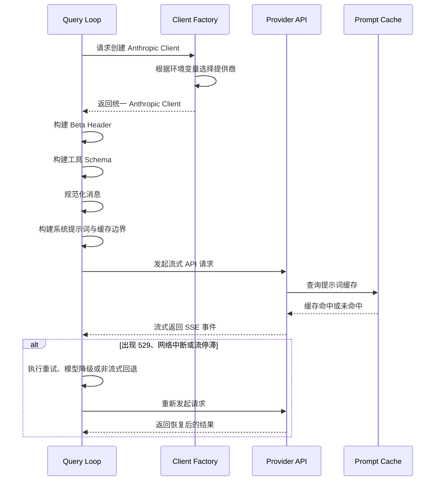
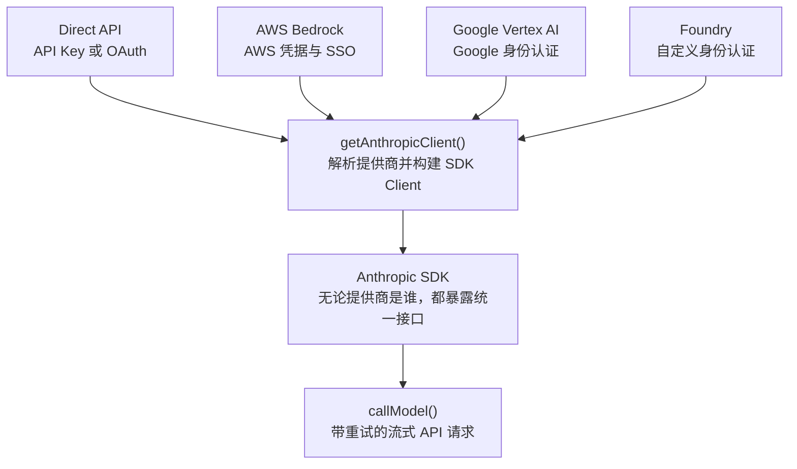
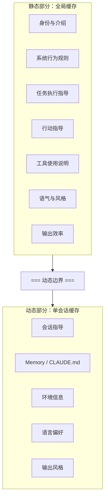
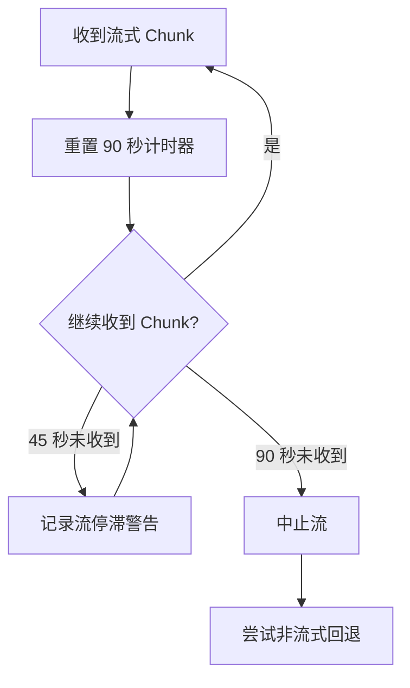
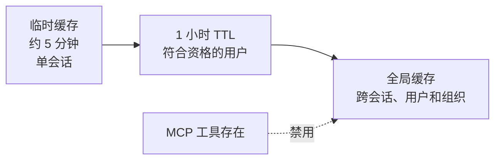
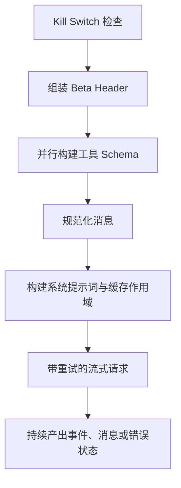
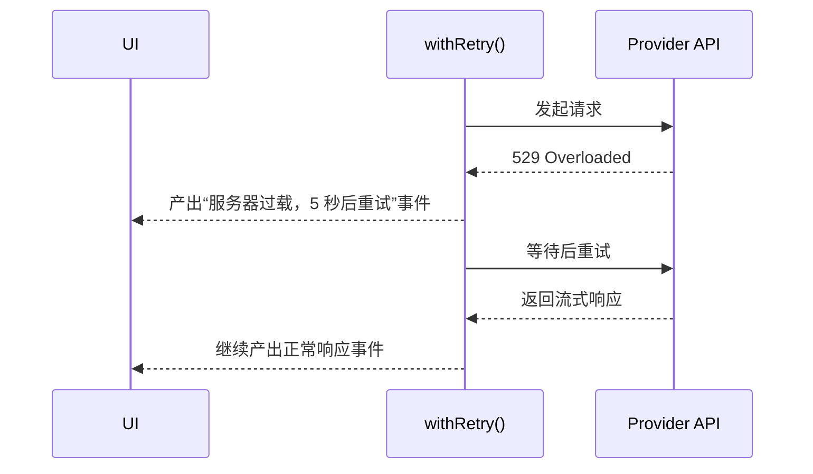
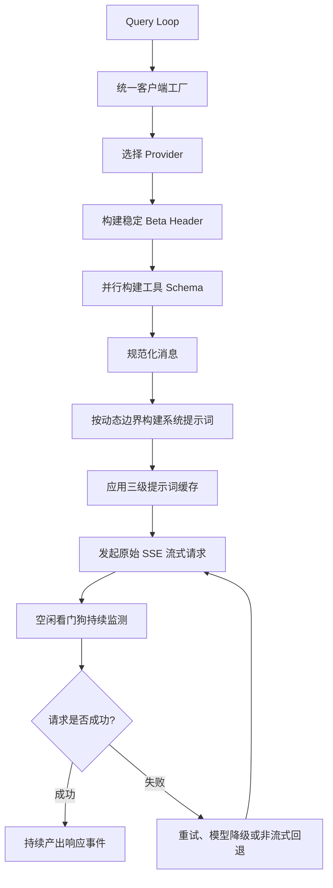

# 第四章：与 Claude 通信：API 层

第 3 章说明了状态保存在哪里，以及两个状态层级之间如何通信。

现在，我们继续追踪这些状态真正被使用时会发生什么：系统需要与语言模型通信。

Claude Code 中的一切，包括启动引导流程、状态系统和权限框架，最终都是为了服务这一刻。

API 层处理的失败模式，比系统中的其他任何部分都更多。

它必须完成以下工作：

- 通过一个统一且透明的接口，在四个云服务提供商之间路由请求；
- 以字节级精度构建系统提示词，因为服务器端提示词缓存对前缀极其敏感；
- 进行带主动故障检测的流式响应处理，因为 TCP 连接可能在没有任何通知的情况下静默断开；
- 维持会话级稳定不变量，避免 Feature Flag 在对话中途变化时，引发难以察觉的性能断崖。

一个位置错误的系统提示词区段，就可能破坏一个价值超过 50,000 Token 的缓存。

下面，我们从头到尾跟踪一次完整的 API 调用。

---

## API 请求生命周期

原网页在这里提供了一张可播放、可逐步执行，并可模拟 `529` 错误的交互图。

图中包含以下核心参与者：

- Query Loop，查询循环；
- Client Factory，客户端工厂；
- Provider API，提供商 API；
- Cache，缓存。

转换为静态 Markdown 后，可以用下面的时序图表示：



---

## 多提供商客户端工厂

`getAnthropicClient()` 是所有模型通信的唯一客户端工厂。

它会返回一个已经配置好的 Anthropic SDK Client，并根据当前部署目标连接相应提供商。

Claude Code 支持四条基础设施路径：



客户端分发完全由环境变量驱动，并按照固定优先级求值。

四种提供商对应的 SDK Class 最终都会通过下面这种方式强制转换为 `Anthropic`：

```typescript
as unknown as Anthropic
```

源代码中的注释非常坦率：

```text
we have always been lying about the return type
```

中文意思是：

> 我们一直都在对返回类型撒谎。

这种有意进行的类型擦除，使所有调用方都看到统一接口。

代码库中的其他部分完全不需要根据提供商进行分支判断。

### 动态导入提供商 SDK

每一种提供商 SDK 都会动态导入，例如：

```text
AnthropicBedrock
AnthropicFoundry
AnthropicVertex
```

这些模块本身体积较大，并且拥有各自的依赖树。

动态导入可以确保：

> 当前没有使用的提供商永远不会被加载。

提供商选择会在程序启动时完成，并存入 Bootstrap `STATE`。

查询循环从不检查当前正在使用哪一个提供商。

因此，从 Direct API 切换到 Bedrock 只是一次配置变化，不是一次代码变化。

---

## `buildFetch` 包装器

每一次向外发送的 `fetch` 都会经过一层包装。

这层包装会注入：

```http
x-client-request-id: <UUID>
```

每个请求都会生成一个独立 UUID。

当请求超时时，服务器通常还没有机会给响应分配 Request ID。

如果没有客户端 Request ID，API 团队就无法把客户端观察到的超时，与服务器端日志中的具体请求对应起来。

`x-client-request-id` Header 填补了这个缺口。

这个 Header 只会发送给 Anthropic 第一方端点。

原因是第三方提供商可能拒绝无法识别的 Header。

---

## 系统提示词构建

系统提示词是整个系统中对缓存最敏感的产物。

Claude API 提供服务端提示词缓存。

如果不同请求拥有完全相同的提示词前缀，服务器就可以复用之前的计算，从而同时降低：

- 延迟；
- 成本。

一场 200,000 Token 的对话中，可能有 50,000 到 70,000 Token 与上一轮完全相同。

如果缓存被破坏，服务器就必须重新处理这些全部内容。

---

## 动态边界标记

系统提示词会被构建成一个字符串区段数组，其中有一条至关重要的分界线。

原网页提供了一张可以切换提供商和 Feature Toggle 的交互图。

静态结构如下：

| 系统提示词区段 | 估算 Token | 缓存范围 |
|---|---:|---|
| Identity & Intro，身份与介绍 | 约 200 | 全局 |
| System Behavior Rules，系统行为规则 | 约 500 | 全局 |
| Doing Tasks Guidance，任务执行指导 | 约 400 | 全局 |
| Actions Guidance，行动指导 | 约 2,000 | 全局 |
| Tool Usage Instructions，工具使用说明 | 约 3,000 | 全局 |
| Tone & Style，语气与风格 | 约 300 | 全局 |
| Output Efficiency，输出效率 | 约 200 | 全局 |
| **动态边界** | **中断点** | **缓存层级切换** |
| Session Guidance，会话指导 | 约 300 | 单会话 |
| Memory（`CLAUDE.md`） | 约 2,000 到 50,000 | 单会话 |
| Environment Info，环境信息 | 约 500 | 单会话 |
| Language Preference，语言偏好 | 约 50 | 单会话 |
| Output Style，输出风格 | 约 100 | 单会话 |



边界之前的所有内容，在以下范围内都保持一致：

- 不同会话；
- 不同用户；
- 不同组织。

因此，它们可以获得最高级别的服务端缓存。

边界之后的内容包含用户专属信息，只能使用单会话缓存。

### 刻意显眼的命名约定

添加一个新的系统提示词区段时，开发者必须在下面两个函数之间做出选择：

```text
systemPromptSection
```

这是安全、可全局缓存的区段。

```text
DANGEROUS_uncachedSystemPromptSection
```

这是会破坏缓存的区段，并且必须提供一个原因字符串。

`_reason` 参数在运行时不会被使用，但它承担强制文档的作用。

每一个会破坏缓存的区段，都必须在源代码中写明理由。

这是一种刻意制造“刺眼感”的 API 设计。

它让危险操作在代码审查中很难被忽略。

---

## `2^N` 问题

`prompts.ts` 中的一条注释解释了，为什么运行时条件区段必须放在动态边界之后：

```text
Each conditional here is a runtime bit that would otherwise multiply
the Blake2b prefix hash variants (2^N).
```

中文意思是：

> 这里的每一个条件都是一个运行时 Bit，否则它会按照 `2^N` 的方式增加 Blake2b 前缀哈希变体数量。

边界之前每增加一个布尔条件，全局缓存条目数量都会翻倍。

例如：

| 条件数量 | 全局缓存变体数量 |
|---:|---:|
| 1 | 2 |
| 2 | 4 |
| 3 | 8 |
| 5 | 32 |
| 10 | 1,024 |

静态区段因此被刻意设计为无条件内容。

允许出现在边界前的条件：

- 编译期 Feature Flag；
- 已经被 Bundler 解析为常量的条件。

必须放在边界后的条件：

- 当前是否使用 Haiku；
- 用户是否拥有 Auto Mode；
- 任意会在运行时变化的用户或会话条件。

这类约束在被违反之前几乎不可见。

一个出于好意的工程师，如果把一个受用户设置控制的区段加到边界之前，可能会在没有明显错误的情况下：

- 让全局缓存发生碎片化；
- 把整个平台的提示词处理成本翻倍。

---

## 流式响应

### 使用原始 SSE，而不是 SDK 高层抽象

流式实现使用的是：

```typescript
Stream<BetaRawMessageStreamEvent>
```

而不是 SDK 提供的更高层：

```typescript
BetaMessageStream
```

原因在于，`BetaMessageStream` 会在每一次：

```text
input_json_delta
```

事件发生时调用：

```text
partialParse()
```

对于输入 JSON 很大的工具调用，例如包含数百行内容的文件编辑，这会在每个 Chunk 到来时，从头重新解析正在增长的 JSON 字符串。

其时间复杂度会退化为：

```text
O(n²)
```

Claude Code 自己会累积工具输入，因此 SDK 的部分解析对它来说是纯粹浪费。

使用原始 SSE 事件流，可以避免这部分重复工作。

---

## 空闲看门狗

TCP 连接可能在没有任何通知的情况下死亡。

可能发生的情况包括：

- 服务器崩溃；
- 负载均衡器静默丢弃连接；
- 企业代理超时；
- 中间网络设备停止转发数据。

SDK 的 Request Timeout 通常只覆盖最初的 `fetch` 请求。

一旦服务器返回：

```http
HTTP 200
```

请求超时条件就被视为已经满足。

但如果响应 Body 在流式传输过程中停止到达，普通 Request Timeout 并不能发现这个问题。

Claude Code 使用一个空闲看门狗来解决它。

实现方式是：

1. 创建一个 `setTimeout`；
2. 每收到一个数据 Chunk，就重置计时器；
3. 如果连续 90 秒没有收到任何 Chunk，就主动中止数据流；
4. 随后系统尝试使用非流式请求进行回退。

时间节点如下：

| 空闲时间 | 行为 |
|---:|---|
| 45 秒 | 发出警告 |
| 90 秒 | 中止流并触发回退 |

看门狗触发时，系统还会把对应的 Client Request ID 写入日志，以便和服务端日志关联。



---

## 非流式回退

当流式响应在中途失败时，系统会退回同步调用：

```typescript
messages.create()
```

可能触发回退的情况包括：

- 网络错误；
- 数据流停滞；
- SSE 流被截断；
- 代理返回 `HTTP 200`，但 Body 并不是 SSE；
- 代理只转发了部分响应。

企业网络中的代理故障，往往比开发者想象得更常见。

非流式回退为这些异常网络环境提供了第二条执行路径。

### 流式工具执行时可能禁用回退

当流式工具执行已经启用时，系统可以禁用非流式回退。

原因是，重新执行完整请求可能让模型再次生成相同的工具调用，从而导致工具被执行两次。

对于读操作，这可能只是浪费。

对于写文件、运行命令等具有副作用的操作，重复执行可能造成严重问题。

因此，回退机制必须结合工具执行状态进行判断，而不能无条件启用。

---

## 提示词缓存系统

### 三个缓存层级

Claude Code 的提示词缓存分为三个层级。

### 1. Ephemeral Cache：临时缓存

这是默认缓存层级。

特征如下：

- 每个会话独立；
- 服务器定义 TTL；
- TTL 大约为 5 分钟；
- 所有用户都可以使用。

### 2. 一小时 TTL

符合条件的用户可以获得更长的缓存时间。

资格由订阅状态决定，并会锁存在 Bootstrap State 中。

第 3 章介绍的：

```text
promptCache1hEligible
```

粘性锁存器可以保证，即使用户在会话中途因超额使用等原因发生资格变化，当前会话的 TTL 也不会随之改变。

这可以避免同一场对话中缓存 Key 或缓存策略突然变化。

### 3. Global Scope：全局作用域

系统提示词的静态部分可以跨以下范围共享：

- 会话；
- 用户；
- 组织。

由于 Claude Code 的静态系统提示词对所有用户都相同，因此一份缓存副本就可以服务所有人。

### MCP 工具存在时禁用全局缓存

当请求中存在 MCP 工具时，全局作用域会被禁用。

原因是 MCP 工具定义属于用户专属内容。

如果把它们放入全局缓存前缀，就会产生数百万种唯一前缀，使全局缓存严重碎片化。



---

## 粘性锁存器的实际使用

第 3 章介绍的五个粘性锁存器，会在 API 请求构建阶段进行求值。

每个锁存器初始值都是：

```text
null
```

一旦被设置为：

```text
true
```

它就会在当前会话剩余时间内保持为 `true`。

锁存器代码块上方的注释写得非常精确：

```text
Sticky-on latches for dynamic beta headers. Each header, once first sent,
keeps being sent for the rest of the session so mid-session toggles don’t
change the server-side cache key and bust ~50-70K tokens.
```

中文意思是：

> 动态 Beta Header 使用只开不关的粘性锁存器。每一个 Header 一旦首次发送，就会在当前会话剩余时间内持续发送，避免会话中途的功能切换改变服务端缓存 Key，并破坏约 50,000 到 70,000 Token 的缓存。

锁存器解决的不是“功能是否开启”这一普通配置问题，而是：

> 功能状态变化是否会改变缓存命名空间。

关于锁存器模式、五个具体锁存器以及为什么不能始终发送所有 Header，可以参见第 3 章第 3.1 节。

---

## `queryModel()` 生成器

`queryModel()` 是一个约 700 行的异步生成器。

它负责协调一整次 API 调用生命周期。

它会产出以下对象：

```text
StreamEvent
AssistantMessage
SystemAPIErrorMessage
```

请求装配严格按照固定顺序执行。

### 1. Kill Switch 检查

首先检查最高成本模型层级的紧急停止开关。

Kill Switch 是一个安全阀，用于在成本或稳定性出现重大问题时，迅速阻止最昂贵的模型请求。

### 2. 组装 Beta Header

系统会根据模型和功能状态构建 Beta Header。

在这里会应用粘性锁存器，以保持会话内 Header 稳定。

### 3. 构建工具 Schema

工具 Schema 会通过：

```typescript
Promise.all()
```

并行构建。

尚未被发现的延迟工具不会立即加入请求，而是在真正发现后再注册。

### 4. 消息规范化

系统会对消息历史进行修复与清理，包括：

- 修复孤立的 `tool_use` / `tool_result` 不匹配；
- 移除超过限制的媒体内容；
- 删除已经过期的 Block；
- 保证发送给 API 的消息结构合法。

### 5. 构建系统提示词 Block

系统会在动态边界处分割提示词，并给不同 Block 分配对应缓存作用域。

### 6. 带重试的流式调用

系统随后进入带重试包装的流式请求阶段。

它可以处理：

- `529` 服务过载；
- 模型回退；
- Thinking Budget 降级；
- OAuth Token 刷新。

完整装配流程如下：



---

## 输出 Token 上限

默认输出上限是：

```text
8,000 Token
```

而不是常见的：

```text
32K 或 64K Token
```

生产数据表明，输出长度的 P99 是：

```text
4,911 Token
```

也就是说，使用 32K 或 64K 上限，会比绝大多数真实请求需要的容量多预留 8 到 16 倍。

当响应真正触及 8,000 Token 上限时，系统会执行一次干净重试，并把上限提高到：

```text
64K Token
```

触及上限的请求少于 1%。

这一策略可以在大规模部署中显著降低成本：

- 绝大多数请求只预留合理输出空间；
- 极少数长输出请求通过一次重试获得更高额度。

这是一种使用真实分布数据，而不是理论最大值设计默认参数的例子。

---

## 错误处理与重试

`withRetry()` 本身也是一个异步生成器。

它会产出：

```text
SystemAPIErrorMessage
```

这样，UI 就可以直接显示重试状态。

支持的主要重试策略如下。

### `529`：服务器过载

系统会等待后重试，并可以选择把 Fast Mode 降级。

例如，用户可能看到：

```text
服务器过载，将在 5 秒后重试……
```

### 模型回退

如果主模型失败，系统会尝试备用模型。

例如：

```text
Opus → Sonnet
```

这可以在高端模型暂时不可用时保持服务可用性。

### Thinking 降级

如果上下文窗口溢出，系统可以降低 Thinking Budget 后重新请求。

### OAuth `401`

如果 OAuth 请求返回 `401`，系统会刷新 Token，并重试一次。

### 为什么使用生成器表达重试

由于重试包装器是异步生成器，重试过程可以自然融入同一条事件流。

UI 不需要额外的旁路通知系统。



这种方式把以下内容统一成同一种数据模型：

- 正常输出；
- 工具事件；
- 系统错误；
- 重试进度。


---

## 应用这些设计

### 把提示词缓存视为架构约束，而不是功能开关

大多数 LLM 应用只是简单地“打开缓存”。

Claude Code 则把缓存视为一种会影响系统设计的基础约束。

缓存要求直接塑造了：

- 提示词区段的排列顺序；
- 系统提示词区段的记忆化方式；
- Header 的粘性锁存策略；
- 配置管理方式；
- 运行时条件应该放在动态边界的哪一侧。

结构良好的提示词，可以在 50,000 Token 上获得缓存命中。

结构混乱的提示词，则可能每一轮都要求服务器重新处理全部内容。

两者之间的差异，是整个系统中最大的单项成本杠杆。

---

### 为高成本逃生通道使用 `DANGEROUS` 命名

如果代码库中存在一个很容易被意外破坏的不变量，可以把危险逃生通道命名得足够醒目。

例如：

```text
DANGEROUS_uncachedSystemPromptSection
```

这种命名方式有三个作用。

#### 1. 让违规行为在代码审查中清晰可见

Reviewer 很难在 Diff 中忽略以 `DANGEROUS` 开头的函数。

#### 2. 强制开发者留下文档

必填的 `_reason` 参数要求调用者解释，为什么必须破坏缓存。

#### 3. 为安全默认值制造心理阻力

开发者会更谨慎地考虑，是否真的需要调用危险接口。

这种模式不仅适用于缓存，也适用于任何具有隐性成本或风险的操作，例如：

- 绕过权限；
- 禁用校验；
- 执行不可逆迁移；
- 强制清空缓存；
- 跳过数据一致性检查。

---

### 为流式传输设计看门狗，而不只是请求超时

SDK 的 Request Timeout 在收到 `HTTP 200` 时通常就已经完成使命。

但响应 Body 可能在之后任意时刻停止到达。

因此，流式系统需要一个按 Chunk 重置的空闲计时器。

推荐模式是：

```text
收到 Chunk
    ↓
重置 Idle Timeout
    ↓
超过警告阈值则记录日志
    ↓
超过终止阈值则中止并回退
```

非流式回退还可以处理企业代理中的常见故障：

- 返回 `HTTP 200`，但内容不是 SSE；
- 中途截断数据流；
- 长时间保持连接，却不再传输数据。

这些情况往往比理想网络环境下的测试结果更常见。

---

### 使用基于 `yield` 的重试，而不是只依赖异常

如果重试包装器是异步生成器，就可以把重试状态作为正常事件产出。

调用方可以像处理普通流式响应一样，处理：

- 服务器过载；
- 等待倒计时；
- 模型回退；
- Token 刷新；
- 最终恢复。

这样，重试不是隐藏在异常处理内部的黑盒，而是用户可见、可观测的执行过程。

模型回退模式尤其适合生产系统：

```text
主模型失败
    ↓
尝试备用模型
    ↓
保持服务可用
```

例如从 Opus 回退到 Sonnet，可以在高端模型出现暂时性故障时维持任务执行。

---

### 把快速路径与完整流水线分离

并不是每一次模型调用都需要：

- 工具搜索；
- Advisor 集成；
- Thinking Budget；
- 完整流式基础设施；
- 所有智能体能力。

Claude Code 的：

```text
queryHaiku()
```

为内部操作提供了精简路径，例如：

- 上下文压缩；
- 分类；
- 其他轻量判断。

它会跳过完整智能体调用所需的复杂能力。

为简单任务提供一个接口更小、约束更明确的独立函数，可以防止完整流水线的复杂度意外泄漏到所有调用场景中。

这一原则与第 2 章中的快速启动路径一致：

> 先判断意图，再决定需要加载和执行多少系统能力。

---

## 展望后续章节

API 层位于后续所有系统的基础位置。

第 5 章将介绍查询循环如何使用流式响应驱动工具执行，包括：

> 模型尚未完成整个响应时，工具为什么已经可以开始执行。

第 6 章将解释，当对话接近上下文窗口上限时，压缩系统如何在减少上下文体积的同时维持缓存效率。

第 7 章将介绍，每一条智能体线程如何拥有自己的：

- 消息数组；
- 请求链；
- 独立上下文。

这些系统都会继承本章建立的约束。

### 缓存稳定性是架构不变量

提示词区段顺序、Header 和会话配置不能随意变化。

### 客户端工厂提供提供商透明性

其他模块只面对统一 Anthropic Client，无需感知 Direct API、Bedrock、Vertex 或 Foundry 的区别。

### 锁存器提供会话级稳定配置

会改变缓存 Key 的动态功能，一旦启用，就在当前会话中保持稳定。

API 层不只是发送请求。

它定义了系统中其他模块必须遵守的运行规则。

---

## 本章总结

Claude Code 的 API 层承担了四项核心职责。

### 1. 提供商透明路由

`getAnthropicClient()` 根据环境变量选择提供商，并对外返回统一客户端接口。

系统其他部分从不根据提供商编写分支逻辑。

### 2. 缓存感知的提示词构建

系统提示词被分成：

- 全局静态区段；
- 动态边界；
- 单会话动态区段。

任何运行时条件出现在边界之前，都可能制造 `2^N` 个全局缓存变体。

### 3. 具有主动故障检测的流式传输

系统使用原始 SSE 事件流避免 `O(n²)` JSON 部分解析，并通过：

- 45 秒警告；
- 90 秒空闲看门狗；
- 非流式回退；

处理静默断连和代理异常。

### 4. 可观测的错误恢复

`queryModel()` 与 `withRetry()` 都采用异步生成器，把：

- 正常响应；
- 重试状态；
- 系统错误；
- 模型回退；

统一到同一条事件流中。

整条 API 调用链可以概括为：



这套架构最重要的认识是：

> 对生产级 LLM 应用而言，API 层并不是一个简单的 HTTP Client。它同时是缓存设计、故障恢复、成本控制、提供商抽象和会话稳定性的交汇点。

Claude Code 把这些原本容易散落在各处的约束，集中进一条结构化的请求生命周期中。

这让上层查询循环可以专注于决定“下一步做什么”，而把“如何可靠、稳定且经济地与模型通信”交给 API 层处理。
