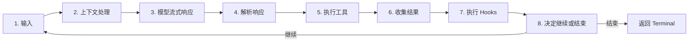
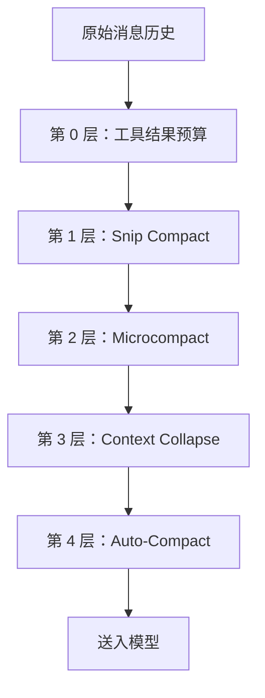
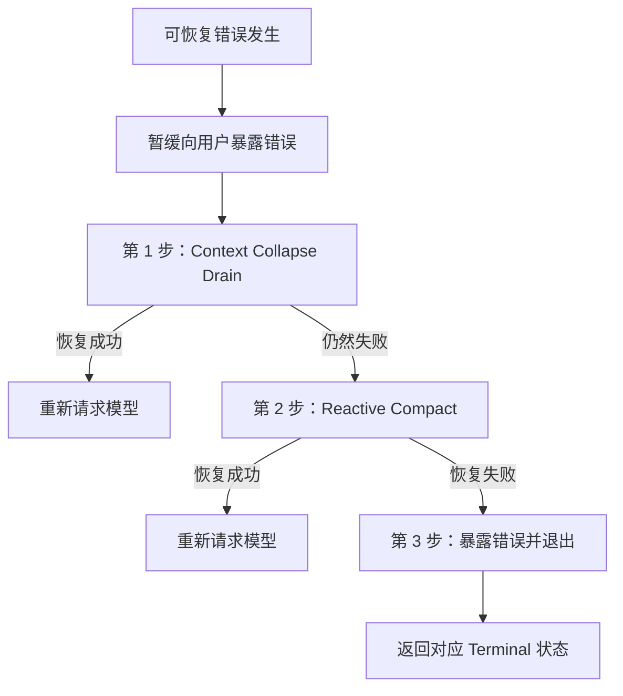

# 第五章：智能体循环

> 原文：[Ch 5. The Agent Loop](https://claude-code-from-source.com/ch05-agent-loop/)


## 跳动的心脏

第 4 章介绍了 API 层如何把配置转换成流式 HTTP 请求：客户端如何创建、系统提示词如何组装、响应如何以 Server-Sent Events 的形式到达。

这一层解决的是“怎样和模型通信”的机械问题。

但一次 API 调用并不等于一个智能体。

智能体真正的本质，是一个循环：

```text
调用模型
   ↓
执行工具
   ↓
把结果反馈给模型
   ↓
再次调用模型
   ↓
直到任务完成
```

每一个复杂系统都有自己的重心。

- 对数据库来说，重心是存储引擎；
- 对编译器来说，重心是中间表示；
- 对 Claude Code 来说，重心是 `query.ts`。

这是一个约 1,730 行的单文件模块，里面包含一个异步生成器。Claude Code 中的每一次交互，从 REPL 中的第一次按键，到无界面 `--print` 调用中的最后一次工具执行，最终都会经过这里。

这并不是夸张。

系统中只有一条代码路径同时负责：

- 与模型通信；
- 执行工具；
- 管理上下文；
- 从错误中恢复；
- 判断什么时候停止。

这条路径就是：

```text
query()
```

REPL 会调用它。

SDK 会调用它。

子智能体会调用它。

无界面运行器也会调用它。

只要你正在使用 Claude Code，你就在 `query()` 之中。

这个文件很密集，但它的复杂不是“继承层级纠缠”那种复杂。

它更像一艘潜艇：所有系统都被封装在同一层船壳里，而每一个冗余机制，都是因为海水曾经找到过渗入的方法。

每一个 `if` 分支背后都有一段故事。

每一条被暂时隐藏的错误消息，都对应一个真实 Bug：SDK 消费端曾经在恢复过程中途断开。

每一个熔断器阈值，都是根据真实会话调整出来的，因为有些无限循环曾经燃烧掉数千次 API 调用。

本章会从头到尾追踪整个循环。

读完之后，你不仅会知道它做了什么，也会知道为什么每一种机制必须存在，以及缺少它时会坏掉什么。

---

## 为什么使用异步生成器

第一个架构问题是：

> 为什么智能体循环使用生成器，而不是基于回调的事件发射器？

简化后的签名如下：

```typescript
// 简化示例，只展示核心概念，不代表精确类型
async function* agentLoop(
  params: LoopParams,
): AsyncGenerator<Message | Event, TerminalReason>
```

真实签名会产出多种消息和事件类型，并返回一个可辨识联合类型，用来表示循环为什么终止。

选择异步生成器，主要有三个原因，按重要程度排序如下。

### 1. 背压

事件发射器会不断发送事件，不管消费者是否已经准备好。

生成器则只会在消费者调用：

```text
.next()
```

时才继续产出数据。

当 REPL 的 React 渲染器还在绘制上一帧时，生成器会自然暂停。

当 SDK 消费端正在处理上一条工具结果时，生成器会等待。

因此不会出现：

- 缓冲区溢出；
- 消息丢失；
- 生产者过快、消费者过慢。

背压能力是生成器天然附带的。

### 2. 返回值语义

生成器的返回类型是：

```text
Terminal
```

这是一个可辨识联合类型，可以精确表示循环为什么停止。

可能的原因包括：

- 正常完成；
- 用户中止；
- Token 预算耗尽；
- Stop Hook 介入；
- 达到最大轮次；
- 无法恢复的模型错误。

系统一共有 10 种不同的终止状态。

调用方不需要订阅一个模糊的 `end` 事件，也不需要祈祷事件 Payload 中包含终止原因。

调用方可以直接从：

```typescript
for await...of
```

或：

```typescript
yield*
```

获得类型明确的最终返回值。

### 3. 通过 `yield*` 组合

外层 `query()` 会使用：

```typescript
yield*
```

把工作委托给内层 `queryLoop()`。

这样可以透明转发：

- 所有中间产出；
- 最终返回值。

类似 `handleStopHooks()` 这样的子生成器也使用同样模式。

这会形成一条非常清晰的职责链，而不需要：

- 回调套回调；
- Promise 包 Promise；
- 手动转发事件。

### 代价

JavaScript 的异步生成器不能：

- 回退；
- 分叉。

但智能体循环也不需要这两种能力。

它是一个严格向前移动的状态机。

### 一个更隐蔽的优势：惰性执行

`function*` 语法让函数体具有惰性。

调用 `query()` 时，函数会立刻返回生成器对象，但函数体不会马上执行。

真正的执行要等到第一次：

```text
.next()
```

调用。

因此，所有重量级初始化，例如：

- 配置快照；
- 记忆预取；
- 预算追踪器；

都会等到消费者真正开始拉取数据时才启动。

在 REPL 中，这意味着 React 渲染管线会先准备好，然后智能体循环才开始运行。

---

## 调用方需要提供什么

在跟踪循环之前，先看看输入参数。

```typescript
// 简化示例，展示关键字段
type LoopParams = {
  messages: Message[]
  prompt: SystemPrompt
  permissionCheck: CanUseToolFn
  context: ToolUseContext
  source: QuerySource
  maxTurns?: number
  budget?: {
    total: number
  }
  deps?: LoopDeps
}
```

### `querySource`

这是一个字符串判别值，例如：

```text
repl_main_thread
sdk
agent:xyz
compact
session_memory
```

许多条件分支都会根据它决定行为。

例如，压缩智能体使用：

```text
querySource: 'compact'
```

这样它就不会被阻塞上限保护器卡死。

原因很简单：压缩智能体本身必须能够运行，才能降低 Token 数量。

### `taskBudget`

这是 API 层的任务预算：

```text
output_config.task_budget
```

它与 `+500k` 自动继续 Token 预算功能不是一回事。

其中：

- `total` 表示整个智能体轮次的总预算；
- `remaining` 会根据累计 API 使用量，在每次迭代中重新计算；
- 跨越上下文压缩边界时，还会做相应调整。

### `deps`

可选的依赖注入对象。

默认值是：

```text
productionDeps()
```

测试可以通过这个接口替换：

- 模型调用；
- 压缩逻辑；
- 确定性的 UUID；
- 其他外部依赖。

### `canUseTool`

这是权限层函数，用于判断某个工具是否允许执行。

它会综合检查：

- 信任设置；
- Hook 决策；
- 当前权限模式。

---

## 双层入口

公开 API 只是对真实循环的一层薄包装。

外层函数会记录当前轮次中哪些排队命令被消费。

当内层循环正常完成后，已经消费的命令会被标记为：

```text
completed
```

在循环内部，某个命令一旦开始处理，就会被标记为：

```text
started
```

这些命令可能来自：

- Slash Command；
- 任务通知；
- 其他排队事件。

如果循环抛出异常，或者生成器通过：

```text
.return()
```

被关闭，那么完成通知不会触发。

这是有意设计的。

失败的轮次不应该把命令错误地标记为“已经成功处理”。

---

## 状态对象

循环使用一个有明确类型的对象保存全部状态。

```typescript
// 简化示例，展示关键字段
type LoopState = {
  messages: Message[]
  context: ToolUseContext
  turnCount: number
  transition: Continue | undefined

  // 还包括恢复计数器、压缩追踪和待处理摘要等
}
```

这个对象大约有 10 个关键字段，每一个都必须存在。

| 字段 | 存在原因 |
|---|---|
| `messages` | 保存对话历史，每次迭代都会增长 |
| `toolUseContext` | 可变工具上下文，包括工具、Abort Controller、智能体状态和选项 |
| `autoCompactTracking` | 追踪上下文压缩状态，包括轮次计数、轮次 ID、连续失败次数和是否已经压缩 |
| `maxOutputTokensRecoveryCount` | 记录输出 Token 上限的多轮恢复次数，最多 3 次 |
| `hasAttemptedReactiveCompact` | 一次性保护，防止反应式压缩进入无限循环 |
| `maxOutputTokensOverride` | 升级时设置为 64K，之后清除 |
| `pendingToolUseSummary` | 上一轮由 Haiku 生成的工具摘要 Promise，在当前流式响应过程中解析 |
| `stopHookActive` | 防止 Stop Hook 阻塞重试后再次运行相同 Hook |
| `turnCount` | 单调递增计数器，用于检查 `maxTurns` |
| `transition` | 记录上一轮为什么继续，首次迭代时为 `undefined` |

---

## 可变循环中的不可变状态转换

循环中的每一个 `continue` 位置，都会使用同一种模式：

```typescript
const next: State = {
  messages: [
    ...messagesForQuery,
    ...assistantMessages,
    ...toolResults,
  ],
  toolUseContext: toolUseContextWithQueryTracking,
  autoCompactTracking: tracking,
  turnCount: nextTurnCount,
  maxOutputTokensRecoveryCount: 0,
  hasAttemptedReactiveCompact: false,
  pendingToolUseSummary: nextPendingToolUseSummary,
  maxOutputTokensOverride: undefined,
  stopHookActive,
  transition: {
    reason: 'next_turn',
  },
}

state = next
```

每次继续循环时，系统都会重新构造一个完整的新状态对象。

它不会这样做：

```typescript
state.messages = newMessages
state.turnCount++
```

完整重构的好处是：

> 每一次状态转换都是自解释的。

阅读任意一个 `continue` 位置，就能清楚看到：

- 哪些字段发生了变化；
- 哪些字段被保留；
- 这次为什么继续。

新状态中的 `transition` 字段会记录继续原因。

测试可以直接断言这个字段，从而确认系统是否进入了正确的恢复路径。

---

## 循环主体

单次迭代的执行流程，可以压缩为下面八步。



这就是整个智能体循环。

Claude Code 中几乎所有功能，包括：

- 记忆；
- 子智能体；
- 错误恢复；
- 工具并发；
- Stop Hook；
- Token 预算；

都会进入这套迭代结构，或者从中消费结果。

---

## 上下文管理：四层压缩

每次调用 API 之前，消息历史最多会经过四层上下文管理。

它们有固定顺序，而且顺序非常重要。

原文提供了一个交互式压缩演示（见 [原文交互版](https://claude-code-from-source.com/ch05-agent-loop/)），将一段超过 200K Token 的对话逐层缩小。

静态结构如下：



### 第 0 层：工具结果预算

在任何压缩之前，系统会调用：

```text
applyToolResultBudget()
```

它会对每条工具结果强制执行大小限制。

没有设置有限：

```text
maxResultSizeChars
```

的工具可以豁免。

### 第 1 层：Snip Compact

这是最轻量的压缩方式。

Snip 会直接从消息数组中移除较老的消息。

同时，它会产出一个边界消息，通知 UI：

> 某一段历史已经被移除。

它还会报告释放了多少 Token。

这个数值会继续传递给 Auto-Compact 的阈值判断。

### 第 2 层：Microcompact

Microcompact 会根据：

```text
tool_use_id
```

移除不再需要的工具结果。

对于会修改 API Cache 的缓存式 Microcompact，边界消息不会立即产出，而是等到 API 响应之后。

原因是：

> 客户端 Token 估算并不可靠。

API 返回的：

```text
cache_deleted_input_tokens
```

才是真正释放的 Token 数量。

### 第 3 层：Context Collapse

Context Collapse 会把一段对话替换成摘要。

它会在 Auto-Compact 之前运行。

这个顺序是刻意安排的。

如果 Context Collapse 已经把上下文压缩到 Auto-Compact 阈值之下，那么 Auto-Compact 就会变成 No-op。

这样可以尽量保留细粒度上下文，而不是直接把整个历史替换成一个大摘要。

### 第 4 层：Auto-Compact

这是最重量级的压缩操作。

系统会分叉出一场完整的 Claude 对话，用来总结当前历史。

它包含一个熔断器：

> 连续失败 3 次后，系统停止继续尝试 Auto-Compact。

这是为了避免生产环境中已经真实发生过的噩梦：

- 会话一直超过上下文上限；
- 压缩失败；
- 自动重试；
- 再次失败；
- 无限循环；
- 每天燃烧 250,000 次 API 调用。

---

## Auto-Compact 阈值

阈值根据模型上下文窗口计算。

```text
effectiveContextWindow
  = contextWindow - min(modelMaxOutput, 20000)
```

相对于有效上下文窗口，关键阈值如下：

```text
Auto-Compact 触发：
effectiveWindow - 13,000

阻塞硬上限：
effectiveWindow - 3,000
```

对应常量如下：

| 常量 | 数值 | 用途 |
|---|---:|---|
| `AUTOCOMPACT_BUFFER_TOKENS` | 13,000 | 在有效窗口下方预留空间，用于触发 Auto-Compact |
| `MANUAL_COMPACT_BUFFER_TOKENS` | 3,000 | 为 `/compact` 手动命令保留空间 |
| `MAX_CONSECUTIVE_AUTOCOMPACT_FAILURES` | 3 | Auto-Compact 熔断阈值 |

13,000 Token 缓冲意味着系统会在到达硬上限之前较早触发 Auto-Compact。

Auto-Compact 阈值与阻塞上限之间的区域，是 Reactive Compact 的工作区间。

如果主动 Auto-Compact：

- 失败；
- 或被关闭；

Reactive Compact 会在收到 `413` 错误后按需进行压缩。

---

## Token 计数

系统中的标准函数：

```text
tokenCountWithEstimation
```

会组合两类数据：

1. 最近一次 API 响应中由服务器报告的权威 Token 数量；
2. 在那次响应之后新增消息的粗略估算。

这种估算是保守的。

它宁可把 Token 估得稍高，也不愿估得过低。

结果是：

> Auto-Compact 可能稍微提前触发，但不会因为估算过低而太晚触发。

---

## 模型流式响应

### `callModel()` 循环

API 调用位于一个：

```typescript
while (attemptWithFallback)
```

循环中，以便支持模型回退。

```typescript
let attemptWithFallback = true

while (attemptWithFallback) {
  attemptWithFallback = false

  try {
    for await (
      const message of deps.callModel({
        messages,
        systemPrompt,
        tools,
        signal,
      })
    ) {
      // 处理每一条流式消息
    }
  } catch (innerError) {
    if (
      innerError instanceof FallbackTriggeredError &&
      fallbackModel
    ) {
      currentModel = fallbackModel
      attemptWithFallback = true
      continue
    }

    throw innerError
  }
}
```

启用流式工具执行后，`StreamingToolExecutor` 会在工具的 `tool_use` 区块到达时立即开始执行，而不是等完整响应结束。

工具如何被编排成并发批次，将在第 7 章介绍。

---

## 暂缓暴露错误模式

这是整个文件中最重要的模式之一。

可以恢复的错误不会立刻产出到消息流中。

```typescript
let withheld = false

if (contextCollapse?.isWithheldPromptTooLong(message)) {
  withheld = true
}

if (reactiveCompact?.isWithheldPromptTooLong(message)) {
  withheld = true
}

if (isWithheldMaxOutputTokens(message)) {
  withheld = true
}

if (!withheld) {
  yield yieldMessage
}
```

为什么要暂时隐藏错误？

因为某些 SDK 消费端，例如：

- Cowork；
- 桌面应用；

一旦收到任何带有 `error` 字段的消息，就会立即结束会话。

假设系统先产出一个“提示词过长”错误，然后通过 Reactive Compact 成功恢复，消费端却已经断开。

此时恢复循环仍在后台运行，但已经没有人继续监听。

因此，这类错误会先被隐藏，并加入 `assistantMessages`，让后续恢复逻辑可以检测它。

只有当所有恢复路径都失败时，隐藏的错误才会真正暴露给用户。

---

## 模型回退

当捕获到：

```text
FallbackTriggeredError
```

例如主模型处于高负载时，循环会切换模型并重新请求。

但 Thinking Signature 与模型绑定。

如果把一个模型生成的受保护 Thinking Block 原样发送给另一个回退模型，API 会返回 `400` 错误。

因此，切换模型之前，代码会删除签名区块。

失败尝试中产生的孤立 Assistant Message 也会被标记为 Tombstone，让 UI 将它们移除。

---

## 错误恢复：逐级升级阶梯

`query.ts` 的错误恢复不是一项单独策略，而是一座逐渐增强干预力度的阶梯。

只有前一层失败，系统才会进入下一层。

原文允许模拟三类错误（见 [原文交互版](https://claude-code-from-source.com/ch05-agent-loop/)）：

- Prompt Too Long，`413`；
- Max Output Tokens；
- Media / Size Error。

恢复流程如下：



### 第 1 步：排空 Context Collapse

系统会清空已经提前暂存的上下文折叠项。

这些内容通常包括：

- 冗长工具结果；
- 已经标记为可以移除的早期对话片段。

这一步只是在刷新已经准备好的压缩，成本低、速度快。

### 第 2 步：Reactive Compact

如果排空 Context Collapse 仍然不够，系统会启动一个专门的压缩子智能体，对整个会话进行紧急总结。

它会把原始对话重写成更紧凑的摘要。

系统使用：

```text
hasAttemptedReactiveCompact
```

作为一次性保护。

同一种错误最多触发一次 Reactive Compact，防止无限循环。

### 第 3 步：暴露错误并退出

如果所有恢复方式都已经耗尽，系统才会真正把错误呈现给用户，并结束循环。

例如提示词过长时，会返回：

```typescript
{
  reason: 'prompt_too_long'
}
```

直到这一刻，错误暂缓模式才会结束。

---

## 死亡螺旋保护器

最危险的失败模式不是单次错误，而是无限循环。

代码中有多层保护。

### `hasAttemptedReactiveCompact`

一次性标记。

同一类错误的 Reactive Compact 只会执行一次。

### `MAX_OUTPUT_TOKENS_RECOVERY_LIMIT = 3`

输出 Token 上限的多轮恢复，最多尝试 3 次。

### Auto-Compact 熔断器

连续失败 3 次后，Auto-Compact 完全停止尝试。

### 错误响应不执行 Stop Hook

当最后一条消息是 API 错误时，代码会在到达 Stop Hook 之前直接返回。

源码注释解释了原因：

```text
error -> hook blocking -> retry -> error -> ...
```

因为 Hook 每一轮还可能注入更多 Token，这种循环会越来越糟。

### Stop Hook 重试时保留 Reactive Compact 标记

当 Stop Hook 返回阻塞错误并强制重试时，`hasAttemptedReactiveCompact` 不会被重置。

源代码记录了曾经发生的 Bug：

> 在这里重置为 `false` 会造成无限循环，并烧掉数千次 API 调用。

这些保护器中的每一个，都是因为对应故障曾经在生产环境中真实发生过。

---

## 完整示例：“修复 `auth.ts` 中的 Bug”

为了让循环更具体，下面跟踪一次经过三轮迭代的真实交互。

用户输入：

```text
Fix the null pointer bug in src/auth/validate.ts
```

中文意思是：

```text
修复 src/auth/validate.ts 中的空指针 Bug。
```

### 第 1 轮：模型读取文件

循环开始运行。

上下文管理先执行。由于对话还很短，不需要压缩。

模型流式输出：

```text
Let me look at the file.
```

也就是：

```text
我先看看这个文件。
```

随后生成一个工具调用：

```typescript
Read({
  file_path: 'src/auth/validate.ts',
})
```

流式执行器发现 `Read` 是并发安全工具，因此立刻开始执行。

等模型完成当前响应文本时，文件内容通常已经读取到内存中。

流式响应结束后，系统发现模型使用了工具，于是进入工具调用分支。

`Read` 返回的文件内容和行号会被加入 `toolResults`。

同时，系统会在后台启动一个 Haiku 摘要 Promise。

然后完整重建状态：

```typescript
transition: {
  reason: 'next_turn',
}
```

循环继续。

### 第 2 轮：模型编辑文件

上下文管理再次运行，仍然没有达到压缩阈值。

模型流式输出：

```text
I see the bug on line 42 — userId can be null.
```

中文意思是：

```text
我看到第 42 行的问题了，userId 可能为 null。
```

随后生成编辑调用：

```typescript
Edit({
  file_path: 'src/auth/validate.ts',
  old_string: 'const user = getUser(userId)',
  new_string:
    "if (!userId) return { error: 'unauthorized' }\n" +
    'const user = getUser(userId)',
})
```

`Edit` 不是并发安全工具，因此流式执行器会把它排队，等模型响应完成后再执行。

随后进入 14 步工具执行流水线，其中包括：

- Zod 校验通过；
- 输入回填展开文件路径；
- `PreToolUse` Hook 检查权限；
- 用户批准操作；
- 文件修改被应用。

第 1 轮启动的 Haiku 摘要，会在本轮流式响应期间完成。

它的结果会以：

```text
ToolUseSummaryMessage
```

的形式产出。

状态再次重建，循环继续。

### 第 3 轮：模型宣布完成

模型流式输出：

```text
I've fixed the null pointer bug by adding a guard clause.
```

中文意思是：

```text
我通过添加防御性判断，修复了空指针问题。
```

这一次没有产生 `tool_use` 区块，因此系统进入“完成”路径。

依次检查：

- 是否需要进行 Prompt Too Long 恢复：不需要；
- 是否触发最大输出 Token：没有；
- Stop Hook 是否返回阻塞错误：没有；
- Token 预算是否允许结束：允许。

循环最终返回：

```typescript
{
  reason: 'completed'
}
```

整个过程共包含：

- 3 次 API 调用；
- 2 次工具执行；
- 1 次用户权限确认。

在同一个 `while (true)` 结构中，循环同时处理了：

- 流式工具执行；
- 与 API 调用重叠的 Haiku 摘要；
- 完整权限流水线。

---

## Token 预算

用户可以为一轮任务指定 Token 预算，例如：

```text
+500k
```

模型完成一次响应后，预算系统会决定：

- 继续；
- 或停止。

`checkTokenBudget` 使用三条规则作出二元判断。

### 规则一：子智能体总是停止

预算是顶层概念，只作用于主智能体。

子智能体不会因为顶层 Token 预算而自动继续。

### 规则二：90% 完成阈值

如果：

```text
turnTokens < budget * 0.9
```

系统会继续运行。

换句话说，在预算使用达到约 90% 前，模型仍然可以继续工作。

### 规则三：检测收益递减

在已经连续执行 3 次以上后，如果：

- 当前新增输出低于 500 Token；
- 上一次新增输出也低于 500 Token；

系统会提前停止。

这意味着模型每次继续产生的有效内容正在越来越少，再继续消耗预算已经不划算。

当判断结果为“继续”时，系统会注入一条提示消息，告诉模型还剩多少预算。

---

## Stop Hook：强迫模型继续工作

当模型完成响应，并且没有请求任何工具时，它认为任务已经完成。

Stop Hook 会在此时运行，用来判断：

> 它真的完成了吗？

流水线会执行：

1. 模板任务分类；
2. 启动后台任务，例如提示建议和记忆提取；
3. 执行真正的 Stop Hook。

如果 Stop Hook 返回阻塞错误，例如：

```text
你说任务完成了，但 Linter 仍然发现 3 个错误。
```

这些错误会被追加到消息历史中，循环继续。

新状态会设置：

```typescript
stopHookActive: true
```

这个标记用于防止重试时再次运行相同的 Hook。

如果 Stop Hook 返回：

```text
preventContinuation
```

循环会立即退出，并返回：

```typescript
{
  reason: 'stop_hook_prevented'
}
```

---

## 状态转换：完整目录

循环的每一个出口都属于两类之一：

- `Terminal`：循环返回；
- `Continue`：进入下一轮迭代。

### Terminal 状态：10 种终止原因

| 原因 | 触发条件 |
|---|---|
| `blocking_limit` | Token 数量达到硬上限，并且 Auto-Compact 已关闭 |
| `image_error` | 出现 `ImageSizeError`、`ImageResizeError` 或无法恢复的媒体错误 |
| `model_error` | 出现无法恢复的 API 或模型异常 |
| `aborted_streaming` | 用户在模型流式响应期间中止 |
| `prompt_too_long` | 所有恢复方式耗尽后，仍然存在被暂缓的 `413` 错误 |
| `completed` | 正常完成，例如没有工具调用、预算耗尽或 API 错误结束 |
| `stop_hook_prevented` | Stop Hook 明确禁止继续 |
| `aborted_tools` | 用户在工具执行期间中止 |
| `hook_stopped` | `PreToolUse` Hook 终止了继续执行 |
| `max_turns` | 达到 `maxTurns` 上限 |

### Continue 状态：7 种继续原因

| 原因 | 触发条件 |
|---|---|
| `collapse_drain_retry` | 收到 `413` 后，Context Collapse 成功排空暂存压缩项 |
| `reactive_compact_retry` | 收到 `413` 或媒体错误后，Reactive Compact 成功 |
| `max_output_tokens_escalate` | 触及 8K 上限，升级到 64K |
| `max_output_tokens_recovery` | 64K 仍然耗尽，进行多轮恢复，最多 3 次 |
| `stop_hook_blocking` | Stop Hook 返回阻塞错误，必须重试 |
| `token_budget_continuation` | Token 预算尚未耗尽，注入继续提示 |
| `next_turn` | 正常的工具调用后续轮次 |

---

## 孤立工具结果：协议安全网

API 协议要求：

> 每一个 `tool_use` 区块之后，都必须存在对应的 `tool_result`。

函数：

```text
yieldMissingToolResultBlocks
```

会为模型已经生成、但没有获得结果的每一个 `tool_use`，创建错误类型的 `tool_result` 消息。

如果没有这道安全网，流式处理中途发生崩溃后，消息历史中就会留下孤立的 `tool_use`。

下一次 API 调用会因此触发协议错误。

这个函数会在三个位置运行。

### 1. 外层错误处理器

模型调用崩溃时运行。

### 2. 模型回退处理器

流式响应中途切换模型时运行。

### 3. 中止处理器

用户中断操作时运行。

三条路径使用的错误消息不同，但安全机制完全相同。

---

## 中止处理：两条路径

中止可能发生在两个阶段：

1. 模型流式响应期间；
2. 工具执行期间。

两者需要不同处理。

### 在流式响应期间中止

如果启用了流式工具执行器，它会排空剩余结果，并为还在排队的工具生成合成 `tool_result`。

如果没有执行器，`yieldMissingToolResultBlocks` 会补齐缺失结果。

系统还会检查：

```text
signal.reason
```

以区分两种中止。

#### 硬中止

例如用户按下：

```text
Ctrl+C
```

#### 提交式中断

用户在智能体工作时输入了新的消息。

提交式中断不会额外生成“已中断”消息，因为排队中的新用户消息已经提供了足够上下文。

### 在工具执行期间中止

处理逻辑相似，但中断消息会携带：

```typescript
toolUse: true
```

这个参数告诉 UI：中止发生时，工具仍在执行。

---

## Thinking 区块规则

Claude 的：

```text
thinking
redacted_thinking
```

区块有三条不可违反的规则。

### 规则一

包含 Thinking Block 的消息，必须属于一个：

```text
max_thinking_length > 0
```

的查询。

### 规则二

Thinking Block 不能成为一条消息中的最后一个区块。

### 规则三

在同一条 Assistant Trajectory 中，Thinking Block 必须始终保留。

违反任意一条规则，都会产生难以理解的 API 错误。

代码在多个位置处理这些约束：

- 模型回退处理器会删除与模型绑定的签名区块；
- 压缩流水线会保留受保护的尾部消息；
- Microcompact 永远不会修改 Thinking Block。

---

## 依赖注入

`QueryDeps` 类型被刻意控制得很窄。

它只包含四项依赖，而不是四十项：

- 模型调用器；
- 压缩器；
- Microcompactor；
- UUID 生成器。

测试可以通过循环参数直接传入 `deps`，替换成 Fake 实现。

类型定义使用：

```typescript
typeof fn
```

这样依赖接口会自动与真实函数签名保持同步。

除了可变的 `State` 和可注入的 `QueryDeps`，系统还在 `query()` 入口处创建一份不可变的 `QueryConfig` 快照。

其中包含：

- Feature Flag；
- 会话状态；
- 环境变量。

这些数据只读取一次，之后不再重新读取。

因此，循环内部形成三类明确对象：

| 类别 | 特征 |
|---|---|
| 可变状态 `State` | 随循环迭代而变化 |
| 不可变配置 `QueryConfig` | 入口处快照，整个调用期间保持稳定 |
| 可注入依赖 `QueryDeps` | 测试时可以替换 |

这种三分法让循环更容易测试，也为未来重构为纯函数打下基础，例如：

```typescript
step(state, event, config)
```

---

## 应用这些设计：构建自己的智能体循环

### 使用生成器，而不是回调

生成器天然提供：

- 背压；
- 返回值语义；
- 通过 `yield*` 组合子流程的能力。

智能体循环本身严格向前移动，通常不需要回退或分叉，因此生成器与它的状态机形态天然契合。

### 让状态转换显式化

在每一个 `continue` 位置重建完整状态对象。

这种写法看起来更冗长，但冗长本身就是它的价值。

它能够：

- 防止只更新一半字段；
- 让每一次转换自解释；
- 让测试可以断言转换原因。

### 暂缓暴露可恢复错误

如果消费端一看到错误就会断开，不要在确认恢复失败之前产出错误。

可以先把错误放入内部缓冲区，完成恢复尝试后再决定：

- 恢复成功，不向用户暴露；
- 所有恢复失败，再正式返回错误。

### 分层进行上下文管理

先执行轻量操作，再执行重量操作：

```text
移除无用内容
   ↓
局部清理工具结果
   ↓
折叠部分上下文
   ↓
对整个会话进行总结
```

这样可以在可能的情况下保留细粒度信息，只在真正必要时使用整体摘要。

### 为每一种重试添加熔断器

`query.ts` 中的每一种恢复方式都有明确上限：

- Auto-Compact 连续失败最多 3 次；
- 最大输出 Token 恢复最多 3 次；
- Reactive Compact 最多尝试 1 次。

没有这些限制，生产环境中第一次触发“失败后继续重试”的循环，就可能在一夜之间烧光 API 预算。

---

## 最小智能体循环骨架

如果从零开始实现，一个最小循环可以写成：

```typescript
async function* agentLoop(params) {
  let state = initState(params)

  while (true) {
    const context = compressIfNeeded(state.messages)
    const response = await callModel(context)

    if (response.error) {
      if (canRecover(response.error, state)) {
        state = recoverState(state)
        continue
      }

      return {
        reason: 'error',
      }
    }

    if (!response.toolCalls.length) {
      return {
        reason: 'completed',
      }
    }

    const results = await executeTools(response.toolCalls)

    state = {
      ...state,
      messages: [
        ...context,
        response.message,
        ...results,
      ],
    }
  }
}
```

Claude Code 循环中的所有功能，都是对这些基本步骤的扩展。

- 四层压缩扩展了 `compressIfNeeded`；
- 错误暂缓模式扩展了模型调用；
- 恢复阶梯扩展了错误处理；
- Stop Hook 扩展了“没有工具调用就结束”的出口。

最合理的实现方式是：

> 先从这个骨架开始，只在真正遇到某个问题时，加入解决这个问题的机制。

---

## 本章总结

智能体循环由一个约 1,730 行的 `while (true)` 构成，却承担了整个系统最核心的工作。

它负责：

- 流式接收模型响应；
- 并发执行工具；
- 通过多层机制压缩上下文；
- 从多类错误中恢复；
- 使用收益递减检测追踪 Token 预算；
- 运行可以强迫模型继续工作的 Stop Hook；
- 管理记忆和技能的预取流水线；
- 用类型化可辨识联合准确表达终止原因。

它是整个系统中最重要的文件，因为它是唯一接触所有其他子系统的地方。

```mermaid
flowchart TB
    CP[上下文流水线] --> Q[query() 智能体循环]
    Q --> TS[工具系统]
    ER[错误恢复] --> Q
    HK[Hooks] --> Q
    SL[状态层] --> Q
    Q --> UI[UI 渲染]
```

- 上下文流水线向它输入消息；
- 工具系统从它接收调用；
- 错误恢复包裹着它；
- Hooks 在关键位置拦截它；
- 状态层贯穿它的生命周期；
- UI 根据它产出的消息进行渲染。

如果你理解了 `query()`，就理解了 Claude Code。

其他模块都是围绕这颗心脏展开的外围系统。
