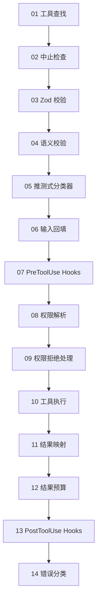
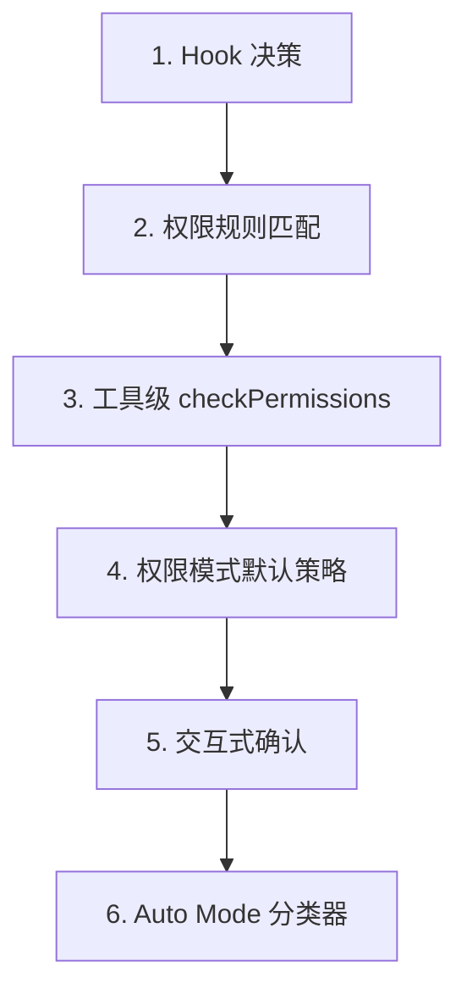
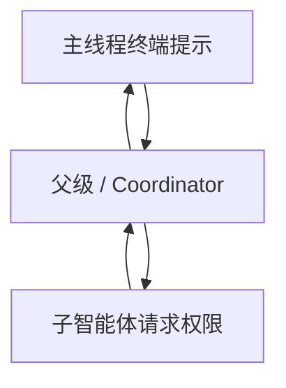

# 第六章：工具：从定义到执行

## 神经系统

第 5 章介绍了智能体循环，也就是那个不断执行 `while (true)` 的核心流程：流式接收模型响应、收集工具调用，再把工具结果反馈给模型。

循环是心跳，但如果没有一套神经系统，把“模型想运行 `git status`”翻译成真实的 Shell 命令，并在中间完成权限检查、结果预算和错误处理，那么心跳本身没有意义。

工具系统就是这套神经系统。

它包含：

- 40 多个工具实现；
- 一个带 Feature Flag 控制的集中式注册表；
- 一条 14 步执行流水线；
- 一个支持 7 种模式的权限解析器；
- 一个能在模型响应尚未结束时提前启动工具的流式执行器。

Claude Code 中的每一次工具调用，无论是读取文件、执行 Shell、运行 Grep，还是调度子智能体，都会经过同一条流水线。

统一性正是设计目标。

无论工具是内置的 Bash 执行器，还是第三方 MCP Server，它都会经历相同的：

- 输入校验；
- 权限检查；
- 结果预算；
- 错误分类。

`Tool` 接口大约有 45 个成员。听起来很庞大，但理解系统时，真正重要的只有五个：

```text
call()                 执行工具
inputSchema            校验并解析输入
isConcurrencySafe()    是否允许并行执行
checkPermissions()     是否允许当前操作
validateInput()        输入在语义上是否合理
```

其余内容，例如 12 个渲染方法、分析 Hook 和搜索提示，主要是为 UI 与遥测层服务。

先理解这五个，其他部分就会自然归位。

---

## 工具接口

### 三个类型参数

每个工具都由三个泛型类型参数定义：

```typescript
Tool<Input extends AnyObject, Output, P extends ToolProgressData>
```

### `Input`

`Input` 是一个 Zod 对象 Schema，同时承担两项职责：

1. 生成发送给 API 的 JSON Schema，让模型知道需要提供哪些参数；
2. 使用 `safeParse` 在运行时校验模型返回的参数。

### `Output`

`Output` 是工具执行结果对应的 TypeScript 类型。

### `P`

`P` 是工具运行时发送的进度事件类型。

例如：

- `BashTool` 会发送标准输出片段；
- `GrepTool` 会发送匹配数量；
- `AgentTool` 会发送子智能体对话记录。

---

## `buildTool()` 与 Fail-Closed 默认值

没有任何工具会直接构造一个 `Tool` 对象。

所有工具定义都会经过 `buildTool()` 工厂。该工厂会先铺入一组默认值，再由工具自己的定义覆盖：

```typescript
// 伪代码，用于说明 Fail-Closed 默认值模式
const SAFE_DEFAULTS = {
  isEnabled:        () => true,
  isParallelSafe:   () => false,  // Fail-Closed：新工具默认串行
  isReadOnly:       () => false,  // Fail-Closed：默认按写操作处理
  isDestructive:    () => false,
  checkPermissions: (input) => ({
    behavior: 'allow',
    updatedInput: input,
  }),
}

function buildTool(definition) {
  return {
    ...SAFE_DEFAULTS,
    ...definition,
  }
}
```

在涉及安全的地方，这些默认值会有意采取保守策略。

如果一个新工具忘记实现 `isConcurrencySafe`，它会默认返回 `false`，因此只会串行运行，不会并发执行。

如果工具忘记实现 `isReadOnly`，系统会默认把它视为写操作。

如果工具忘记实现 `toAutoClassifierInput`，它会返回空字符串。此时 Auto Mode 安全分类器会跳过它，工具仍然会进入通用权限系统，而不是获得某种自动绕过。

### 为什么 `checkPermissions` 默认允许

唯一看起来不是 Fail-Closed 的默认值，是 `checkPermissions`，它默认返回 `allow`。

乍看之下似乎不安全，但这是因为权限系统是分层的。

`checkPermissions` 属于工具自己的附加判断，它执行时，通用权限系统已经完成了：

- 权限规则检查；
- Hook 决策；
- 模式策略判断。

因此，一个工具从 `checkPermissions` 返回 `allow`，真正表达的是：

> 我没有额外的工具级反对理由。

它并不表示给予工具全局访问权。

工具接口还通过 `options`、`readFileState` 等具名字段，把上下文按用途分组。这种做法提供了类似多个小接口的结构，但避免了在 40 多个调用位置声明、实现并传递五套独立接口的样板代码。

---

## 并发安全取决于输入

`isConcurrencySafe` 的签名会接收已经解析的输入：

```typescript
isConcurrencySafe(input: z.infer<Input>): boolean
```

原因是同一个工具在不同输入下，安全属性可能不同。

`BashTool` 是最典型的例子。

```bash
ls -la
```

属于只读操作，可以安全并发执行。

而：

```bash
rm -rf /tmp/build
```

会修改文件系统，不能安全并发。

工具会解析命令，把其中每一个子命令与已知安全集合进行比较。只有当所有非中性部分都属于搜索或读取操作时，才会返回 `true`。

---

## `ToolResult` 返回类型

每一次 `call()` 都会返回：

```typescript
type ToolResult<T> = {
  data: T
  newMessages?: (
    | UserMessage
    | AssistantMessage
    | AttachmentMessage
    | SystemMessage
  )[]
  contextModifier?: (
    context: ToolUseContext,
  ) => ToolUseContext
}
```

### `data`

`data` 是类型明确的输出，最终会被序列化为 API 的 `tool_result` 内容块。

### `newMessages`

`newMessages` 允许工具向对话中注入额外消息。

例如，`AgentTool` 会使用它追加子智能体的完整对话记录。

### `contextModifier`

`contextModifier` 是一个函数，用于修改后续工具看到的 `ToolUseContext`。

例如，`EnterPlanMode` 会通过它把权限模式切换为 `plan`。

Context Modifier 只会对非并发安全工具立即生效。

如果一个工具正在并行运行，它的 Modifier 会先排队，等整个批次完成后再统一应用。

---

## `ToolUseContext`：上帝对象

`ToolUseContext` 是传递给每一次工具调用的巨型上下文包，大约包含 40 个字段。

按照任何正常定义，它都是一个上帝对象。

它之所以存在，是因为替代方案更糟。

一个类似 `BashTool` 的工具可能同时需要：

- Abort Controller；
- 文件状态缓存；
- AppState；
- 完整消息历史；
- 工具集合；
- MCP 连接；
- 多个 UI 回调。

如果把这些内容作为独立参数传递，函数签名很快会膨胀到 15 个以上参数。

工程上的务实方案是使用单个上下文对象，并按关注点分组。

### 配置

通常放在 `options` 子对象中，包括：

- 工具集合；
- 模型名称；
- MCP 连接；
- Debug Flag。

这些内容在 Query 开始时设置，之后大多保持不变。

### 执行状态

包括：

- 用于取消的 `abortController`；
- LRU 文件缓存 `readFileState`；
- 完整对话历史 `messages`。

这些数据会在执行过程中变化。

### UI 回调

包括：

```text
setToolJSX
addNotification
requestPrompt
```

它们只会在交互式 REPL 环境中连接。

SDK 和 Headless 模式通常把这些字段留空。

### 智能体上下文

包括：

- `agentId`；
- `renderedSystemPrompt`。

对于 Fork 出来的子智能体，`renderedSystemPrompt` 会保存被冻结的父级提示词。

如果子智能体重新渲染提示词，可能因为 Feature Flag 预热状态不同而产生差异，并破坏提示词缓存。

### 子智能体上下文中的取舍

`createSubagentContext()` 为子智能体创建上下文时，会有意决定哪些字段共享、哪些隔离。

例如：

- 对异步智能体，`setAppState` 会变成 No-op；
- `localDenialTracking` 会创建全新对象；
- `contentReplacementState` 会从父级克隆。

每一个选择背后，都记录着一个曾经出现过的生产环境 Bug。

---

## 工具注册表

### `getAllBaseTools()`：唯一真实来源

`getAllBaseTools()` 会返回当前进程中所有可能存在的工具。

始终存在的工具排在前面，随后是受 Feature Flag 控制的条件工具。

```typescript
const SleepTool =
  feature('PROACTIVE') || feature('KAIROS')
    ? require('./tools/SleepTool/SleepTool.js').SleepTool
    : null
```

来自 `bun:bundle` 的 `feature()` 会在打包阶段解析。

如果：

```typescript
feature('AGENT_TRIGGERS')
```

被静态判断为 `false`，打包器会把整个 `require()` 调用删除。

这是一种死代码消除，可以让最终二进制保持精简。

### `assembleToolPool()`：合并内置工具与 MCP 工具

最终发送给模型的工具集合来自：

```text
assembleToolPool()
```

它会按顺序执行：

1. 获取内置工具；
2. 应用 Deny Rule；
3. 隐藏不适用于 REPL 模式的工具；
4. 检查 `isEnabled()`；
5. 过滤 MCP 工具的 Deny Rule；
6. 分别按名称对内置工具和 MCP 工具排序；
7. 拼接为“内置工具前缀 + MCP 工具后缀”。

这里采用“分别排序后再拼接”，并不是审美偏好。

API Server 会在最后一个内置工具之后设置提示词缓存断点。

如果把全部工具混在一起做扁平排序，那么添加或删除一个 MCP 工具，就可能把某些内置工具的位置向前或向后移动，从而破坏缓存。

---

## 14 步工具执行流水线

`checkPermissionsAndCallTool()` 是意图真正变成行动的地方。

每一次工具调用都会经过以下 14 步：



### 步骤 1 到 4：校验

#### 01 工具查找

根据名称从注册表中查找工具。

如果当前名称没有直接命中，系统会回退到 `getAllBaseTools()` 查找别名。

这样可以兼容旧会话记录中已经改名的工具。

#### 02 中止检查

确认请求没有被取消。

这可以避免在 `Ctrl+C` 已经传播后，继续浪费资源执行之前排队的工具调用。

#### 03 Zod 校验

使用工具 Schema 检查输入类型。

对于 Deferred Tool，如果校验失败，系统会附加一个提示，要求模型先调用 `ToolSearch`。

#### 04 语义校验

Schema 合法不代表语义合理。

例如：

- `FileEditTool` 会拒绝没有任何实际变化的编辑；
- 当 `MonitorTool` 可用时，`BashTool` 会阻止单独运行 `sleep`。

### 步骤 5 到 6：准备

#### 05 启动推测式分类器

对于 Bash 命令，系统会并行启动 Auto Mode 安全分类器。

这样可以从常见路径中节省数百毫秒。

#### 06 输入回填

系统会克隆解析后的输入，再添加派生字段。

例如：

```text
~/foo.txt
```

会展开成绝对路径。

这里必须使用克隆，而不是直接修改原始输入，以保持会话记录稳定。

### 步骤 7 到 9：权限

#### 07 `PreToolUse` Hooks

这是工具系统的扩展点。

Hook 可以：

- 直接做出允许或拒绝决定；
- 修改输入；
- 注入上下文；
- 完全停止执行。

#### 08 权限解析

如果 Hook 已经返回权限决定，该决定就是最终结果。

否则，`canUseTool()` 会继续执行：

- 规则匹配；
- 工具级检查；
- 权限模式默认策略；
- 交互式确认。

#### 09 权限拒绝处理

系统会构造错误消息，并执行 `PermissionDenied` Hooks。

### 步骤 10 到 14：执行与清理

#### 10 工具执行

使用原始输入调用真正的：

```text
call()
```

#### 11 结果映射

把原始输出转换成 API 可以理解的 `tool_result` 消息。

#### 12 结果预算

超大输出会被保存到：

```text
~/.claude/tool-results/{hash}.txt
```

对话中只保留预览与文件路径。

#### 13 `PostToolUse` Hooks

这些 Hook 可以修改 MCP 输出，或者阻止后续继续执行。

工具返回的 `newMessages` 也会在此阶段追加，例如：

- 子智能体对话记录；
- 系统提醒。

#### 14 错误分类

系统会：

- 为遥测分类错误；
- 从可能被压缩或混淆的错误名称中提取稳定信息；
- 发送 OpenTelemetry 事件。


---

## 权限系统

### 七种模式

| 模式 | 行为 |
|---|---|
| `default` | 执行工具级检查，对无法识别的操作向用户询问 |
| `acceptEdits` | 自动允许文件编辑，其他操作仍可能需要询问 |
| `plan` | 只读模式，拒绝全部写操作 |
| `dontAsk` | 自动拒绝所有原本需要弹窗询问的操作，常用于后台智能体 |
| `bypassPermissions` | 不弹窗，允许全部操作 |
| `auto` | 使用对话记录分类器做决定，受 Feature Flag 控制 |
| `bubble` | 子智能体内部模式，把权限请求升级给父智能体 |

### 权限解析链

当一次工具调用进入权限解析阶段，系统会按以下顺序判断：



#### 1. Hook 决策

如果 `PreToolUse` Hook 已经返回 `allow` 或 `deny`，该结果就是最终结果。

#### 2. 规则匹配

系统维护三组规则：

```text
alwaysAllowRules
alwaysDenyRules
alwaysAskRules
```

规则可以匹配工具名称，也可以匹配可选内容模式。

例如：

```text
Bash(git *)
```

会匹配所有以 `git` 开头的 Bash 命令。

#### 3. 工具级检查

调用工具自己的：

```text
checkPermissions()
```

大多数工具只会透传结果。

#### 4. 模式默认策略

例如：

- `bypassPermissions` 直接允许；
- `plan` 拒绝写操作；
- `dontAsk` 拒绝原本需要询问的操作。

#### 5. 交互式确认

在 `default` 和 `acceptEdits` 模式下，尚未解决的权限请求会显示确认提示。

#### 6. Auto Mode 分类器

Auto Mode 使用两阶段分类器：

1. 先调用快速模型；
2. 对模糊案例再使用 Extended Thinking。

### `classifierApprovable`

安全检查结果中包含一个：

```text
classifierApprovable
```

字段。

例如，对以下目录的编辑会设为 `true`：

```text
.claude/
.git/
```

这类操作不常见，但有时确实合理，可以交给分类器判断。

而 Windows 路径绕过尝试通常会设为 `false`，因为它们几乎总是带有对抗性。

---

## 权限规则与匹配

权限规则保存为 `PermissionRule` 对象，包含三个部分。

### 来源 `source`

用于追踪规则从哪里产生，例如：

```text
userSettings
projectSettings
localSettings
cliArg
policySettings
session
```

### 行为 `ruleBehavior`

可能是：

```text
allow
deny
ask
```

### 规则值 `ruleValue`

包含：

- 工具名称；
- 可选的内容模式。

`ruleContent` 支持细粒度匹配。

例如：

```text
Bash(git *)
```

允许所有以 `git` 开头的 Bash 命令。

```text
Edit(/src/**)
```

只允许编辑 `/src` 下的文件。

```text
Fetch(domain:example.com)
```

只允许访问特定域名。

没有 `ruleContent` 的规则，会匹配该工具的全部调用。

### Bash 权限匹配

`BashTool` 会使用：

```text
parseForSecurity()
```

解析命令。它是一个 Bash AST Parser，可以把复合命令拆成多个子命令。

如果 AST 解析失败，例如命令包含复杂 Heredoc 或嵌套子 Shell，匹配器会返回：

```typescript
() => true
```

也就是 Fail-Safe：始终执行安全检查 Hook。

背后的假设是：

> 如果一个命令复杂到无法可靠解析，它也复杂到不能自信地排除安全检查。

---

## 子智能体的 Bubble 模式

在 Coordinator-Worker 模式中，子智能体没有自己的终端，因此无法弹出权限确认框。

`bubble` 模式会把权限请求沿上下文向上传递。

主线程中的 Coordinator 智能体拥有终端访问能力，它负责：

1. 向用户显示权限提示；
2. 获得决定；
3. 把结果传回子智能体。



---

## 工具延迟加载

具有：

```text
shouldDefer: true
```

的工具，会以：

```text
defer_loading: true
```

发送给 API。

此时，模型只能看到：

- 工具名称；
- 工具描述。

完整参数 Schema 不会立即发送。

这样可以减少初始提示词大小。

模型要使用 Deferred Tool，必须先调用：

```text
ToolSearchTool
```

加载它的 Schema。

### 未加载就调用会发生什么

如果模型未加载 Schema 就直接调用 Deferred Tool，所有类型化参数可能都会以字符串形式到达，最终导致 Zod 校验失败。

系统会在错误中附加有针对性的恢复提示，告诉模型先使用 `ToolSearch`。

### 对缓存的帮助

Deferred Tool 在提示词中只贡献工具名称。

因此，添加或删除一个延迟加载的 MCP 工具，只会让提示词变化几个 Token，而不是数百个 Token。

这会显著提高缓存命中率。

---

## 结果预算

### 单工具大小限制

每个工具会声明：

```text
maxResultSizeChars
```

代表单次结果允许的最大字符数。

| 工具 | `maxResultSizeChars` | 原因 |
|---|---:|---|
| `BashTool` | 30,000 | 足够覆盖大多数有用的命令输出 |
| `FileEditTool` | 100,000 | Diff 可能很大，但模型通常需要查看 |
| `GrepTool` | 100,000 | 带上下文行的搜索结果很容易膨胀 |
| `FileReadTool` | `Infinity` | 工具自行限制 Token；持久化会造成循环 Read |

当结果超过阈值时，完整内容会保存到磁盘。

对话中的结果会替换为一个：

```text
<persisted-output>
```

包装块，其中包含：

- 内容预览；
- 完整结果文件路径。

如果需要，模型可以继续使用 `Read` 打开完整输出。

### 整场对话的累计预算

除了单工具限制，`ContentReplacementState` 还会追踪整场对话的累计预算。

这是为了防止“千刀万剐式”上下文膨胀：

> 每个工具都只返回自身限制的 90%，单次看起来都没有超标，但几十次调用累积起来仍然能压垮上下文窗口。

---

## 代表性工具

### `BashTool`：最复杂的工具

`BashTool` 是整个系统中最复杂的工具。

它会：

- 解析复合命令；
- 判断子命令是只读还是写入；
- 管理后台任务；
- 根据 Magic Bytes 检测图片输出；
- 为安全编辑预览模拟 `sed`。

#### 复合命令解析

`splitCommandWithOperators()` 会把下面的命令：

```bash
cd /tmp && mkdir build && ls build
```

拆成独立子命令。

每个子命令都会与已知安全命令集合比较，例如：

```text
BASH_SEARCH_COMMANDS
BASH_READ_COMMANDS
BASH_LIST_COMMANDS
```

只有当所有非中性部分都安全时，整个复合命令才被视为只读。

中性命令包括：

```text
echo
printf
```

它们不会让一个命令自动变成只读，但也不会让它自动变成写操作。

#### `sed` 模拟：`_simulatedSedEdit`

当用户在权限对话框中批准一条 `sed` 命令时，系统会先在沙箱中运行该命令，计算可能产生的文件结果，并捕获输出。

这个预计算结果会写入输入字段：

```text
_simulatedSedEdit
```

真正调用 `call()` 时，系统会直接应用预计算的编辑，而不是再次通过 Shell 执行 `sed`。

这样可以保证：

> 用户在权限提示中看到的内容，就是最终实际写入的内容。

如果预览与执行之间文件已经变化，重新执行 Shell 命令可能得到不同结果，而预计算机制避免了这种时间差风险。

---

## `FileEditTool`：陈旧状态检测

`FileEditTool` 会使用 `readFileState`。

这是一个在整个对话期间维护文件内容与时间戳的 LRU Cache。

在应用编辑之前，工具会检查：

> 文件是否在模型上次读取之后发生了变化。

文件可能被以下对象修改：

- 后台进程；
- 另一个工具；
- 用户本人。

如果文件已经陈旧，系统会拒绝编辑，并要求模型先重新读取文件。

### 模糊匹配

`findActualString()` 会处理模型在空格方面出现小偏差的常见情况。

它会在匹配前规范化：

- 空白字符；
- 引号样式。

因此，`old_string` 即使多了尾部空格，也可能正确匹配实际文件内容。

### `replace_all`

`replace_all` 允许批量替换。

如果没有启用它，而 `old_string` 在文件中出现多次，系统会拒绝编辑，并要求模型提供更多上下文，把目标定位到唯一位置。

---

## `FileReadTool`：多用途读取器

`FileReadTool` 是唯一一个：

```text
maxResultSizeChars: Infinity
```

的内置工具。

如果 Read 的输出也被持久化到磁盘，模型就必须再用 Read 读取那个结果文件。

如果结果文件本身仍然超限，就会形成无限 Read 循环。

因此，Read 不通过通用持久化机制限制结果，而是在源头使用 Token 估算自行截断。

它可以读取：

- 带行号的文本文件；
- 图片，并返回 Base64 多模态内容块；
- PDF，通过 `extractPDFPages()`；
- Jupyter Notebook，通过 `readNotebook()`；
- 目录，并回退到类似 `ls` 的结果。

它还会阻止危险设备路径，例如：

```text
/dev/zero
/dev/random
/dev/stdin
```

此外，它会处理 macOS 截图文件名中的特殊空格问题，例如 U+202F 窄不换行空格与普通空格在“Screen Shot”文件名中的差异。

---

## `GrepTool`：通过 `head_limit` 分页

`GrepTool` 对 `ripGrep()` 做了一层封装，并使用：

```text
head_limit
```

实现分页。

默认值是：

```text
250
```

这个数量通常足够有用，同时又不会让上下文过度膨胀。

当结果被截断时，响应中会包含：

```text
appliedLimit: 250
```

它会提示模型下一次调用时使用 `offset` 继续分页。

显式设置：

```text
head_limit: 0
```

可以完全取消限制。

`GrepTool` 会自动排除六种版本控制目录：

```text
.git
.svn
.hg
.bzr
.jj
.sl
```

搜索 `.git/objects` 几乎从来不是模型真正想做的事情，而且误读二进制 Pack File 会瞬间耗尽 Token 预算。

---

## `AgentTool` 与 Context Modifier

`AgentTool` 会启动拥有独立 Query Loop 的子智能体。

它的 `call()` 会返回：

- 包含子智能体对话记录的 `newMessages`；
- 可选的 `contextModifier`，用于把状态变化传播回父智能体。

默认情况下，`AgentTool` 不属于并发安全工具。

因此，如果模型在同一条响应中发起多次 Agent 调用，它们会串行运行。

每个子智能体的 Context Modifier 都会先应用，然后下一个子智能体才开始。

在 Coordinator Mode 下，模式会反转：Coordinator 会为相互独立的任务分发子智能体，而：

```text
isAgentSwarmsEnabled()
```

可以解锁并行智能体执行。


---

## 工具如何参与消息历史

工具结果并不是简单地把一段数据返回给模型。

它们会以结构化消息的方式进入对话。

API 要求工具结果使用：

```text
ToolResultBlockParam
```

并通过 ID 引用最初的 `tool_use` 内容块。

大多数工具会把结果序列化为文本。

`FileReadTool` 可以把图片序列化为 Base64 编码的图片内容块，从而支持多模态响应。

`BashTool` 会检查标准输出中的 Magic Bytes。如果发现图片数据，就会改用图片内容块返回。

### `ToolResult.newMessages`

`newMessages` 让工具可以突破简单的“一次调用对应一次结果”模式，继续扩展对话。

#### 子智能体记录

`AgentTool` 会把子智能体的消息历史作为 Attachment Message 注入父级对话。

#### 系统提醒

记忆类工具可以在工具结果之后注入系统消息。

这些消息会在下一轮对模型可见，但会在：

```text
normalizeMessagesForAPI
```

边界处被剥离或规范化。

#### 附件消息

Hook 结果、额外上下文和错误详情可以通过带结构化元数据的 Attachment Message 传递，供模型在后续轮次引用。

### `contextModifier`

`contextModifier` 是工具修改执行环境的正式机制。

例如：

- `EnterPlanMode` 会把权限模式设置为 `plan`；
- `ExitWorktree` 会修改当前工作目录。

工具不能直接修改 `ToolUseContext`。

每次工具调用之前，Context 都会经过展开复制。

因此，Modifier 是工具影响后续工具的唯一正式入口。

编排层会强制要求具有 Modifier 的工具串行执行。

原因很明确：

> 如果两个并发工具都修改工作目录，最终应该以谁的结果为准？

---

## 将这些模式应用到自己的工具系统

### 使用 Fail-Closed 默认值

新工具在被明确标记之前，应该采取保守行为。

开发者忘记设置一个 Flag 时，系统应该得到安全结果，而不是危险结果。

### 安全属性应依赖输入

下面这些方法应该接收解析后的输入：

```text
isConcurrencySafe(input)
isReadOnly(input)
```

同一个工具在不同输入下，可能拥有不同的安全属性。

简单地把 `BashTool` 标记成“永远串行”虽然安全，但会浪费大量可并发执行的机会。

### 权限应该分层

不同权限机制解决不同问题：

- 工具级检查；
- 基于规则的匹配；
- 模式默认值；
- 交互式提示；
- 自动分类器。

没有任何单一机制能够覆盖全部情况。

### 不只限制输入，也要限制结果

输入 Token 限制很常见，但工具结果也可能无限大，而且会跨轮次累积。

需要同时具备：

- 单工具限制，防止一次结果爆炸；
- 全会话累计限制，防止多次小结果共同压垮上下文。

### 错误分类必须适合遥测

在 Minified Build 中：

```text
error.constructor.name
```

可能已经被改写。

`classifyToolError()` 会从错误对象中提取最稳定、最有信息量的安全字符串，例如：

- 适合遥测的固定消息；
- `errno`；
- 稳定错误名。

它不会把原始错误消息直接发送到分析系统，避免泄漏敏感内容。

---

## 本章总结

本章追踪了一次工具调用如何从定义一路走到执行结果。

完整路径可以概括为：


这套系统的核心不是某一个工具特别聪明，而是所有工具都必须遵守同一套规则：

- 统一定义；
- 统一校验；
- 统一权限；
- 统一执行；
- 统一结果预算；
- 统一错误分类。

`Tool` 接口虽然拥有约 45 个成员，但真正驱动系统的是五个核心能力：

```text
call()
inputSchema
isConcurrencySafe()
checkPermissions()
validateInput()
```

围绕它们，Claude Code 构建了一个能够处理内置工具、MCP 工具、文件操作、Shell 命令与子智能体的统一神经系统。

本章关注的是一次工具调用如何执行。

但模型很少只请求一个工具。

多个工具如何划分为并发批次、哪些必须串行、流式响应尚未结束时工具怎样提前启动，将是下一章的主题。
