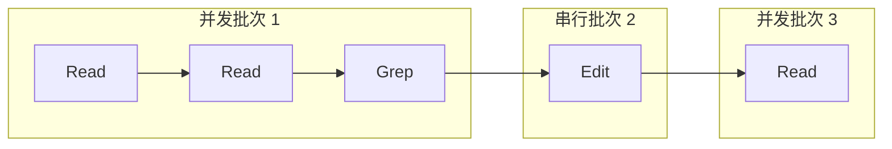
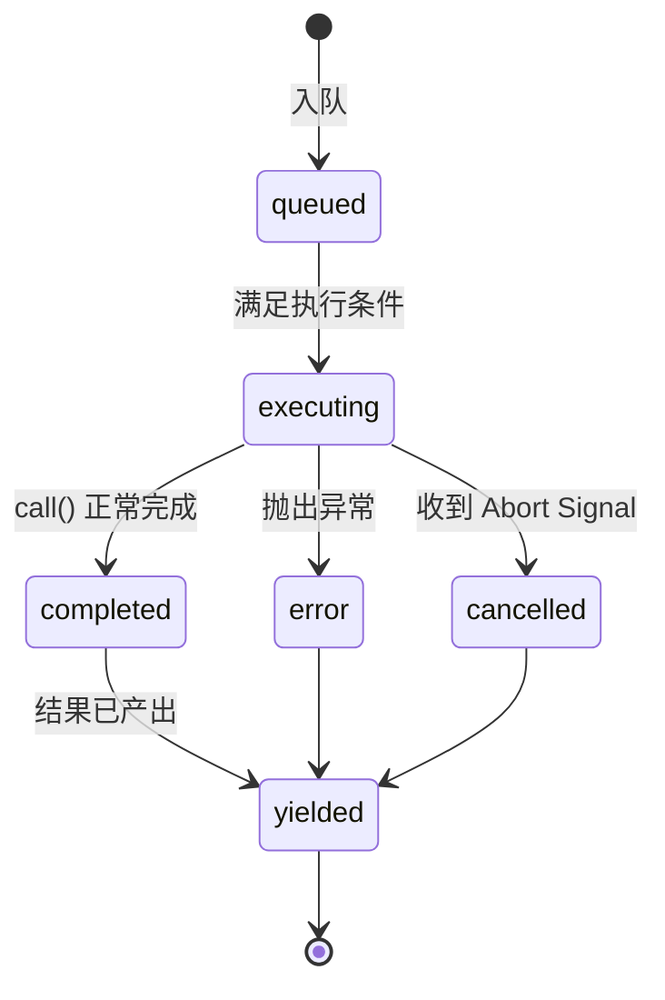
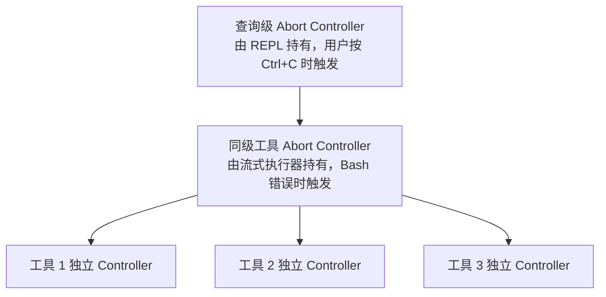

# 第七章：并发工具执行

> 原文：[Ch 7. Concurrent Tool Execution](https://claude-code-from-source.com/ch07-concurrency/)


## 等待的代价

第 6 章追踪了一次工具调用的完整生命周期：从 API 响应中的原始 `tool_use` 区块开始，经过输入校验、权限检查、执行以及结果格式化。

那条流水线处理的是一个工具。

但模型很少只请求一个工具。

一次典型的 Claude Code 交互，每轮通常会包含 3 到 5 次工具调用，例如：

> 读取这两个文件，搜索这个模式，然后编辑这个函数。

模型会在同一个响应中发出全部这些工具调用。

如果每个工具耗时 200 毫秒，并且按顺序执行，那么总耗时就是 1 秒。

如果 Read 和 Grep 相互独立，而它们通常确实独立，那么并行执行就可以把这部分耗时压缩到 200 毫秒。

这是一次免费的 5 倍提升。

但不是所有工具都相互独立。

修改 `config.ts` 的 Edit，不能和另一个同样修改 `config.ts` 的 Edit 并发运行。

创建目录的 Bash 命令，必须先完成，后续把文件写进该目录的 Bash 命令才能执行。

因此，并发安全并不是某个工具类型的全局属性。

它取决于：

> 某一次具体的工具调用，以及这次调用携带的具体输入。

这就是整个并发系统的核心洞察：

> **安全性属于每次调用，而不是属于工具类型。**

例如：

```text
Bash("ls -la")
```

适合并行执行。

而：

```text
Bash("rm -rf build/")
```

不适合并行执行。

工具相同，输入不同，并发分类也不同。

系统必须先检查输入，再决定是否并行。

Claude Code 实现了两层并发优化。

### 第一层：批次编排

模型响应完全接收之后，系统会把工具调用划分为：

- 可以并发的分组；
- 必须串行的分组。

然后使用相应方式执行每个分组。

### 第二层：推测执行

模型响应还在流式生成时，系统就开始执行已经完整解析出来的工具。

工具结果可能在模型响应结束之前就已经准备好。

这两种机制结合后，可以消除大部分原本浪费在等待上的墙钟时间。

---

## 分组算法

入口函数是：

```text
partitionToolCalls()
```

它位于：

```text
toolOrchestration.ts
```

该函数接收一个按顺序排列的 `ToolUseBlock` 消息数组，并输出一组批次。

每个批次只有两种形式：

- 一组全部并发安全的调用；
- 一个必须串行执行的工具。

伪代码如下：

```typescript
// 伪代码，用于展示分组算法
type Group = {
  parallel: boolean
  calls: ToolCall[]
}

function groupBySafety(
  calls: ToolCall[],
  registry: ToolRegistry,
): Group[] {
  return calls.reduce((groups, call) => {
    const def = registry.lookup(call.name)
    const input = def?.schema.safeParse(call.input)

    // 失败即关闭：解析失败或出现异常时，默认串行
    const safe = input?.success
      ? tryCatch(
          () => def.isParallelSafe(input.data),
          false,
        )
      : false

    // 把连续的安全调用合并到同一个批次
    if (safe && groups.at(-1)?.parallel) {
      groups.at(-1)!.calls.push(call)
    } else {
      groups.push({
        parallel: safe,
        calls: [call],
      })
    }

    return groups
  }, [] as Group[])
}
```

算法会从左到右遍历整个调用数组。

对于每一个工具调用，它会依次完成以下步骤。

### 第一步：查找工具定义

根据工具名称从 Registry 中查找对应定义。

### 第二步：解析输入

使用工具的 Zod Schema 调用：

```text
safeParse()
```

如果解析失败，系统会保守地把该工具判断为不支持并发。

### 第三步：调用输入相关的并发判断

调用：

```text
isConcurrencySafe(parsedInput)
```

并发分类就在这里发生。

例如，Bash 工具会：

1. 解析命令字符串；
2. 检查每一个子命令是否属于只读操作；
3. 只有整个复合命令都是纯读取时，才返回 `true`。

典型安全命令包括：

```text
ls
grep
cat
git status
```

Read 工具始终返回 `true`。

Edit 工具始终返回 `false`。

并发判断本身也会被 `try-catch` 包裹。

如果 `isConcurrencySafe()` 抛出异常，例如 Shell 命令无法被解析，系统会默认串行执行。

### 第四步：合并或新建批次

如果：

- 当前工具并发安全；
- 最近一个批次也是并发批次；

那么就把当前调用追加到最近批次。

否则，创建一个新批次。

---

## 具体示例

假设模型请求：

```text
[Read, Read, Grep, Edit, Read]
```

处理过程如下：

```text
第 1 步：Read
并发安全
新建批次 {safe, [Read]}

第 2 步：Read
并发安全
追加到批次 {safe, [Read, Read]}

第 3 步：Grep
并发安全
追加到批次 {safe, [Read, Read, Grep]}

第 4 步：Edit
不安全
新建批次 {serial, [Edit]}

第 5 步：Read
并发安全
新建批次 {safe, [Read]}
```

最终得到 3 个批次：

```text
批次 1：[Read, Read, Grep]
并发执行

批次 2：[Edit]
单独串行执行

批次 3：[Read]
作为一个并发批次执行，虽然只有一个工具
```

可以表示为：



分组算法具备两个特点：

- 贪心；
- 保持原始顺序。

连续的安全工具会被合并进同一个批次。

任何不安全工具都会打断并发序列，并启动新的批次。

这意味着模型发出工具调用的顺序会影响批次数量。

例如，如果模型在两个 Read 之间插入一个 Write，那么系统会得到 3 个批次，而不是 2 个。

实际使用中，模型通常会把读取操作聚集在一起，这也是该算法优化的常见场景。

---

## 批次执行

`runTools()` 生成器会遍历划分好的批次，并把每个批次交给合适的执行器。

---

## 并发批次

对于并发批次，`runToolsConcurrently()` 会通过一个支持并发上限的 `all()` 工具，同时启动所有工具。

```typescript
// 伪代码，用于展示并发分发模式
async function* dispatchParallel(
  calls,
  context,
) {
  yield* boundedAll(
    calls.map(async function* (call) {
      context.markInProgress(call.id)
      yield* executeSingle(call, context)
      context.markComplete(call.id)
    }),
    MAX_CONCURRENCY,
  )
}
```

默认并发上限是：

```text
10
```

它可以通过下面的环境变量进行配置：

```text
CLAUDE_CODE_MAX_TOOL_USE_CONCURRENCY
```

10 是一个相当宽松的数值。

模型单次响应很少会生成超过 5 到 6 个工具调用。

这个限制主要用于防止病态情况，而不是普通场景下的性能瓶颈。

### 生成器感知的 `all()`

这里使用的 `all()` 不是普通的 `Promise.all()`。

它是一个具备以下能力的异步生成器调度器：

- 限制同时活跃的生成器数量；
- 最多启动 N 个生成器；
- 谁先产出结果，就先把谁的结果向外产出；
- 某个生成器结束后，再启动下一个排队生成器。

它的工作方式接近：

> 由 Semaphore 控制的任务池，只不过专门适配会持续产出中间结果的异步生成器。

---

## 上下文修改器排队

并发执行中最微妙的部分，是上下文修改器。

某些工具会产生 Context Modifier，也就是一个用于修改后续 `ToolUseContext` 的函数。

工具并发执行时，不能立即应用这些修改器，因为同一个批次中的其他工具正在读取同一份上下文。

因此，系统会先把修改器按工具调用 ID 收集到 Map 中。

```typescript
const queuedContextModifiers: Record<
  string,
  (
    (context: ToolUseContext) => ToolUseContext
  )[]
> = {}
```

整个并发批次完成之后，系统会按照工具提交顺序，而不是完成顺序，依次应用这些修改器。

```typescript
for (const block of blocks) {
  const modifiers =
    queuedContextModifiers[block.id]

  if (!modifiers) continue

  for (const modifier of modifiers) {
    currentContext = modifier(currentContext)
  }
}
```

这样可以保证上下文演化是确定性的。

当前内置的并发安全工具都不会产生 Context Modifier，代码中的注释也明确承认了这一点。

但这套基础设施仍然存在，因为 MCP 服务器可以增加自定义工具。

例如，一个只读 MCP 工具可能希望更新：

```text
已经看过的文件集合
```

这种行为本身并不会写入文件，但仍然会修改执行上下文。

---

## 串行批次

串行执行更加直接。

每一个工具运行后，它的 Context Modifier 会立即应用，然后下一个工具会看到更新后的上下文。

```typescript
for (const toolUse of toolUseMessages) {
  for await (
    const update of runToolUse(
      toolUse,
      /* ... */
    )
  ) {
    if (update.contextModifier) {
      currentContext =
        update.contextModifier.modifyContext(
          currentContext,
        )
    }

    yield {
      message: update.message,
      newContext: currentContext,
    }
  }
}
```

这是并发与串行之间最重要的差异。

串行工具可以改变后续工具所看到的世界。

例如：

- Edit 修改一个文件，之后的 Read 会读到修改后的内容；
- Bash 创建一个目录，之后的 Bash 才能向里面写入文件。

Context Modifier 是这种依赖关系的正式表达方式。

它允许工具声明：

> 执行环境已经变化，后续工具应当使用这份新上下文。

---

## 流式工具执行器

批次编排解决了模型响应完全到达之后的无谓串行问题。

但还有一个更大的优化空间：

> 模型响应本身也需要时间才能完整流式生成。

典型的多工具响应可能需要 2 到 3 秒才能完整到达。

第一个工具调用通常在 500 毫秒左右就已经能够完整解析。

既然如此，为什么还要等待剩余 2 秒？

`StreamingToolExecutor` 类实现了推测执行。

当模型流式输出响应时，每一个 `tool_use` 区块一旦完成解析，就会立即交给执行器。

执行器会马上开始运行它，同时模型仍在生成后续工具调用。

当模型响应结束时，一些工具可能已经执行完成。

---

## 顺序执行与流式推测执行

原文提供了一张可以播放的对比动画（见 [原文交互版](https://claude-code-from-source.com/ch07-concurrency/)）。

静态示例如下：

```text
顺序执行：

0s ───── 模型生成完整响应 ───── 2.0s
                                 ↓
                         Tool 1：读取文件
                                 ↓
                         Tool 2：读取文件
                                 ↓
                         Tool 3：写入文件

总耗时约 3.1s
```

```text
流式推测执行：

0s ───── 模型流式生成 ───────── 2.0s
       ↘ Tool 1：读取文件
            ↘ Tool 2：读取文件
                                 ↓
                         Tool 3：写入文件

总耗时约 2.6s
```

在这个例子中：

- 顺序执行总耗时约 3.1 秒；
- 流式执行总耗时约 2.6 秒；
- 墙钟时间减少约 16%。

两个读取工具在模型仍然流式生成时就已经完成。

如果模型请求 5 个只读工具，而响应本身需要 3 秒生成，那么这 5 个工具都可能在这 3 秒内启动并完成。

模型最后一个字符出现后，后续 Drain 阶段可能已经没有任何工作可做。

用户几乎可以立即看到结果。

---

## 工具生命周期

流式执行器会追踪每个工具的生命周期。

原文描述了以下几个状态：



### `queued`

`tool_use` 区块已经完成解析并注册，但正在等待并发条件允许执行。

### `executing`

工具的 `call()` 正在运行，结果被累积到内部 Buffer。

### `completed`

执行完成，结果已经可以向对话产出。

### `yielded`

结果已经发送，属于终态。

此外，异常和中止会进入 `error` 或 `cancelled`，最终也会转换成可产出的结果。

---

## `addTool()`：流式响应期间入队

方法签名如下：

```typescript
addTool(
  block: ToolUseBlock,
  assistantMessage: AssistantMessage,
): void
```

流式响应解析器每收到一个完整的 `tool_use` 区块，就会调用它。

该方法会完成以下工作：

1. 查找工具定义；
2. 如果工具不存在，立即创建一个带错误消息的已完成条目；
3. 解析输入；
4. 使用与 `partitionToolCalls()` 相同的逻辑判断并发安全性；
5. 创建状态为 `queued` 的 `TrackedTool`；
6. 调用 `processQueue()`，尝试立即启动工具。

如果工具不存在，就没有必要把它加入等待队列。

系统会直接生成错误结果。

`processQueue()` 的调用方式是 Fire-and-forget：

```typescript
void this.processQueue()
```

执行器不会等待它完成。

这是刻意设计的。

`addTool()` 是从流式解析器的事件处理函数中调用的。

如果在这里阻塞，模型响应解析也会被卡住。

因此，工具会在后台启动，解析器则继续消费响应流。


---

## `processQueue()`：准入检查

准入条件可以压缩成一个谓词：

```typescript
// 伪代码，用于展示互斥规则
canRun =
  noToolsRunning ||
  (
    newToolIsSafe &&
    allRunningAreSafe
  )
```

一个工具只有在以下任一条件成立时才能开始执行：

1. 当前没有任何工具正在运行；
2. 新工具并发安全，并且所有正在运行的工具也都并发安全。

这是一份互斥契约。

不支持并发的工具需要独占访问。

只要它在运行，其他工具都不能同时运行。

并发安全工具可以和其他并发安全工具共享执行跑道。

但正在执行集合中只要存在一个非并发工具，其他工具就会被阻塞。

`processQueue()` 会按顺序遍历全部工具。

对于每个仍然处于 `queued` 状态的工具，它会调用：

```text
canExecuteTool()
```

如果可以执行，就立即启动。

如果一个非并发工具暂时无法运行，遍历会直接停止。

系统不会继续检查它后面的工具，因为非并发工具必须保持原始顺序。

如果一个并发工具被正在执行的非并发工具阻塞，遍历可以继续。

不过实际场景中，这通常不会带来太多收益，因为排列在非并发阻塞项之后的工具，往往也依赖它的结果。

---

## `executeTool()`：核心执行循环

真正复杂的逻辑位于 `executeTool()`。

它负责管理：

- Abort Controller；
- 错误级联；
- 进度消息；
- Context Modifier；
- 工具结果缓存。

---

## 子级 Abort Controller

每一个工具都会获得自己的 `AbortController`。

它是一个共享同级控制器的子控制器。

整个控制层级有三层：



### 查询级控制器

由 REPL 持有。

用户按下 `Ctrl+C` 时，它会触发并中止整个当前查询。

### 同级控制器

由 Streaming Executor 持有。

当某个需要级联的工具失败时，它可以中止当前批次中的全部同级工具。

### 工具独立控制器

只控制某一个工具。

中止它通常只会杀掉这个工具。

但是，如果中止原因不是同级错误，它还会向查询级控制器向上冒泡。

---

## 为什么中止必须向上冒泡

权限拒绝尤其依赖这套机制。

当用户在权限对话框中拒绝一个工具时，该工具的 Abort Controller 会触发。

这个信号必须传到查询循环，让整个当前轮次结束。

如果不向上冒泡，查询循环会继续运行，好像什么都没发生过，然后把一个已经过期的拒绝消息发送给模型。

因此，权限拒绝不能只停留在单个工具层级。

---

## 同级错误级联

当工具返回错误结果时，执行器会判断是否需要取消同级工具。

规则非常明确：

> 只有 Bash 错误会向同级工具级联。

当 Shell 命令出错时，执行器会：

1. 记录失败；
2. 提取失败工具的简短描述；
3. 中止同级控制器；
4. 取消当前批次中其他正在运行的工具。

这样设计是因为 Bash 命令经常形成隐式依赖链。

例如：

```bash
mkdir build &&
cp src/* build/ &&
tar -czf dist.tar.gz build/
```

如果 `mkdir build` 失败，那么继续执行 `cp` 和 `tar` 已经没有意义。

立即取消同级工具可以：

- 节省时间；
- 避免产生一串迷惑性的后续错误。

Read 和 Grep 错误则不会级联。

如果一个文件因为被删除而读取失败，并不代表另一个目录中的 Grep 也会失败。

取消 Grep 只会浪费已经开始的工作。

### 合成错误消息

被取消的同级工具会收到类似下面的合成错误：

```text
Cancelled: parallel tool call Bash(mkdir build) errored
```

描述中会包含失败工具命令或文件路径的前 40 个字符。

这样模型可以理解是哪一个操作引发了级联取消。

---

## 进度消息与结果分离

进度消息不会和最终结果共用同一条缓冲路径。

例如：

```text
正在读取文件……
正在搜索……
```

最终结果会被缓存，并按顺序产出。

进度消息则会进入：

```text
pendingProgress
```

数组，并通过：

```text
getCompletedResults()
```

尽快发给 UI。

系统还使用一个 Resolve Callback 来唤醒 `getRemainingResults()` 等待循环。

当长时间运行的工具产生新进度时，UI 可以立即更新，不会看起来像被冻结。

---

## 重新处理队列

每个工具执行结束后，系统都会再次调用：

```typescript
void promise.finally(() => {
  void this.processQueue()
})
```

这正是之前被并发批次阻塞的串行工具能够启动的原因。

当最后一个并发工具结束后，后续非并发工具的 `canExecuteTool()` 就会通过检查，然后立即开始执行。

---

## 结果收割

流式执行器暴露两个结果收割方法。

它们服务于响应生命周期中的不同阶段。

### `getCompletedResults()`

用于模型仍在流式响应时收割结果。

这是一个同步生成器，会按提交顺序遍历工具数组。

对于每个工具，它会：

1. 先排空待处理进度消息；
2. 如果工具已经完成，产出它的结果；
3. 把工具标记为 `yielded`。

关键规则是：

> 如果一个非并发工具仍在执行，遍历会在这里停止。

即使后面的工具已经完成，也不能产出。

因为排在串行工具之后的结果，可能依赖它的 Context Modifier。

它们必须等待。

对于并发工具，这个限制不适用。

如果当前并发工具仍在执行，遍历可以跳过它，并继续检查后续并发条目。

### 顺序保持逻辑

可以概括为：

```text
遇到正在运行的并发工具：
跳过，继续检查后面。

遇到正在运行的串行工具：
停止，后面的结果全部等待。
```

这就是结果顺序保护机制。

---

## `getRemainingResults()`

这个方法用于模型响应完全结束之后的 Drain 阶段。

它是一个异步生成器，会一直循环，直到所有工具结果都已经产出。

每一轮会：

1. 处理队列，启动新近解除阻塞的工具；
2. 通过 `getCompletedResults()` 产出已完成结果；
3. 如果还有工具正在执行，但暂时没有新结果，就进入等待。

等待方式使用：

```typescript
Promise.race()
```

它会等待以下事件中最先发生的一个：

- 任意正在执行的工具完成；
- 新的进度消息出现。

这可以避免忙轮询。

系统既不会不断占用 CPU 检查状态，也能在事件发生的瞬间立刻醒来。

---

## 保持提交顺序

工具结果会按照模型请求工具的顺序产出，而不是按照完成顺序。

这是一个有意的设计选择。

假设模型请求：

```text
[
  Read("a.ts"),
  Read("b.ts"),
  Read("c.ts")
]
```

三个读取同时开始。

完成顺序可能是：

```text
c.ts
a.ts
b.ts
```

因为 `c.ts` 最小，所以最先完成。

如果按照完成顺序写入对话，历史会变成：

```text
工具结果：c.ts 内容
工具结果：a.ts 内容
工具结果：b.ts 内容
```

但模型最初的请求顺序是 a、b、c。

为了让下一轮上下文与模型预期一致，系统会产出：

```text
工具结果：a.ts 内容
工具结果：b.ts 内容
工具结果：c.ts 内容
```

即使：

- `a.ts` 第二个完成，却第一个产出；
- `b.ts` 第三个完成，却第二个产出；
- `c.ts` 第一个完成，却最后产出。

代价是小量等待。

如果工具 1 很慢，而工具 2 到工具 5 都很快，那么后者的结果需要暂存在 Buffer 中，直到工具 1 完成。

但替代方案是对话历史失去一致性，代价远大于这点等待。

---

## `discard()`：流式回退的逃生口

如果 API 响应流在中途失败，例如：

- 网络错误；
- 服务器断开；
- SSE 流被截断；

系统会发起新的 API 请求重试。

但旧的 Streaming Executor 可能已经启动了失败响应中的工具。

这些结果已经变成孤儿，因为它们对应的模型响应从未完整接收。

执行器提供：

```typescript
discard(): void {
  this.discarded = true
}
```

设置 `discarded = true` 后：

- `getCompletedResults()` 会立即返回，不产出任何结果；
- `getRemainingResults()` 会立即返回；
- 新开始执行的工具会通过 `getAbortReason()` 看到 `streaming_fallback`；
- 工具不会真正执行，而是得到合成错误。

旧执行器会被整体遗弃。

重试请求会创建一个新的执行器。

这样可以防止失败响应中的孤儿工具结果污染新一轮对话。

---

## 工具的并发属性

每个内置工具都会通过：

```text
isConcurrencySafe()
```

声明自己的并发特征。

这种分类不是随意设置的，而是来自工具对共享状态的真实影响。

| 工具 | 是否并发安全 | 条件 | 原因 |
|---|---|---|---|
| Read | 始终安全 | 无 | 纯读取，没有副作用 |
| Grep | 始终安全 | 无 | 纯读取，封装 Ripgrep |
| Glob | 始终安全 | 无 | 纯读取，仅列出文件 |
| Fetch | 始终安全 | 无 | HTTP GET，不修改本地状态 |
| WebSearch | 始终安全 | 无 | 调用搜索提供商 API |
| Bash | 有时安全 | 仅限只读命令 | 解析命令和子命令，只读时允许并行 |
| Edit | 永不安全 | 无 | 修改文件，并发编辑可能损坏内容 |
| Write | 永不安全 | 无 | 创建或覆盖文件，存在同样的冲突风险 |
| NotebookEdit | 永不安全 | 无 | 修改 `.ipynb` 文件 |

---

## Bash 并发分类

Bash 工具会使用：

```text
splitCommandWithOperators()
```

拆解复合命令。

它会识别：

```text
&&
||
;
|
```

等操作符，然后把每个子命令分类到已知安全集合中。

### 搜索命令

```text
grep
rg
find
fd
ag
ack
```

### 读取命令

```text
cat
head
tail
wc
jq
less
file
stat
```

### 列表命令

```text
ls
tree
du
df
```

### 中性命令

```text
echo
printf
```

中性命令没有明显副作用，但它们本身也不构成读取操作。

它们不会让一个命令被判定为只读，也不会让命令被判定为写操作。

复合命令只有在所有非中性子命令都属于搜索、读取或列表集合时，才被判断为只读。

例如：

```bash
ls -la && cat README.md
```

是安全的。

而：

```bash
ls -la && rm -rf build/
```

是不安全的。

一个 `rm` 会污染整条复合命令的安全分类。

---

## 中断行为契约

工具执行期间，用户可能输入一条新消息。

此时应该怎么处理，取决于当前工具。

每个工具都可以声明：

```text
interruptBehavior()
```

返回值有两种。

### `cancel`

立即停止工具，丢弃部分结果，然后处理用户的新消息。

适用于中途停止不会留下不一致状态的工具，例如：

- 文件读取；
- 搜索。

### `block`

让工具继续执行到完成。

用户的新消息需要等待。

适用于中断后可能留下不一致状态的工具，例如：

- 正在写入的文件；
- 长时间运行的 Bash 命令。

这是默认行为。

---

## 整个工具集合是否可中断

流式执行器会检查当前全部执行中工具。

只有当每一个正在运行的工具都支持 `cancel` 时，整个集合才会被标记为可中断。

```text
所有工具都可取消
    → 整个批次可中断

只要一个工具为 block
    → 整个批次不可中断
```

UI 只有在全部执行中工具都支持取消时，才会显示“可中断”状态。

这很保守，但逻辑正确。

如果一批工具中有一个无论如何都会继续运行，那么声称整个批次可以中断就没有意义。

当用户触发中断且所有工具都可取消时，Abort Controller 会携带：

```text
interrupt
```

原因触发。

`getAbortReason()` 会再次检查每个工具的中断行为。

- `cancel` 工具会得到合成的 `user_interrupted` 错误；
- `block` 工具原则上不会出现在完全可中断集合中，但边缘情况下代码仍允许它继续运行。


---

## Context Modifier：只能串行应用的契约

Context Modifier 的类型是：

```typescript
(
  context: ToolUseContext,
) => ToolUseContext
```

它允许工具表达：

> 我已经改变了执行环境，后续工具需要知道这个变化。

契约非常简单：

> Context Modifier 只会立即应用于串行工具，也就是非并发安全工具。

源代码中明确写道：

```typescript
// NOTE: we currently don't support context modifiers for concurrent
//       tools. None are actively being used, but if we want to use
//       them in concurrent tools, we need to support that here.
if (
  !tool.isConcurrencySafe &&
  contextModifiers.length > 0
) {
  for (const modifier of contextModifiers) {
    this.toolUseContext =
      modifier(this.toolUseContext)
  }
}
```

中文意思是：

> 当前还不支持并发工具立即应用 Context Modifier。现在没有工具真正依赖这种能力；将来如果需要，就必须在这里增加相应支持。

在 `toolOrchestration.ts` 的批次编排路径中，并发批次产生的 Modifier 会先被收集。

批次全部完成之后，系统才会按照工具提交顺序应用它们。

因此：

- 同一个并发批次中的工具看不到彼此的上下文变化；
- 后续批次可以看到前一个批次最终应用后的上下文。

这种不对称是刻意设计的。

如果工具 A 会修改上下文，而工具 B 需要读取修改后的上下文，那么 A 和 B 之间就存在数据依赖。

存在数据依赖，就意味着它们不应该并发执行。

按照定义，如果两个工具被判断为并发安全，那么它们就不应依赖彼此的 Context Modifier。

系统通过延迟应用来强制执行这条原则。

---

## 应用这些设计

Claude Code 中的并发模式，可以迁移到任何需要编排多个独立操作的系统中。

其中有三条原则尤其值得提取。

### 按安全性分组，而不是按操作类型分组

`isConcurrencySafe(input)` 接收的是已经解析的输入，而不只是工具名称。

这种按调用实例进行分类的方式，比静态声明：

```text
这个工具类型始终安全
```

更加精确。

在自己的系统中，应该先检查操作参数，再决定是否并行。

例如：

- 数据库读取通常可以并行；
- 对同一行的数据库写入不应并行；
- 一个 Bash 工具既可以执行 `ls`，也可以执行 `rm`；
- 仅凭“这是 Bash”无法得出足够准确的结论。

操作类型本身并不能提供全部安全信息。

### 在 I/O 等待期间进行推测执行

流式执行器会在 API 响应仍然到达时启动工具。

相同模式适用于任何具有：

- 慢速生产者；
- 快速消费者；

的系统。

只要早期产物已经足够完整，就可以在后续产物仍在生成时开始处理。

类似结构还出现在：

- HTTP/2 Server Push；
- 编译器流水线并行；
- CPU 推测执行；
- 流式数据处理。

关键前提是：

> 在完整指令集合到达之前，你已经能够识别一部分相互独立的工作。

### 保持结果的提交顺序

按照完成顺序产出结果看起来很诱人，因为它可以降低第一条结果的等待时间。

但如果消费者期待特定顺序，结果重排会引发更大的混乱。

在 Claude Code 中，消费者是语言模型。

模型按照 a、b、c 的顺序请求工具，就应该按照 a、b、c 的顺序看到结果。

因此，系统会：

1. 缓存已经完成的结果；
2. 按照请求顺序释放。

实现成本只是一轮数组遍历。

正确性收益则是绝对的。

---

## 智能体系统中的流式执行模式

流式执行器模式对智能体系统尤其有价值。

智能体循环通常遵循：

```text
思考
  ↓
行动
```

如果思考阶段会逐步产生多个相互独立的动作，就可以让：

> 思考的尾部，与行动的开头重叠。

节省程度取决于：

```text
思考时间 / 行动时间
```

对于语言模型智能体，API 响应生成通常占据很大比例的墙钟时间。

因此，把工具执行嵌入流式生成过程，能够获得非常可观的收益。

---

## 本章总结

Claude Code 的并发系统在两个层级上运行。

### 第一层：工具调用分组

`partitionToolCalls()` 会把连续的并发安全工具聚合成并发批次。

不安全工具则被隔离成串行批次。

串行批次中的每一个工具，都可以看到前一个工具产生的世界状态与上下文变化。

### 第二层：流式工具执行器

`StreamingToolExecutor` 会在模型流式响应期间，推测性地启动已经完整解析的工具。

这样可以让：

- 模型生成响应；
- 工具执行；

两项工作重叠发生。

---

## 保守的安全模型

整套安全模型有意保持保守。

并发安全性会针对每一次调用，根据解析后的输入决定。

以下情况全部默认串行：

- 未知工具；
- 输入解析失败；
- 安全检查抛出异常；
- 工具没有明确声明支持并发。

系统从不猜测一个操作是否安全。

工具必须主动、明确地证明自己可以并发执行。

---

## 错误处理遵循依赖结构

错误处理方式也反映工具之间的真实依赖关系。

### Bash 错误会级联

Shell 命令经常构成隐式流水线。

前一个命令失败，后续命令通常已经失去意义。

因此 Bash 错误会取消同批次中的其他工具。

### Read 与 Search 错误相互隔离

读取不同文件或搜索不同目录通常相互独立。

其中一个失败，不应浪费其他操作已经完成的工作。

因此，它们不会触发同级级联。

---

## 分层中止控制

Abort Controller 形成三层结构：

```text
查询级 Controller
      ↓
同级工具 Controller
      ↓
单个工具 Controller
```

每一层都可以取消自己的作用域，而无需不必要地破坏上一级。

同时，权限拒绝等必须结束整个轮次的事件，也可以通过向上冒泡抵达查询循环。

---

## 执行速度与展示顺序

最终，这套系统在两个目标之间建立了平衡：

### 执行层

工具以底层操作允许的最快速度并行完成。

### 对话层

模型按照自己请求工具的顺序看到结果。

两者之间的差异，由 Buffer 桥接。

工具可以乱序完成，但结果不会乱序进入对话。

这块 Buffer 反而是整个并发系统中最简单的部分。

最终得到的系统，能够从模型的工具请求中提取尽可能多的并行度，同时维持一个关键不变量：

> 对话历史必须呈现一条连贯、有序、可以被模型正确理解的行动序列。
