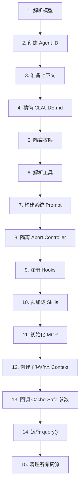
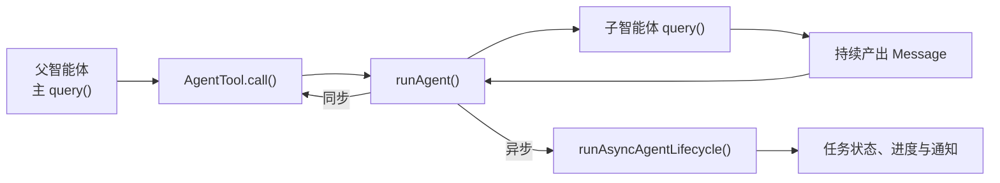

# 第八章：创建子智能体

> 原文：[Ch 8. Spawning Sub-Agents](https://claude-code-from-source.com/ch08-sub-agents/)


## 智能的倍增

单个智能体已经非常强大。

它可以：

- 读取文件；
- 编辑代码；
- 运行测试；
- 搜索网络；
- 根据结果继续推理。

但一个智能体在一场对话中能够完成的工作仍然存在硬上限。

- 上下文窗口会逐渐填满；
- 任务会向不同方向分叉，并需要不同能力；
- 工具执行的串行特性会成为瓶颈。

解决方案不一定是更大的模型。

很多时候，解决方案是：

> **更多智能体。**

Claude Code 的子智能体系统允许模型主动请求帮助。

当父智能体遇到适合委派的任务时，例如：

- 一次不应污染主对话的代码库搜索；
- 一轮需要对抗性思考的验证；
- 一组可以并行完成的独立修改；

它会调用 Agent 工具。

这次调用会创建一个子智能体。

子智能体拥有自己独立的：

- 对话循环；
- 工具集合；
- 权限边界；
- Abort Controller。

子智能体完成工作后，会返回结果。

父智能体不会看到子智能体的内部推理，只会看到最终输出。

这并不是一个锦上添花的便利功能。

它是以下能力的架构基础：

- 并行文件探索；
- Coordinator-Worker 协调者与工作者层级；
- 多智能体 Swarm 团队。

整个创建流程主要经过两个文件：

```text
AgentTool.tsx
runAgent.ts
```

其中：

- `AgentTool.tsx` 定义模型看到的 Agent 工具接口；
- `runAgent.ts` 实现子智能体的完整生命周期。

这项设计面临相当大的挑战。

子智能体需要足够多的上下文才能完成工作，但又不能携带大量无关信息浪费 Token。

它需要足够严格的权限边界来保证安全，又必须保留足够灵活性，才能真正有用。

它还需要一套生命周期管理机制，能够清理自己接触过的全部资源，而不要求调用方记住每一种清理步骤。

此外，同一套系统还必须支持一整条 Agent 光谱：

- 便宜、快速、只读的 Haiku 搜索 Agent；
- 昂贵、全面、由 Opus 驱动的验证 Agent；
- 在后台运行对抗性测试的 Verification Agent；
- 继承父上下文的 Fork Agent；
- Coordinator 模式中的 Worker。

本章会追踪完整路径：

> 从模型说“我需要帮助”，到一个真正可运行的子智能体被创建出来。

我们将依次介绍：

- 模型看到的 AgentTool 定义；
- 创建执行环境的 15 步生命周期；
- 6 种内置 Agent 及其优化目标；
- 允许用户定义自定义 Agent 的 Frontmatter 系统；
- 从这些设计中可以提炼出的通用原则。

---

## 术语说明

本章中：

- **Parent，父智能体**：调用 Agent 工具的智能体；
- **Child，子智能体**：被创建出来的智能体。

父智能体通常是顶层 REPL 智能体，但并不总是如此。

在 Coordinator 模式下：

- Coordinator 创建 Worker；
- Worker 是 Coordinator 的子智能体。

在嵌套场景中，子智能体还可以继续创建孙级智能体。

同一套生命周期会递归应用。

整个编排层大约横跨 40 个文件，主要分布在：

```text
tools/AgentTool/
tasks/
coordinator/
tools/SendMessageTool/
utils/swarm/
```

本章专注于创建机制，也就是：

- AgentTool 定义；
- `runAgent()` 生命周期。

下一章会继续介绍运行时问题：

- 进度追踪；
- 结果获取；
- 多智能体协作模式。

---

# AgentTool 定义

AgentTool 注册时使用的名称是：

```text
Agent
```

同时保留一个旧别名：

```text
Task
```

这是为了兼容旧版本中的：

- 对话记录；
- 权限规则；
- Hook 配置。

它同样通过标准的：

```text
buildTool()
```

工厂创建。

但它的 Schema 比系统中任何其他工具都更动态。

---

## 输入 Schema

输入 Schema 会通过：

```text
lazySchema()
```

延迟构建。

这是第 6 章介绍过的模式，它可以把 Zod 编译推迟到第一次真正使用时。

Schema 分为两层：

1. 基础 Schema；
2. 完整 Schema。

完整 Schema 会在基础字段之上增加多智能体和隔离参数。

### 基础字段

这些字段始终存在。

| 字段 | 类型 | 必填 | 用途 |
|---|---|---:|---|
| `description` | `string` | 是 | 3 到 5 个词的简短任务摘要 |
| `prompt` | `string` | 是 | 给子智能体的完整任务说明 |
| `subagent_type` | `string` | 否 | 指定要使用的专门 Agent 类型 |
| `model` | `enum('sonnet','opus','haiku')` | 否 | 覆盖当前 Agent 使用的模型 |
| `run_in_background` | `boolean` | 否 | 是否异步后台启动 |

### 多智能体和隔离字段

当 Swarm 功能开启时，完整 Schema 还会增加：

| 字段 | 类型 | 用途 |
|---|---|---|
| `name` | `string` | 让 Agent 可以通过 `SendMessage({to: name})` 被寻址 |
| `team_name` | `string` | 创建 Agent 时使用的团队上下文 |
| `mode` | `PermissionMode` | 为被创建的 Team Member 指定权限模式 |
| `isolation` | `enum('worktree','remote')` | 文件系统隔离策略 |
| `cwd` | `string` | 覆盖工作目录，必须是绝对路径 |

这些多智能体字段支持第 9 章会介绍的 Swarm 模式：

- 创建具名 Agent；
- 多个 智能体 并发运行；
- Agent 之间通过 `SendMessage({to: name})` 通信。

隔离字段用于保护文件系统。

例如，`worktree` 隔离会创建临时 Git Worktree，让 Agent 在仓库副本中工作。

这样多个 智能体 同时修改同一个代码库时，就不会互相冲突。

---

## Feature Flag 驱动的动态 Schema

AgentTool 的 Schema 会根据 Feature Flag 动态改变。

```typescript
// 伪代码，用于展示受 Feature Gate 控制的 Schema
inputSchema = lazySchema(() => {
  let schema = baseSchema()

  if (!featureEnabled('ASSISTANT_MODE')) {
    schema = schema.omit({
      cwd: true,
    })
  }

  if (backgroundDisabled || forkMode) {
    schema = schema.omit({
      run_in_background: true,
    })
  }

  return schema
})
```

例如：

- Fork 实验开启时，`run_in_background` 会从 Schema 中完全消失，因为该路径下所有创建都强制异步；
- 通过 `CLAUDE_CODE_DISABLE_BACKGROUND_TASKS` 关闭后台任务时，该字段也会移除；
- `KAIROS` Feature Flag 关闭时，`cwd` 会被省略。

模型永远看不到自己不能使用的字段。

这是一个重要的设计选择。

Schema 不只是校验规则。

它还是：

> **模型的操作说明书。**

每个字段都会出现在模型看到的工具定义中。

因此，与其在提示词中写：

```text
不要使用这个字段
```

不如直接从 Schema 中删掉它。

模型无法误用自己根本看不到的字段。

---

## 输出 Schema

公共输出是一个可辨识联合类型，包含两种变体。

### 同步完成

```typescript
{
  status: 'completed',
  prompt,
  ...AgentToolResult
}
```

表示子智能体同步完成，并返回最终输出。

### 异步启动

```typescript
{
  status: 'async_launched',
  agentId,
  description,
  prompt,
  outputFile
}
```

表示后台 Agent 已经启动。

其中 `outputFile` 很重要。

它指向 Agent 完成后写入结果的文件路径。

父智能体或其他消费者可以：

- 轮询该文件；
- 监听该文件；
- 在进程重启后继续读取结果。

这构成了一条基于文件系统的通信通道。

### 内部输出变体

系统还存在两种内部变体：

```text
TeammateSpawnedOutput
RemoteLaunchedOutput
```

但它们不会出现在公开 Schema 中。

这样外部构建在相应 Feature Flag 关闭时，Bundler 可以通过死代码消除，把这些变体和关联代码路径一起移除，减小发布二进制体积。

---

## 动态 Prompt

AgentTool 的 Prompt 由：

```text
getPrompt()
```

动态生成。

它会根据当前上下文进行调整，包括：

- 当前有哪些 Agent 可用；
- Agent 列表是直接写在 Prompt 中，还是作为 Attachment 提供；
- Fork 是否开启；
- 是否需要增加“When to fork”指导；
- 当前是否处于 Coordinator 模式；
- 当前订阅层级。

非 Pro 用户还会看到一条关于并发启动多个 智能体 的提示。

---

## 为什么把 Agent 列表放进 Attachment

这一点尤其值得关注。

代码注释指出，动态工具描述曾经占到全平台：

```text
约 10.2% 的 cache_creation Token
```

问题在于，如果 Agent 列表直接写进工具描述，那么：

- 新 Agent 被加载；
- 插件被连接；
- MCP Server 被连接；

都会改变工具定义。

而工具定义属于提示词缓存前缀的一部分。

只要工具定义发生变化，后续 API 请求的整个缓存前缀就会失效。

解决办法是：

> 把容易变化的 Agent 列表从工具描述中移到 Attachment Message。

工具描述可以保持静态。

动态 Agent 列表仍然能够被模型看到，但它位于缓存区段之后。

这样既能传递信息，又不会破坏全局提示词缓存。

这是一个可以迁移到其他系统的模式：

> 对工具定义中的动态内容，应尽量移出缓存前缀，放到后置消息或附件中。

---

# Feature Gate

子智能体系统拥有整个代码库中最复杂的 Feature Gate 组合。

至少有 12 个 Feature Flag 和 GrowthBook 实验，共同控制：

- 哪些 Agent 可用；
- Schema 中出现哪些参数；
- 进入哪条代码路径。

其中主要 Gate 包括：

| Feature Gate | 控制内容 |
|---|---|
| `FORK_SUBAGENT` | Fork Agent 路径 |
| `BUILTIN_EXPLORE_PLAN_AGENTS` | Explore 和 Plan Agent |
| `VERIFICATION_AGENT` | Verification Agent |
| `KAIROS` | `cwd` 覆盖与 Assistant 强制异步 |
| `TRANSCRIPT_CLASSIFIER` | Handoff 分类与 Auto Mode 覆盖 |
| `PROACTIVE` | Proactive 模块集成 |

系统同时使用两类 Gate。

### 编译期 Gate

使用 Bun 的：

```text
feature()
```

在构建时执行死代码消除。

例如，当：

```text
FORK_SUBAGENT = 'ant'
```

时，Fork 路径会进入构建。

当它是：

```text
'external'
```

时，相关代码可能完全不进入最终产物。

### 运行时实验

使用：

```text
getFeatureValue_CACHED_MAY_BE_STALE()
```

从 GrowthBook 获取运行时 A/B 实验值。

例如：

```text
tengu_amber_stoat
```

实验可以测试移除 Explore 与 Plan Agent 是否会改变用户行为，而无需发布新二进制。

---

# `call()` 决策树

在 `runAgent()` 真正执行之前，`AgentTool.tsx` 中的 `call()` 会通过一棵决策树判断：

- 要创建哪一种 智能体；
- 使用什么隔离方式；
- 同步还是异步运行。

```text
1. 是否创建 Teammate？
   条件：team_name 与 name 都存在
   是 → spawnTeammate()
   否 → 继续

2. 解析有效 Agent 类型
   提供 subagent_type → 使用它
   未提供且 Fork 开启 → undefined，进入 Fork 路径
   未提供且 Fork 关闭 → general-purpose

3. 是否为 Fork 路径？
   effectiveType === undefined
   是 → 检查递归 Fork Guard
       → 使用 FORK_AGENT 定义

4. 从 activeAgents 中解析 Agent 定义
   → 应用权限 Deny Rule
   → 应用 allowedAgentTypes
   → 找不到或被拒绝时抛错

5. 检查 Agent 需要的 MCP Server
   → 最多等待 30 秒

6. 解析隔离模式
   参数覆盖 Agent 定义
   remote   → teleportToRemote()
   worktree → createAgentWorktree()
   null     → 普通执行

7. 判断同步还是异步
   shouldRunAsync =
     run_in_background ||
     selectedAgent.background ||
     isCoordinator ||
     forceAsync ||
     isProactiveActive

8. 组装 Worker 工具池

9. 构建系统 Prompt 与 Prompt Messages

10. 执行
    异步 → registerAsyncAgent() + 后台生命周期
    同步 → 直接迭代 runAgent()
```

步骤 1 到步骤 6 只是路由。

此时真正的 Agent 还没有创建。

生命周期从 `runAgent()` 开始。

---

## 为什么路由位于 `call()`，而不是 `runAgent()`

`runAgent()` 被设计成一个纯生命周期函数。

它不知道：

- Teammate；
- Remote Agent；
- Fork 实验；
- 路由策略。

它只接收已经解析好的 Agent 定义，然后执行。

选择哪个 智能体 定义、如何隔离、同步还是异步，这些决策属于上层。

这种分离让 `runAgent()`：

- 更容易测试；
- 更容易复用；
- 可以同时服务普通 AgentTool 和后台恢复生命周期。

---

## Fork 递归保护

Fork 子智能体会保留 Agent 工具。

这样可以保持父子工具定义完全一致，从而利用提示词缓存。

但如果允许它继续递归 Fork，就可能产生病态的无限分叉。

系统使用两个 Guard。

### 主 Guard

```text
querySource === 'agent:builtin:fork'
```

它会被写入子智能体 Context Options，并且能够跨 Auto-Compact 保留。

### 备用 Guard

```text
isInForkChild(messages)
```

它会扫描对话历史，寻找：

```text
<fork-boilerplate>
```

标签。

这是一种“腰带加背带”式设计。

主 Guard 快速可靠。

备用 Guard 用于捕获 `querySource` 没有正确传递的边缘情况。


---

# `runAgent()` 生命周期

`runAgent.ts` 中的 `runAgent()` 是一个异步生成器。

它负责驱动子智能体的完整生命周期。

它会随着 Agent 工作持续产出 `Message` 对象。

所有子智能体都会经过这个函数，包括：

- Fork Agent；
- 内置 Agent；
- 自定义 Agent；
- Coordinator Worker；
- 同步 Agent；
- 异步 Agent。

整个函数大约 400 行，每一行都服务于真实需求。

简化后的签名如下：

```typescript
export async function* runAgent({
  agentDefinition,       // Agent 类型
  promptMessages,        // 任务内容
  toolUseContext,        // 父智能体执行上下文
  canUseTool,            // 权限回调
  isAsync,               // 后台还是阻塞
  canShowPermissionPrompts,
  forkContextMessages,   // Fork 专用的父历史
  querySource,           // 来源追踪
  override,              // 系统 Prompt、Controller、Agent ID 覆盖
  model,                 // 调用方模型覆盖
  maxTurns,              // 最大轮次
  availableTools,        // 已组装工具池
  allowedTools,          // 权限范围
  onCacheSafeParams,     // 后台摘要回调
  useExactTools,         // Fork 使用父工具原数组
  worktreePath,          // 隔离目录
  description,           // 人类可读任务描述
}: {
  // ...
}): AsyncGenerator<Message, void>
```

它有大约 17 个参数。

每个参数都对应生命周期必须处理的一种变化维度。

这不是过度设计。

同一个函数需要同时服务：

- Fork；
- 内置 Agent；
- 自定义 Agent；
- 同步和异步；
- Worktree 隔离；
- Coordinator Worker。

替代方案是为每一种 智能体 写一套生命周期函数，并复制大量逻辑，结果会更糟。

其中 `override` 对象尤其重要。

它是 Fork Agent 和恢复中的 Agent 注入预计算值的逃生口，例如：

- 系统 Prompt；
- Abort Controller；
- Agent ID。

下面是生命周期的 15 个步骤。



---

## 第 1 步：解析模型

```typescript
const resolvedAgentModel = getAgentModel(
  agentDefinition.model,
  toolUseContext.options.mainLoopModel,
  model,
  permissionMode,
)
```

解析链是：

```text
调用方覆盖
   >
Agent 定义
   >
父智能体模型
   >
默认模型
```

`getAgentModel()` 还会处理：

- `inherit`；
- 针对特定 Agent 类型的 GrowthBook 覆盖。

例如，Explore Agent 面向外部用户时默认使用 Haiku。

原因是它是一个廉价、快速的只读搜索专家，每周可能被调用 3,400 万次。

调用方，也就是父模型，可以在工具调用中传入 `model` 覆盖 Agent 定义。

这样父智能体可以：

- 面对复杂搜索时，把通常廉价的 Agent 提升到更强模型；
- 面对简单任务时，把昂贵 Agent 降级到更便宜模型。

但 Agent 定义中的模型仍然优先于父模型。

否则，一个默认应该使用 Haiku 的 Explore Agent，可能仅仅因为父智能体正在使用 Opus，就意外继承 Opus，导致成本飙升。

这体现了一条贯穿整个生命周期的规则：

> 显式覆盖优先于声明，声明优先于继承，继承优先于默认值。

权限模式、Abort Controller 和系统 Prompt 也遵循类似解析原则。

一致性让系统更容易预测。

---

## 第 2 步：创建 Agent ID

```typescript
const agentId = override?.agentId
  ? override.agentId
  : createAgentId()
```

Agent ID 的形式类似：

```text
agent-<hex>
```

Hex 部分来自：

```text
crypto.randomUUID()
```

系统使用品牌类型 `AgentId`，防止 TypeScript 中把普通字符串误当成 Agent ID。

`override` 路径用于恢复 Agent。

恢复后的 Agent 必须继续使用原 ID，才能保持 Transcript 连续。

---

## 第 3 步：准备上下文

Fork Agent 与普通新 Agent 从这里开始分流。

```typescript
const contextMessages: Message[] =
  forkContextMessages
    ? filterIncompleteToolCalls(
        forkContextMessages,
      )
    : []

const initialMessages: Message[] = [
  ...contextMessages,
  ...promptMessages,
]
```

Fork Agent 会把父智能体的完整对话历史克隆到 `contextMessages`。

但首先要调用：

```text
filterIncompleteToolCalls()
```

移除没有匹配 `tool_result` 的 `tool_use` 区块。

否则 API 会拒绝格式不完整的对话。

这种情况可能发生在父智能体正在执行工具时创建 Fork：

- `tool_use` 已经生成；
- 但工具结果还没返回。

### 文件状态缓存

```typescript
const agentReadFileState =
  forkContextMessages !== undefined
    ? cloneFileStateCache(
        toolUseContext.readFileState,
      )
    : createFileStateCacheWithSizeLimit(
        READ_FILE_STATE_CACHE_SIZE,
      )
```

Fork 子智能体会获得父缓存的克隆。

它已经“知道”父智能体读取过哪些文件。

普通新 Agent 则从空缓存开始。

克隆是浅拷贝。

文件内容字符串通过引用共享，而不是完整复制。

这对内存很重要：

- 50 个文件内容不会复制 50 份；
- 只会复制 50 个引用。

但每个 智能体 的 LRU 淘汰行为是独立的，因为它们会按照自己的访问模式更新缓存。

---

## 第 4 步：移除 `CLAUDE.md`

Explore 和 Plan 这类只读 Agent 的定义中包含：

```text
omitClaudeMd: true
```

实现逻辑如下：

```typescript
const shouldOmitClaudeMd =
  agentDefinition.omitClaudeMd &&
  !override?.userContext &&
  getFeatureValue_CACHED_MAY_BE_STALE(
    'tengu_slim_subagent_claudemd',
    true,
  )

const {
  claudeMd: _omittedClaudeMd,
  ...userContextNoClaudeMd
} = baseUserContext

const resolvedUserContext =
  shouldOmitClaudeMd
    ? userContextNoClaudeMd
    : baseUserContext
```

`CLAUDE.md` 通常包含项目专属说明，例如：

- Commit Message 规范；
- PR 约定；
- Lint 规则；
- 编码标准。

只读搜索 Agent 不需要这些内容，因为它：

- 不能 Commit；
- 不能创建 PR；
- 不能编辑文件。

父智能体拥有完整上下文，并会解释搜索结果。

因此，移除 `CLAUDE.md` 能节省大量 Token。

同样，Explore 和 Plan Agent 还会移除系统上下文中的 Git Status。

会话启动时采集的 Git 状态可能高达 40 KB，并且已经明确标记为旧快照。

这些 Agent 真正需要 Git 信息时，可以自己运行：

```bash
git status
```

获得最新数据。

这不是过早优化。

在每周 3,400 万次 Explore 创建量下，每一个多余 Token 都会累积成可测量成本。

GrowthBook Kill Switch：

```text
tengu_slim_subagent_claudemd
```

默认开启。

如果精简上下文造成回归，可以在线关闭。

---

## 第 5 步：权限隔离

这是最复杂的步骤。

每一个 智能体 都会获得自定义的：

```text
getAppState()
```

包装器。

它会在父状态上叠加 Agent 自己的权限配置。

```typescript
const agentGetAppState = () => {
  const state =
    toolUseContext.getAppState()

  let toolPermissionContext =
    state.toolPermissionContext

  // 只有父模式允许覆盖时，
  // 才使用 Agent 定义中的权限模式
  if (
    agentPermissionMode &&
    canOverride
  ) {
    toolPermissionContext = {
      ...toolPermissionContext,
      mode: agentPermissionMode,
    }
  }

  // 无 UI 的 Agent 自动避免权限弹窗
  const shouldAvoidPrompts =
    canShowPermissionPrompts !== undefined
      ? !canShowPermissionPrompts
      : agentPermissionMode === 'bubble'
        ? false
        : isAsync

  if (shouldAvoidPrompts) {
    toolPermissionContext = {
      ...toolPermissionContext,
      shouldAvoidPermissionPrompts: true,
    }
  }

  // 收紧工具 Allow Rule
  if (allowedTools !== undefined) {
    toolPermissionContext = {
      ...toolPermissionContext,
      alwaysAllowRules: {
        cliArg:
          state.toolPermissionContext
            .alwaysAllowRules.cliArg,
        session: [...allowedTools],
      },
    }
  }

  return {
    ...state,
    toolPermissionContext,
    effortValue,
  }
}
```

这里叠加了四个不同关注点。

### 权限模式级联

如果父智能体处于：

```text
bypassPermissions
acceptEdits
auto
```

那么父模式始终优先。

Agent 定义不能削弱或改变它。

否则，Agent 定义中的 `permissionMode` 会生效。

这可以避免自定义 Agent 在用户已经明确设置会话权限后，悄悄改变安全边界。

### 避免权限弹窗

后台 Agent 没有终端，无法显示权限对话框。

因此，它们会设置：

```text
shouldAvoidPermissionPrompts: true
```

权限系统遇到原本需要询问的操作时，会自动拒绝，而不是永远阻塞。

例外是：

```text
bubble
```

模式。

Bubble Agent 可以把权限请求上浮到父智能体终端，因此无论同步还是异步，都能够向用户提问。

### 自动检查优先

能弹出权限请求的后台 Bubble Agent 会设置：

```text
awaitAutomatedChecksBeforeDialog
```

分类器和权限 Hook 会先运行。

只有自动系统无法解决时，才真正打断用户。

后台任务多时，这一点很重要。

否则 5 个 智能体 同时运行，可能把界面变成权限弹窗喷泉。

### 工具权限范围

提供 `allowedTools` 时，它会替换 Session 级 Allow Rule。

这可以防止父智能体曾经批准过的权限泄漏到受限 Agent。

但 CLI 的：

```text
--allowedTools
```

规则仍然保留。

因为它代表嵌入应用或用户显式声明的顶层安全策略，应该应用到所有 Agent。

---

## 第 6 步：解析工具

```typescript
const resolvedTools = useExactTools
  ? availableTools
  : resolveAgentTools(
      agentDefinition,
      availableTools,
      isAsync,
    ).resolvedTools
```

Fork Agent 使用：

```text
useExactTools: true
```

它会直接复用父智能体的工具数组。

这不只是方便，也是缓存优化。

不同工具定义序列化后可能存在字节差异。

例如，不同权限模式可能改变工具元数据。

任何工具区块差异都会破坏提示词缓存。

Fork 子智能体需要与父请求保持字节级一致的前缀。

普通 Agent 则通过 `resolveAgentTools()` 进行分层过滤。

### 工具声明

```yaml
tools: ['*']
```

表示允许所有工具。

```yaml
tools:
  - Read
  - Bash
```

表示只允许这些工具。

### 禁用工具

```yaml
disallowedTools:
  - Agent
  - FileEdit
```

会从工具池中移除相应工具。

### Agent 来源差异

内置 Agent 和自定义 Agent 使用不同的默认禁用集合。

### 异步工具限制

异步 Agent 还会经过：

```text
ASYNC_AGENT_ALLOWED_TOOLS
```

过滤。

最终，每种 智能体 只看到自己应该使用的工具。

例如：

- Explore 无法调用 FileEdit；
- Verification 无法调用 Agent，避免验证器继续递归创建子 Agent；
- 自定义 Agent 默认比内置 Agent 更受限。

---

## 第 7 步：构建系统 Prompt

```typescript
const agentSystemPrompt =
  override?.systemPrompt
    ? override.systemPrompt
    : asSystemPrompt(
        await getAgentSystemPrompt(
          agentDefinition,
          toolUseContext,
          resolvedAgentModel,
          additionalWorkingDirectories,
          resolvedTools,
        ),
      )
```

Fork Agent 会通过：

```text
override.systemPrompt
```

直接接收父智能体已经渲染好的系统 Prompt。

它来自：

```text
toolUseContext.renderedSystemPrompt
```

也就是父智能体上一次 API 请求真正使用的精确字节。

不能重新调用 `getSystemPrompt()` 生成。

因为父请求与子请求之间，GrowthBook Feature 可能已经从冷状态变成热状态。

哪怕系统 Prompt 只变化一个字节，整个缓存前缀都会失效。

普通 Agent 则通过 `getAgentSystemPrompt()` 生成自己的 Prompt。

系统会把 Agent 定义中的 Prompt 与环境信息组合，包括：

- 绝对路径；
- Emoji 使用指导；
- 模型专属说明。


---

## 第 8 步：隔离 Abort Controller

```typescript
const agentAbortController =
  override?.abortController
    ? override.abortController
    : isAsync
      ? new AbortController()
      : toolUseContext.abortController
```

三行代码对应三种行为。

### Override

用于：

- 恢复后台 Agent；
- 特殊生命周期管理。

显式覆盖拥有最高优先级。

### 异步 Agent

异步 Agent 会获得一个新的、与父控制器不连接的 Abort Controller。

用户按下 Escape 时，父智能体的 Controller 会触发。

但异步 Agent 应该继续运行，因为它是用户已经委派出去的后台工作。

### 同步 Agent

同步 Agent 与父智能体共享同一个 Controller。

Escape 会同时终止父子两边。

同步 Agent 正在阻塞父智能体。

用户要求停止时，通常希望全部停止。

这个选择如果反过来，后果会很严重。

- 异步 Agent 跟随父中止，会在用户按 Escape 输入补充问题时丢掉全部后台工作；
- 同步 Agent 无视父中止，会让终端看起来冻结，用户无法真正停止任务。

---

## 第 9 步：注册 Hooks

```typescript
if (
  agentDefinition.hooks &&
  hooksAllowedForThisAgent
) {
  registerFrontmatterHooks(
    rootSetAppState,
    agentId,
    agentDefinition.hooks,
    `agent '${agentDefinition.agentType}'`,
    true,
  )
}
```

Agent 定义可以在 Frontmatter 中声明自己的：

- `PreToolUse`；
- `PostToolUse`；
- 其他生命周期 Hooks。

这些 Hook 会通过 `agentId` 限定作用域。

它们只会对当前 Agent 的工具调用生效。

Agent 结束时，系统会在 `finally` 中自动清理。

最后一个 `true` 参数表示：

```text
isAgent: true
```

它会把 Stop Hook 转换成：

```text
SubagentStop
```

子智能体触发的是 `SubagentStop`，而不是顶层 Agent 的 `Stop`。

### Hook 安全策略

当系统启用：

```text
strictPluginOnlyCustomization
```

时，只有以下来源的 Agent Hooks 会注册：

- Plugin；
- Built-in；
- Policy Settings。

用户自己在：

```text
.claude/agents/
```

中定义的 Agent，其 Hook 会被静默跳过。

这样可以防止恶意或配置错误的 Agent 定义注入绕过安全控制的 Hook。

---

## 第 10 步：预加载 Skills

```typescript
const skillsToPreload =
  agentDefinition.skills ?? []

if (skillsToPreload.length > 0) {
  const allSkills =
    await getSkillToolCommands(
      getProjectRoot(),
    )

  // 解析名称、加载内容，
  // 然后把它们放到 initialMessages 前面
}
```

Agent 可以在 Frontmatter 中指定：

```yaml
skills:
  - my-skill
```

Skill 名称会通过三种方式解析。

### 精确匹配

直接寻找：

```text
my-skill
```

### Plugin 前缀匹配

如果 Agent 来自某个 Plugin，则尝试：

```text
plugin:my-skill
```

### 后缀匹配

寻找以：

```text
:my-skill
```

结尾的 Plugin Namespace Skill。

这三种策略保证 Agent 作者无论使用：

- 完整限定名；
- 短名称；
- Plugin 相对名称；

都能正确引用 Skill。

加载后的 Skill 会变成 User Message，并插入 Agent 对话最前面。

这意味着 Agent 会先“阅读”技能说明，再看到任务 Prompt。

它复用了主 REPL 中 Slash Command 的消息注入机制。

多个 Skill 会通过：

```text
Promise.all()
```

并行加载，降低启动延迟。

---

## 第 11 步：初始化 MCP

```typescript
const {
  clients: mergedMcpClients,
  tools: agentMcpTools,
  cleanup: mcpCleanup,
} = await initializeAgentMcpServers(
  agentDefinition,
  toolUseContext.options.mcpClients,
)
```

Agent 可以在 Frontmatter 中定义自己的 MCP Server。

这些 Server 会在父智能体已有 Client 基础上增量添加。

支持两种形式。

### 按名称引用

```yaml
mcpServers:
  - slack
```

系统会查找现有 MCP 配置，并获得共享且经过记忆化的 Client。

### 内联定义

```yaml
mcpServers:
  - my-server:
      command: node
      args:
        - ./server.js
```

系统会创建一个新的 Client。

该 Client 会在 Agent 结束时清理。

只有新创建的内联 Client 会被清理。

共享 Client 不会被关闭，因为它们属于父级生命周期，其他 Agent 或父智能体可能仍在使用。

### 初始化顺序

MCP 初始化发生在：

- Hook 注册之后；
- Skill 预加载之后；
- Context 创建之前。

这个顺序很重要。

MCP 工具必须先合并进工具池，然后 `createSubagentContext()` 才能把它们快照进 Agent Options。

如果顺序错误，Agent 可能：

- 完全没有 MCP 工具；
- 或 MCP 已连接，但工具没有进入它的 Tool Pool。

---

## 第 12 步：创建子智能体 Context

```typescript
const agentToolUseContext =
  createSubagentContext(
    toolUseContext,
    {
      options: agentOptions,
      agentId,
      agentType:
        agentDefinition.agentType,
      messages: initialMessages,
      readFileState:
        agentReadFileState,
      abortController:
        agentAbortController,
      getAppState: agentGetAppState,
      shareSetAppState: !isAsync,
      shareSetResponseLength: true,
      criticalSystemReminder_EXPERIMENTAL:
        agentDefinition
          .criticalSystemReminder_EXPERIMENTAL,
      contentReplacementState,
    },
  )
```

`createSubagentContext()` 位于：

```text
utils/forkedAgent.ts
```

它负责组装新的 `ToolUseContext`。

关键隔离决策如下。

### 同步 Agent 共享 `setAppState`

父子状态变化立即互相可见。

例如，权限批准会出现在同一份状态里。

用户看到的是一个连贯状态。

### 异步 Agent 隔离 `setAppState`

子智能体对普通 AppState 的写入不会改变父 UI。

从子智能体视角看，父级 `setAppState` 副本近似 No-op。

否则后台 Agent 可能在用户操作主界面时，让 UI 突然跳变。

### `setAppStateForTasks` 始终共享

即使异步 Agent 无法修改父 UI 普通状态，它仍然必须更新全局任务注册表。

父智能体依靠任务状态知道：

- Agent 是否还在运行；
- 进度如何；
- 是否已经完成。

### `setResponseLength` 始终共享

响应指标需要全局视图。

### 文件缓存独立

每个 智能体 拥有自己的 Read File Cache。

### Thinking 配置

Fork Agent 继承父级 Thinking Config，以维持缓存一致的 API 请求。

普通 Agent 使用：

```typescript
{ type: 'disabled' }
```

关闭扩展思考，控制输出成本。

可以把共享与隔离关系整理如下：

| 关注点 | 同步 Agent | 异步 Agent |
|---|---|---|
| `setAppState` | 与父共享 | 隔离，写入不会改变父 UI |
| `setAppStateForTasks` | 共享 | 共享 |
| `setResponseLength` | 共享 | 共享 |
| `readFileState` | 独立缓存 | 独立缓存 |
| `abortController` | 父 Controller | 独立 Controller |
| `thinkingConfig` | Fork 继承，普通关闭 | Fork 继承，普通关闭 |
| `messages` | 独立数组 | 独立数组 |

异步 Agent 的双通道设计尤其重要：

```text
普通 AppState 写入隔离
任务状态写入共享
```

它既防止后台任务打乱父 UI，又允许后台 Agent 报告完成状态。

---

## 第 13 步：Cache-Safe 参数回调

```typescript
if (onCacheSafeParams) {
  onCacheSafeParams({
    systemPrompt:
      agentSystemPrompt,
    userContext:
      resolvedUserContext,
    systemContext:
      resolvedSystemContext,
    toolUseContext:
      agentToolUseContext,
    forkContextMessages:
      initialMessages,
  })
}
```

这个回调由后台摘要系统使用。

异步 Agent 运行时，摘要服务可以 Fork 它的对话，并使用这些精确参数构造缓存一致的请求前缀。

然后，它可以周期性生成进度摘要，而不干扰主对话。

这些参数之所以称为 Cache-Safe，是因为它们能够产生与 Agent 当前请求相同的 API 前缀，最大化缓存命中。

---

## 第 14 步：查询循环

```typescript
try {
  for await (
    const message of query({
      messages: initialMessages,
      systemPrompt:
        agentSystemPrompt,
      userContext:
        resolvedUserContext,
      systemContext:
        resolvedSystemContext,
      canUseTool,
      toolUseContext:
        agentToolUseContext,
      querySource,
      maxTurns:
        maxTurns ??
        agentDefinition.maxTurns,
    })
  ) {
    // 转发 API 请求开始事件
    // 产出 Attachment Message
    // 写入 Sidechain Transcript
    // 把可记录消息产出给调用方
  }
}
```

子智能体使用的仍然是之前章节介绍的同一个：

```text
query()
```

同步 Agent 的消息会直接由 `AgentTool.call()` 迭代。

异步 Agent 的消息则由脱离前台的：

```text
runAsyncAgentLifecycle()
```

消费。

### Sidechain Transcript

每条消息都会通过：

```text
recordSidechainTranscript()
```

记录到 Agent 独立的 Sidechain Transcript。

它是每个 智能体 一个追加写入的 JSONL 文件。

这为 Resume 提供支持。

如果 Session 中断，可以根据 Transcript 重建 Agent。

每条消息的记录复杂度是：

```text
O(1)
```

系统只追加新消息，并用上一条 UUID 保持链式连续性。

---

## 第 15 步：清理

`finally` 会在以下所有场景中运行：

- 正常完成；
- 用户中止；
- 发生异常。

它是代码库中最全面的一段资源清理流程。

```typescript
finally {
  await mcpCleanup()

  clearSessionHooks(
    rootSetAppState,
    agentId,
  )

  cleanupAgentTracking(agentId)

  agentToolUseContext
    .readFileState
    .clear()

  initialMessages.length = 0

  unregisterPerfettoAgent(agentId)

  clearAgentTranscriptSubdir(
    agentId,
  )

  rootSetAppState((prev) => {
    const {
      [agentId]: _removed,
      ...todos
    } = prev.todos

    return {
      ...prev,
      todos,
    }
  })

  killShellTasksForAgent(
    agentId,
    // ...
  )
}
```

它会清理：

- Agent 专属 MCP Server；
- Agent Scope Hooks；
- Prompt Cache Tracking；
- 文件状态缓存；
- Fork 上下文消息引用；
- Perfetto Trace 层级；
- Transcript 子目录映射；
- Agent Todo 条目；
- 遗留 Shell 进程。

### 为什么要清空 `initialMessages`

Fork Agent 的 `initialMessages` 包含父智能体的完整对话历史。

```typescript
initialMessages.length = 0
```

是一条手动 GC 提示。

它会释放数组持有的引用，让 Garbage Collector 可以回收内存。

如果一个 200K Token Context 同时创建 5 个 Fork 子 Agent，每个子 Agent 都可能持有约一份大型消息对象集合。

不清理这些引用，长会话中的内存压力会持续累积。

### Whale Session

源代码注释提到可能创建数百个 智能体 的 Whale Session。

每个 智能体 如果只泄漏一点点资源，最终也会形成明显问题。

不同清理步骤对应不同资源：

| 清理对象 | 泄漏类型 |
|---|---|
| MCP Client | 文件描述符和连接 |
| Hooks | AppState 中的内存 |
| File State Cache | 文件内容内存 |
| Perfetto Registration | Trace 元数据 |
| Todo Entry | 响应式状态 Key |
| Shell Task | 操作系统进程 |

`finally` 是通知全部子系统 Agent 已结束的唯一集中位置。

异步生成器协议保证，无论 Agent 如何结束，这里都会执行。

因此，生成器架构不仅是便利设计，也是正确性要求。


---

# 生成器链

在介绍内置 Agent 类型之前，先退后一步观察整个系统的结构模式。

子智能体系统完全建立在异步生成器上。



这种生成器架构带来四项关键能力。

## 1. 流式处理

消息会逐步流过系统。

父智能体或异步生命周期包装器可以在每条消息产生时：

- 更新进度；
- 转发指标；
- 写入 Transcript；
- 更新 UI。

不需要先把整场子智能体对话全部缓存起来。

## 2. 取消

对异步迭代器执行 Return，会触发 `runAgent()` 中的 `finally`。

无论 Agent 是：

- 正常完成；
- 被用户中止；
- 抛出异常；

15 步生命周期中的清理都会执行。

JavaScript 异步生成器协议提供了这项保证。

## 3. 中途转后台

一个运行过久的同步 Agent 可以在执行中途被转入后台。

系统会把 Iterator 从前台交给异步上下文。

Agent 不会重新启动，而是从当前位置继续执行。

## 4. 进度追踪

每一次 `yield` 都是一个观察点。

异步生命周期包装器可以借此：

- 更新 Task State Machine；
- 计算进度；
- 在 Agent 完成时生成通知。

---

# 内置 Agent 类型

内置 Agent 通过：

```text
getBuiltInAgents()
```

注册。

代码位于：

```text
builtInAgents.ts
```

Registry 是动态的。

Agent 是否可用，取决于：

- Feature Flag；
- GrowthBook 实验；
- 当前 Session 的入口类型。

系统提供 6 种主要内置 Agent，每一种都为特定工作类型做了优化。

---

## General-Purpose Agent

当：

- 没有提供 `subagent_type`；
- Fork 路径没有开启；

系统会默认选择 General-Purpose。

它具备：

- 完整工具访问；
- 不移除 `CLAUDE.md`；
- 模型由 `getDefaultSubagentModel()` 决定；
- 可以同步或异步运行。

它的系统 Prompt 把自己定义为一个以完成任务为目标的 Worker：

> 完整完成任务，不要过度雕琢，但也不要半途而废。

它还包含关于以下方面的指导：

- 搜索策略，先广后窄；
- 文件创建纪律，任务不要求时不要创建文件。

这是系统中的通用劳动力。

当父模型不知道需要哪种专门 Agent 时，就会获得一个几乎可以完成所有工作的通用 Agent。

但它默认不能继续创建自己的子 Agent。

这条限制非常重要。

如果 General-Purpose 子 Agent 可以继续创建子 Agent，后者又可以继续创建下一层，就可能产生指数级 Fan-Out，在几秒内消耗大量 API 预算。

因此，Agent 工具位于默认禁用集合中。

---

## Explore Agent

Explore 是只读搜索专家。

它使用：

```text
Haiku
```

也就是成本最低、速度最快的模型。

它会移除：

- `CLAUDE.md`；
- Git Status。

它的工具池中没有：

- FileEdit；
- FileWrite；
- NotebookEdit；
- Agent。

系统同时使用两层只读约束。

### 工具层约束

机械地移除写入工具。

### Prompt 层约束

系统 Prompt 中加入：

```text
=== CRITICAL: READ-ONLY MODE ===
```

也就是：

> 严格只读模式。

Explore 是优化最激进的内置 Agent，因为它也是创建次数最多的 Agent。

全平台每周大约会创建：

```text
3,400 万次
```

它被标记为 One-Shot Agent：

```text
ONE_SHOT_BUILTIN_AGENT_TYPES
```

因此 Prompt 中会跳过：

- Agent ID；
- SendMessage 指南；
- 使用结尾说明。

每次大约节省 135 个字符。

在每周 3,400 万次调用下，相当于节省约：

```text
46 亿字符 / 周
```

这类优化在单次调用中几乎看不出来，但在平台规模下非常显著。

Explore 的可用性同时受以下条件控制：

```text
BUILTIN_EXPLORE_PLAN_AGENTS
+
tengu_amber_stoat
```

后者是 GrowthBook 实验，用来测试移除 Explore 与 Plan 后对用户行为的影响。

---

## Plan Agent

Plan 是软件架构 Agent。

它使用与 Explore 相同的只读工具集，但模型设置为：

```text
inherit
```

也就是继承父智能体模型能力。

它的系统 Prompt 指导 Agent 按照四步流程工作：

1. 理解需求；
2. 充分探索；
3. 设计解决方案；
4. 详细描述计划。

最终必须输出：

```text
Critical Files for Implementation
```

也就是实现所需的关键文件列表。

Plan 继承父模型，是因为架构设计需要与实际执行相同级别的推理能力。

不应该让 Haiku 级模型制定设计方案，再让 Opus 级模型执行。

两种能力级别不匹配，可能产生：

- 执行方难以遵循的计划；
- 表面合理但暗藏错误的设计。

Plan 与 Explore 使用相同的 Feature Gate。

---

## Verification Agent

Verification 是对抗性测试 Agent。

它具备：

- 只读工具；
- `inherit` 模型；
- 始终后台运行；
- 终端中使用红色显示。

它的系统 Prompt 大约 130 行，是所有内置 Agent 中最复杂的。

### 反逃避设计

Prompt 会明确列出模型可能给出的借口，并要求：

> 识别这些借口，然后采取相反行动。

每一项检查都必须包含：

```text
Command run
```

并给出真实终端输出。

不允许只说：

```text
理论上应该可以工作
```

Agent 至少必须进行一次对抗性探测，例如：

- 并发；
- 边界条件；
- 幂等性；
- 孤儿资源清理。

在报告失败之前，它还必须先检查：

- 这是不是有意行为；
- 是否在其他位置已经处理。

### 防止从验证漂移到修复

`criticalSystemReminder_EXPERIMENTAL` 会在每个工具结果之后注入提醒。

它会反复强调：

> 你只负责验证，不负责修复。

语言模型通常会倾向于“帮忙修问题”。

但 Verification Agent 的价值恰恰在于保持独立，不参与修改。

### 始终异步

```text
background: true
```

意味着父智能体不会等待它。

父智能体可以继续工作，Verification 在后台进行探测。

完成后，系统会显示结果通知。

这与人类代码评审相似：

> 开发者不会在 Reviewer 阅读 PR 时停止全部工作。

Verification 受以下条件控制：

```text
VERIFICATION_AGENT
+
tengu_hive_evidence
```

---

## Claude Code Guide Agent

这是一个文档查询 Agent。

它用于回答以下主题的问题：

- Claude Code；
- Claude Agent SDK；
- Claude API。

它使用 Haiku，并采用：

```text
dontAsk
```

权限模式。

因为它只读取文档，不需要打断用户确认。

系统内置了两个文档 URL。

### 动态系统 Prompt

Guide 的 `getSystemPrompt()` 很独特。

它会接收 `toolUseContext`，并动态加入用户项目当前已有的信息，例如：

- 自定义 Skills；
- 自定义 Agents；
- 已配置 MCP Servers；
- Plugin Commands；
- 用户设置。

因此它可以结合现状回答：

> 我应该怎样配置 X？

而不是只给出抽象文档答案。

SDK 入口会排除 Guide Agent。

使用 TypeScript、Python 或 CLI SDK 的开发者，通常不是在询问 Claude Code 本身怎么使用，而是在构建自己的 Agent 应用。

Guide 是唯一一个系统 Prompt 明显依赖用户项目配置的内置 Agent。

这种动态性会增加复杂度，但能换来更有上下文的文档回答。

---

## Statusline Setup Agent

这是一个专门配置终端状态栏的 Agent。

它使用：

```text
Sonnet
```

终端显示颜色是橙色。

工具范围仅限：

- Read；
- Edit。

它了解：

- Shell PS1 Escape Sequence 如何转换成 Shell Command；
- 如何写入 `~/.claude/settings.json`；
- `statusLine` 命令的 JSON 输入格式。

这是范围最窄的内置 Agent。

它存在的原因是，状态栏配置是一个规则明确、自成一体的领域。

如果把全部状态栏文档塞给 General-Purpose Agent，也许同样能完成任务。

但会：

- 使用更大的模型；
- 处理更多上下文；
- 执行更慢；
- 更容易被状态栏语法与主任务之间的关系干扰。

一个拥有专用 Prompt、只具备 Read 与 Edit 的 Sonnet Agent，通常能更快、更便宜、更稳定地完成任务。

Statusline Setup 始终可用，不受 Feature Gate 控制。

---

## Worker Agent：Coordinator 模式

Worker 不位于普通 `built-in/` 目录。

Coordinator 模式开启时，它会动态加载。

```typescript
if (
  isEnvTruthy(
    process.env
      .CLAUDE_CODE_COORDINATOR_MODE,
  )
) {
  const {
    getCoordinatorAgents,
  } = require(
    '../../coordinator/workerAgent.js',
  )

  return getCoordinatorAgents()
}
```

Coordinator 模式下，Worker 会替换所有标准内置 Agent。

它只有一个类型：

```text
worker
```

并拥有完整工具访问。

这种简化是刻意设计的。

Coordinator 已经负责决定每个 Worker 做什么。

Worker 不需要 Explore 或 Plan 这种专门化。

它需要的是足够灵活，可以完成 Coordinator 分配的任何工作。

---

## Fork Agent

Fork Agent 会继承父智能体的：

- 完整对话历史；
- 系统 Prompt；
- 工具数组。

它的核心目标是利用提示词缓存。

当：

- Agent 工具调用省略 `subagent_type`；
- Fork 实验开启；

系统会进入 Fork 路径。

Fork 系统中的每一项设计，都围绕一个目标：

> 让多个并行子智能体与父智能体拥有字节完全一致的 API 请求前缀，从而对共享上下文获得约 90% 的缓存折扣。

Fork Agent 会在后续章节中单独展开。


---

# 使用 Frontmatter 定义 Agent

用户和 Plugin 可以在：

```text
.claude/agents/
```

目录中放置 Markdown 文件，定义自己的 Agent。

Frontmatter Schema 支持完整的 Agent 配置。

```yaml
---
description: "什么时候使用这个 Agent"

tools:
  - Read
  - Bash
  - Grep

disallowedTools:
  - FileWrite

model: haiku
permissionMode: dontAsk
maxTurns: 50

skills:
  - my-custom-skill

mcpServers:
  - slack
  - my-inline-server:
      command: node
      args:
        - "./server.js"

hooks:
  PreToolUse:
    - command: "echo validating"
      event: PreToolUse

color: blue
background: false
isolation: worktree
effort: high
---

# 我的自定义 Agent

你是一个专门负责……的 Agent。
```

Markdown 正文会成为 Agent 的系统 Prompt。

Frontmatter 字段会直接映射到：

```text
AgentDefinition
```

接口，并由 `runAgent()` 消费。

加载流程位于：

```text
loadAgentsDir.ts
```

它会：

1. 使用 `AgentJsonSchema` 校验 Frontmatter；
2. 判断 Agent 来源；
3. 注册到可用 Agent 列表。

---

## Agent 定义的四种来源

系统按照优先顺序支持四类 Agent 来源。

### 1. 内置 Agent

硬编码在 TypeScript 中。

只要 Feature Gate 允许，就始终可用。

### 2. 用户 Agent

来自：

```text
.claude/agents/
```

目录中的 Markdown 文件。

### 3. Plugin Agent

通过：

```text
loadPluginAgents()
```

加载。

### 4. Policy Agent

通过组织策略设置加载。

当模型使用某个 `subagent_type` 调用 Agent 时，系统会在合并后的列表中解析名称。

解析时还会应用：

- `Agent(AgentName)` 权限 Deny Rule；
- 工具规范中的 `allowedAgentTypes`。

如果 Agent 类型：

- 不存在；
- 被权限规则拒绝；

工具调用会失败。

---

## 组织如何分发 Agent

组织可以通过 Plugin 发布自定义 Agent，例如：

- Code Review Agent；
- Security Audit Agent；
- Deployment Agent。

它们会和内置 Agent 一样出现在模型看到的 Agent 列表中。

模型使用完全相同的接口进行委派。

Frontmatter Agent 的优势是：

> 不需要编写 TypeScript。

团队负责人想增加一个 PR Review Agent 时，只需要：

1. 编写 Markdown 文件；
2. 填写 Frontmatter；
3. 放进 `.claude/agents/`；
4. 提交到代码仓库。

团队成员下一次 Session 就能看到它。

系统 Prompt 来自 Markdown 正文。

以下配置通过 YAML 声明：

- 工具限制；
- 模型偏好；
- 权限模式；
- MCP Servers；
- Hooks；
- Skills；
- 隔离方式。

生命周期剩余部分全部由 `runAgent()` 处理。

同样的 15 步、清理逻辑与隔离保证都会自动生效。

---

## Agent 定义可以与代码一起版本控制

仓库可以携带专门适配自身架构、规范和工具链的 Agent。

Agent 会随着代码演化。

例如，团队引入新的测试框架时，可以在同一个 Commit 中：

- 增加框架依赖；
- 更新 Verification Agent Prompt。

这样 Agent 的行为规范与项目状态保持同步。

---

## 信任边界与来源追踪

用户 Agent 是用户可控内容。

其：

- Hooks；
- MCP Servers；
- 工具配置；

在严格策略开启时，会受到：

```text
strictPluginOnlyCustomization
```

限制。

Plugin Agent 和 Policy Agent 被视为管理员信任内容，可以绕过这些限制。

Built-in Agent 属于 Claude Code 二进制本身。

系统会精确记录每个 智能体 的来源。

这不仅是元数据，它会直接控制行为。

例如：

### MCP Plugin-Only 策略开启

用户 Agent Frontmatter 中声明的 MCP Server 会被静默跳过。

Agent 仍会运行，只是不会建立不受信任的 MCP 连接。

### Hook Plugin-Only 策略开启

用户 Agent 的 Frontmatter Hooks 不会注册。

Agent 同样继续运行，只是没有这些扩展。

这是优雅降级原则：

> 即使完整能力被组织策略限制，Agent 仍然尽可能保持可用。

---

# 应用这些设计：如何设计 Agent 类型

内置 Agent 展示了一套可以复用的 Agent 设计语言。

如果你正在创建子智能体系统，可以从五个维度进行设计。

---

## 维度 1：它能看到什么

以下机制共同控制 Agent 的认知范围：

- `omitClaudeMd`；
- 移除 Git Status；
- Skill 预加载；
- 是否继承父对话。

只读 Agent 可以看到更少内容。

专门 Agent 可以通过 Skill 看到更多领域知识。

关键洞察是：

> 上下文不是免费的。

系统 Prompt、用户 Context 和对话历史中的每个 Token 都会：

- 产生成本；
- 占用工作记忆；
- 挤压真正执行任务的空间。

Claude Code 从 Explore Agent 中移除 `CLAUDE.md`，不是因为里面的内容有害，而是因为与搜索任务无关。

单次无关信息可能无所谓。

每周 3,400 万次创建时，它就会变成基础设施账单上的一行。

设计 Agent 时应该问：

> 这个 智能体 完成工作真正需要知道什么？

其余全部尽量删掉。

---

## 维度 2：它能做什么

以下字段定义硬边界：

```text
tools
disallowedTools
```

例如：

- Verification 不能编辑文件；
- Explore 不能写入；
- General-Purpose 可以做几乎所有事情，但不能继续创建子 Agent。

工具限制有两个作用。

### 安全

Verification 不能“顺手修复”自己发现的问题，从而保持验证独立性。

### 专注

工具越少，Agent 需要在工具选择上消耗的注意力越少。

Claude Code 会同时使用：

- 工具层机械限制；
- 系统 Prompt 指导。

例如 Explore 同时移除写工具，并加入：

```text
CRITICAL: READ-ONLY MODE
```

这是纵深防御。

工具层保证边界不会被突破。

Prompt 解释边界为什么存在，减少模型浪费轮次尝试绕过。

---

## 维度 3：它如何与用户交互

以下设置决定 Agent 遇到权限问题时如何处理：

```text
permissionMode
canShowPermissionPrompts
```

Agent 可以：

- 直接询问；
- 自动拒绝；
- 把请求 Bubble 到父终端；
- 使用自动分类器判断。

后台 Agent 不能随意打断用户。

它必须：

- 在预批准边界内工作；
- 或把权限请求上浮。

`awaitAutomatedChecksBeforeDialog` 是一个值得保留的细节。

对于能够 Bubble 的后台 Agent，系统会先运行：

- 分类器；
- 权限 Hooks。

只有自动判断无法完成时，才打断用户。

当多个后台 Agent 同时运行时，这决定了界面究竟是可用工具，还是权限弹窗风暴。

---

## 维度 4：它与父智能体是什么关系

### 同步 Agent

- 阻塞父智能体；
- 共享父状态；
- Escape 同时终止父子。

适用于：

> 先把这件事做完，我再继续。

### 异步 Agent

- 独立运行；
- 拥有自己的 Abort Controller；
- 父智能体可以继续工作；
- Escape 不会终止后台 Agent。

适用于：

> 你在后台做这个，我继续处理其他部分。

### Fork Agent

- 继承完整对话；
- 继承系统 Prompt；
- 继承工具数组；
- 最大化提示词缓存共享。

适用于：

> 你知道我知道的一切，现在去处理其中一个分支。

这三种关系同时影响：

- 用户体验；
- 中止语义；
- 状态共享；
- 缓存效率。

---

## 维度 5：它有多贵

成本主要由以下因素决定：

- 模型；
- Thinking 配置；
- 上下文大小；
- 调用次数。

典型策略：

- Haiku 处理廉价只读工作；
- Sonnet 处理中等复杂任务；
- `inherit` 用于需要父级推理能力的任务；
- 普通子 Agent 关闭 Thinking；
- Fork Agent 为缓存一致性继承 Thinking。

经济因素不应该是多智能体架构的事后考虑。

它是 Claude Code 设计的核心约束。

Explore 如果使用 Opus，单次调用仍然可以工作。

但每周 3,400 万次调用时，模型选择会成为乘法级成本。

每次节省 135 字符的 One-Shot 优化，在平台规模下会转化为每周约 46 亿字符。

这不是微小优化。

它可能决定产品是否具有经济可行性。

---

# 统一生命周期

`runAgent()` 的 15 个步骤会根据 Agent 定义，为每个 智能体 创建独特的执行环境。

子智能体并不是简单地：

> 再运行一份父智能体。

它实际上会创建一个：

- 精确限定范围；
- 资源受控；
- 权限隔离；
- 上下文适配；
- 可完整清理；

的独立执行空间。

架构上的优雅来自统一性。

无论是：

- Haiku 驱动的只读搜索 Agent；
- Opus 驱动的 Fork Agent；
- 使用完整工具和 Bubble 权限的 Worker；

都经过相同的 15 个步骤。

这些步骤不会把 Agent 类型硬编码进控制流。

它们只会根据配置进行参数化。

- 模型解析选择正确模型；
- Context Preparation 选择正确文件缓存；
- Permission Isolation 选择正确权限模式；
- Tool Resolution 选择正确工具；
- Abort Controller 选择正确生命周期关系。

Agent 类型被编码在配置中，而不是编码在大量 `if-else` 中。

因此，增加一种新 Agent 通常只需要：

> 编写一个 智能体 Definition，而不是修改生命周期。

---

# Agent 设计空间总结

六种主要内置 Agent 覆盖了不同的设计组合。

| Agent | 模型 | 工具 | 上下文 | 同步 / 异步 | 目标 |
|---|---|---|---|---|---|
| General-Purpose | 默认模型 | 几乎全部 | 完整 | 均可 | 通用工作委派 |
| Explore | Haiku | 只读 | 精简 | 同步 | 快速、廉价搜索 |
| Plan | 继承父模型 | 只读 | 精简 | 同步 | 架构和实施规划 |
| Verification | 继承父模型 | 只读 | 完整 | 始终异步 | 对抗性验证 |
| Guide | Haiku | Read + Web | 动态 | 同步 | 文档查询 |
| Statusline | Sonnet | Read + Edit | 最小 | 同步 | 状态栏配置 |

没有两个 智能体 在五个设计维度上做出完全相同的选择。

每一个都针对自己的用途进行了优化。

而 `runAgent()` 使用相同 15 步，处理所有这些 Agent。

可以把它理解成：

> 生命周期是一台通用机器，Agent Definition 是运行在机器上的程序。

---

# 本章总结

Claude Code 的子智能体系统，并不是简单地开启另一个模型请求。

它会从 Agent 工具调用开始，经过一棵路由决策树，然后使用统一的 15 步生命周期创建一个完整子执行环境。

核心过程包括：

```text
解析 Agent 类型
    ↓
解析模型与上下文
    ↓
隔离权限与 Abort Controller
    ↓
筛选工具
    ↓
加载 Skills、Hooks 和 MCP
    ↓
创建独立 ToolUseContext
    ↓
运行同一个 query() 循环
    ↓
记录 Transcript 和进度
    ↓
清理全部资源
```

这套架构解决了多智能体系统中最容易失控的几个问题：

- 上下文膨胀；
- 权限泄漏；
- 后台任务错误中止；
- 工具能力越界；
- Prompt Cache 失效；
- Agent 结束后的资源泄漏；
- 不同 Agent 类型生命周期分叉。

最重要的设计原则是：

> Agent 的差异应由配置表达，生命周期应尽量保持统一。

这种设计让 Claude Code 可以不断增加新的 Agent 类型，而不必复制或重写核心创建流程。

下一部分会深入 Fork Agent，解释如何通过字节级一致的请求前缀，让并行委派在经济上真正可行。

之后还会进入编排层，介绍：

- 异步 Agent 如何通过任务状态机汇报进度；
- 父智能体如何获取结果；
- Coordinator 如何管理多个 智能体 共同完成一个目标。

本章讲的是如何创建 Agent。

接下来讲的是如何让它们更便宜，以及如何管理它们。
