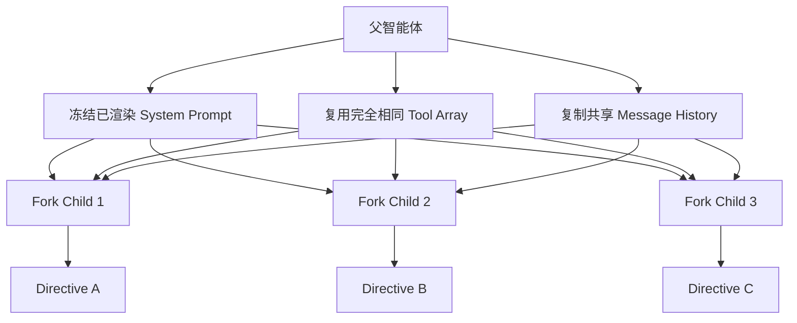

# 第九章：Fork Agent 与提示词缓存

> 原文：[Ch 9. Fork Agents and the Prompt Cache](https://claude-code-from-source.com/ch09-fork-agents/)


## 95% 的关键洞察

当一个父智能体并行创建 5 个子智能体时，每个子智能体 API 请求中的绝大部分内容其实完全相同。

相同的包括：系统提示词、工具定义、对话历史，以及触发这次创建操作的 Assistant Message。真正不同的，往往只有最后那条任务指令，例如：

```text
你负责数据库迁移。
你负责写测试。
你负责更新文档。
```

在一次已经“热起来”的典型 Fork 中，共享前缀可能有 80,000 Token，而每个子智能体自己的指令可能只有 200 Token。

这意味着：

```text
80,000 / 80,200 ≈ 99.75%
```

也就是说，约 99.75% 的内容都是重复的。

Anthropic 的 Prompt Cache 对命中的缓存输入 Token 提供约 90% 的折扣。如果能让第 2 到第 5 个子智能体都命中那 80,000 Token 的缓存，就相当于把这 4 个请求的大部分输入成本降低 90%。从父智能体角度看，这可能意味着同一轮并行委派原本花费约 4 美元，优化后约 0.5 美元。

但问题在于，Prompt Cache 的匹配条件是：

> **字节级完全一致。**

不是“差不多”，也不是“语义等价”。而是从系统提示词的第一个字节开始，到每个子智能体真正开始出现差异之前，必须逐字符完全相同。

只要多一个空格、工具定义排序不同，或者某个过期 Feature Flag 改变了系统提示词的一小段内容，缓存都会失效。一旦失效，整个共享前缀就会按照原价重新处理。

Fork Agent 正是 Claude Code 对这一约束的回答。它不只是“创建一个带有父上下文的子智能体”，更准确地说，它是：

> **披着编排功能外衣的 Prompt Cache 利用机制。**

Fork 系统中的每一个设计决策，最终都围绕同一个问题：

> 怎样保证多个并行子智能体拥有字节级完全一致的请求前缀？

---

## Fork 子智能体继承什么

Fork Agent 会从父智能体继承 4 类东西，而且这些内容不是重新计算，而是按引用传递，或按字节完全一致地复制。

### 1. 系统提示词

系统提示词不会重新生成，而是通过：

```text
override.systemPrompt
```

直接传入。来源是：

```text
toolUseContext.renderedSystemPrompt
```

这就是父智能体最近一次 API 请求真正发送出去的完整字符串。

### 2. 工具定义

Fork Agent Definition 声明：

```yaml
tools:
  - "*"
```

但因为：

```text
useExactTools = true
```

子智能体不会重新过滤工具，而会直接拿到父智能体已经组装好的工具数组。不会过滤，不会重排，也不会重新序列化。

### 3. 对话历史

父智能体与 API 交换过的每一条消息都会进入子智能体上下文，包括 User Message、Assistant Message、Tool Call 和 Tool Result。它们通过：

```text
forkContextMessages
```

被复制到子智能体中。

### 4. Thinking 配置与模型

Fork Definition 使用：

```text
model: 'inherit'
```

因此会继承父智能体的精确模型。同一个模型意味着相同 Tokenizer、相同 Context Window 和相同 Cache Namespace。

Fork Agent 的定义本身非常简单，几乎像一个空壳。它主要做几件事：使用全部工具、继承父模型、权限模式使用 `bubble`，并提供一个实际不会被调用的空 System Prompt Builder。真正的系统提示词不会由 Fork Agent 自己生成，而会通过 Override Channel 直接收到父智能体已经渲染好的、字节稳定的 Prompt。

`bubble` 模式意味着子智能体遇到权限请求时，会把请求传回父智能体终端。

---

# 字节完全一致的前缀技巧

Claude API 的请求结构有固定顺序：

```text
System Prompt
    ↓
Tools
    ↓
Messages
```

Prompt Cache 想要命中，就要求从请求开始，到某个前缀边界之间的所有字节都完全一致。

Fork Agent 通过冻结 3 个层级来实现这一点。

## 第一层：传递 System Prompt，而不是重新计算

父智能体最近一次 API 调用使用的系统提示词，会被保存到：

```text
toolUseContext.renderedSystemPrompt
```

这里保存的是所有动态插值完成后的最终字符串，其中可能已经包含 GrowthBook Feature Flag、环境信息、MCP Server 描述、Skill 内容和 `CLAUDE.md` 文件。

Fork 子智能体直接拿到这个字符串。

### 为什么不能再次调用 `getSystemPrompt()`

因为系统提示词生成不是纯函数。例如，GrowthBook Flag 可能会从 Cold 状态变成 Warm 状态。父智能体第一次请求时某个 Feature Flag 可能是 `false`，Fork 子智能体启动时它可能已经变成 `true`。

如果系统提示词中有受该 Flag 控制的条件区块，那么重新渲染出来的 Prompt 哪怕只差一个字符，也会导致 Cache Miss，然后 80,000 Token 的共享前缀会重新按原价处理。如果同时创建 5 个子智能体，这个损失还会乘以 5。

直接传递父智能体已经渲染好的字节，可以完全消除这一类差异。

## 第二层：工具定义原样透传

普通子智能体会经过：

```text
resolveAgentTools()
```

它会根据 `tools` 和 `disallowedTools` 过滤工具池，还可能根据权限模式和 Agent 类型产生不同的工具元数据和顺序。这样序列化后的工具数组就会与父智能体不同。

Fork Agent 会完全绕过这一步：

```typescript
const resolvedTools = useExactTools
  ? availableTools
  : resolveAgentTools(
      agentDefinition,
      availableTools,
      isAsync,
    ).resolvedTools
```

Fork 路径中：

```text
useExactTools = true
```

因此，子智能体拿到的是父智能体的原始 Tool Array，保证工具相同、顺序相同、序列化结果相同。

甚至连 Agent 工具本身都会保留。虽然 Fork 子智能体实际上禁止再次使用 Agent 工具进行 Fork，但仍然不能从 Tool Array 中删除它，因为删除工具本身就会改变序列化后的工具区块，从而破坏缓存。

## 第三层：消息数组的构造

真正需要精细处理的是：

```text
buildForkedMessages()
```

这个函数负责在共享历史与每个子智能体自己的 Directive 之间，构造最后两条消息。

算法如下：

1. 克隆父智能体的 Assistant Message，所有 `tool_use` 区块以及原始 ID 都保留不变。
2. 为每个 `tool_use` 创建对应的 `tool_result`，但结果内容不是实际结果，而是统一的固定占位字符串。
3. 创建一条 User Message，内容依次为所有 Placeholder Tool Result，以及当前子智能体的 Directive，并在 Directive 外包裹统一 Boilerplate Tag。
4. 返回 `[clonedAssistantMessage, userMessageWithPlaceholdersAndDirective]`。

伪代码如下：

```typescript
function buildChildMessages(
  directive,
  parentAssistant,
) {
  const cloned =
    cloneMessage(parentAssistant)

  const placeholders =
    parentAssistant.toolUseBlocks.map(
      (block) =>
        toolResult(
          block.id,
          CONSTANT_PLACEHOLDER,
        ),
    )

  const userMsg =
    createUserMessage([
      ...placeholders,
      wrapDirective(directive),
    ])

  return [
    cloned,
    userMsg,
  ]
}
```

最终每个子智能体看到的消息数组类似：

```text
[
  ...shared_history,
  assistant(all_tool_uses),
  user(
    placeholder_results...,
    directive
  )
]
```

在 Directive 之前的所有元素，多个子智能体之间完全相同。

系统使用固定常量：

```text
FORK_PLACEHOLDER_RESULT
```

其内容为：

```text
Fork started -- processing in background
```

也就是“Fork 已启动，正在后台处理”。

所有子智能体都会使用同一个字符串。`tool_use_id` 也完全相同，因为它们都引用父智能体同一条 Assistant Message。只有 User Message 最后那段 `directive` 会发生变化。

因此，缓存边界可以落在 Directive 之前。在它之上的内容，包括 System Prompt、Tool Definitions、Conversation History 和 Placeholder Tool Results，可能达到数万 Token。从第 2 个子智能体开始，这些部分都可以享受约 90% 的 Prompt Cache 折扣。

---

# Fork Boilerplate Tag

每个子智能体的 Directive 都会包裹在一段 XML 风格的 Boilerplate Tag 中。

它有两个作用：

1. 告诉 Fork 子智能体应该如何工作；
2. 作为递归 Fork 检测标记。

Boilerplate 大约包含 10 条规则，其中最重要的包括以下几条。

### 覆盖父智能体的 Fork 指令

父智能体 System Prompt 中可能写着：

> 遇到可以并行的工作时，默认使用 Fork。

但 Fork 子智能体会继承这份 System Prompt。因此 Boilerplate 会明确告诉它：

> 那条指令是给父智能体看的。你本身就是 Fork。不要再创建子智能体。

### 安静执行，只报告一次

Fork Agent 不应该在工具调用之间不断输出对话文本。它应该直接使用工具、完成工作，然后最后给出一次结构化报告。

### 严格限定任务范围

子智能体不能主动扩展自己的任务，只负责当前 Directive 指定的范围。

### 固定结构化输出

最终输出需要按照固定结构组织，例如：

```text
Scope
Result
Key files
Files changed
Issues
```

也就是：

```text
范围
结果
关键文件
修改的文件
问题
```

这不是为了排版好看。当 5 个子智能体同时回报结果时，父智能体需要快速聚合信息。固定结构可以显著降低父智能体解析多个结果的难度。

第一条规则尤其重要。Fork 子智能体继承的父 System Prompt 中，很可能存在“有并行任务时默认 Fork”这样的指令。如果 Fork 子智能体照做，就会继续创建自己的 Fork，形成递归爆炸。

因此 Boilerplate 必须明确覆盖：

> 你不是负责决定是否 Fork 的父智能体。你就是被 Fork 出来的执行者。

结构化输出也会把子智能体限制在客观报告，而不是继续自由发挥。

---

# 防止递归 Fork

Fork 子智能体会保留 Agent 工具。

这是必须的，因为如果移除 Agent 工具，序列化后的 Tool Array 就会变化，Prompt Cache 会失效。

但这也带来一个危险：如果 Fork 子智能体真的调用 Agent 工具，而且没有指定 `subagent_type`，就会再次触发 Fork 路径，创建一个孙级 Fork。

这个孙级 Agent 会继承更大的上下文：

```text
父上下文
+ 子智能体对话
```

然后它还可能继续 Fork。

结果可能变成：

```text
Parent
  ↓
Fork Child
  ↓
Fork Grandchild
  ↓
更多 Fork
  ↓
指数级 API 消耗
```

系统使用两层 Guard 防止这种情况。

## 第一层：`querySource` 检查

Fork 子智能体创建时，其：

```text
context.options.querySource
```

会设置为：

```text
agent:builtin:fork
```

`AgentTool.call()` 在进入 Fork 路径之前会检查它。

```typescript
// AgentTool.call() 中的逻辑
if (effectiveType === undefined) {
  // 准备走 Fork 路径，
  // 但当前是不是已经在 Fork 子智能体中？
  if (
    querySource ===
    'agent:builtin:fork'
  ) {
    // 拒绝：已经是 Fork Child
  }
}
```

这是快速路径。

它只需要比较一个字符串。

## 第二层：扫描消息历史

系统还会扫描对话历史，寻找 Fork Boilerplate XML Tag。

这是备用保护。

Fork 防递归因此同时依赖：

- 创建时写入的 `querySource`；
- 对话历史中的 Boilerplate Tag。

为什么需要备用检查？

Claude Code 的 Auto-Compact 会在上下文过长时重写消息数组。

理论上，`querySource` 会存放在 Options 中，并跨 Auto-Compact 保留下来，所以单靠它应该已经足够。

但实际工程中，仍可能存在 `querySource` 没有被正确向下传递的边缘情况。

消息扫描就是最后一道保险。

这是一种典型的“双重保险”设计：扫描消息的成本极低，而误触发递归 Fork 的成本可能是失控的 API 费用。

---

# 从同步运行切换到异步运行

一个 Fork 子智能体可能最初以前台方式运行：

- 消息实时流向父智能体终端；
- 父智能体等待它完成。

但如果子智能体运行时间过长怎么办？

Claude Code 支持：

> **执行中途把前台 Agent 转移到后台，而且不丢失已经完成的工作。**

实现方式非常干净。

## 第一步：创建后台信号

前台 Agent 通过：

```text
registerAgentForeground()
```

注册时，会创建一个 Background Signal Promise。

## 第二步：前台循环同时等待两件事

父智能体的同步循环会使用 `Promise.race()`，同时等待：

1. 子智能体下一条消息；
2. “转入后台”的信号。

```typescript
while (true) {
  const result =
    await Promise.race([
      iterator.next(),
      backgroundSignal,
    ])

  if (
    result === BACKGROUND_SIGNAL
  ) {
    break
  }

  // 处理 Agent Message
}
```

## 第三步：优雅终止前台 Iterator

后台信号触发后，系统会调用：

```text
iterator.return()
```

结束前台生成器。

这会触发 `runAgent()` 的 `finally`，执行对应清理流程。

## 第四步：创建新的异步 `runAgent()`

系统随后使用：

```text
isAsync: true
```

创建一个新的 `runAgent()` 实例。

它会复用：

- 原 Agent ID；
- 目前已经积累的 Message History。

Agent 会从此前执行位置继续，只是现在改成后台运行。

## 第五步：同步调用返回

原本前台阻塞的 `call()` 会返回：

```typescript
{
  status: 'async_launched'
}
```

父智能体可以继续自己的对话。

---

## 为什么不会丢失工作

因为 Agent 真正的状态主要存在于：

> Message History。

Sidechain Transcript 已经把 Agent 产生的全部消息写入磁盘。

新的异步 Agent 可以从这些历史重新构造当前状态，并从原位置继续执行。

这意味着“转后台”并不是把同一个 JavaScript Generator 神奇地搬走。

更准确地说，是：

1. 安全结束前台实例；
2. 使用相同身份和已积累历史启动后台实例；
3. 从同一条对话状态继续。

---

# 自动转后台

如果开启下面任一配置：

```text
CLAUDE_AUTO_BACKGROUND_TASKS
```

或者 GrowthBook Flag：

```text
tengu_auto_background_agents
```

前台 Agent 在运行 120 秒后会自动转到后台。

如果该功能关闭，则超时时间返回：

```text
0
```

也就是完全不自动转后台。

这是一个同时影响 UX 和成本的设计。

前台 Agent 会阻塞父终端。

这时用户无法：

- 输入新消息；
- 发出新指令；
- 启动其他 Agent。

120 秒是一个折中点。

它足够长，可以让大多数短任务以前台同步方式完成，用户还能看到持续输出；又足够短，不至于让一个长任务无限占住终端。

在 Fork 实验开启时，这个问题基本不存在。

因为 Fork 创建会从一开始就强制异步。

此时 `run_in_background` 甚至不会出现在 Schema 中。

所有 Fork Child 都在后台运行，完成后通过：

```text
<task-notification>
```

向父智能体报告。

父智能体从不会因为 Fork Child 而阻塞。

---

# 哪些情况下不会使用 Fork

Fork 只是多种编排模式中的一种。

系统会明确在三类场景中禁用它。

## 1. Coordinator 模式

Coordinator Mode 与 Fork Mode 互斥。

Coordinator 有一套结构化委派模型：

- 维护 Plan；
- 给 Worker 分配明确任务；
- 跟踪进度。

Fork 的核心是“继承父智能体的一切”。

这会破坏 Coordinator 的职责划分。

例如，Fork 出来的 Coordinator Child 会继承类似：

```text
你是 Coordinator，负责委派工作。
```

这样的系统指令。

结果它可能继续编排，而不是执行父 Coordinator 分配给它的具体任务。

因此：

```text
isForkSubagentEnabled()
```

会首先检查：

```text
isCoordinatorMode()
```

Coordinator 开启时直接返回 `false`。

## 2. 非交互式 Session

SDK、API Consumer 和 `--print` 模式没有终端。

但 Fork 使用：

```text
permissionMode: 'bubble'
```

权限请求需要上浮到父终端。

非交互模式根本没有这个终端。

系统没有为 Fork 再建立一整套特殊权限通道，而是选择更简单的方案：

> 非交互模式直接禁用 Fork。

SDK Consumer 需要显式指定：

```text
subagent_type
```

来创建普通子智能体。

## 3. 明确指定 `subagent_type`

如果模型明确写出：

```text
Explore
Plan
general-purpose
```

等 `subagent_type`，就不会进入 Fork 路径。

Fork 只在：

```text
subagent_type 被省略
```

时触发。

这给模型提供两种明确选择。

### 指定类型

表示：

> 我需要一个拥有自己 System Prompt、工具集和角色定位的专门 Agent。

### 不指定类型

表示：

> 我需要一个继承我全部上下文的副本，去并行处理其中一个分支。

---

# Fork 的经济账

考虑一个具体场景。

开发者要求 Claude Code 重构一个模块。

父智能体先分析代码库并形成计划，然后并行创建 5 个 Fork Child：

- 一个更新数据库 Schema；
- 一个重写 Service Layer；
- 一个更新 Router；
- 一个修复 Tests；
- 一个更新 Types。

这时，共享上下文已经相当大。

大致可以是：

| 内容 | Token 数 |
|---|---:|
| System Prompt | 约 4,000 |
| Tool Definitions，40+ 工具 | 约 12,000 |
| Conversation History，分析与规划 | 约 30,000 |
| 带 5 个 `tool_use` 的 Assistant Message | 约 2,000 |
| Placeholder Tool Results | 约 500 |
| **共享前缀总计** | **约 48,500** |

每个 Child 自己的 Directive 大约只有：

```text
200 Token
```

## 不使用 Fork

如果创建 5 个彼此独立的新 Agent：

- 每个 Child 都处理自己的 System Prompt、Tools 和 Task Prompt；
- System Prompt 不同；
- Tool Set 不同；
- 无法共享 Cache；
- 相当于 5 次完整 Input Processing。

## 使用 Fork

请求成本大致变成：

### Child 1

```text
48,700 Token
```

第一次请求缓存未命中，因此按原价处理。

### Child 2 到 Child 5

共享的：

```text
48,500 Token
```

命中缓存，按约 10% 成本计算。

每个 Child 自己的：

```text
200 Token
```

仍然按原价计算。

因此每个后续 Child 的等效成本大约为：

```text
48,500 × 10% + 200
≈ 4,850 + 200
≈ 5,050 Token
```

相比约 48,700 Token 的完整处理，差距非常大。

共享上下文越大、并行 Child 越多，节省越明显。

如果一个已经运行较久的 Session 有 100K Token 历史，并一次创建 8 个 Fork，缓存带来的输入成本节省可能超过原本费用的 90%。

这也解释了为什么 Fork 系统中的各种设计都围绕字节一致性服务，包括：

- Thread Prompt，而不是重新生成；
- Tool Array 原样透传；
- Placeholder Result；
- 子智能体明明不能再 Fork，却仍然保留 Agent 工具。

每一项设计，都在用一点架构上的“不优雅”，换取可以量化的 API 成本下降。

---

# 设计上的张力

Fork 系统做出了几项非常明确的取舍。

理解这些取舍，比只记住实现细节更重要。

## 隔离性 vs. 缓存效率

Fork Child 会继承全部对话历史，其中很多内容可能和自己的任务无关。

例如，一个只负责重写测试的 Child，可能并不需要父智能体之前讨论数据库 Schema 的 15 条消息。

从上下文纯净度来看，应该删掉这些内容。

但一旦删除，共享前缀就不再完全相同，Cache 会失效。

因此系统选择：

> 保留一些无关上下文，换取缓存命中。

它赌的是：

> 缓存节省的成本，大于额外上下文带来的成本。

## 安全性 vs. 缓存效率

Fork Child 的 Tool Pool 中保留 Agent 工具，虽然它实际上禁止再次 Fork。

从纯安全角度看，更合理的方式似乎应该是：

> 直接把 Agent Tool 删除。

这样它连尝试 Fork 的机会都没有。

但删除工具会改变 Tool Array，Cache 会失效。

所以系统使用补偿式控制：

- Boilerplate 明确禁止递归；
- `querySource` Guard；
- Message Scan Guard。

也就是：

> 不在静态层删除能力，而在运行时阻止它。

## 简洁性 vs. 缓存效率

Placeholder Tool Result 从严格意义上说是一种“善意的假数据”。

Fork Child 会看到：

```text
Fork started -- processing in background
```

作为父 Assistant Message 中每个 `tool_use` 的结果。

这些并不是真实 Tool Result。

但 Child 并不需要知道父智能体当前调度轮次中每个 Tool Call 的真实结果。

它真正需要的是自己的 Directive。

Placeholder 被选择，是因为它：

- 短；
- 固定；
- 所有 Child 完全一样。

代价是 Child 的 Conversation History 在语义上并不百分之百连贯。

这些权衡都反映同一个优先级：

> 当 API 按 Token 收费且运行规模足够大时，为了字节一致的前缀，值得让架构做相当大的妥协。

---

# 应用这些设计：面向 Prompt Cache 设计并行 LLM 系统

Fork Agent 的思想并不局限于 Claude Code。

任何从同一上下文并行派生多个 LLM 请求的系统，都可以从 Cache-Aware Request Construction 中获益。

## 1. 传递已经渲染好的 Prompt，不要重新计算

如果 System Prompt 中包含任何动态内容，例如：

- Feature Flag；
- 时间戳；
- 用户偏好；
- A/B Test Variant；

应该保存已经渲染完成的字符串，并直接传给 Child。

不要再次调用 Prompt Builder。

重新计算会引入差异风险。

## 2. 冻结 Tool Array

如果不同 Child 使用不同工具集合，就等于主动放弃 Tools 区块上的 Cache Sharing。

如果安全边界允许，可以考虑：

- 所有 Child 保持相同 Tool Array；
- 使用 Runtime Guard 限制某些工具不能真正调用。

Fork Boilerplate 中的：

```text
不要调用 Agent
```

就是这种模式。

## 3. 最大化共享前缀，最小化 Child 专属后缀

消息数组应该组织成：

```text
所有共享内容
所有共享内容
所有共享内容
...
最后才放 Child 专属内容
```

不要让 Shared Content 与 Per-Child Content 交错出现。

否则 Cache Boundary 会被不断切碎。

最理想的结构是：

```text
[巨大共享前缀] + [极小专属后缀]
```

## 4. 对必须存在但内容会变化的位置使用固定 Placeholder

如果协议要求你必须为之前的 Tool Call 提供 Tool Result，但不同 Child 的真实结果会发生变化，可以考虑使用：

> 所有 Child 完全相同的固定占位内容。

这样可以保持消息结构合法，同时最大化共享前缀。

## 5. 计算 Break-Even Point

Cache Sharing 本身也有成本。

例如 Fork Child 会携带大量与自己任务无关的父对话，因此会占用更大的 Context Window。

同时还需要：

- Runtime Guard；
- 更复杂的架构；
- 特殊 Message Construction；
- 更复杂的调试方式。

因此不能简单认为：

> 有 Cache 就一定值得 Fork。

应该根据自己的场景计算：

- Child 数量；
- 共享前缀长度；
- 每个 Child 专属内容大小；
- Cache Discount；
- 携带冗余上下文的成本。

只有这些因素合起来仍然有明显收益时，Fork 才真正划算。

---

# 本章总结

Fork Agent 的核心并不是“复制一个 智能体”。

它真正解决的问题是：

> **多个并行 LLM 请求拥有巨大共享上下文时，怎样把重复输入变成可缓存资产，而不是重复付费。**

整套机制可以压缩成：



在 Directive 出现之前，所有 Child 的请求尽可能做到字节完全一致。

这样：

- 第一个 Child 负责把共享前缀“预热”；
- 后续 Child 命中 Cache；
- 每个 Child 只为自己的少量差异内容支付完整价格。

为了获得这种收益，Claude Code 愿意接受一些非常现实的架构取舍：保留无关历史、保留实际不能使用的 Agent Tool、使用固定 Placeholder，并增加多层递归保护。

这些设计最终都指向同一个答案：

> 当 Prompt Cache 能为重复前缀提供约 90% 的折扣时，一个大规模多智能体系统值得围绕“字节一致性”重新设计自己的请求结构。
