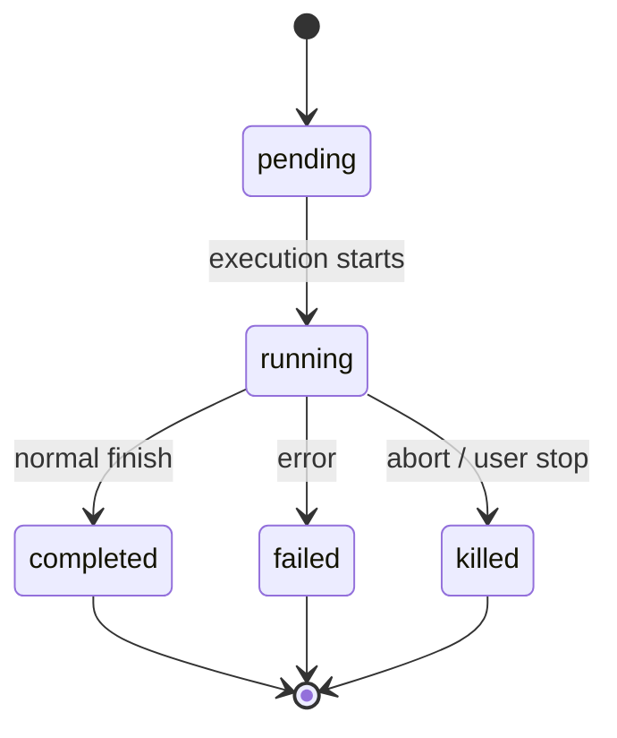
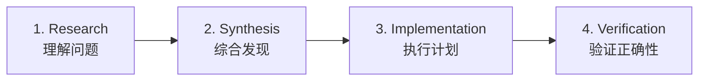
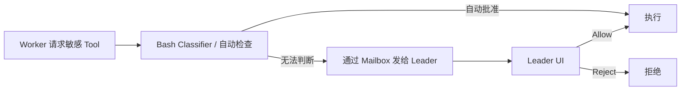
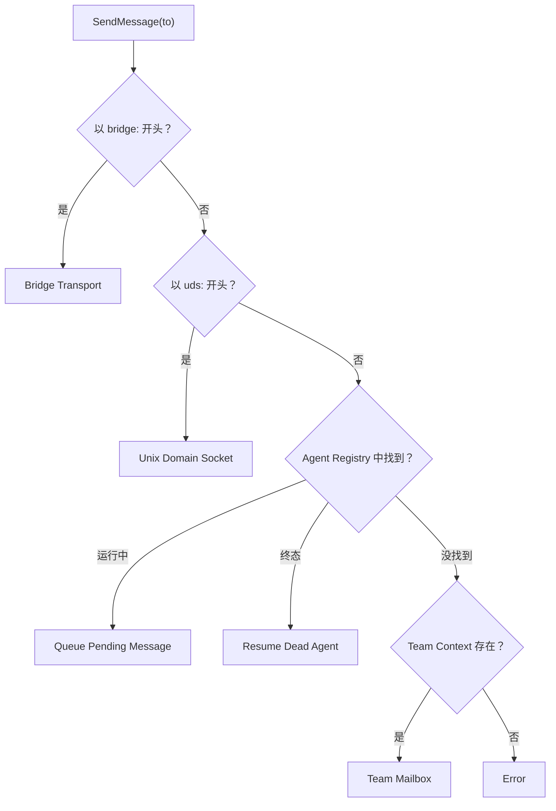
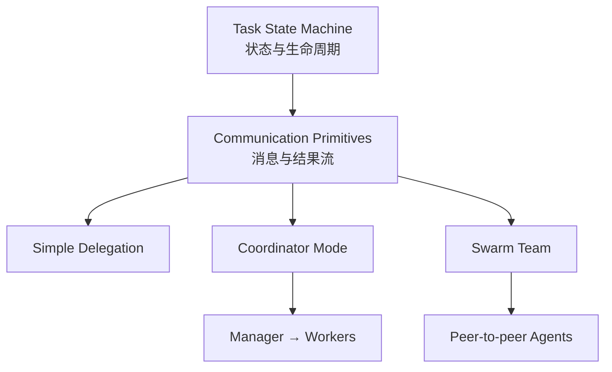

# 第十章：任务、协调与 Swarm

> 原文：[Ch 10. Tasks, Coordination, and Swarms](https://claude-code-from-source.com/ch10-coordination/)


## 单线程的极限

第 8 章讲了如何创建一个子智能体，也就是那套根据 Agent 定义构建隔离执行环境的 15 步生命周期。

第 9 章讲了如何利用 Prompt Cache，让并行创建子智能体在经济上变得可行。

但：

> 创建 Agent，和管理 Agent，是两个不同的问题。

本章解决的是第二个问题。

一个单独的 Agent Loop，也就是：

```text
一个模型
一场对话
一次处理一项工具操作
```

已经可以完成大量工作。

它能：

- 读取文件；
- 修改代码；
- 运行测试；
- 搜索网络；
- 推理复杂问题。

但它终究会碰到天花板。

真正的天花板并不是“智能不够”。

而是：

> **并行度和任务范围。**

比如，一个开发者正在做一次大型重构：

- 需要修改 40 个文件；
- 每改完一批就运行测试；
- 最后还要确认没有破坏现有行为。

一次代码迁移可能同时影响：

- 前端；
- 后端；
- 数据库。

一次彻底的 Code Review 可能需要：

- 阅读几十个文件；
- 同时在后台运行测试套件。

这些问题并不一定更“难”。

它们只是更“宽”。

它们要求系统能够：

- 同时做多件事；
- 把工作委派给不同专家；
- 协调多个结果。

Claude Code 对这个问题的回答，并不是单一机制，而是一套分层的编排栈。

不同的任务形状对应不同模式：

- **Background Task**：适合 Fire-and-forget 的后台任务；
- **Coordinator Mode**：适合 Manager-Worker 层级；
- **Swarm Team**：适合 Peer-to-peer 协作；
- **统一通信协议**：把这些模式连接起来。

整个编排层大约横跨 40 个文件，主要分布在：

```text
tools/AgentTool/
tasks/
coordinator/
tools/SendMessageTool/
utils/swarm/
```

虽然覆盖面很广，但其设计实际上围绕同一个核心状态机展开：

```text
Task.ts
```

中的 `Task` 抽象。

理解这个状态机，是理解其他所有编排模式的前提。

本章会从最底层的 Task State Machine 开始，一直讲到最复杂的多智能体拓扑。

---

# Task 状态机

Claude Code 中的每一种后台操作，都会被统一追踪为一个：

```text
Task
```

包括：

- Shell 命令；
- 子智能体；
- 远程 Session；
- Workflow Script；
- MCP Monitor；
- 其他后台工作。

Task 抽象位于：

```text
Task.ts
```

它提供统一的状态模型。

所有更高级的编排机制都构建在这上面。

---

## 七种 Task 类型

系统定义了 7 种 Task Type。

每种类型代表一种不同的执行模型。

| Task 类型 | 用途 |
|---|---|
| `local_bash` | 后台 Shell 命令 |
| `local_agent` | 后台子智能体 |
| `remote_agent` | 远程 Session |
| `in_process_teammate` | Swarm 中的进程内队友 |
| `local_workflow` | Workflow Script 执行 |
| `monitor_mcp` | MCP Server 健康监控 |
| `dream` | 推测性的后台思考 |

其中最常用的是：

```text
local_bash
local_agent
```

分别对应：

- 后台 Shell；
- 后台子智能体。

`in_process_teammate` 是 Swarm 的基础原语。

`remote_agent` 用于连接远程 Claude Code Runtime。

`local_workflow` 执行多步骤 Workflow Script。

`monitor_mcp` 用于监控 MCP Server 健康状态。

最特别的是：

```text
dream
```

它允许 Agent 在等待用户输入期间，在后台进行推测性思考。

---

## Task ID 前缀

每种 Task Type 都拥有一个单字符前缀。

这样在日志中可以瞬间看出 Task 类型。

| Task 类型 | 前缀 | ID 示例 |
|---|---|---|
| `local_bash` | `b` | `b4k2m8x1` |
| `local_agent` | `a` | `a7j3n9p2` |
| `remote_agent` | `r` | `r1h5q6w4` |
| `in_process_teammate` | `t` | `t3f8s2v5` |
| `local_workflow` | `w` | `w6c9d4y7` |
| `monitor_mcp` | `m` | `m2g7k1z8` |
| `dream` | `d` | `d5b4n3r6` |

Task ID 的结构是：

```text
单字符类型前缀
+
8 个随机字母或数字
```

随机字符使用：

- 数字；
- 小写字母；

并刻意避免大小写混淆。

组合数量大约达到：

```text
2.8 万亿
```

这不仅用于避免冲突，也足以抵抗针对磁盘 Task Output File 的暴力 Symlink 攻击。

看到：

```text
a7j3n9p2
```

就知道是后台 Agent。

看到：

```text
b4k2m8x1
```

就知道是后台 Shell。

这只是一个面向人类阅读的小优化。

但在同时存在几十个并发任务的系统中，非常实用。

---

## 五种状态

Task 生命周期是一张非常简单、没有环的有向图。



五种状态分别为：

```text
pending
running
completed
failed
killed
```

### `pending`

表示 Task 已经注册，但真正执行还没有开始。

这是一个很短暂的状态。

### `running`

表示 Task 正在执行。

### `completed`

成功结束。

### `failed`

发生错误。

### `killed`

被以下任一行为明确终止：

- 用户停止；
- Coordinator 停止；
- Abort Signal。

后三种状态都是终态。

系统使用一个辅助函数判断：

```typescript
export function isTerminalTaskStatus(
  status: TaskStatus,
): boolean {
  return (
    status === 'completed' ||
    status === 'failed' ||
    status === 'killed'
  )
}
```

这个函数会出现在很多地方，例如：

- 消息注入保护；
- Task Eviction；
- 孤儿资源清理；
- SendMessage 路由。

它帮助系统判断：

> 目标 Agent 还在运行，还是已经死亡，需要 Resume。

---

## 基础 Task State

所有 Task 状态都继承：

```text
TaskStateBase
```

它保存七种 Task 都共有的字段。

```typescript
export type TaskStateBase = {
  id: string
  type: TaskType
  status: TaskStatus
  description: string
  toolUseId?: string
  startTime: number
  endTime?: number
  totalPausedMs?: number
  outputFile: string
  outputOffset: number
  notified: boolean
}
```

其中两个字段尤其值得关注。

### `outputFile`

它是后台执行与父对话之间的桥梁。

每一个 Task 都会把输出写到磁盘文件。

父智能体可以通过：

```text
outputOffset
```

增量读取这个文件。

### `notified`

用于防止重复发送完成通知。

Task 第一次向父智能体报告完成后：

```text
notified = true
```

之后不会再次发送同一通知。

如果没有这个 Guard，一个 Task 恰好在两次 Notification Queue Poll 之间完成，就可能被重复通知。

模型可能因此误以为：

> 有两个任务完成了。

实际上只有一个。

---

## Agent Task State

`LocalAgentTaskState` 是最复杂的一种 Task State。

它包含管理后台子智能体完整生命周期所需的全部信息。

```typescript
export type LocalAgentTaskState =
  TaskStateBase & {
    type: 'local_agent'
    agentId: string
    prompt: string
    selectedAgent?: AgentDefinition
    agentType: string
    model?: string
    abortController?: AbortController

    pendingMessages: string[]

    isBackgrounded: boolean
    retain: boolean
    diskLoaded: boolean
    evictAfter?: number

    progress?: AgentProgress

    lastReportedToolCount: number
    lastReportedTokenCount: number

    // ... 其他生命周期字段
  }
```

其中三个字段揭示了重要设计。

### `pendingMessages`

这是 Agent 的 Inbox。

当 `SendMessage` 向正在运行的 Agent 发消息时，消息不会立刻插进当前推理过程。

而是先进入：

```text
pendingMessages
```

然后在 Tool Round 边界时再注入。

这样可以保持 Agent 的 Turn Structure 完整。

### `isBackgrounded`

用于区分：

- 一开始就以 Async 方式创建的 Agent；
- 原本是 Foreground Sync，后来被用户切到后台的 Agent。

### `evictAfter`

这是 GC 机制。

已经完成、且 UI 不再 Retain 的 Task，不会立刻从内存移除。

系统会给它一个 Grace Period。

时间到了之后，才清除 Task State。

---

## Task Store 为什么是平面 Map

所有 Task 都存储在：

```text
AppState.tasks
```

中。

数据结构是：

```typescript
Record<string, TaskState>
```

Key 就是带前缀的 Task ID。

这是一张平面 Map，而不是 Parent-Child Tree。

系统不会在 State Store 中显式表示：

```text
父 Task
  └─ 子 Task
      └─ 孙 Task
```

父子关系隐含在对话流里。

父智能体拥有创建子 Task 时对应的：

```text
toolUseId
```

这已经足够建立关联。

---

# Task Registry

每种 Task Type 都由一个 `Task` 对象实现。

它的接口非常小。

```typescript
export type Task = {
  name: string
  type: TaskType

  kill(
    taskId: string,
    setAppState: SetAppState,
  ): Promise<void>
}
```

Registry 会收集所有 Task 实现。

```typescript
export function getAllTasks(): Task[] {
  return [
    LocalShellTask,
    LocalAgentTask,
    RemoteAgentTask,
    DreamTask,

    ...(LocalWorkflowTask
      ? [LocalWorkflowTask]
      : []),

    ...(MonitorMcpTask
      ? [MonitorMcpTask]
      : []),
  ]
}
```

其中：

```text
LocalWorkflowTask
MonitorMcpTask
```

受到 Feature Flag 控制，在运行时可能不存在。

---

## 为什么 Task 接口只有 `kill()`

早期版本曾经给 Task 接口加入：

```text
spawn()
render()
```

后来这些方法被删除。

原因是，工程师发现：

> 它们从来没有真正被多态调用。

Shell Task 的 Spawn 和 Teammate Task 的 Spawn 几乎没有共同点。

每种 Task：

- 有自己的 Spawn Logic；
- 有自己的 State Management；
- 有自己的 Rendering。

唯一真正需要“按类型统一派发”的操作是：

```text
kill()
```

所以最后接口只保留这一项。

这是一个典型的：

> **通过减法演化接口。**

最初设计假设所有 Task 会共享同一生命周期。

现实证明，它们已经分化得太远。

继续维持统一 `spawn()` 只会变成一个泄漏抽象。

于是系统干脆删除所有不真正需要多态的部分。


---

# 通信模式

后台任务只有在父智能体能够：

- 观察进度；
- 获取结果；

时才真正有用。

Claude Code 提供三种通信通道，每一种针对不同访问模式进行了优化。

---

## 前台：生成器链

当 Agent 同步运行时，父智能体会直接迭代它的：

```text
runAgent()
```

异步生成器。

每一条 Message 会沿调用栈向上产出。

最有意思的机制，是“转后台逃生口”。

同步循环会在两件事之间进行竞争：

1. Agent 的下一条消息；
2. Background Signal。

```typescript
const agentIterator =
  runAgent({
    ...params,
  })[Symbol.asyncIterator]()

while (true) {
  const nextMessagePromise =
    agentIterator.next()

  const raceResult =
    backgroundPromise
      ? await Promise.race([
          nextMessagePromise.then(
            // ...
          ),
          backgroundPromise,
        ])
      : {
          type: 'message',
          result:
            await nextMessagePromise,
        }

  if (
    raceResult.type ===
    'background'
  ) {
    // 用户要求把 Agent 转到后台
    await agentIterator.return(
      undefined,
    )

    void runAgent({
      ...params,
      isAsync: true,
    })

    return {
      data: {
        status:
          'async_launched',
      },
    }
  }

  agentMessages.push(message)
}
```

如果用户在执行中途决定：

> 这个同步 Agent 太慢了，放后台吧。

系统会：

1. 正常 Return 当前前台 Iterator；
2. 触发原 `runAgent()` 的 `finally`；
3. 进行资源清理；
4. 使用相同 Agent ID，把 Agent 重新以 Async 模式启动。

整个过渡不会丢失工作。

Agent 会从之前的位置继续。

---

## 为什么这个状态转换很难

前台 Agent 与后台 Agent 的生命周期语义不同。

### 前台 Agent

共享父智能体 Abort Controller。

```text
ESC
→ 父 Agent 停止
→ 子 Agent 也停止
```

### 后台 Agent

必须拥有自己的 Controller。

```text
ESC
→ 父 Agent 停止当前操作
→ 后台 Agent 继续工作
```

此外还必须同时完成：

- Message 从前台 Generator Stream 切换到后台 Notification System；
- Task State 更新 `isBackgrounded`；
- UI 开始把它显示在 Background Panel；
- 不能丢 Message；
- 不能留下 Zombie Iterator。

这一切必须近似原子地完成。

`Promise.race()` 正是支撑这个切换的核心机制。

---

# 后台：三条通信通道

后台 Agent 主要通过三条渠道通信：

1. 磁盘输出；
2. Task Notification；
3. Command Queue。

---

## 1. 磁盘输出文件

每个 Task 都拥有：

```text
outputFile
```

它是指向 Agent JSONL Transcript 的 Symlink。

父智能体或任何 Observer 都可以通过：

```text
outputOffset
```

增量读取。

模型通过：

```text
TaskOutputTool
```

访问它。

输入 Schema：

```typescript
inputSchema =
  z.strictObject({
    task_id: z.string(),

    block:
      z.boolean()
        .default(true),

    timeout:
      z.number()
        .default(30000),
  })
```

当：

```text
block: true
```

时，工具会持续 Poll，直到：

- Task 进入终态；
- 或 Timeout。

这是 Coordinator Spawn Worker 后等待结果的主要机制。

---

## 2. Task Notification

后台 Agent 完成时，系统会生成 XML Notification，并加入父智能体的消息队列。

示例：

```xml
<task-notification>
  <task-id>a7j3n9p2</task-id>

  <tool-use-id>
    toolu_abc123
  </tool-use-id>

  <output-file>
    /path/to/output
  </output-file>

  <status>
    completed
  </status>

  <summary>
    Agent "Investigate auth bug"
    completed
  </summary>

  <result>
    Found null pointer in
    src/auth/validate.ts:42...
  </result>

  <usage>
    <total_tokens>
      15000
    </total_tokens>

    <tool_uses>
      8
    </tool_uses>

    <duration_ms>
      12000
    </duration_ms>
  </usage>
</task-notification>
```

这个 Notification 会作为：

```text
user-role Message
```

注入父智能体对话。

也就是说，模型会像看到普通用户消息一样看到后台任务结果。

它不需要专门不断调用工具检查：

```text
任务完成了吗？
```

完成信息会自然进入 Context。

Task State 中的：

```text
notified
```

字段防止同一通知重复发送。

---

## 3. Command Queue

`LocalAgentTaskState` 中的：

```text
pendingMessages
```

是第三条通道。

当 `SendMessage` 的目标是正在运行的 Agent 时：

```typescript
if (
  isLocalAgentTask(task) &&
  task.status === 'running'
) {
  queuePendingMessage(
    agentId,
    input.message,
    setAppState,
  )

  return {
    data: {
      success: true,
      message:
        'Message queued...',
    },
  }
}
```

消息不会立刻打断 Agent 当前执行。

系统会在：

```text
Tool Round 边界
```

调用：

```text
drainPendingMessages()
```

把消息作为 User Message 注入下一轮对话。

这是一个非常重要的设计。

新消息到达时：

- Agent 先完成当前 Thought；
- 当前工具执行不会被中途篡改；
- 然后在自然轮次边界读取新信息。

这样可以避免：

- Race Condition；
- 对话状态损坏；
- 工具执行逻辑被半路修改。

---

# 进度追踪

`ProgressTracker` 提供 Agent 实时活动信息。

```typescript
export type ProgressTracker = {
  toolUseCount: number

  latestInputTokens:
    number

  cumulativeOutputTokens:
    number

  recentActivities:
    ToolActivity[]
}
```

其中：

```text
recentActivities
```

最多保留最近 5 条工具活动。

---

## Input Token 与 Output Token 为什么聚合方式不同

这是一个很容易算错的地方。

### Input Token

API 每一轮都会重新发送完整 Conversation。

因此第 15 轮 API Call 中报告的 Input Token，已经包含前 14 轮上下文。

所以 Input Token 应该保存：

```text
最新值
```

而不是求和。

如果求和，会严重重复统计。

### Output Token

每一轮模型只会新生成一段输出。

因此每轮 Output Token 是增量。

正确方式是：

```text
累计求和
```

如果只保存最新 Output Token，则会严重低估。

---

## Recent Activities

最近活动会显示类似：

```text
Read src/auth/validate.ts

Bash: npm test

Edit src/auth/validate.ts
```

这些内容会显示在：

- VS Code Subagent Panel；
- Terminal Background Task Indicator。

用户不用打开完整 Transcript，也能知道 Agent 当前在做什么。

后台 Agent 的进度会：

- 通过 `updateAsyncAgentProgress()` 写入 AppState；
- 通过 `emitTaskProgress()` 发送 SDK Event。

VS Code Subagent Panel 使用这些事件展示：

- Live Progress；
- Tool Count；
- Activity Stream。

进度追踪并不只是 UI 装饰。

它是判断后台 Agent：

> 正在正常推进，还是陷入 Loop

的主要反馈机制。

---

# Coordinator Mode

Coordinator Mode 把 Claude Code 从：

> 一个 智能体 + 若干后台助手

变成：

> 真正的 Manager-Worker 架构。

这是整个系统中最强意见化的编排模式。

它的设计反映了系统对于：

> LLM 应该怎样委派工作，以及不应该怎样委派工作

的深入经验。

---

## Coordinator Mode 解决什么问题

普通 Agent Loop 只有：

- 一场对话；
- 一个 Context Window。

它可以创建后台 Agent。

后台 Agent 独立执行，然后通过 Task Notification 返回结果。

这适合：

> 你后台跑测试，我继续改代码。

但面对复杂、多阶段 Workflow 时，就不够了。

假设进行一次大型代码迁移。

Agent 需要：

1. 理解 200 个文件中的现有 Pattern；
2. 设计 Migration Strategy；
3. 对每个文件应用修改；
4. 验证没有破坏系统。

其中：

- 第 1 步适合并行；
- 第 2 步必须综合第 1 步；
- 第 3 步适合并行；
- 第 4 步依赖第 3 步。

单个 智能体 顺序执行，会浪费大量 Token 反复读取文件。

多个后台 Agent 如果完全无协调，又可能做出互相不一致的修改。

Coordinator Mode 的解决方式是：

> 把“思考的人”和“干活的人”分开。

### Coordinator

负责：

- 派发 Research；
- 汇总 Research；
- 形成统一理解；
- 制定计划；
- 分配明确执行任务。

### Worker

负责：

- 修改代码；
- 运行测试；
- 执行 Coordinator 已经理解好的工作。

Coordinator 看到全局。

Worker 只看到自己的任务。

---

## 激活 Coordinator Mode

只需要一个环境变量。

```typescript
export function isCoordinatorMode():
  boolean {
  if (
    feature(
      'COORDINATOR_MODE',
    )
  ) {
    return isEnvTruthy(
      process.env
        .CLAUDE_CODE_COORDINATOR_MODE,
    )
  }

  return false
}
```

Session Resume 时：

```text
matchSessionMode()
```

会检查：

- 当前环境变量模式；
- 被 Resume Session 记录的模式。

如果两者不一致，环境变量会被调整成 Session 模式。

这样可以避免：

- Coordinator Session 恢复后突然变成普通 Agent；
- 普通 Session 恢复后突然变 Coordinator。

Session 自身保存的模式才是 Source of Truth。

环境变量只是 Runtime Signal。

---

# Coordinator 工具限制

Coordinator 的能力不是来自更多工具。

而是来自：

> **更少的工具。**

Coordinator Mode 中，Coordinator 只有 3 个工具。

```text
Agent
SendMessage
TaskStop
```

仅此而已。

它不能：

- Read File；
- Edit Code；
- Run Bash；
- 直接碰代码库。

这不是缺陷。

而是整个设计的核心原则。

Coordinator 的工作是：

> 思考、规划、拆分、综合。

Worker 的工作才是：

> 真正执行。

---

## Worker 工具

Worker 基本拥有完整工具集，但会移除内部协调工具。

```typescript
const INTERNAL_WORKER_TOOLS =
  new Set([
    TEAM_CREATE_TOOL_NAME,
    TEAM_DELETE_TOOL_NAME,
    SEND_MESSAGE_TOOL_NAME,
    SYNTHETIC_OUTPUT_TOOL_NAME,
  ])
```

Worker 不能：

- 再创建 Sub-team；
- 直接给 Peer 发消息；
- 自己变成下一层 Coordinator。

它们通过正常 Task Completion 机制向 Coordinator 回报。

Coordinator 负责综合。

---

# 约 370 行的 Coordinator System Prompt

Coordinator 的 System Prompt 大约有 370 行。

它可能是整个代码库中最能体现：

> LLM 编排经验

的一份文档。

其中几条原则尤其关键。

---

## “Never delegate understanding”

也就是：

> **永远不要委派理解。**

这是 Coordinator Mode 的中心思想。

Coordinator 必须先把 Research 结果综合成具体任务。

Worker Prompt 应该包含：

- 文件路径；
- 行号；
- 精确问题；
- 明确修改。

错误的 Prompt：

```text
根据你发现的情况，把 Bug 修掉。
```

这把“理解问题”的工作再次交给 Worker。

Worker 必须重新推导 Coordinator 已经知道的上下文。

正确方式是：

```text
在 src/auth/validate.ts 第 42 行，
userId 在 OAuth Flow 调用时可能为 null。

增加 null 判断。
如果 userId 为 null，
返回 401 Response。
```

Coordinator 应该把自己已经获得的理解压缩成可执行指令。

---

## “Parallelism is your superpower”

也就是：

> **并行是你的超能力。**

Coordinator Prompt 明确规定了并发模型。

### Read-only Task

可以自由并行：

- Research；
- Exploration；
- File Reading。

### Write-heavy Task

必须按照 File Set 判断依赖。

互不重叠的文件集合可以并行。

同一文件的写入必须串行。

一个好的 Coordinator 可能：

1. 同时 Spawn 5 个 Research Worker；
2. 等待全部完成；
3. 自己综合结果；
4. 再 Spawn 3 个分别修改不同模块的 Implementation Worker。

一个差的 Coordinator 会：

```text
Spawn 1
等
Spawn 2
等
Spawn 3
等
```

把本来能够并发的工作强行串行化。

---

# Coordinator 四阶段 Workflow

System Prompt 定义了 4 个阶段。



核心分工：

```text
Coordinator 负责理解与计划
Worker 负责操作代码
```

### 1. Research

Worker 并行：

- 探索 Codebase；
- 读取文件；
- 运行测试；
- 收集信息。

### 2. Synthesis

必须由 Coordinator 自己完成。

它读取所有 Research Result，建立统一理解。

不能再委派给某个 Worker。

### 3. Implementation

Coordinator 根据 Synthesis 写出具体任务。

Worker 并行执行。

### 4. Verification

Worker：

- 跑测试；
- 检查类型；
- 验证行为；
- 确认符合要求。

Coordinator 不应该跳过阶段。

最常见的失败方式是：

```text
Research
   ↓
直接 Implementation
```

跳过 Synthesis。

这样 Implementation Worker 会不得不自己重新理解问题。

不同 Worker 可能形成不同理解，最终产生不一致修改。

---

# Continue 还是 Spawn 新 Worker

Worker 完成之后，如果还有后续任务，Coordinator 要判断：

> 给原 Worker 发消息继续，还是创建新 Worker？

决策取决于 Context Overlap。

### 高重叠 + 同一批文件

继续原 Worker。

它已经：

- 读过文件；
- 理解 Pattern；
- 持有相关 Context。

新建 Worker 只会重新读取和理解。

### 低重叠 + 不同领域

创建新 Worker。

一个刚研究完 Auth System 的 Worker，可能携带 20,000 Token Auth Context。

如果接下来任务是 CSS Refactor，这些内容全是 Dead Weight。

干净 Context 更便宜。

### 高重叠但 Worker 已失败

创建新 Worker。

并明确告诉它：

```text
上一轮失败是因为 X。
不要再使用 Y。
```

继续使用已经混乱的 Context，可能越来越难纠正。

### Follow-up 需要原 Worker 的输出

继续原 Worker。

把它自己的结果随 `SendMessage` 一起发回去即可。

它无需重新推导自己的工作。

---

# Worker Prompt 的反模式

Coordinator Prompt 会明确指出哪些 Worker Prompt 是错误的。

### 反模式

```text
根据 Research Findings 实现修复。
```

问题：

> 把理解再次委派。

### 反模式

```text
修复 Auth Module 中的 Bug。
```

问题：

- 没文件路径；
- 没行号；
- 没 Bug 描述。

Worker 只能重新搜整个 Codebase。

### 反模式

```text
把同样修改应用到其他文件。
```

问题：

> 哪些文件？什么修改？

Coordinator 明明已经知道，却没有说出来。

### 好的 Prompt

```text
在 src/auth/validate.ts 第 42 行，

userId 从 src/oauth/callback.ts:89
调用时可能为 null。

增加 null check：

如果 userId 为 null，
返回：

{ error: 'unauthorized', status: 401 }

然后更新：
src/auth/__tests__/validate.test.ts

覆盖 null case。
```

Coordinator 多花几十秒把 Prompt 写具体。

Worker 可能节省几分钟无谓探索。

这不是“Prompt 写得啰嗦”。

而是：

> 把理解成本只支付一次。

---

# Worker Context

Coordinator 会在自己的 Context 中注入 Worker 能力信息。

```typescript
export function getCoordinatorUserContext(
  mcpClients,
  scratchpadDir?,
) {
  return {
    workerToolsContext:
      `Workers spawned via Agent have access to: ${workerTools}` +
      (
        mcpClients.length > 0
          ? `\nWorkers also have MCP tools from: ${serverNames}`
          : ''
      ) +
      (
        scratchpadDir
          ? `\nScratchpad: ${scratchpadDir}`
          : ''
      ),
  }
}
```

因此 Coordinator 知道 Worker：

- 能用哪些工具；
- 有哪些 MCP Server；
- Scratchpad 在哪里。

---

## Scratchpad

Scratchpad 由：

```text
tengu_scratch
```

Feature Flag 控制。

它是一个共享文件目录。

Worker 可以：

- 读取；
- 写入；

并且不需要额外权限 Prompt。

它允许跨 Worker 持久共享知识。

例如：

Worker A 把研究结果写入：

```text
/tmp/scratchpad/auth-analysis.md
```

Coordinator 再告诉 Worker B：

```text
读取 /tmp/scratchpad/auth-analysis.md，
按照其中 Pattern 修改 OAuth Module。
```

没有 Scratchpad 时，所有信息都必须流过 Coordinator：

```text
Worker A
   ↓
Coordinator Context
   ↓
Worker B Prompt
```

Coordinator 的 Context Window 会成为瓶颈。

有了 Scratchpad 后，可以：

> 通过引用移动信息，而不是通过值移动信息。

---

# Coordinator 与 Fork 互斥

Coordinator Mode 和 Fork Subagent 不能同时开启。

```typescript
export function
isForkSubagentEnabled():
  boolean {
  if (
    feature('FORK_SUBAGENT')
  ) {
    if (
      isCoordinatorMode()
    ) {
      return false
    }

    // ...
  }
}
```

原因不是实现困难，而是两者哲学冲突。

### Fork

子智能体继承父智能体完整 Context。

思想是：

> 你知道我知道的一切，去并行处理一个分支。

### Coordinator Worker

Worker 使用干净 Context + 精确 Prompt。

思想是：

> 我已经理解问题，你只需要执行明确任务。

它们代表两种相反的委派哲学。

系统在 Feature Flag 层面直接要求二选一。


---

# Swarm 系统

Coordinator Mode 是层级式结构：

```text
一个 Manager
多个 Worker
自上而下控制
```

Swarm 则是 Peer-to-peer 的替代方案。

它允许多个 Claude Code Instance 组成一个 Team。

Leader 通过消息传递协调多个 Teammate。

---

## Team Context

Team 使用：

```text
teamName
```

标识。

状态保存在：

```text
AppState.teamContext
```

中。

```typescript
teamContext?: {
  teamName: string

  teammates: {
    [id: string]: {
      name: string
      color?: string
      // ...
    }
  }
}
```

每个 Teammate 都有：

- 名称，用于寻址；
- Color，用于 UI 区分。

Team File 会持久化到磁盘。

因此进程重启后，团队成员关系仍然可以恢复。

---

# Agent Name Registry

后台 Agent 创建时可以指定名称。

这样就可以使用人类可读名称，而不是随机 Task ID。

```typescript
if (name) {
  rootSetAppState(
    (prev) => {
      const next =
        new Map(
          prev.agentNameRegistry,
        )

      next.set(
        name,
        asAgentId(asyncAgentId),
      )

      return {
        ...prev,
        agentNameRegistry: next,
      }
    },
  )
}
```

`agentNameRegistry` 类型是：

```typescript
Map<string, AgentId>
```

当 `SendMessage` 解析：

```text
to
```

字段时，会优先检查 Registry。

```typescript
const registered =
  appState
    .agentNameRegistry
    .get(input.to)

const agentId =
  registered ??
  toAgentId(input.to)
```

因此可以发送：

```text
to: "researcher"
```

而不是：

```text
to: "a7j3n9p2"
```

这层 Indirection 很简单，但对模型很重要。

Coordinator 可以围绕：

```text
researcher
tester
database-worker
```

这些“角色”进行推理。

而不需要记随机 ID。

---

# 进程内 Teammate

In-process Teammate 与 Leader 运行在同一个 Node.js 进程中。

隔离主要通过：

```text
AsyncLocalStorage
```

实现。

状态扩展如下：

```typescript
export type
InProcessTeammateTaskState =
  TaskStateBase & {
    type:
      'in_process_teammate'

    identity:
      TeammateIdentity

    prompt: string

    messages?: Message[]

    pendingUserMessages:
      string[]

    isIdle: boolean

    shutdownRequested:
      boolean

    awaitingPlanApproval:
      boolean

    permissionMode:
      PermissionMode

    onIdleCallbacks?:
      Array<() => void>

    currentWorkAbortController?:
      AbortController
  }
```

其中：

```text
messages
```

最多保留 50 条用于 UI。

---

## 为什么 UI 只保留 50 条 Message

开发过程中发现：

一个 In-process Agent 在 500+ Turn 后，大约可能累计：

```text
20 MB RSS
```

更极端的 Whale Session 曾经在 2 分钟内创建：

```text
292 个 Agent
```

最终 RSS 达到：

```text
36.8 GB
```

这是真实生产问题，不是理论风险。

所以 UI Facing Snapshot 最多保留：

```text
50 条 Message
```

注意：

> Agent 真正的 Conversation History 并没有被砍掉。

只截断 UI 表示。

这是一道内存安全阀。

---

## `isIdle`

`isIdle` 支持 Work Stealing 模式。

空闲 Teammate：

- 不消耗 Token；
- 不发 API 请求；
- 等待下一条 Message。

`onIdleCallbacks` 可以监听：

> 从 Active 变为 Idle

这一转换。

因此可以构建：

```text
等待所有 Teammate 完成
    ↓
全部 Idle
    ↓
继续下一阶段
```

这样的协调逻辑。

---

## 两层 Abort Controller

`currentWorkAbortController` 和 Teammate 主 Abort Controller 是两回事。

### Current Work Controller

只取消当前 Turn。

Teammate 本身继续存活。

这支持 Redirect Pattern：

```text
Leader 发送更高优先级任务
    ↓
取消 Teammate 当前工作
    ↓
Teammate 读取新消息
    ↓
继续执行新任务
```

### Main Abort Controller

终止整个 Teammate。

这是两层不同意图对应的两层中止机制：

```text
停止当前工作
≠
杀死 Agent
```

---

## Cooperative Shutdown

`shutdownRequested` 用于协作式退出。

Leader 发送 Shutdown Request 后，Flag 会被设置。

Teammate 可以在自然停止点检查它，然后优雅退出。

例如：

- 完成当前 File Write；
- Commit 当前改动；
- 发送最后状态；
- 再退出。

这比 Hard Kill 更温和。

后者可能让文件停留在半写入状态。

---

# Mailbox

Teammate 使用基于文件的 Mailbox 通信。

当 `SendMessage` 发送给某个 Teammate 时，系统会把消息写到它的 Mailbox File。

```typescript
await writeToMailbox(
  recipientName,
  {
    from: senderName,
    text: content,
    summary,

    timestamp:
      new Date()
        .toISOString(),

    color: senderColor,
  },
  teamName,
)
```

消息可以是：

- Plain Text；
- Structured Protocol Message；
- Broadcast。

例如：

```text
to: "*"
```

表示广播给除自己之外的所有 Team Member。

Poller Hook 会读取 Mailbox，并把新消息路由进 Teammate Conversation。

---

## 为什么使用文件，而不是消息队列

系统没有使用：

- Redis；
- Message Broker；
- Event Bus；
- Shared Memory Channel。

它只是用文件。

原因是当前吞吐量非常低：

```text
每个 Session 几十条消息
```

而不是：

```text
每秒几千条消息
```

文件拥有几个天然优势：

- Durable，进程崩溃后仍存在；
- Inspectable，可以直接 `cat`；
- Cheap，不需要基础设施；
- 权限模型由文件系统承担。

如果为了几十条消息引入 Redis：

- 增加依赖；
- 增加运维；
- 增加新的故障模式；

收益几乎为零。

---

## Broadcast 实现

发送到：

```text
"*"
```

时，系统遍历 Team File 中所有成员。

跳过自己，然后逐个写 Mailbox。

```typescript
for (
  const member
  of teamFile.members
) {
  if (
    member.name.toLowerCase()
    ===
    senderName.toLowerCase()
  ) {
    continue
  }

  recipients.push(
    member.name,
  )
}

for (
  const recipientName
  of recipients
) {
  await writeToMailbox(
    recipientName,
    {
      from: senderName,
      text: content,
      // ...
    },
    teamName,
  )
}
```

没有 Fan-out Optimization。

每一个 Receiver 都是单独 File Write。

对于典型：

```text
3 到 8 人 Agent Team
```

完全够用。

如果未来 Team 有 100 人，就需要重新设计。

---

# 权限转发

Swarm Worker 权限受限。

但遇到敏感操作时，可以把权限请求升级给 Leader。

```typescript
const request =
  createPermissionRequest({
    toolName,
    toolUseId,
    input,
    description,
    permissionSuggestions,
  })

registerPermissionCallback({
  requestId,
  toolUseId,
  onAllow,
  onReject,
})

void sendPermissionRequestViaMailbox(
  request,
)
```

流程如下：



Worker 可以对安全操作自主执行。

危险操作仍然保留 Human Oversight。

---

# Agent 间通信：SendMessage

`SendMessageTool` 是统一通信原语。

一个工具接口处理 4 种不同路由模式。

具体走哪条路径，由：

```text
to
```

字段的形状决定。

---

## 输入 Schema

```typescript
inputSchema =
  z.object({
    to: z.string(),

    // 示例：
    // teammate-name
    // "*"
    // uds:/tmp/claude.sock
    // bridge:<session-id>

    summary:
      z.string()
        .optional(),

    message:
      z.union([
        z.string(),

        z.discriminatedUnion(
          'type',
          [
            z.object({
              type:
                z.literal(
                  'shutdown_request',
                ),

              reason:
                z.string()
                  .optional(),
            }),

            z.object({
              type:
                z.literal(
                  'shutdown_response',
                ),

              request_id,
              approve,
              reason,
            }),

            z.object({
              type:
                z.literal(
                  'plan_approval_response',
                ),

              request_id,
              approve,
              feedback,
            }),
          ],
        ),
      ]),
  })
```

`message` 既可以是普通文本，也可以是结构化协议消息。

因此 `SendMessage` 同时承担：

### 非正式沟通

```text
这是我的研究结果……
```

### 正式协议

```text
我批准你的 Plan。
请优雅退出。
```

---

# SendMessage 路由顺序

`call()` 使用一条按优先级排序的 Dispatch Chain。



优先顺序如下。

---

## 1. Bridge Message

格式：

```text
bridge:<session-id>
```

用于跨机器通信。

通过 Anthropic Remote Control Server 进行 Relay。

这意味着两台可能位于不同城市甚至不同国家的 Claude Code Instance 可以通信。

系统要求用户显式同意 Bridge Message。

这是安全保护。

如果没有这个 Gate，一个被攻陷或行为混乱的 Agent 可能主动把数据发送到远程 Session。

具体发送由：

```text
postInterClaudeMessage()
```

负责。

---

## 2. UDS Message

格式：

```text
uds:<socket-path>
```

通过 Unix Domain Socket 进行本地跨进程通信。

适用于：

- VS Code Extension 中一个 Claude Code Instance；
- Terminal 中另一个 Claude Code Instance；

它们运行在同一台机器，但属于不同 Process。

UDS 的优点：

- 快，没有网络 RTT；
- 安全，受文件系统权限控制；
- 可靠，Kernel 负责传递。

发送函数：

```text
sendToUdsSocket()
```

Peer Discovery 由：

```text
ListPeers
```

Tool 扫描活跃 UDS Endpoint 完成。

---

## 3. 进程内 Subagent Routing

这是最常见路径。

目标可以是：

- Agent Name；
- Agent ID。

路由逻辑：

```text
在 agentNameRegistry 中查找 input.to
    ↓
找到且 Running
    → queuePendingMessage()

找到但已进入 Terminal State
    → resumeAgentBackground()

AppState 中没找到
    → 尝试从 Disk Transcript Resume
```

---

## 4. Team Mailbox

当 Team Context 存在时，作为 Fallback。

具名 Recipient 会写入它的 Mailbox。

```text
to: "*"
```

则广播给全部队友。

---

# Structured Protocol

除了 Plain Text，SendMessage 还承载两套正式协议。

---

## Shutdown Protocol

Leader 发送：

```json
{
  "type": "shutdown_request",
  "reason": "..."
}
```

Teammate 回应：

```json
{
  "type": "shutdown_response",
  "request_id": "...",
  "approve": true,
  "reason": "..."
}
```

如果批准：

- In-process Teammate 会 Abort Controller；
- Tmux Teammate 会调用 `gracefulShutdown()`。

协议是 Cooperative 的。

Teammate 可以拒绝 Shutdown。

例如，它可能正在：

- 写关键文件；
- 做不可中断操作；
- Commit。

Leader 必须处理这种拒绝。

---

## Plan Approval Protocol

处于 Plan Mode 的 Teammate 在真正执行前必须获得批准。

它会提交 Plan。

Leader 返回：

```json
{
  "type": "plan_approval_response",
  "request_id": "...",
  "approve": true,
  "feedback": "..."
}
```

只有 Team Lead 可以批准。

这形成一道 Review Gate：

> 在任何文件真正被修改之前，Leader 可以先检查 Worker 的实施思路。

这能在很早阶段发现理解偏差。

---

# Auto-Resume Pattern

SendMessage 路由中最优雅的能力之一，是透明 Resume。

当目标 Agent 已经：

- Completed；
- Killed；

系统不会直接返回：

```text
Agent 已经死了
```

而是自动把它复活。

```typescript
if (
  task.status !== 'running'
) {
  const result =
    await resumeAgentBackground({
      agentId,

      prompt:
        input.message,

      toolUseContext:
        context,

      canUseTool,
    })

  return {
    data: {
      success: true,

      message:
        `Agent "${input.to}" was stopped; resumed with your message`,
    },
  }
}
```

`resumeAgentBackground()` 会：

1. 读取 Sidechain JSONL Transcript；
2. 重建 Message History；
3. 过滤 Orphan Thinking Block；
4. 过滤未解决 Tool Use；
5. 重建 Content Replacement State，保护 Prompt Cache；
6. 从 Metadata 恢复原 Agent Definition；
7. 使用新的 Abort Controller 重新注册后台 Task；
8. 调用 `runAgent()`；
9. 把历史 + 新 Message 作为新的 Prompt。

从 Coordinator 视角看：

```text
给活 Agent 发消息
```

和：

```text
给死 Agent 发消息
```

完全是同一个操作。

Coordinator 不需要管理 Agent Liveness。

只需要：

> 发消息。

Infrastructure 自己判断：

- 如果活着，Queue；
- 如果死了，Resume。

---

## 为什么 Auto-Resume 很重要

没有 Auto-Resume 时，Coordinator 必须自己记住：

```text
researcher 还活着吗？
我先检查。
它完成了。
那我是不是要重新 Spawn？
名称还用 researcher 吗？
新 Agent 有原 Context 吗？
```

这是一堆 Bookkeeping。

而 LLM 的优势是：

- 理解问题；
- 写任务说明；
- 推理。

它不擅长长期维护大量生命周期台账。

Auto-Resume 把这些复杂性吸收到 Infrastructure。

接口只剩一句：

```text
Send "researcher" a message.
```

这就是：

> **表面简单优先于实现简单。**

底层可能很复杂，但让模型看到的接口应该尽量简单。

---

## Resume 的成本

当然，这不是免费的。

从 Disk Transcript 恢复意味着：

- 读取大量历史；
- 重建内部 State；
- 重新解析 Agent Definition；
- 发起新的 API Call；
- 可能重新装入完整 Context Window。

长生命周期 Agent Resume 可能：

- 延迟较高；
- Token 较贵。

但相比让 Coordinator 自己管理 Agent 生命周期，这个代价通常更合理。

---

# TaskStop：Kill Switch

`TaskStopTool` 是 Agent 与 SendMessage 的补充。

它用于终止正在运行的 Task。

```typescript
inputSchema =
  z.strictObject({
    task_id:
      z.string()
        .optional(),

    shell_id:
      z.string()
        .optional(),
  })
```

`shell_id` 是旧版本兼容字段。

实现最终委托给：

```text
stopTask()
```

流程如下：

1. 从 `AppState.tasks` 查找 Task；
2. 调用：

```text
getTaskByType(task.type).kill(...)
```

3. 对 Agent：
   - Abort Controller；
   - 状态改为 `killed`；
   - 启动 Eviction Timer；
4. 对 Shell：
   - Kill Process Group。

TaskStop 还有旧别名：

```text
KillShell
```

这提醒我们：

> Task 系统最初只有后台 Shell，后来才逐渐长成现在的编排层。

---

## 不同 Task 的 Kill 机制

### Agent

- Abort Controller；
- `query()` 在下一个 Yield Point 退出；
- 状态设成 `killed`；
- 启动 Grace Period。

### Shell

先发送：

```text
SIGTERM
```

如果 Timeout 后还没退出，再发送：

```text
SIGKILL
```

给整个 Process Group。

### In-process Teammate

除了终止，还会给 Team 发送 Shutdown Notification。

这样其他成员知道这个 Teammate 已经离开。

---

## 为什么 Kill 后不立刻删除 State

Task 被 Kill 后，State 会继续留在：

```text
AppState.tasks
```

一段 Grace Period。

由：

```text
evictAfter
```

控制。

这样：

- UI 还能展示 Killed 状态；
- Final Output 仍然可以读取；
- SendMessage Auto-Resume 仍然有机会恢复它。

Grace Period 结束后才执行 GC。

系统明确区分：

```text
Finished
```

和：

```text
Forgotten
```

完成任务不代表状态必须立刻消失。


---

# 如何选择编排模式

代码库中还有：

```text
TaskCreate
TaskGet
TaskList
TaskUpdate
```

这些工具用于管理结构化 Todo List。

它们和本章讨论的后台 Task State Machine 是两个完全不同的系统。

历史命名导致它们容易混淆：

```text
TaskStop
```

操作的是：

```text
AppState.tasks
```

而：

```text
TaskUpdate
```

操作的是 Project Tracking Data Store。

---

## 三种主要编排模式

现在系统主要有三种编排方式：

1. Simple Delegation；
2. Coordinator Mode；
3. Swarm Team。

应该根据问题形状选择，而不是一律使用最复杂方案。

---

## Simple Delegation

也就是：

```text
Agent
+
run_in_background: true
```

适合父智能体只有一两个独立任务需要卸载时。

例如：

```text
后台跑测试，我继续改代码。
```

或者：

```text
后台搜索整个 Codebase，我先处理当前模块。
```

特点是：

- Parent 仍然掌控主流程；
- 需要时再读取 Task Result；
- 不需要复杂通信协议；
- 开销很低。

典型开销只有：

- 一个 Task State；
- 一个 Disk Output File；
- 完成后一个 Notification。

---

## Coordinator Mode

适合具有清晰阶段结构的问题：

```text
Research
    ↓
Synthesis
    ↓
Implementation
```

尤其适合：

- 多个 Worker 的结果需要先汇总；
- 后续任务必须建立在统一理解上；
- 文件修改可以按模块并行。

Coordinator 不能直接修改文件。

这强制实现：

```text
Thinking Context
与
Doing Context
分离
```

那份 370 行 Coordinator Prompt 并不是仪式感。

它编码的是大量真实委派经验，尤其用于防止：

> 把“理解”委派给 Worker，而不是把“行动”委派给 Worker。

---

## Swarm Team

适合长期协作型 Session。

典型特征：

- Agent 之间需要 Peer-to-peer Communication；
- 工作是持续性的，而不是一次 Spawn-Wait-Collect；
- Agent 可能 Idle；
- 收到新 Message 后再次 Resume；
- 需要 Plan Approval；
- 需要权限 Forwarding；
- 多个角色长期存在。

Mailbox 支持这种异步拓扑。

这是 Coordinator 那种严格层级式 Spawn-Wait-Synthesize 模式不擅长的场景。

---

## 实用决策表

| 场景 | 推荐模式 | 原因 |
|---|---|---|
| 改代码时后台跑测试 | Simple Delegation | 一个后台任务，不需要协调 |
| 全 Codebase 搜索某个 Usage | Simple Delegation | Fire-and-forget，完成后读取即可 |
| 跨 3 个模块重构 40 个文件 | Coordinator | Research 找 Pattern，Synthesis 统一方案，Worker 按模块并行实施 |
| 多天 Feature 开发并带 Review Gate | Swarm | Long-lived Agent、Plan Approval、Peer Communication |
| 已知位置的简单 Bug | 不需要编排，单 Agent | 编排开销高于收益 |
| 数据库 Schema + API + Frontend 同时迁移 | Coordinator | Shared Research 后形成 3 条独立 Workstream |
| 用户监督式 Pair Programming | Swarm + Plan Mode | Worker 提方案，Leader 批准，再执行 |

---

## 这些模式并不真正混用

理论上它们可以组合。

实践中系统通常让 Session 选择一种主要模式。

例如：

- Coordinator Mode 会关闭 Fork Subagent；
- Swarm 有自己独立的通信协议；
- Coordinator 使用 Task Notification；
- Session Startup 的环境变量和 Feature Flag 会决定整个 Interaction Model。

一个非常重要的观察是：

> 最简单的模式，通常应该是默认起点。

绝大多数开发任务不需要：

- Coordinator；
- Swarm。

单 Agent + 偶尔后台委派，已经足以处理大量工作。

复杂编排只适用于少部分真正：

- 很宽；
- 很并行；
- 很长时间；

的问题。

在一个单文件 Bug 上使用 Coordinator，就像：

> 为一个静态网站部署 Kubernetes。

技术上可以。

架构上完全没有必要。

---

# 编排的成本

在讨论编排层体现的设计哲学之前，必须先承认：

> 编排本身是有成本的。

---

## 每个 智能体 都是一场独立 API Conversation

每个后台 Agent 都拥有自己的：

- Context Window；
- Token Budget；
- Prompt Cache Slot。

Coordinator 如果创建 5 个 Research Worker，那么实际上是在同时运行：

```text
1 Coordinator
+
5 Workers
=
6 条 API Conversation
```

每条都可能携带：

- System Prompt；
- Tool Definitions；
- `CLAUDE.md`；
- 自己的消息历史。

Token Overhead 不小。

Worker 之间还可能重复读取同一批文件。

---

## 通信有延迟

Disk Output File 需要：

```text
Filesystem I/O
```

Task Notification 不是实时到达。

它通常在：

```text
Tool Round Boundary
```

注入。

Command Queue 也至少引入一轮延迟。

例如：

```text
Coordinator 发 Message
    ↓
Message 等待 Worker 当前 Tool Use 完成
    ↓
Worker 读取 Message
    ↓
Worker 继续工作
    ↓
结果写入 Disk
    ↓
Coordinator 再读取
```

每一步都是真实延迟。

---

## State Management 也有复杂度

系统维护：

- 7 种 Task Type；
- 5 种 Status；
- 每个 Task 数十个 State Field；
- Eviction Logic；
- GC Timer；
- Memory Cap。

这些并不是为了代码“显得高级”。

它们是因为无限制 State Growth 曾经真正造成：

```text
36.8 GB RSS
```

的生产事故。

编排不是错。

只是：

> 它是一件有成本的工具。

应该让收益覆盖成本。

如果并行 5 个 Worker 可以把 5 分钟搜索压成 1 分钟，非常值得。

如果只是修一个 Typo，那么 Coordinator 全是额外开销。

---

# 编排层真正揭示了什么

这套系统最有意思的并不是：

- Task State；
- Mailbox；
- Notification XML。

这些机制本身都不神秘。

真正值得注意的是，它们组合后暴露出的设计哲学。

---

## “Never delegate understanding” 是关于 Context Window 的结论

这不仅是 LLM 编排技巧。

它实际上揭示了基于 Context Window 推理的根本限制。

Coordinator 可能已经：

- 阅读 50 个文件；
- 看完 3 份 Research Report；
- 形成统一理解。

一个 Fresh Worker 并没有这些 Context。

它不可能自动拥有 Coordinator 的理解。

唯一能跨越这条鸿沟的方法是：

> Coordinator 把自己的理解压缩成明确、可执行的 Prompt。

因此模糊委派不仅效率低。

它还是：

> **信息论意义上的有损传递。**

---

## Auto-Resume：表面简单优先

Auto-Resume 的底层实现很复杂。

它要：

- 读取 Disk Transcript；
- 重建 Content Replacement State；
- 重新解析 Agent Definition；
- 恢复 Conversation；
- 创建新的 Abort Controller。

但对上层来说，接口非常简单：

```text
SendMessage("researcher", "继续检查 OAuth")
```

至于：

```text
researcher 还活着吗？
```

不需要 Coordinator 关心。

Infrastructure 吸收了复杂性。

这是一个非常典型的设计原则：

> **实现复杂，可以；接口复杂，尽量不要。**

尤其当接口消费者本身是 LLM 时更重要。

模型应该把 Token 和注意力花在：

- Problem Solving；
- Task Decomposition；
- Instruction Writing。

而不是生命周期记账。

---

## 50 条 Message Cap 提醒我们：抽象最终运行在硬件上

In-process Teammate 的 UI Message Cap 是 50。

背后不是优雅的理论，而是非常朴素的现实：

```text
292 Agents
2 分钟
36.8 GB RSS
```

抽象再漂亮，最后也运行在：

- 有限 RAM；
- 有限 CPU；
- 有限网络；
- 有限 Token Budget；

的机器上。

系统必须在被极端使用时仍然能够 Gracefully Degrade。

---

# 分层架构的价值

Task State Machine 本身不知道：

- Coordinator；
- Swarm。

SendMessage 本身也不知道调用者到底是：

- Coordinator；
- Swarm Leader；
- 普通 Agent。

Coordinator Prompt 只是叠加在通用 Primitive 上的一层 Methodology。

因此：

- Task State 可以独立测试；
- Communication Channel 可以独立测试；
- Coordinator Prompt 可以独立演化；
- Swarm 可以在不修改 Task State Machine 的情况下加入。

当系统加入 Swarm 时，不需要重写 Task State Machine。

加入 Coordinator Prompt 时，也不需要修改 SendMessage。

这就是良好 Factorization 的标志：

> Primitive 足够通用，Pattern 通过组合 Primitive 得到。

---

## Coordinator 本质是什么

可以把 Coordinator 简化成：

```text
一个工具非常受限的 Agent
+
一份非常详细的 System Prompt
```

它只有：

- Agent；
- SendMessage；
- TaskStop。

它的“Coordinator 能力”并不是硬编码进 Task Runtime 的。

---

## Swarm Leader 本质是什么

可以理解成：

```text
一个拥有 Team Context
+
Mailbox Access
的 Agent
```

---

## Background Worker 本质是什么

它只是：

```text
一个拥有独立 Abort Controller
+
Disk Output File
的 Agent
```

7 种 Task Type、5 种 Status 和 4 种 SendMessage Route 组合后，形成了比任何单个 Primitive 更强大的编排模式。

---

# 本章总结

Claude Code 的编排层，是它从：

> 单线程工具执行器

走向：

> 类似一个小型开发团队

的地方。

最底层是 Task State Machine。

它负责：

- 生命周期；
- Task ID；
- 状态；
- Kill；
- 输出文件；
- GC。

再往上是通信层。

它提供：

- Generator Chain；
- Disk Output；
- Notification；
- Pending Message Queue；
- Bridge；
- UDS；
- Mailbox；
- Auto-Resume。

再往上是 Coordinator。

它提供 Methodology：

```text
Research
    ↓
Synthesis
    ↓
Implementation
    ↓
Verification
```

并贯彻：

> Never delegate understanding.

Swarm 则提供另一种拓扑：

```text
Peer-to-peer
```

支持：

- Teammate；
- Mailbox；
- Broadcast；
- Permission Forwarding；
- Plan Approval；
- Cooperative Shutdown。

可以把整套结构概括成：



这套架构最值得借鉴的地方，不是“多开几个 智能体”。

而是：

> 先建立足够通用、可靠的任务与通信 Primitive，再用不同 Prompt、权限和拓扑把它们组合成不同协作模式。

最终，一个语言模型才能做单次模型调用做不到的事情：

> 面对一个很宽的问题，同时展开多条工作流，并在保持协调的情况下把结果重新汇合。

下一章将继续进入权限系统。

因为多智能体带来的不只有能力放大。

如果没有权限控制，它同样会把错误放大。

权限系统要解决的问题，就是确保：

> Agent 越多，意味着能力更强，而不是风险更大。
