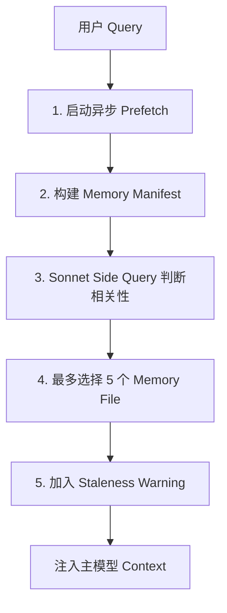
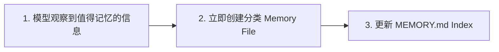
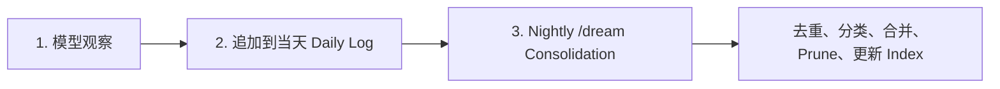
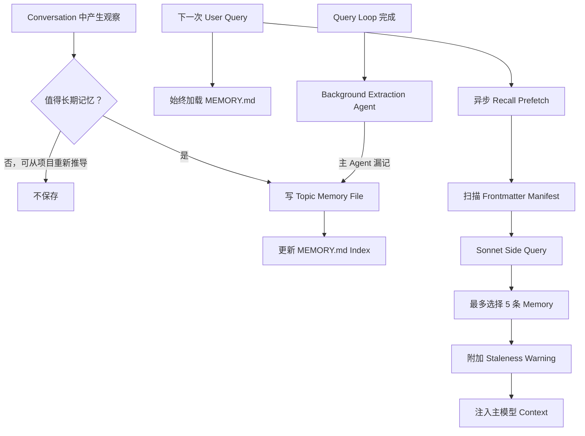

# 第十一章：记忆：跨会话学习

## 无状态问题

到目前为止，前面所有章节描述的机制都只存在于单次 Session 中。

Agent Loop 在运行，工具在执行，子智能体在协调。但只要进程退出，这些东西就全部消失。

下一次对话会重新开始：

- 相同的 System Prompt；
- 相同的 Tool Definition；
- 相同的模型；
- 以及对上一场对话完全为零的认知。

这就是无状态架构最根本的限制。

开发者周一纠正了模型的测试方式，到了周二，模型又犯同样的错误。

用户解释了自己的角色、项目限制、代码风格偏好，但每次开启新 Session，都要重新解释一遍。

模型并不是“忘了”。

更准确地说：

> **它从来就不知道。**

每一场对话都是一个相互独立的宇宙。

这个问题并不只是理论上的缺陷，它会以非常具体的方式侵蚀用户信任。

例如用户说：

> 记住，我们的集成测试要使用真实数据库实例，不要使用 Mock。

但下周模型又生成了 Mock Database Test。

或者用户已经说明：

> 我是资深工程师，不需要面向初学者的解释。

结果下一场 Session 还是从教程级别的基础知识讲起。

如果没有 Memory，每一场对话都从零开始。

Agent 永远像：

> 第一天入职的新员工。

---

## 为什么不用传统 RAG

行业中的标准解决方案通常是 Retrieval-Augmented Generation，也就是 RAG：

1. 把文档转换成 Embedding；
2. 存入 Vector Database；
3. 在查询时检索相关 Chunk；
4. 把检索结果加入模型上下文。

这种方式非常适合知识库，例如：

- 文档；
- FAQ；
- Reference Material。

但它与一个 Agent 真正需要跨 Session 记住的东西，在架构上并不完全匹配。

Agent Memory 并不是一座知识库。

它更像是一组观察记录：

- 用户是谁；
- 用户纠正过什么；
- 项目当前有什么约束；
- 某些信息应该去哪里寻找。

这些 Observation 通常：

- 很小；
- 经常变化；
- 必须允许人类直接编辑。

因此，向量数据库解决的是一个不同的问题。

Claude Code 选择了完全不同的路线：

> **磁盘文件 + Markdown + LLM 驱动的 Recall + 零基础设施。**

它押注的是：

> 存储越简单，召回越聪明，整体系统反而可能比“存储和检索都高度复杂”更好。

---

## 设计哲学

这种设计选择直接塑造了整个 Memory System。

### 人类可读

用户想知道 Claude Code 记住了什么，只需要打开：

```text
~/.claude/projects/<slug>/memory/MEMORY.md
```

任何文本编辑器都可以查看。

不需要：

- 特殊工具；
- 解密；
- Export Command。

### 人类可编辑

过期记忆可以直接用 Vim 修改。

错误记忆可以直接：

```bash
rm
```

删除。

用户对 Agent 的长期知识拥有完全控制权。

### 可以版本控制

Team Memory 可以提交进 Git。

因为是 Markdown，所以 Memory Change 可以正常：

```text
git diff
```

### 零基础设施

Memory System：

- 可以离线运行；
- 不需要 Server；
- 只要操作系统有 File System 就能工作。

没有数据库 Schema，因此也没有复杂的 Migration Path。

### 容易调试

如果 Memory 行为异常，诊断方式通常是：

```bash
ls
cat
```

而不是：

- 查数据库；
- 看 Query Log；
- 调 Vector Store。

---

## Memory 没有专用 API

模型读写 Memory 时使用的仍然是第 6 章介绍过的普通工具：

```text
FileWriteTool
FileEditTool
```

也就是它平时修改源代码时使用的同一套工具。

系统并没有设计一个专门的：

```text
Memory API
```

System Prompt 只是教模型遵循两步协议：

1. 创建 Memory File；
2. 更新 Index。

然后模型使用自己已经拥有的文件工具执行。

这是“工具复用”作为架构原则的一个典型例子。

Memory System 并不是后来硬装到 Agent 身上的一个独立子系统。

它更像一种：

> Agent 在新的指令下，使用已有能力自然产生出来的行为。

---

## Memory 保存的是观察，而不是权威事实

文件方案之所以特别适合 Agent Memory，还有一个更深层原因。

传统应用中的数据库通常保存的是：

> 权威状态。

它是系统数据的 Source of Truth。

而 Agent Memory 保存的是：

> **Observation。**

这些信息可能在写入时是真的，但以后不一定仍然是真的。

文件能够天然表达这种认识论状态。

它有：

- 修改时间；
- 可以被人类打开；
- 可以被修改；
- 可以被删除。

数据库容易给人一种：

> 永久、权威、正式数据

的感觉。

而 Markdown 文件更像：

> 某个人写下的一条笔记，未来可能需要修改。

存储介质本身就在暗示这些数据应该如何被理解：

> 这是工作笔记，不是圣旨。

---

## 按项目隔离

Memory Scope 绑定的是：

```text
Git Repository Root
```

而不是当前 Working Directory。

例如，一个 Terminal 位于：

```text
src/components/
```

另一个 Terminal 位于：

```text
tests/
```

只要它们属于同一个 Git Repository，就会共享同一个 Memory Directory。

路径解析时，系统优先寻找 Canonical Git Root。

如果找不到，才退回 Project Root。

`findCanonicalGitRoot()` 还保证：

> 同一 Repository 的不同 Git Worktree 共享一套 Memory。

Git Root 会经过：

```text
sanitizePath()
```

处理。

例如：

```text
/Users/alex/code/myapp
```

可能被转换为：

```text
-Users-alex-code-myapp
```

最终目录：

```text
~/.claude/projects/-Users-alex-code-myapp/memory/
```

---

## Memory 目录结构

一个完整的 Memory Directory 大致如下：

```text
~/.claude/
└── projects/
    └── <project-slug>/
        └── memory/
            ├── MEMORY.md
            ├── user_role.md
            ├── feedback_testing.md
            ├── project_auth.md
            └── reference_docs.md
```

其中：

```text
MEMORY.md
```

始终加载。

它是索引文件。

其他 Memory File 则按需加载。

命名约定为：

```text
<type>_<topic>.md
```

例如：

```text
user_role.md
feedback_testing.md
project_auth.md
reference_docs.md
```

类型前缀并不是代码强制要求，而是 System Prompt 中的约定。

这样用户只要扫一眼目录，就能大致理解当前 Memory Landscape。

---

# 四种 Memory 类型

并不是所有东西都值得记住。

Claude Code 把所有 Memory 限制为 4 种类型：

```text
user
feedback
project
reference
```

分类背后只有一个核心判断：

> **这些知识能不能从当前项目状态重新推导出来？**

例如：

- Code Pattern；
- Architecture；
- File Structure；
- Git History；

这些内容都能重新读取代码库得到，因此不应该保存为 Memory。

四种 Memory 专门记录：

> 无法简单从项目当前状态重新推导的信息。

---

## User Memory

记录关于“这个人”的信息，例如：

- Role；
- Goal；
- Responsibility；
- Expertise Level。

例如：

> 用户是一名资深 Go Engineer，但刚开始学习 React。

这会让系统选择不同的解释方式。

面对这种用户，模型不需要解释什么是变量，却可能需要更详细地解释 React Hook。

---

## Feedback Memory

记录：

> 应该怎样做事。

它不仅保存用户的纠正，也保存用户明确认可过的方法。

系统特别提醒模型：

> 如果你只记录纠正，你会逐渐偏离那些用户已经验证并认可的方法。

Feedback Memory 推荐结构如下：

```markdown
具体规则。

**Why:** 为什么有这条规则，通常来自某次过去的事故。

**How to apply:** 什么情况下应该使用这条规则。
```

---

## Project Memory

保存持续中的项目上下文：

- 谁在做什么；
- 为什么做；
- 什么时候完成。

System Prompt 特别要求把相对日期转换成绝对日期。

例如：

```text
Thursday
```

应该保存为：

```text
2026-03-05
```

这样几周之后再读，这条 Memory 仍然有明确含义。

---

## Reference Memory

Reference 是 Bookmark。

它告诉模型：

> 信息在哪里。

而不是直接保存：

> 信息是什么。

例如：

- Linear Project URL；
- Grafana Dashboard；
- Slack Channel；
- 外部文档位置。

---

## 分类本身就是过滤器

这四种类型不只是分类标签。

它们还是一层过滤器。

当系统明确规定什么算 Memory 时，也就隐含定义了：

> 什么不算 Memory。

如果没有这个 Taxonomy，一个积极过头的模型可能会保存：

- Code Pattern；
- Architecture Diagram；
- Error Message；
- Debug Solution。

但这些信息都能从 Codebase 重新获得。

保存它们只会创建一份：

> 平行、而且未来可能过期的副本。

---

## 防止 Memory 变成拐杖

还有一个更微妙的风险：

> Memory 可能变成模型逃避重新观察现实的拐杖。

如果模型把 Architecture Decision 全部保存成 Memory，它未来可能不再阅读当前 Codebase，而是直接相信旧 Memory。

因此，排除可推导信息，会迫使模型继续：

> Grounded in current code.

也就是持续以当前代码状态为准。

明确排除项包括：

- Code Pattern；
- Git History；
- Debugging Solution；
- 已经写在 `CLAUDE.md` 中的内容；
- 临时任务细节。

这些排除规则甚至在用户明确说“记住”时仍然有效。

如果用户说：

> 记住这份 PR List。

模型应该进一步追问或提炼：

> 这份 PR List 中真正令人意外、非显而易见、值得长期保留的是什么？

原始列表本身不值得存。

值得存的是：

> 那个无法从现状轻易重新推导的洞察。

这一规则经过 Eval 验证。

加入“即使用户要求保存也要遵守排除规则”的指令后，相关 Eval 从：

```text
0/2
```

提升到：

```text
3/3
```

---

## Frontmatter 是契约

每个 Memory File 都使用 YAML Frontmatter。

必须包含 3 个字段：

```yaml
---
name: {{memory name}}
description: {{one-line description -- used to decide relevance}}
type: {{user, feedback, project, reference}}
---
```

其中最关键的是：

```text
description
```

它承担了非常重的职责。

之后负责 Relevance Selection 的 Sonnet Side Query，会根据 Description 决定：

> 当前是否应该加载这条 Memory。

一个模糊 Description：

```text
testing stuff
```

可能：

- 匹配过宽；
- 或根本匹配不到。

而具体 Description：

```text
Integration tests must hit real DB, not mocks — burned by mock divergence Q4
```

则可以准确匹配真正相关的场景。

可以把 Description 理解为：

> Memory 的 Search Index。

但消费它的不是 Search Engine，而是一个能够理解：

- 语义；
- 上下文；
- 意图；

的语言模型。

Recall 扫描时，也不会读取整个 Memory File。

`scanMemoryFiles()` 最多只读取每个文件前：

```text
30 行
```

提取 Frontmatter。

Body 在真正被选中之前不会进入 Context。

---

# 写入路径

写一条 Memory 需要两步，而且全部使用普通文件工具完成。

## 第一步：创建 Memory File

例如：

```markdown
---
name: Testing Policy
description: Integration tests must hit real DB, not mocks
type: feedback
---

集成测试不要 Mock 数据库。

**Why:** 上个季度我们吃过亏。Mock Test 全部通过，
但 Production Query 遇到了 Mock 没覆盖的 Edge Case。

**How to apply:** `__tests__/` 下任何涉及数据库操作的测试，
都应该使用 `test-utils` 中真实的 PGlite Instance。
```

## 第二步：更新 Index

模型随后向：

```text
MEMORY.md
```

加入一行 Pointer：

```markdown
- [Testing Policy](feedback_testing.md) -- integration tests must hit real DB
```

每个 Index Entry 应该尽量控制在：

```text
约 150 字符以内
```

因为 `MEMORY.md` 是：

> Table of Contents。

不是知识库正文。

如果新信息只是修改已有 Memory，模型应该使用：

```text
FileEditTool
```

修改现有文件，而不是新建一份重复 Memory。

Memory System 本身不做版本管理。

因为文件就在本地 File System 上。

用户需要版本控制时，已经有：

```text
git
```

在 Prompt 构建之前：

```text
ensureMemoryDirExists()
```

会提前创建 Memory Directory。

Prompt 还会明确告诉模型：

> 目录已经存在。

避免模型浪费额外 Turn 去执行：

```bash
ls
mkdir -p
```

---

# 召回路径

写 Memory 只是第一步。

真正更难的问题是：

> 当用户问一个问题时，几百个 Memory File 中到底应该加载哪几个？

如果全部加载：

> Token Budget 会爆炸。

如果一个都不加载：

> Memory 失去意义。

如果选错：

> 浪费 Token，同时错过真正会改变模型行为的知识。

Claude Code 使用两层 Recall。

第一层：

```text
MEMORY.md
```

在 Session Start 时始终加载，提供方向感。

第二层：

> 每轮通过 LLM Relevance Query，最多选择 5 条 Memory 按需加载。

---

## 完整 Recall Pipeline

可以概括为：



### 第 1 步：Prefetch

Recall 会异步启动，并与用户 Query 的其他处理并行。

### 第 2 步：构建 Manifest

`scanMemoryFiles()` 扫描全部 `.md` 文件。

但每个文件最多读取前 30 行，只解析 Frontmatter。

### 第 3 步：Sonnet 评估

Side Query 会收到：

- Memory Manifest；
- 当前 User Query；
- 最近使用过的工具。

### 第 4 步：选择相关 Memory

Sonnet 使用 Structured Output 返回：

```json
{
  "selected_memories": []
}
```

最多 5 个文件名。

系统还会校验这些 Filename 确实存在于已知集合中。

### 第 5 步：加入陈旧性信息

选中的 Memory 会被加载。

如果内容较旧，还会附带 Age Warning。

---

## 为什么 Prefetch 很重要

异步 Prefetch 是这里最关键的性能决策。

当主模型真正推理到需要 Memory 的地方时，Side Query 通常已经完成。

因此用户通常不会额外感受到：

> “为了查 Memory 多等了几百毫秒。”

额外延迟被隐藏在主请求自己的处理时间里。

---

## Sonnet Side Query

Selector 的 System Prompt 会要求它非常保守：

- 只选当前 Query 真正有用的 Memory；
- 不确定时宁可不选；
- 如果某个 Tool 当前已经加载并正在使用，不要重复选它的 API / Usage Documentation；
- 但有关该 Tool 的 Warning、Gotcha、Known Issue 仍然可以召回。

这种方式实际上是在用：

> LLM 做语义化的 Memory Router。

---

## 为什么不用 Keyword 或 Embedding

### Keyword Matching

优点：

- 快。

缺点：

- 不理解上下文。

它很难表达：

> 如果 Tool 已经在当前 Session 使用，就不要加载它的 Usage Doc。

### Embedding Similarity

优点：

- 能做语义匹配。

缺点：

- 需要 Embedding Model；
- 需要 Vector Store；
- 需要更新 Pipeline；
- 对否定语义很麻烦。

例如：

```text
do NOT use database mocks
```

和：

```text
use database mocks
```

在 Embedding Space 中可能非常接近。

但含义正好相反。

### Sonnet Side Query

它可以：

- 理解语义相关性；
- 结合当前 Context；
- 处理否定；
- 判断当前已经有哪些 Tool；
- 不需要额外基础设施。

代价是几百毫秒的 Side Query。

但这部分延迟是有上界的，而且可以通过 Prefetch 隐藏。

---

## Recall Telemetry

系统即使一次 Memory 都没选，也会记录 Selection Rate。

例如：

```text
0 / 150
```

和：

```text
0 / 3
```

含义完全不同。

前者更可能说明：

> Precision 有问题。

后者可能只是：

> Coverage 太少，样本不足。


---

# 陈旧性：Staleness

Staleness System 用来解决真实使用中出现过的一类问题。

用户发现，一些旧 Memory 中保存了：

```text
file:line
```

这样的代码引用。

但代码后来已经修改。

模型却仍然把旧 Memory 当作当前事实。

更糟的是：

> 因为带有文件和行号，看起来反而更加权威。

解决方案不是：

> 过期后自动删除。

因为旧 Memory 可能包含多年后仍然有效的组织经验。

Claude Code 选择的是：

> **保留 Memory，但附加年龄警告。**

---

## Age Warning

Staleness Function 会计算 Memory 距离现在已经过去多少天。

### 今天或昨天的 Memory

不显示 Warning。

函数返回空字符串。

### 更旧的 Memory

会在内容旁边注入 Caveat。

它会说明：

- Memory 已经存在多少天；
- 关于 Code Behavior 的描述可能过期；
- `file:line` Citation 可能已经变化；
- 使用前应该重新验证当前 Code。

---

## 为什么使用“47 天前”，而不是 ISO Timestamp

Warning 会使用人类可读格式，例如：

```text
today
yesterday
47 days ago
```

而不是直接给模型：

```text
2026-01-23T17:31:22Z
```

原因是模型并不擅长日期心算。

```text
47 days ago
```

会直接触发：

> 这东西可能已经过期。

而原始 Timestamp 未必能触发相同的 Reasoning。

这是通过 Eval 验证过的经验。

同一段 Body Text 下：

```text
Before recommending from memory
```

这种行动提示式表述获得：

```text
3/3
```

而更抽象的：

```text
Trusting what you recall
```

只有：

```text
0/3
```

也就是说，面对模型时：

> 抽象原则未必比具体行动提示有效。

---

## Memory 是假设，不是事实

这里存在一个很有意思的哲学张力。

Staleness System 实际上是在告诉模型：

> Memory 是 Hypothesis，不是 Fact。

但模型天然倾向于用肯定语气表达信息。

因此 Age Warning 是在利用模型的 Instruction Following 能力，压制它自身：

> 自动生成确定语气

的倾向。

---

# `MEMORY.md`：始终加载的索引

每一场 Conversation 开始时：

```text
MEMORY.md
```

都会进入 Context。

但严格来说，它本身并不是 Memory。

它是：

> Memory File 的目录和索引。

---

## 两个硬上限

`MEMORY.md` 有两个 Hard Cap：

```text
200 行
25,000 Bytes
```

### 200 行限制

用于限制普通意义上的索引增长。

### 25 KB 限制

用于捕获另一类真实 Failure Mode：

> 用户把大量内容塞进少数超长行里。

这样虽然没有超过 200 行，却会消耗巨大的 Token Budget。

真实数据中，第 97 Percentile 的一个案例：

```text
197 行
197 KB
```

几乎每一行都是超长内容。

当任意一个限制触发时，系统会给出明确建议，例如：

> Index Entry 保持一行，控制在约 200 字符以内；详细内容移到 Topic File。

---

## 为什么两层 Memory 能扩展

设计是：

```text
轻量 Always-On Index
+
重量 On-Demand Memory File
```

假设一个项目拥有：

```text
150 条 Memory
```

那么 Session Start 只需要加载约 150 行 Index。

可能只消耗：

```text
约 3,000 Token
```

而不是把 150 个完整文件全部加载，消耗：

```text
100,000 Token
```

以上。

这就是 Memory 能够不断增长，却不会立刻撑爆 Context Window 的关键。

---

# Team Memory

从个人 Memory 走向团队知识，是很自然的一步。

例如：

- Testing Policy；
- Deployment Convention；
- Build System 中某个已知 Gotcha；

显然不应该只让某一个人的 Agent 知道。

Team Memory 位于：

```text
<autoMemPath>/team/
```

它是 Auto Memory Directory 的子目录。

该能力受到 Feature Flag 控制，并要求 Auto Memory 已经开启。

架构上的嵌套是刻意设计的：

```text
关闭 Auto Memory
    ↓
Team Memory 也自动关闭
```

---

## Defense in Depth

Team Memory 引入了个人 Memory 不存在的攻击面。

原因是：

> Team Sync File 来自其他用户。

恶意 Teammate 可能尝试 Path Traversal。

因此系统使用三层防御。

---

## 第一层：输入清洗

`sanitizePathKey()` 会拒绝：

- Null Byte；
- URL Encoded Traversal，例如：

```text
%2e%2e%2f
```

- Unicode Normalization Attack；
- 会 Normalize 成 `../` 的全角字符；
- Backslash；
- Absolute Path。

---

## 第二层：字符串级路径验证

完成 Sanitization 后：

```text
path.resolve()
```

会规范化剩余的：

```text
..
```

路径段。

然后系统检查最终路径是否仍位于 Team Directory Prefix 下。

检查 Prefix 时会包含结尾 Path Separator。

这样可以避免：

```text
team-evil/
```

错误匹配：

```text
team/
```

---

## 第三层：Symlink Resolution

字符串路径合法并不代表真实文件路径合法。

例如：

```text
team/evil
```

可能是一个 Symlink，实际指向：

```text
/etc/
```

字符串检查会认为它仍在：

```text
team/
```

下面。

因此系统还会调用：

```text
realpathDeepestExisting()
```

解析最深已存在祖先节点上的 Symlink。

真实 Target 暴露后，就可以发现 Path Traversal。

---

## Fail Closed

任何 Validation Failure 都会产生：

```text
PathTraversalError
```

系统不会：

- 部分成功；
- 自动退回；
- 尝试“猜一个安全路径”。

原则是：

> Fail Closed。

---

## Private 与 Shared Scope

System Prompt 会教模型区分个人 Memory 与 Team Memory。

### User Memory

始终 Private。

### Reference Memory

通常适合 Team Shared。

例如：

- 项目 Dashboard；
- Team Documentation；
- Slack Channel。

### Feedback Memory

默认 Private。

但如果它描述的是整个 Project 的统一规则，例如：

```text
Integration Test 必须使用真实数据库
```

则可以作为 Team Feedback。

还有一条 Cross-check Instruction：

> 在保存 Private Feedback Memory 之前，先检查它是否与 Team Feedback Memory 冲突。

这样可以避免：

- 一条 Private Rule；
- 一条 Team Rule；

互相矛盾，然后因为 Recall 顺序不同导致 Agent 行为随机变化。

---

# KAIROS Mode：Append-Only Daily Log

标准 Memory 模型假设：

> Session 是离散的。

每次对话开始、结束。

但 KAIROS Mode，也就是 Claude Code 的 Assistant Mode，会打破这个假设。

它的 Session 可能持续：

```text
数天
```

如果每产生一点信息，就立即执行：

```text
创建 Memory File
+
修改 MEMORY.md
```

这种两步结构在持续运行场景中会变得笨重。

解决方案是：

> **把 Capture 和 Consolidation 分开。**

---

## Standard 与 KAIROS 的区别

### Standard Mode

立即结构化写入。



优点：

- 马上结构化；
- 立即可检索。

缺点：

- 打断对话流程；
- 容易过度建立 Index。

### KAIROS Mode

先捕获，之后批量整理。



优点：

- 写入摩擦小；
- 不中断当前 Flow；
- Consolidation 时可以自然去重。

缺点：

- 依赖后续 `/dream` Consolidation。

---

## Daily Log 路径

KAIROS Mode 会追加到：

```text
<autoMemPath>/logs/YYYY/MM/YYYY-MM-DD.md
```

每条记录只是：

> 带 Timestamp 的短 Bullet。

System Prompt 会特别要求：

> 不要在 Capture 阶段重写或重新组织 Log。

因为：

> Chronological Signal

对后续 Consolidation 非常重要。

如果模型边记边重新整理，时间线信息会被破坏。

---

## Prompt 中为什么写日期 Pattern，而不是当天日期

Memory Prompt 不会每天写入当前真实日期。

而是写：

```text
logs/YYYY/MM/YYYY-MM-DD.md
```

这种 Pattern。

原因是 Prompt Cache。

如果 Prompt 内直接包含：

```text
2026-08-12
```

那么午夜到来后日期变成：

```text
2026-08-13
```

System Prompt 会改变，Cache 失效。

因此 Prompt 保持稳定 Pattern。

当前日期通过独立：

```text
date_change
```

Attachment 提供给模型。

这是又一个：

> 为 Prompt Cache 稳定性调整架构

的例子。

---

# `/dream` Consolidation

Consolidation 分为 4 个阶段。

## 1. Orient

- 列 Memory Directory；
- 阅读 Index；
- 快速浏览现有 Memory。

目标是先搞清楚：

> 已经有什么。

## 2. Gather

- 搜索 Daily Log；
- 找到新 Observation；
- 检查已有 Memory 是否 Drift。

## 3. Consolidate

- 创建或更新 Memory；
- 优先 Merge；
- 不要简单 Duplicate。

## 4. Prune

- 更新 `MEMORY.md`；
- 保证低于 200 行；
- 删除已经无效的 Pointer。

强调 Merge 非常重要。

如果每次 Consolidation 都创建新文件，Memory Directory 会随着使用时长：

```text
线性膨胀。
```

---

# Consolidation Lock

Lock File：

```text
.consolidate-lock
```

同时承担两个职责。

### 内容

保存当前 Holder 的：

```text
PID
```

用于 Mutual Exclusion。

### `mtime`

文件修改时间直接代表：

```text
lastConsolidatedAt
```

也就是 Scheduling State。

Auto-Dream 只有三个 Gate 全部通过时才启动。

而且按成本从低到高依次判断：

1. 距上一次 Consolidation 是否超过 24 小时；
2. 之后是否至少有 5 个 Session 被修改；
3. 是否没有其他 Process 正持有 Lock。

Crash Recovery 会通过：

```text
process.kill(pid, 0)
```

检测 PID 是否仍然存在。

为了防止 PID 被操作系统重新分配，还设置：

```text
1 小时 Staleness Timeout
```

作为第二道保护。


---

# 后台提取：Background Extraction

主 Agent 的 System Prompt 已经包含完整的 Memory 保存说明。

但 Agent 并不完美。

而且它的失败模式很容易预测。

例如用户说：

> 记住，以后集成测试都要使用真实数据库。

紧接着又说：

> 现在修复 Login Bug。

模型的注意力很可能立即转向 Bug。

虽然它“读到了”记忆指令，但不一定真的执行保存动作。

Claude Code 因此增加了一层后台 Safety Net。

---

## Query Loop 结束后的补记 Agent

每次完整 Query Loop 结束后，会创建一个 Fork Agent。

它与父 Agent 共享 Prompt Cache。

这个 Fork Agent 会分析最近对话，并判断：

> 主 Agent 有没有漏掉应该保存的 Memory？

如果主 Agent 在当前 Turn Range 中已经写过 Memory，Extraction Agent 会跳过该范围。

这避免：

- 重复写；
- 相互竞争；
- 产生 Duplicate Memory。

---

## 受限工具预算

Extraction Agent 不拥有完整工具集。

它只拥有：

- Read-only Tool；
- 对 Memory Directory 的 Write Access。

换句话说，它可以查看必要信息并补写 Memory，但不能顺手去修改项目代码。

System Prompt 还要求它使用两轮策略。

### Turn 1

并行读取。

### Turn 2

并行写入。

这样可以减少额外 API Turn。

---

## 主路径 + 后台 Safety Net

两者是合作关系，而不是竞争关系。

```text
Main Agent
  ├─ 如果自己已经保存 Memory
  │      → Background Agent 跳过
  │
  └─ 如果漏掉
         → Background Agent 补上
```

这种设计很像可靠系统中的：

> Primary Path + Recovery Path。

只依赖 Main Agent，Memory 会漏。

只依赖 Background Extraction，则反馈不够及时，而且会失去主模型对上下文的第一手判断。

两者结合才能提高 Capture Reliability。

---

# 路径解析与安全

Auto Memory Path 会按照明确优先级解析。

```text
1. CLAUDE_COWORK_MEMORY_PATH_OVERRIDE
2. settings.json 中的 autoMemoryDirectory
3. 默认项目路径
```

---

## 1. `CLAUDE_COWORK_MEMORY_PATH_OVERRIDE`

为 Cowork 提供完整路径 Override。

优先级最高。

---

## 2. `settings.json` 中的 `autoMemoryDirectory`

只有可信 Settings Source 才允许控制这个字段。

Project Settings 被故意排除。

这是安全决策，不是实现限制。

---

## 3. 默认路径

默认使用：

```text
~/.claude/projects/<sanitized-git-root>/memory/
```

---

## 为什么 Project Settings 不能覆盖 Memory Directory

假设一个恶意 Repository 提交：

```text
.claude/settings.json
```

并写入：

```json
{
  "autoMemoryDirectory": "~/.ssh"
}
```

如果 Project Settings 可以控制 Memory Path，而系统又对 Memory Directory 提供自动写权限，那么模型可能因此获得：

```text
~/.ssh
```

的自动写权限。

攻击者就能把 Memory Permission Carve-out 变成对 SSH Key 的写入能力。

因此系统只允许以下不可由 Repository Commit 控制的来源修改 Memory Directory：

- Policy；
- Flag；
- Local Settings；
- User Settings。

Project Settings 被排除。

这直接关闭了上述攻击路径。

---

## `isAutoMemPath()`

系统会在做 Prefix Check 之前先进行 Path Normalization。

这样可以避免：

```text
..
```

等 Traversal 绕过检查。

同时，Prefix 会带结尾 Directory Separator。

这确保：

```text
/path/memory-evil
```

不会被误判为位于：

```text
/path/memory/
```

之内。

---

# Enable / Disable Chain

是否开启 Auto Memory，由：

```text
isAutoMemoryEnabled()
```

决定。

它也拥有自己的 Priority Chain，大致考虑：

1. Environment Variable；
2. Bare Mode；
3. 没有 Persistent Storage 的 CCR；
4. Settings；
5. Default Enabled。

当 Auto Memory 关闭时，必须同时关闭两个层面。

### Prompt 层

移除 Memory System Prompt Section。

模型不会再收到：

> 如何保存 Memory

的指令。

### Background Process 层

同时停止：

- Extract Memories；
- Auto-Dream；
- Team Sync。

这两个 Gate 必须一致。

只删除 Prompt 不够。

因为 Background Extraction Agent 拥有自己的 Prompt，仍然可能继续运行。

---

# 应用这些设计：如何构建 Agent Memory

Claude Code 的 Memory System 有一个很鲜明的特点：

> 复杂度主要放在行为层，而不是存储层。

复杂的部分是：

- Prompt Instruction；
- LLM Recall；
- Staleness Management；
- Background Extraction；
- 安全边界。

而底层存储只是：

> Markdown File。

这种复杂度分布本身就是一种设计原则。

---

## 文件比数据库更适合作为 Agent Memory

对于 Agent Memory 来说，文件有非常强的优势：

- 可查看；
- 可修改；
- 可删除；
- 可版本控制；
- 用户可以直接理解。

Transparency 会建立信任。

如果另一种选择是：

> 一个用户很难直接检查的数据库，

那么仅仅在“可信感”这一点上，文件就已经占据优势。

---

## 不仅限制“怎么保存”，更要限制“保存什么”

真正重要的过滤问题是：

> 这条信息能否从当前项目状态重新推导？

如果可以，就不应该保存成 Memory。

这个 Derivability Test 能过滤掉绝大多数潜在 Memory，同时留下真正需要跨 Session 保留的部分。

---

## 用 LLM 做 Recall，而不是 Keyword 或 Embedding

LLM Side Query 可以理解：

- Semantic Relevance；
- 当前 Conversation 已经有什么；
- 当前 Tool 是否已经加载；
- Negation；
- Gotcha 与 Warning。

而且不需要：

- Embedding Pipeline；
- Vector Index；
- 数据迁移；
- Index Maintenance。

延迟确实存在。

但：

- 有上限；
- 通常只是几百毫秒；
- 可以隐藏在主模型处理时间里。

---

## 对过期内容发 Warning，而不是自动 Expire

组织经验可能几年后仍然有效。

自动删除旧 Memory 会损失长期知识。

更好的方式是：

> 保留，同时提醒模型它已经很旧。

这样模型会把它视为：

```text
需要验证的 Hypothesis
```

而不是：

```text
绝对事实
```

尤其是使用：

```text
47 days ago
```

这样的 Human-readable Age，比原始 Timestamp 更容易触发正确推理。

---

## 为 Memory Capture 建立 Safety Net

Main Agent 一定会漏记。

因此，Background Extraction Agent 可以在不打断用户主要 Interaction 的情况下，回头检查最近对话。

原则是：

```text
Main Agent 保存了
→ Background Agent 不重复

Main Agent 漏了
→ Background Agent 补上
```

这是比“要求主模型永远完美执行 Memory Instruction”更现实的设计。

---

# 本章总结

到这一章，Claude Code 开始真正具备：

> 跨 Conversation 学习

的能力。

它可以逐渐积累：

- 关于用户的信息；
- 用户偏好；
- 用户曾经纠正过的做法；
- 项目持续中的背景；
- 外部 Reference 的位置。

但它并没有建立一套沉重的数据库基础设施。

它选择：

```text
Markdown 文件作为存储
    ↓
MEMORY.md 作为 Always-On Index
    ↓
Sonnet Side Query 做 Recall
    ↓
Staleness Warning 管理旧知识
    ↓
Background Agent 补漏
```

可以把整体架构画成：



这套设计背后其实是一种明确的哲学承诺：

> Agent 与用户的关系应该随着时间变深，而不是每次打开新 Session 都重置。

文件化实现让这种承诺不是黑盒。

用户可以直接在磁盘上看到 Agent 记住了什么。

可以修改。

可以删除。

可以提交 Git。

可以 Diff。

Agent 的 Memory 最终并不是一个神秘向量空间。

它只是一组放在文件夹里的笔记。

而且这些笔记使用的语言：

> 人类和模型都能读懂。

下一章将继续介绍 Claude Code 如何扩展核心能力：

- Skill System 如何教模型新的行为；
- Hook System 如何在二十多个生命周期节点上，让外部代码约束、修改或扩展这些行为。
