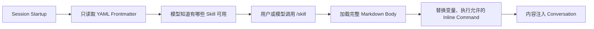
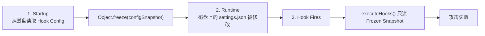
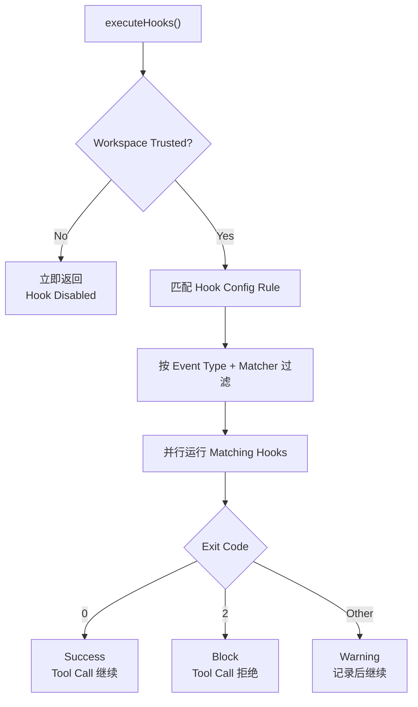
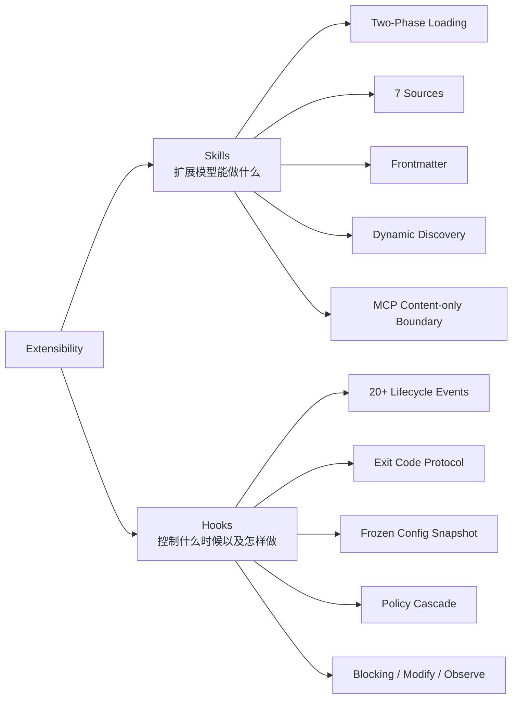

# 第十二章：扩展性：Skills 与 Hooks

> 原文：[Ch 12. Extensibility — Skills and Hooks](https://claude-code-from-source.com/ch12-extensibility/)


## 扩展系统的两个维度

任何一套扩展系统，最终都在回答两个问题：

> 系统能够做什么？  
> 系统在什么时候做这些事？

很多框架会把这两个问题揉在一起。

一个 Plugin 既注册能力，也注册生命周期回调，于是：

- “新增一个功能”
- “拦截一个功能”

之间的边界逐渐模糊，最后全都落进同一个 Registration API。

Claude Code 则把它们明确拆开。

### Skills 扩展“模型能做什么”

Skill 本质上是 Markdown 文件。

它们会变成 Slash Command，在被调用时把新的指令注入 Conversation。

也就是说，Skill 通过增加 Prompt Content 扩展模型能力。

### Hooks 扩展“事情在什么时候以及怎样发生”

Hook 是 Lifecycle Interceptor。

它们会在一个 Session 中二十多个不同节点触发，可以运行任意代码，并且可以：

- 阻止操作；
- 修改输入；
- 强迫 Conversation 继续；
- 静默观察；
- 注入额外 Context。

这种分离不是偶然。

Skills 属于：

> **Content。**

它们通过增加 Prompt Text 扩展模型的知识和能力。

Hooks 属于：

> **Control Flow。**

它们改变执行路径，但不改变模型“知道什么”。

例如：

- 一个 Skill 可以教模型如何执行你们团队的 Deployment Process；
- 一个 Hook 可以确保测试套件没有通过时，任何 Deployment Command 都不能真正执行。

Skill 增加能力。

Hook 增加约束。

本章会分别深入介绍两套系统，然后讨论它们的交汇点：

> Skill 可以在 Frontmatter 中声明 Hook，并在 Skill 被调用后，把这些 Hook 注册为 Session-scoped Lifecycle Interceptor。

---

# Skills：教模型新的招式

## 两阶段加载

Skill System 最核心的优化是：

> 启动时只加载 Frontmatter，真正的 Markdown Body 只有在调用 Skill 时才加载。

这是一种典型的 Lazy Loading。

可以把过程概括成：



---

## Phase 1：启动阶段

Session 启动时，系统会读取每一个：

```text
SKILL.md
```

然后把 YAML Frontmatter 与 Markdown Body 分离。

只解析 Metadata，例如：

- `name`
- `description`
- `when_to_use`

这些 Frontmatter 字段会进入 System Prompt。

因此模型知道：

> 当前有哪些 Skill 可以用，以及大概什么时候应该用。

Markdown Body 会被保存在 Closure 中，但不会真正解析、执行或注入 Context。

这意味着：

> 一个拥有 50 个 Skill 的项目，只需要支付 50 条简短 Description 的 Token 成本，而不是 50 份完整文档的 Token 成本。

---

## Phase 2：调用阶段

当用户或模型真正调用某个 Skill 时：

```text
getPromptForCommand()
```

才会加载完整内容。

它会完成几件事情。

### 1. 注入 Base Directory

让 Skill 中的相对路径可以基于 Skill Directory 解析。

### 2. 替换变量

支持例如：

```text
$ARGUMENTS
${CLAUDE_SKILL_DIR}
${CLAUDE_SESSION_ID}
```

### 3. 执行 Inline Shell Command

Skill Body 中允许使用以：

```text
!
```

开头的内联 Shell Command。

最终结果会被转换成 Content Block，注入 Conversation。

---

## 为什么两阶段加载重要

假设项目拥有以下 Skill：

```text
/deploy
/review
/test
/db-migrate
/format
/git-pr
/security
/docs
/refactor
/debug
/perf
/api
/ci
/lint
/scaffold
```

绝大多数 Session 只会真正调用其中一两个。

如果启动时把所有 Skill Body 全部塞进 Context：

- Token 成本巨大；
- 大量内容永远不会使用；
- System Prompt 更容易膨胀；
- Prompt Cache 前缀更重。

两阶段加载把成本从：

> “安装了什么”

变成：

> “这次真正用了什么”。

---

# Skill 的七种来源与优先级

Skill 可以从 7 种不同来源进入系统。

这些来源会并行加载，然后按照优先级 Merge。

| 优先级 | 来源 | 位置 | 说明 |
|---:|---|---|---|
| 1 | Managed / Policy | `<MANAGED_PATH>/.claude/skills/` | Enterprise 控制 |
| 2 | User | `~/.claude/skills/` | 个人 Skill，全局可用 |
| 3 | Project | `.claude/skills/` | 可以提交进版本控制 |
| 4 | Additional Dirs | `<add-dir>/.claude/skills/` | 来自 `--add-dir` |
| 5 | Legacy Commands | `.claude/commands/` | 向后兼容旧 Command |
| 6 | Bundled | 编译进 Binary | 受 Feature Flag 控制 |
| 7 | MCP | MCP Server Prompt | Remote、Untrusted |

优先级越高，越早被看到。

Deduplication 使用：

```text
realpath
```

解决：

- Symlink；
- Parent Directory Overlap；
- 同一 Skill 被多个 Source 重复发现。

系统使用：

```text
getFileIdentity()
```

获取 Canonical Path。

它没有依赖 Inode。

原因是 Inode 在以下环境中并不可靠：

- Container Mount；
- NFS；
- ExFAT。

因此 Canonical Real Path 更稳妥。

---

# Frontmatter Contract

Skill 的 Frontmatter 决定它如何被发现和执行。

核心字段如下。

| YAML 字段 | 用途 |
|---|---|
| `name` | 用户看到的 Skill 名称 |
| `description` | Autocomplete 和 System Prompt 中显示 |
| `when_to_use` | 更详细的模型自动发现说明 |
| `allowed-tools` | Skill 允许使用哪些工具 |
| `disable-model-invocation` | 禁止模型自主调用 |
| `context` | 设置为 `'fork'` 时，以子智能体方式运行 |
| `hooks` | Skill 调用时注册的 Lifecycle Hook |
| `paths` | 条件激活的 Glob Pattern |

---

## `context: 'fork'`

如果一个 Skill 需要大量工作，但不希望污染主 Conversation Context，可以配置：

```yaml
context: fork
```

此时它会以 Sub-agent 方式运行，拥有自己的 Context Window。

这对于：

- 大型分析；
- 复杂转换；
- 长流程 Task；

尤其有价值。

---

## `disable-model-invocation` 与 `user-invocable`

这两个字段控制两条不同入口。

可以分别决定：

- 用户能否主动调用；
- 模型能否自主调用。

如果两者都关闭 Skill 可见性，那么它甚至可以只作为：

> Hooks-only Skill。

也就是不提供普通命令内容，只在被某种机制加载后提供 Lifecycle Hook。

---

# MCP 安全边界

Skill 在变量替换后可能执行 Inline Shell Command。

但这里有一道绝对边界：

> **MCP Skill 永远不能执行 Inline Shell Command。**

原因是 MCP Server 属于外部系统。

假设一个恶意 MCP Prompt 中包含：

```text
!`rm -rf /`
```

如果系统照常执行，它会直接以用户权限运行本地 Shell Command。

因此 MCP Skill 被强制限制为：

> Content-only。

它可以提供 Prompt Content。

不能触发本地 Inline Shell Execution。

这条边界与更大的 MCP Security Model 相连。

---

# 动态 Skill Discovery

Skill 不只在 Session Startup 时加载。

当模型真正访问某些文件时：

```text
discoverSkillDirsForPaths()
```

会从这些路径向上搜索：

```text
.claude/skills/
```

目录。

如果某个 Skill 的 Frontmatter 声明：

```yaml
paths: "packages/database/**"
```

它会先放进：

```text
conditionalSkills
```

Map。

在模型没有碰数据库文件之前，这个 Skill 对模型保持不可见。

只有当模型：

- Read；
- Edit；

了匹配路径后，它才被激活。

这形成一种：

> **Context-sensitive Capability Expansion。**

系统不是把所有能力一股脑给模型。

而是根据模型当前正在触碰的代码区域，逐步展开相关能力。

---

# Hooks：控制事情何时发生

Hook 是 Claude Code 在生命周期节点上：

> 拦截并修改行为

的机制。

主 Execution Engine 已经超过约 4,900 行。

Hook System 主要服务三类人群。

### 个人开发者

用于：

- 自定义 Lint；
- Validation；
- Local Automation。

### 团队

用于：

- Shared Quality Gate；
- 可以提交到 Project Repository 的 Hook。

### Enterprise

用于：

- Policy-managed Compliance Rule；
- 强制执行组织级安全策略。

---

# 一个真实 Hook：禁止直接 Commit 到 Main

先看一个实际例子。

假设团队规定：

> 模型不能直接 Commit 到 `main` Branch。

## 第一步：配置 `settings.json`

```json
{
  "hooks": {
    "PreToolUse": [
      {
        "matcher": "Bash",
        "hooks": [
          {
            "type": "command",
            "command": "/path/to/check-not-main.sh",
            "if": "Bash(git commit*)"
          }
        ]
      }
    ]
  }
}
```

这个 Hook 只会针对：

```text
Bash(git commit*)
```

触发。

不会每次 Bash 都运行。

---

## 第二步：Shell Script

```bash
#!/bin/bash

BRANCH=$(git rev-parse --abbrev-ref HEAD 2>/dev/null)

if [ "$BRANCH" = "main" ]; then
  echo "Cannot commit directly to main. Create a feature branch first." >&2
  exit 2
fi

exit 0
```

如果当前 Branch 是 `main`：

- 向 `stderr` 输出原因；
- 使用 Exit Code `2`。

---

## 第三步：模型体验

当模型尝试：

```bash
git commit
```

时：

1. `PreToolUse` Hook 在真正执行命令之前触发；
2. Script 检查当前 Branch；
3. 返回 Exit Code `2`；
4. Commit 根本不会执行；
5. 模型看到一条 System Message：

```text
Cannot commit directly to main.
Create a feature branch first.
```

模型随后会：

1. 创建 Feature Branch；
2. 再次 Commit。

这就是完整的 Hook Protocol。

---

# 四种用户可配置 Hook 类型

Claude Code 一共定义 6 种 Hook Type。

其中 4 种允许用户配置，另外 2 种属于内部机制。

---

## 1. Command Hook

启动 Shell Process。

Hook Input JSON 通过：

```text
stdin
```

传给 Script。

Script 通过：

- Exit Code；
- stdout；
- stderr；

把结果返回系统。

这是最常用的 Hook 类型。

---

## 2. Prompt Hook

执行一次单轮 LLM Call。

返回结构类似：

```json
{
  "ok": true
}
```

或：

```json
{
  "ok": false,
  "reason": "..."
}
```

适合使用轻量 AI 做 Validation，但不需要完整 Agent Loop。

---

## 3. Agent Hook

执行一个多轮 Agentic Loop。

约束包括：

```text
最大 50 Turns
permissionMode = dontAsk
Thinking Disabled
```

每个 智能体 Hook 都拥有自己的 Session Scope。

适合复杂验证，例如：

> 确认 Test Suite 全部通过，并且新 Feature 的覆盖率达到要求。

---

## 4. HTTP Hook

把 Hook Input 通过 HTTP POST 发送到 URL。

适合：

- Remote Policy Server；
- Audit Logging；
- 远程合规检查。

无需启动本地 Process。

---

# 两种内部 Hook

## Callback Hook

程序内部直接注册。

它有一条 Fast Path。

在 Hot Path 中可以减少约：

```text
70% Overhead
```

因为会跳过：

- Span Tracking；
- 完整 Hook Pipeline；
- 一些额外包装逻辑。

## Function Hook

Session-scoped TypeScript Callback。

主要用于 Agent Hook 的 Structured Output Enforcement。

---

# 最重要的五个 Lifecycle Event

Hook System 在二十多个生命周期节点触发。

其中使用最频繁、最重要的是 5 个。

---

## `PreToolUse`

每个 Tool 执行之前触发。

它可以：

- Block；
- Modify Input；
- Auto-approve；
- Force Ask；
- Inject Context。

权限行为优先级严格为：

```text
deny
>
ask
>
allow
```

这是最常用于：

> Quality Gate

的 Hook Point。

---

## `PostToolUse`

工具成功执行之后触发。

它可以：

- Inject Additional Context；
- 替换 MCP Tool Output。

适合对工具结果做自动反馈或后处理。

---

## `Stop`

Claude 准备结束 Response 之前触发。

如果 Stop Hook 返回 Blocking Result：

> Conversation 会被强制继续。

这正是自动 Verification Loop 的基础。

例如：

```text
你真的完成了吗？
Lint 通过了吗？
测试都跑了吗？
```

如果 Hook 发现还没完成，就阻止结束。

---

## `SessionStart`

Session 开始时触发。

它可以：

- 设置 Environment Variable；
- 覆盖第一条 User Message；
- 注册 File Watch Path。

但它不能 Block Session Startup。

也就是说：

> Hook 可以改变 Session 怎样开始，但不能阻止 Session 存在。

---

## `UserPromptSubmit`

用户提交 Prompt 时触发。

它可以在模型看到 User Prompt 之前：

- Block；
- Validate；
- Filter Content。

适合输入验证和 Policy Filter。

---

# 其他 Hook Event

| 类别 | Event |
|---|---|
| Tool Lifecycle | `PostToolUseFailure`, `PermissionDenied`, `PermissionRequest` |
| Session | `SessionEnd`, `Setup` |
| Subagent | `SubagentStart`, `SubagentStop` |
| Compaction | `PreCompact`, `PostCompact` |
| Notification | `Notification`, `Elicitation`, `ElicitationResult` |
| Configuration | `ConfigChange`, `InstructionsLoaded`, `CwdChanged`, `FileChanged`, `TaskCreated`, `TaskCompleted`, `TeammateIdle` |

其中 `SessionEnd` 默认 Timeout 约：

```text
1.5 秒
```

---

## 为什么有些 Event 可以 Block，有些不能

这种不对称是故意设计的。

### 可恢复的决策点

例如：

- Tool Call；
- Stop Condition。

可以 Block。

因为系统仍然有机会改变行为。

### 已经发生的事实

例如：

- Session 已经启动；
- API 已经失败。

不能 Block。

因为这类事件不是“决策”，而是：

> 已经发生的事实。


---

# Exit Code 语义

对于 Command Hook，Exit Code 具有明确的协议意义。

| Exit Code | 含义 | 是否阻塞 |
|---:|---|---|
| `0` | 成功；如果 stdout 是 JSON，则解析输出 | 否 |
| `2` | Blocking Error；stderr 会作为 System Message 展示 | 是 |
| 其他 | Non-blocking Warning；只展示给用户 | 否 |

为什么选择：

```text
2
```

作为 Blocking Signal，而不是：

```text
1
```

这是刻意设计的。

Exit Code `1` 太常见了。

例如：

- 未捕获异常；
- Assertion Failure；
- Syntax Error；

都可能返回 `1`。

如果把 `1` 定义成“强制阻塞”，一个普通脚本 Bug 就可能意外成为安全策略。

使用 `2` 可以减少这种误触。

也就是说：

> 真正的 Blocking Result 必须更像一种“明确意图”，而不是一个普通失败。

---

# 六种 Hook 来源

Hook 可以来自 6 个不同 Source。

| 来源 | 信任级别 | 说明 |
|---|---|---|
| `userSettings` | User | `~/.claude/settings.json`，最高用户优先级 |
| `projectSettings` | Project | `.claude/settings.json`，可版本控制 |
| `localSettings` | Local | `.claude/settings.local.json`，通常 Gitignored |
| `policySettings` | Enterprise | 组织策略，不能被普通配置覆盖 |
| `pluginHook` | Plugin | Priority 999，最低 |
| `sessionHook` | Session | 仅存在于内存，由 Skill 等动态注册 |

这种多来源模型允许：

- 用户自定义；
- Project Shared；
- Local Override；
- Enterprise Policy；
- Plugin Extension；
- Session Temporary Hook。

但最终仍由 Policy Layer 控制最高边界。

---

# Hook Snapshot 安全模型

Hook 可以执行任意代码。

Project 中的：

```text
.claude/settings.json
```

可以声明一个 Hook，在每次 Tool Call 前运行 Shell Script。

这会引出一个危险问题：

> 如果用户刚刚接受 Workspace Trust，之后恶意 Repository 又修改 Hook Config，会发生什么？

答案是：

> **什么都不会发生。**

因为 Hook Configuration 会在 Startup 时冻结。

---

## Snapshot Security Model

可以概括为：



在启动阶段：

```text
captureHooksConfigSnapshot()
```

只调用一次。

从那之后：

```text
executeHooks()
```

不会在每次触发时重新读 Settings File。

它只读取内存中的 Snapshot。

---

## Snapshot 什么时候会更新

系统并不是永远不允许修改 Hook。

但更新必须经过显式 Channel。

例如：

```text
/hooks
```

Command。

或者 File Watcher 检测到用户主动修改配置。

这类更新会调用：

```text
updateHooksConfigSnapshot()
```

重新构建 Snapshot。

区别在于：

> 运行时不会“偷偷”从磁盘重新读取 Hook。

这样可以避免 TOCTOU，也就是：

```text
Time Of Check
vs
Time Of Use
```

之间的攻击窗口。

---

# Policy Enforcement Cascade

Enterprise Policy 可以压过普通用户配置。

例如：

```text
disableAllHooks
```

如果出现在 Policy Settings 中，可以清空所有 Hook。

另一个策略：

```text
allowManagedHooksOnly
```

会排除：

- User Hook；
- Project Hook。

只保留 Managed / Enterprise Hook。

用户可以通过自己的设置关闭：

> 自己的 Hook。

但不能关闭：

> Enterprise Managed Hook。

也就是说：

> Policy Layer 永远拥有最终决定权。

---

## Trust Check 为什么要集中化

系统使用：

```text
shouldSkipHookDueToTrust()
```

作为 `executeHooks()` 顶层 Gate。

这条机制是从两个真实安全问题中演化出来的。

曾经出现：

1. 用户明确拒绝 Workspace Trust，但 `SessionEnd` Hook 仍然执行；
2. `SubagentStop` Hook 在 Trust Dialog 出现之前就已经触发。

两者根因完全相同：

> Hook 在用户尚未同意 Workspace Code Execution 的生命周期状态中执行了。

修复方法不是分别给两个 Event 打补丁。

而是把 Trust Check 放在：

```text
executeHooks()
```

最顶层。

这样所有 Hook Event 自动继承同一条安全边界。

---

# Hook Execution Flow

一次 Hook 触发的完整决策流程如下。



---

## Internal Callback Fast Path

如果本次匹配到的 Hook 全部属于内部 Callback，例如：

- File Access Analytics；
- Commit Attribution；

系统会走 Fast Path。

它会跳过：

- Span Tracking；
- Abort Signal Creation；
- Progress Message；
- 完整 Output Processing Pipeline。

这样可以把 Hot Path Overhead 降低大约：

```text
70%
```

这是一种典型优化：

> 为实际最常见分布做专门快路径。

---

## Hook Input JSON 只序列化一次

Hook Input JSON 会通过 Lazy Closure：

```text
getJsonInput()
```

生成。

多个 Hook 并行运行时，会复用同一份序列化结果。

这样可以避免：

> 同一批 Hook 每个都重复 JSON Serialize。

---

## Hook Environment Injection

Hook Process 会获得一些环境变量。

例如：

```text
CLAUDE_PROJECT_DIR
CLAUDE_PLUGIN_ROOT
```

对于特定 Event，还会提供：

```text
CLAUDE_ENV_FILE
```

Hook 可以向该文件写入 Environment Export，让后续流程获取新的环境变量。

---

# Skills 与 Hooks 的交汇

Skills 和 Hooks 并不是两个完全互不接触的系统。

Skill 被调用时，可以把自己 Frontmatter 声明的 Hook 注册成：

> Session-scoped Hook。

假设目录：

```text
my-skill/
├── SKILL.md
└── validate.sh
```

其中 `SKILL.md` 的 Frontmatter：

```yaml
hooks:
  PreToolUse:
    - matcher: "Bash"
      hooks:
        - type: command
          command: "${CLAUDE_PLUGIN_ROOT}/validate.sh"
          once: true
```

当用户调用：

```text
/my-skill
```

时，会发生两件事。

### 第一件事

Skill 的 Markdown Content 被加载进 Conversation。

### 第二件事

`PreToolUse` Hook 被注册。

下一次 Bash Tool Call 就会执行：

```text
validate.sh
```

---

## `CLAUDE_PLUGIN_ROOT`

对于 Skill 注册的 Hook：

```text
skillRoot
```

会成为：

```text
CLAUDE_PLUGIN_ROOT
```

因此 Hook Script 可以稳定引用 Skill 自己目录中的文件。

例如：

```bash
${CLAUDE_PLUGIN_ROOT}/validate.sh
```

---

## `once: true`

如果 Hook 配置：

```yaml
once: true
```

那么它在第一次成功执行后会自动移除自己。

这种模式适合：

- Skill 初始化检查；
- 首次执行校验；
- 一次性 Setup。

避免后续每个 Tool Call 都重复执行同一 Hook。

---

## Agent 中的 Stop Hook 自动转换

如果 Agent Frontmatter 声明：

```text
Stop
```

Hook，系统会自动转换为：

```text
SubagentStop
```

原因是 Subagent 生命周期触发的并不是：

```text
Stop
```

而是：

```text
SubagentStop
```

如果不做转换，那么 Agent 自己声明的：

> Stop Verification Hook

永远不会真正触发。

---

# Permission Behavior 优先级

`executePreToolHooks()` 可以返回多种结果。

例如：

- Blocking Error；
- `permissionBehavior: 'allow'`；
- `'ask'`；
- `'deny'`；
- `updatedInput`；
- `additionalContext`。

当多个 Hook 给出冲突 Permission Behavior 时，优先级是：

```text
deny
>
ask
>
allow
```

也就是说：

> 只要有一个 Hook 明确拒绝，其他 Hook 的 Allow 不能覆盖它。

对于 Security-sensitive Decision，这是最安全的默认行为。

---

# Stop Hook：强迫模型继续工作

如果 Stop Hook 返回 Exit Code：

```text
2
```

Hook 的 `stderr` 会作为 Feedback 发送给模型。

然后 Conversation 不会结束，而是继续。

这会把普通的一次性：

```text
Prompt
→ Response
```

转成：

```text
目标驱动 Loop
```

例如模型说：

> 我已经完成了。

Stop Hook 可以检查：

```text
测试是否通过？
Lint 是否通过？
有没有未提交改动？
有没有未处理 TODO？
```

如果发现未完成，就返回 Blocking Error。

模型会看到原因，并继续工作。

因此：

> **Stop Hook 可能是整套 Hook System 中最强大的 Integration Point。**

---

# 应用这些设计：如何设计扩展系统

Claude Code 的 Skills + Hooks 可以提炼出几条非常通用的原则。

---

## 1. 把 Content 与 Control Flow 分开

Skill 增加能力。

Hook 约束行为。

如果把两者混进同一 Plugin Interface，系统会很难回答：

> 这个 Plugin 到底是在“教模型做什么”，还是在“阻止模型做什么”？

分开后：

```text
Skill = Capability / Knowledge
Hook  = Constraint / Lifecycle Control
```

架构边界非常清晰。

---

## 2. 在 Trust Boundary 冻结配置

Snapshot Mechanism 会在用户同意 Trust 的时刻捕获 Hook Config。

之后不会隐式重新读取。

如果系统要执行用户提供的代码，这是非常重要的安全原则。

它可以消除：

> 配置检查之后、实际执行之前被替换

的 TOCTOU Attack。

---

## 3. 使用不常见 Exit Code 表达语义信号

不要拿最常见的：

```text
exit 1
```

承载特殊安全语义。

因为普通 Bug 太容易返回它。

Claude Code 使用：

```text
exit 2
```

表示：

> 明确 Block。

这让 Enforcement 更像一种 deliberate intent，而不是意外 Failure。

---

## 4. 网络目标验证要发生在 Socket Level

原文特别强调：

> SSRF Guard 应该在 DNS Lookup / Socket Connection 阶段执行，而不是只做一次 Application-level Preflight Check。

原因是 DNS Rebinding。

如果流程是：

```text
先解析 Domain
↓
判断安全
↓
过一会再真正 Connection
```

两者之间 Domain 解析结果可能发生变化。

真正安全的做法是：

> 验证与 Connection 尽可能原子化。

这一原则可以推广到所有 Network Destination Validation。

---

## 5. 为 Common Case 优化

两个例子非常典型。

### Internal Callback Fast Path

因为绝大多数 Hook Invocation 实际上只命中 Internal Callback，所以专门增加：

```text
-70% Overhead
```

的快路径。

### Skill Two-Phase Loading

因为一个 Session 中绝大多数 Skill 都不会被调用，所以启动时只加载 Frontmatter。

这两种优化都不是：

> “理论上哪里最慢？”

而是：

> “现实流量中什么情况最常发生？”

优秀性能优化应该针对真实分布。

---

# Power 与 Safety 的张力

这套扩展系统反映了一个成熟系统对：

> 能力与安全之间张力

的理解。

Skills 给模型新的能力。

但它受到：

> MCP Security Boundary

约束。

Hooks 给外部代码影响模型行为的能力。

但它受到：

- Snapshot Security Model；
- Exit Code Semantic；
- Policy Cascade；
- Workspace Trust Gate；

约束。

这两套系统并不会互相信任。

而正是这种：

> **Mutual Distrust**

让它们可以在大规模生产环境中安全组合。

---

# 本章总结

Claude Code 把扩展性拆成两个正交维度。



Skill 的本质是：

> Prompt Content。

它通过 Markdown 教模型新的工作方式。

Hook 的本质是：

> Execution Interceptor。

它可以：

- Block；
- Modify；
- Observe；
- Continue；
- Inject Context。

Skill System 使用两阶段加载，把绝大多数未调用 Skill 的 Token 成本压到接近零。

Hook System 使用 Snapshot Security Model，把“用户信任时看到的配置”冻结下来，防止运行时注入。

它们在 Skill Frontmatter 中交汇：

```text
调用 Skill
    ↓
注入 Skill Content
    +
注册 Session Hook
```

这使一个 Skill 不只可以告诉模型：

> 该怎么做。

还可以同时建立自动约束：

> 必须按照什么条件做。

例如：

```text
Skill 教模型如何 Deployment
+
Hook 强制要求 Test Pass 后才能 Deployment
```

两者组合起来，才真正形成一套可扩展、又可治理的 Agent Platform。

下一章将转向视觉层：

> Claude Code 如何以 60 FPS 渲染响应式 Terminal UI，并同时处理 5 种 Terminal Input Protocol。
