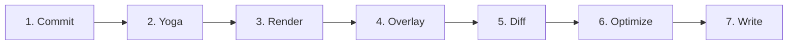
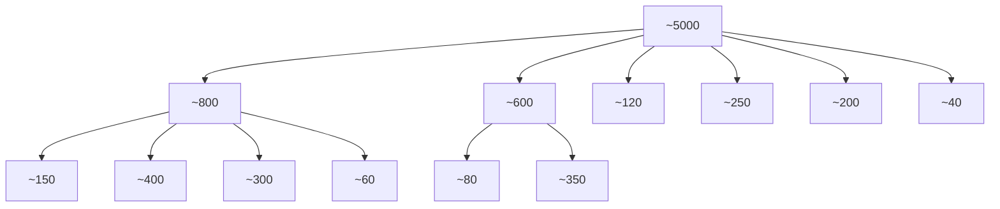
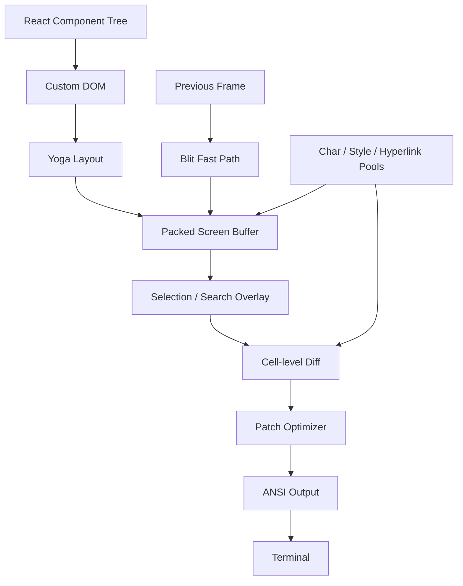

# 第十三章：终端 UI

## 为什么要自定义渲染器？

终端不是浏览器。

它没有：

- DOM；
- CSS Engine；
- Compositor；
- Retained-mode Graphics Pipeline。

终端真正拥有的，只是两股字节流：

```text
stdout：向终端输出字节
stdin：从终端接收字节
```

而这两股字节流之间的一切：

- Layout；
- Styling；
- Diff；
- Hit Testing；
- Scrolling；
- Selection；

都必须自己从零实现。

Claude Code 需要的是一套真正 Reactive 的 UI。

它拥有：

- Prompt Input；
- 流式 Markdown 输出；
- Permission Dialog；
- Progress Spinner；
- 可滚动 Message List；
- Search Highlight；
- Vim-mode Editor。

这种 Component Tree，React 显然非常适合声明。

但问题是：

> React 需要一个 Host Environment 来渲染，而终端本身并不提供。

---

## 从 Ink 到自定义 Rendering Engine

Ink 是 React Terminal UI 的标准答案。

它基于 Yoga 提供 Flexbox Layout。

Claude Code 最初也是从 Ink 开始的。

但后来，它把 Ink Fork 到几乎认不出来。

原因是原版 Ink 的渲染模型无法满足 Claude Code 的性能要求。

### 原版 Ink 的问题

原版 Ink 每一帧、每一个 Cell 都会分配一个 JavaScript Object。

假设 Terminal 是：

```text
200 columns × 120 rows
```

也就是：

```text
24,000 cells
```

如果每 16ms 渲染一帧，相当于：

> 每帧创建并回收 24,000 个对象。

此外，原版 Ink：

- 在 String Level 做 Diff；
- 比较整行 ANSI 编码文本；
- 没有 Blit Optimization；
- 没有 Double Buffer；
- 没有 Cell-level Dirty Tracking。

如果只是一个每秒刷新一次的简单 CLI Dashboard，这完全够用。

但 Claude Code 的情况完全不同。

它需要：

- LLM Token 以 60fps 的节奏不断流入；
- 用户同时可以滚动数百条 Message；
- Markdown、Code Block、Spinner、Highlight 都持续更新。

在这种场景下，原版 Ink 根本撑不住。

---

## Claude Code 的自定义 Rendering Engine

现在 Claude Code 中保留了 Ink 的一些核心思想：

- React Reconciler；
- Yoga Layout；
- ANSI Output。

但关键路径已经完全重写。

主要优化包括：

### Packed Typed Array

不再：

```text
每个 Cell 一个 Object
```

而是使用连续的 Typed Array 表示 Cell。

### Pool-based String Interning

不再每帧重复创建：

- Character String；
- Style String；
- Hyperlink String。

而是放进共享 Pool，Cell 只保存 Integer ID。

### Double-buffer Rendering

同时维护 Front Frame 与 Back Frame。

一边显示，一边渲染下一帧。

### Cell-level Diff

新旧帧按 Cell 比较。

只有真正变化的 Cell 才会写入 Terminal。

### Terminal Write Optimizer

相邻 Patch 会合并。

冗余 Cursor Move 会消除。

最终只输出尽可能少的 ANSI Escape Sequence。

---

## 性能结果

这套引擎可以在：

```text
200-column Terminal
```

中，以：

```text
60 FPS
```

稳定渲染，同时持续接收 Claude Streaming Token。

要理解它是怎么做到的，需要拆成 4 个层次：

1. React Reconciler 所依赖的 Custom DOM；
2. 把 DOM 转换成 Terminal Output 的 Rendering Pipeline；
3. 让数小时 Session 不被 GC 淹没的 Pool-based Memory Management；
4. 把整个 UI 串起来的 Component Architecture。

---

# Custom DOM

React Reconciler 需要一个可以进行 Reconciliation 的对象树。

浏览器里，这棵树是 DOM。

Claude Code Terminal 中，则是一棵自定义 In-memory Tree。

它包含 7 种 Element Type，以及一种 Text Node。

---

## 七种 Element Type

### `ink-root`

整个文档的 Root。

每个 Ink Instance 只有一个。

### `ink-box`

Flexbox Container。

相当于终端中的：

```html
<div>
```

### `ink-text`

文本节点。

它拥有 Yoga Measure Function，用于计算：

- Word Wrap；
- Width；
- Height。

### `ink-virtual-text`

嵌套在另一个 Text Context 中的 Styled Text。

如果 `ink-text` 出现在 Text Context 里面，会自动提升为 `ink-virtual-text`。

### `ink-link`

Hyperlink。

通过：

```text
OSC 8
```

Escape Sequence 渲染。

### `ink-progress`

Progress Indicator。

### `ink-raw-ansi`

已经预先渲染好的 ANSI Content。

它会携带已知尺寸。

主要用于 Syntax-highlighted Code Block。

---

## DOMElement 保存什么

每个 `DOMElement` 都包含 Rendering Pipeline 需要的状态。

```typescript
// 示意，真实接口更复杂
interface DOMElement {
  yogaNode: YogaNode

  style: Styles

  attributes:
    Map<string, DOMNodeAttribute>

  childNodes:
    (DOMElement | TextNode)[]

  dirty: boolean

  _eventHandlers:
    EventHandlerMap

  scrollTop: number

  pendingScrollDelta: number

  stickyScroll: boolean

  debugOwnerChain?: string
}
```

---

## 为什么 `_eventHandlers` 与 `attributes` 分开

这是一个很重要的性能细节。

在 React 中，如果没有手动 Memoize：

> Event Handler 的 Function Identity 往往每次 Render 都会变化。

如果 Handler 也存进普通 Attribute，那么每次 Render 都会让 React 认为：

```text
Attribute Changed
```

于是 Node 会被标记 Dirty，并触发重绘。

Claude Code 把：

```text
_eventHandlers
```

单独存储。

这样 `commitUpdate()` 可以只更新 Handler，而不把 Node 标记 Dirty。

这避免了大量无意义 Repaint。

---

# `markDirty()`：DOM 变更与渲染之间的桥

当某个 Node 内容改变时：

```text
markDirty()
```

会沿 Parent Chain 一路向上。

每个 Ancestor 都会：

```text
dirty = true
```

而 Leaf Text Node 还会调用：

```text
yogaNode.markDirty()
```

这意味着：

> 深层 Text Node 改一个字符，只会污染从它到 Root 的那条路径。

兄弟 Subtree 不会被标脏。

因此下次 Render 时：

- Dirty Path 重新计算；
- Clean Sibling 可以直接从上一帧 Blit。

---

# `ink-raw-ansi`

这个 Element Type 值得单独说。

Syntax Highlighted Code Block 已经是一段完整 ANSI Escape Sequence。

如果每一帧都重新解析它：

1. 拆 ANSI；
2. 找 Character；
3. 找 Style；
4. 再写回 Cell；

会非常浪费。

所以系统直接把它封装成：

```text
ink-raw-ansi
```

并附带：

```text
rawWidth
rawHeight
```

告诉 Yoga：

> 这段内容尺寸就是这么大。

Rendering Pipeline 直接把 Raw ANSI 写入 Output Buffer。

不再拆成单个 Styled Character。

结果是：

> Syntax Highlighting 初次计算很贵，但一旦算完，后续渲染几乎零成本。

UI 中最昂贵的视觉元素之一，反而成为后续 Frame 中最便宜的元素。

---

# `ink-text` 的 Measure Function

`ink-text` 的 Measure Function 会运行在 Yoga Layout Pass 内。

Yoga Layout 是同步且 Blocking 的。

Measure Function 会收到可用 Width，然后必须立即返回文本尺寸。

它需要处理：

- Word Wrapping；
- `wrap`；
- `truncate`；
- `truncate-start`；
- `truncate-middle`；
- Grapheme Cluster；
- Emoji；
- CJK Double-width Character；
- ANSI Escape Code。

例如：

> 一个由多个 Unicode Code Point 组成的 Emoji，不能被拆到两行。

CJK Character 通常占：

```text
2 Columns
```

ANSI Escape Code 虽然有字节长度，但视觉宽度是：

```text
0
```

这些都要正确计算。

而且速度必须非常快。

因为一场 Conversation 如果有：

```text
50 个可见 Text Node
```

一次 Layout Pass 就可能调用 Measure Function：

```text
50 次
```

每个 Node 最好都在 Microsecond 级完成。

---

# React Fiber Container

Custom DOM 与 React 之间的桥梁使用：

```text
react-reconciler
```

也就是 React DOM 和 React Native 使用的同一套底层 API。

Claude Code 使用：

```typescript
createContainer(
  rootNode,
  ConcurrentRoot,
  // ...
)
```

关键点是：

```text
ConcurrentRoot
```

---

## 为什么不用 LegacyRoot

ConcurrentRoot 可以启用：

- Suspense；
- Transition；
- Non-blocking State Update。

例如 Syntax Highlighting 可以 Lazy Load。

Streaming 中的某些 State Update 可以用更低优先级执行。

如果使用 `LegacyRoot`：

> 所有 Render 都会同步进行。

一次重型 Markdown Reparse 就可能 Block Event Loop。

用户输入、Scroll、Token Streaming 都会卡住。

---

# Host Config

React Host Config 会把 React 操作映射到 Custom DOM。

---

## `createInstance(type, props)`

通过：

```text
createNode()
```

创建 `DOMElement`。

然后：

- Apply Initial Style；
- Apply Attribute；
- Attach Event Handler；
- 捕获 React Component Owner Chain。

Owner Chain 保存到：

```text
debugOwnerChain
```

之后 Debug Mode 可以追踪：

> 到底哪个 React Component 引发了 Full-screen Repaint。

---

## `createTextInstance(text)`

只允许在 Text Context 中创建 Text Node。

也就是说，Raw String 必须包在：

```jsx
<Text>
```

里面。

如果在非 Text Context 中直接创建 Text Node，Reconciler 会立刻 Throw。

这样 Bug 会在：

> Reconciliation Time

暴露，而不是拖到 Rendering Time。

---

## `commitUpdate()`

```text
commitUpdate(
  node,
  type,
  oldProps,
  newProps
)
```

会对新旧 Props 做 Shallow Diff。

不同部分拥有独立更新路径：

- Style；
- Attribute；
- Event Handler。

如果没有任何变化，Diff Function 返回：

```text
undefined
```

完全避免 DOM Mutation。

---

## `removeChild()`

移除 Node 后，会递归释放 Yoga Node。

释放前先调用：

```text
unsetMeasureFunc()
```

然后：

```text
free()
```

这样可以避免 WASM Memory 已经释放后，仍然访问旧 Measure Function。

同时还会通知 Focus Manager。

---

## `hideInstance()` / `unhideInstance()`

通过切换：

```text
isHidden
```

并把 Yoga Display 在：

```text
Display.None
Display.Flex
```

之间切换。

这是 React Suspense 做 Fallback Transition 的机制之一。

---

## `resetAfterCommit()`

这是最关键的 Hook。

它会：

1. 调用 `rootNode.onComputeLayout()`；
2. 执行 Yoga；
3. 再调用 `rootNode.onRender()`；
4. 安排 Terminal Paint。

---

# Commit 性能计数器

每次 Commit Cycle 会记录：

```text
lastYogaMs
lastCommitMs
```

这些数据会进入：

```text
FrameEvent
```

最终用于 Production Performance Monitoring。

---

# Event System

Custom DOM 的 Event System 模拟 Browser Capture / Bubble Model。

`Dispatcher` 会执行三个阶段：

```text
Capture
↓
At Target
↓
Bubble
```

Keyboard 和 Click 这类 Event 会被标记为：

```text
Discrete Priority
```

也就是最高优先级，立即处理。

Scroll 和 Resize 属于：

```text
Continuous Priority
```

允许稍微延迟。

所有 Event Processing 会包在：

```text
reconciler.discreteUpdates()
```

中，保证 React 正确 Batch。

---

## Terminal Keyboard Event 真的会“冒泡”

当用户在 Terminal 按下一个 Key：

1. 生成 `KeyboardEvent`；
2. 从 Focused Element 开始；
3. 沿 Custom DOM Tree 向 Root Bubble。

任何 Handler 都可以调用：

```text
stopPropagation()
preventDefault()
```

语义与 Browser DOM 基本一致。

---

# Rendering Pipeline

每一帧会经过 7 个 Stage。

原文中的 Pipeline 可以整理为：



稳态 Frame 中，99% Cell 可以走 Blit Fast-path。

典型情况下，只有 Spinner 的 3 到 4 个 Cell 真正重新 Render。

原文给出的示例 Frame：

```text
Total ≈ 2.3 ms
```

理论最大帧率：

```text
≈ 435 FPS
```

当然实际系统会按 60 FPS 节流。

---

# 为什么每个 Stage 都单独计时

FrameEvent 会记录每个 Stage 的耗时。

当某一帧突然需要：

```text
30 ms
```

时，系统必须知道瓶颈到底在哪里。

可能是：

- Yoga 在重新 Measure 大量 Text；
- Renderer 遍历巨大 Dirty Subtree；
- stdout 遇到 Terminal Backpressure。

不同原因对应完全不同的 Fix。

只有 Stage-level Instrumentation 才能定位。


---

# Rendering Pipeline 的 7 个阶段

## Stage 1：React Commit 与 Yoga Layout

React Reconciler 处理 State Update，然后调用：

```text
resetAfterCommit
```

Root Node 的 Width 会被设置为：

```text
terminalColumns
```

随后执行：

```text
yogaNode.calculateLayout()
```

Yoga 会按照 CSS Flexbox Specification，在一次 Pass 中计算整个 Tree：

- `flex-grow`；
- `flex-shrink`；
- Padding；
- Margin；
- Gap；
- Alignment；
- Wrapping。

结果会缓存到每个 Node 中，例如：

```text
getComputedWidth()
getComputedHeight()
getComputedLeft()
getComputedTop()
```

对于 `ink-text`，Yoga 会在 Layout 过程中调用：

```text
measureTextNode
```

它负责：

- Word Wrap；
- Unicode Grapheme；
- CJK Double-width Character；
- Emoji Sequence；
- ANSI Escape Code。

这是每个 Node 最贵的操作之一。

---

## Stage 2：DOM → Screen

Renderer 会 Depth-first 遍历 DOM Tree。

然后把 Character 与 Style 写进：

```text
Screen
```

Buffer。

每个字符最终都会变成一个 Packed Cell。

一帧结束时：

> Terminal 中的每一个 Cell 都拥有确定的 Character、Style 与 Width。

---

## Stage 3：Overlay

Text Selection 与 Search Highlight 不会重新构造一张新 Screen。

它们直接：

> In-place 修改 Screen Buffer。

### Selection

Selection 会给匹配 Cell 增加：

```text
Inverse Video
```

形成常见的“选中文本”视觉效果。

### Search Highlight

当前匹配项会使用更强的 Style：

```text
inverse
+
yellow foreground
+
bold
+
underline
```

其他 Match 通常只使用 Inverse。

---

## 为什么需要 `prevFrameContaminated`

Overlay 直接修改 Front Frame 的 Buffer。

这意味着上一帧数据已经不再是：

> “纯粹由 DOM Render 出来的真实状态”。

系统会设置：

```text
prevFrameContaminated = true
```

下一帧就不能再直接相信 Previous Screen 来做 Blit。

必须跳过 Blit Fast-path，并执行一次 Full Damage Frame。

这是一个明确 Trade-off：

### 好处

不需要额外 Overlay Buffer。

在：

```text
200 × 120
```

Terminal 上，大约可以节省：

```text
48 KB
```

额外 Buffer。

### 代价

Overlay 清除后的下一帧需要进行更完整 Diff。

---

## Stage 4：Diff

新 Screen 会逐 Cell 与 Front Frame 比较。

一个 Cell 只需要比较两个 Packed `Int32` Word。

也就是说，常见比较大概是：

```text
2 次 Integer Compare / Cell
```

只有真正变化的 Cell 才会产生 Output Patch。

在稳态 Frame 中，例如只有 Spinner 在动：

```text
24,000 Cells
```

中可能只有：

```text
3 Cells
```

变化。

每个 Patch 类似：

```typescript
{
  type: 'stdout',
  content: string,
}
```

其中包含：

- Cursor Move Sequence；
- ANSI-encoded Cell Content。

---

## Stage 5：Optimize

同一 Row 上相邻 Patch 会被合并成一次 Write。

冗余 Cursor Movement 也会被删除。

例如：

```text
Patch N 在 Column 10 结束
Patch N+1 从 Column 11 开始
```

此时 Cursor 本来已经在正确位置。

就不需要额外 Cursor Move Escape Sequence。

---

## Style Transition Cache

Style Transition 也会提前序列化并缓存。

例如：

```text
bold red
→
dim green
```

不是每次重新：

1. Diff Style；
2. Serialize ANSI。

而是直接通过：

```text
StylePool.transition()
```

查找缓存好的 Transition String。

Optimizer 通常可以比 Naive Per-cell Output 减少：

```text
30% - 50%
```

Byte Count。

---

## Stage 6：Write

优化后的 Patch 会被序列化为 ANSI Escape Sequence。

然后通过一次：

```text
stdout.write()
```

写入终端。

如果 Terminal 支持 Synchronized Update Protocol，还会包裹：

```text
BSU
ESU
```

---

## BSU / ESU

BSU：

```text
Begin Synchronized Update
ESC [ ? 2026 h
```

它告诉 Terminal：

> 接下来所有输出先 Buffer，不要立即显示。

ESU：

```text
End Synchronized Update
ESC [ ? 2026 l
```

告诉 Terminal：

> 现在一次性 Flush。

因此整个 Frame 会像 Atomic Update 一样瞬间出现。

这可以消除 Terminal Tearing。

---

# FrameEvent

每一帧都会生成 Performance Event。

```typescript
interface FrameEvent {
  durationMs: number

  phases: {
    renderer: number
    diff: number
    optimize: number
    write: number
    yoga: number
  }

  yogaVisited: number
  yogaMeasured: number
  yogaCacheHits: number

  flickers: FlickerEvent[]
}
```

它记录：

- Renderer 时间；
- Diff 时间；
- Optimize 时间；
- stdout Write 时间；
- Yoga Layout 时间；
- Yoga 遍历 Node 数；
- 实际执行 Measure 的 Node 数；
- Cache Hit 数；
- Full Reset Attribution。

---

## `CLAUDE_CODE_DEBUG_REPAINTS`

开启：

```text
CLAUDE_CODE_DEBUG_REPAINTS
```

后，系统可以把 Full-screen Reset 追踪到具体 React Component。

它使用：

```text
findOwnerChainAtRow()
```

找到某一 Row 背后的 React Owner Chain。

这非常像 Browser React DevTools 中：

```text
Highlight Updates
```

的 Terminal 版本。

目标是回答：

> 到底哪个 Component 让整块 Screen 重绘了？

Full-screen Reset 是 Rendering Pipeline 中最贵的事情之一，因此必须能够定位责任组件。

---

# Blit Optimization

Blit 是最值得关注的优化之一。

如果一个 Node：

1. 当前不是 Dirty；
2. 与上一帧相比位置没有变化；

那么 Renderer 就不会重新 Render 它。

而是：

> 直接把 Previous Screen 对应 Cell Copy 到 Current Screen。

Node Position 会通过 Node Cache 检查。

稳态 Frame 中，Blit 可能覆盖：

```text
99%
```

的 Screen。

例如 Spinner 变化时：

- Conversation 大部分内容直接 Copy；
- 只有 Spinner 的 3～4 个 Cell 真正重新计算。

---

## 三种情况下 Blit 会关闭

### 1. `prevFrameContaminated = true`

Selection 或 Search Overlay 修改过 Front Frame Buffer。

旧 Buffer 不再可信。

### 2. Absolute-positioned Node 被移除

Absolute Positioned Node 可能覆盖并非自己 Sibling 的 Cell。

如果它被删除，那些被覆盖区域必须重新由真正所属 Element Render。

不能简单 Copy 旧内容。

### 3. Layout Shift

任何 Node 当前 Computed Position 与 Cached Position 不同。

此时 Blit 会把旧 Cell Copy 到错误坐标，所以必须重新 Render。

---

# Damage Rectangle

每一张 Screen 都维护：

```text
screen.damage
```

它表示本帧真正写入 Cell 的 Bounding Box。

Diff 不需要遍历整个 Terminal。

只检查 Damage Rectangle 覆盖的 Row。

例如：

```text
Terminal 总共 120 Rows
Streaming Message 位于 Row 80-100
```

那么 Diff 只检查：

```text
20 Rows
```

而不是：

```text
120 Rows
```

相当于大约：

```text
6×
```

减少比较量。

---

# Double-buffer Rendering

Ink Class 同时维护两张 Frame Buffer。

```typescript
private frontFrame: Frame
private backFrame: Frame
```

### `frontFrame`

当前 Terminal 正在显示的 Frame。

### `backFrame`

正在被 Renderer 写入的下一帧。

---

## Frame 包含什么

每个 `Frame` 包含：

```text
screen
viewport
cursor
scrollHint
scrollDrainPending
```

其中：

### `screen`

Packed `Int32Array` Cell Buffer。

### `viewport`

当前 Render 时的 Terminal Size。

### `cursor`

```typescript
{
  x,
  y,
  visible
}
```

Terminal Cursor 最终停放位置。

### `scrollHint`

用于 Alt-screen Mode 的：

```text
DECSTBM
```

Scroll Region Optimization。

### `scrollDrainPending`

表示 ScrollBox 是否还有未消费的 Scroll Delta。

---

## Frame Swap

每次 Render 完成后：

```text
backFrame = frontFrame
frontFrame = newFrame
```

旧 Front Frame 会成为下一次 Render 的 Back Frame。

这样上一帧 Screen 自然就成为：

- Cell Diff Baseline；
- Blit Source。

---

## 为什么 Double Buffer 不是为了“防撕裂”

Graphics Programming 中的 Double Buffer 通常主要用于避免 Tearing。

但 Claude Code 这里，Tearing 已经由：

```text
BSU / ESU
```

处理。

真正的重要原因是：

> 避免每 16ms 创建一个新的 Screen Object。

一个 Screen 至少包含：

```text
48KB+
```

Typed Array。

如果每帧都创建并抛弃：

- GC Pressure 会迅速上升；
- Long Session 更容易卡顿。

Double Buffer 只需要交换 Pointer。

没有新 Screen Allocation。

---

# Frame Scheduling

Render Scheduling 使用 Lodash：

```text
throttle
```

时间间隔：

```text
16ms
```

大约对应：

```text
60 FPS
```

代码类似：

```typescript
const deferredRender =
  () => queueMicrotask(
    this.onRender,
  )

this.scheduleRender =
  throttle(
    deferredRender,
    FRAME_INTERVAL_MS,
    {
      leading: true,
      trailing: true,
    },
  )
```

---

## 为什么还要 `queueMicrotask`

这是有意安排。

`resetAfterCommit()` 会发生在 React Layout Effect Phase 之前。

如果 Renderer 在这里同步执行，它就可能错过：

> Component 在 `useLayoutEffect()` 中声明的 Cursor Position。

通过 `queueMicrotask()`：

- Layout Effect 先完成；
- 同一个 Event Loop Tick 内再 Render Terminal；
- 最终 Terminal 看到的是一张一致 Frame。

---

# Scroll Fast Path

Scroll 使用另一条路径。

它用大约：

```text
4ms
```

的 `setTimeout`。

也就是：

```text
FRAME_INTERVAL_MS >> 2
```

让 Scroll Frame 更快响应。

更关键的是：

> Scroll Mutation 直接绕过 React。

`ScrollBox.scrollBy()` 会：

1. 直接修改 DOM Node Property；
2. 调用 `markDirty()`；
3. 用 Microtask Schedule Render。

不会：

- set React State；
- Reconcile Message List；
- 重新渲染整个 Component Tree。

对于 Mouse Wheel 这种可能每秒数百次的事件，这非常重要。

---

# Resize Handling

Terminal Resize 不做 Debounce。

而是：

> 同步立即处理。

`handleResize()` 会马上更新 Dimension，保持 Layout 一致。

在 Alt-screen Mode 中：

- Frame Buffer 会 Reset；
- `ERASE_SCREEN` 不会立刻输出；
- 它会延迟到下一次 BSU/ESU Atomic Paint。

如果立即 ERASE：

> Screen 会先变成空白，然后等大约 80ms 新 Frame 才出现。

延迟到 Atomic Paint 后：

- Old Content 会一直保留；
- New Frame 完全准备好后才一起切换。

视觉体验明显更好。

---

# Alternate Screen

`AlternateScreen` Component 会在 Mount 时进入：

```text
DEC 1049
```

Alternate Screen Buffer。

并把 Height 限制在 Terminal Rows。

它使用：

```text
useInsertionEffect
```

而不是：

```text
useLayoutEffect
```

原因是 Escape Sequence：

```text
ENTER_ALT_SCREEN
```

必须在第一帧 Paint 之前到达 Terminal。

如果使用 `useLayoutEffect`：

1. 第一帧可能先画到 Main Screen；
2. 然后才切 Alt Screen；
3. 用户会看到明显 Flash。

`useInsertionEffect` 更早执行，因此切换是无缝的。

---

# Pool-based Memory：为什么 Interning 很重要

一个：

```text
200 × 120
```

Terminal 有：

```text
24,000 Cells
```

如果每个 Cell 都是普通 JS Object，并包含：

```text
char: string
style: string
hyperlink: string
```

那么每 Frame 会产生：

```text
24,000 Objects
+
72,000 String References / Allocations
```

以 60 FPS 计算：

```text
≈ 5.76 million allocations / second
```

V8 GC 虽然能处理，但不可避免会出现暂停。

典型 GC Pause：

```text
1 - 5ms
```

而且发生时间不可预测。

如果刚好撞上 Streaming Token Update，用户就会看到明显 Stutter。

---

# Packed Cell

Claude Code 用 Packed Typed Array 消除绝大多数 Per-frame Object Allocation。

每个 Cell 使用两个：

```text
Int32
```

Word。

```text
word0:
charId
32 bits

word1:
styleId[31:17]
|
hyperlinkId[16:2]
|
width[1:0]
```

整个 Screen 使用连续：

```text
Int32Array
```

存储。

---

## `BigInt64Array` View

同一块 Buffer 还会建立：

```text
BigInt64Array
```

View。

这样可以做高效 Bulk Operation。

例如 Clear Row，可以直接：

```text
fill()
```

64-bit Word。

无需逐字段清零。

---

# CharPool

CharPool 把 Character String Intern 成 Integer ID。

ASCII 有一条专门 Fast Path。

内部使用：

```text
128-entry Int32Array
```

直接通过 Character Code 查 Pool Index。

避免：

```text
Map
```

Lookup。

示意代码：

```typescript
export class CharPool {
  private strings: string[] =
    [' ', '']

  private ascii:
    Int32Array =
      initCharAscii()

  intern(char: string):
    number {

    if (char.length === 1) {
      const code =
        char.charCodeAt(0)

      if (code < 128) {
        const cached =
          this.ascii[code]!

        if (cached !== -1) {
          return cached
        }

        const index =
          this.strings.length

        this.strings.push(char)
        this.ascii[code] =
          index

        return index
      }
    }

    // Multi-byte Character
    // 走 Map Fallback
  }
}
```

Pool 中：

```text
Index 0 = space
Index 1 = empty string
```

Emoji 与 CJK 等 Multi-byte Character 则走：

```text
Map<string, number>
```

Fallback。

---

# StylePool

StylePool 把 ANSI Style Code Array Intern 成 Integer ID。

更巧妙的是：

> Style ID 的 Bit 0 被拿来编码“这个 Style 是否会让 Space Cell 产生可见效果”。

例如：

- Background Color；
- Inverse；
- Underline；

即使 Character 是 Space，仍然会产生视觉效果。

而只有 Foreground Color 的 Style，Space 通常不可见。

因此：

```text
Foreground-only Style
→ Even ID

Visible-on-space Style
→ Odd ID
```

Renderer 就可以用一个极便宜的 Bitmask 判断：

```typescript
if (
  !(styleId & 1) &&
  charId === 0
) {
  continue
}
```

无需再查 Style Definition。

---

## Transition Cache

StylePool 还会缓存任意两个 Style ID 之间的 ANSI Transition String。

例如：

```text
bold red
→
dim green
```

后续只需要 String Lookup。

不用重复计算 Style Diff。

---

# HyperlinkPool

HyperlinkPool Intern：

```text
OSC 8 URI
```

为 Integer ID。

其中：

```text
Index 0 = no hyperlink
```

---

# 为什么三个 Pool 必须跨 Frame 共享

CharPool、StylePool、HyperlinkPool 都由：

```text
frontFrame
backFrame
```

共享。

这是关键设计。

因为 ID 在多个 Frame 之间保持有效：

### Blit

可以直接 Copy Packed Cell Word。

无需：

1. 根据旧 ID 查 String；
2. 再把 String Intern 到新 Pool。

### Diff

可以直接比较 Integer ID。

不需要 String Comparison。

如果每 Frame 有自己的 Pool，那么 Blit 就会退化成大量 Re-intern，几乎抵消优化收益。

---

# Pool Reset

Long Session 中，Pool 会持续增长。

即使某些 Character / Style 已经不再被任何 Live Cell 使用，它们仍然会留在 Pool。

因此系统大约每：

```text
5 分钟
```

重置一次 Pool。

流程：

1. 创建 Fresh Pool；
2. 遍历 Front Frame 的 Live Cell；
3. 把仍然存活的 Character / Style / Link 重新 Intern；
4. Old Pool 交给 GC。

这是一种 Application-level Generational Collection。

因为 JavaScript GC 并不知道：

> Pool Entry 在语义上是否已经死亡。

---

# CellWidth

Double-wide Character 需要 2-bit Classification。

| Value | 含义 |
|---:|---|
| `0` | Narrow，普通单列字符 |
| `1` | Wide，CJK / Emoji Head，占两列 |
| `2` | SpacerTail，Wide Character 的第二列 |
| `3` | SpacerHead，Soft-wrap Continuation Marker |

这个值直接存在：

```text
word1
```

最低 2 Bit。

常见 Width Check 几乎免费。

---

# Parallel Metadata Array

其他 Cell Metadata 不塞进 Packed Cell。

而是放在 Parallel Array 中。

### `noSelect: Uint8Array`

标记某个 Cell 不应该进入 Text Selection。

例如：

- Border；
- Indicator；
- UI Chrome。

复制文本时，这些内容不会进入 Clipboard。

### `softWrap: Int32Array`

每 Row 记录是否是 Word-wrap Continuation。

用户跨 Soft-wrap Line 选中文本时：

> 不应该在视觉换行处额外插入 `\n`。

### `damage: Rectangle`

记录本 Frame 真正写入 Cell 的 Bounding Box。

Diff 只处理 Damage 区域。

这种 Parallel Array 设计避免扩大 Packed Cell Width，从而保持 Diff Inner Loop 的 Cache Locality。

---

# `createScreen()`

`Screen` 通过：

```text
createScreen()
```

创建。

传入：

- Dimensions；
- Shared Pool Reference。

初始化时，会通过 `BigInt64Array` View：

```text
fill(0n)
```

一次 Native Call 清空完整 Buffer。

这通常只需要 Microseconds。

主要用于：

- Resize；
- Pool Migration。


---

# REPL Component

REPL 位于：

```text
REPL.tsx
```

代码规模大约：

```text
5,000 lines
```

它是整个代码库中最大的单个 Component。

原因也很简单：

> 整个交互体验几乎都从这里流过。

---

## REPL 的九个主要区域

大致可以分成 9 个部分。

### 1. Imports

大约 100 行。

引入：

- Bootstrap State；
- Commands；
- History；
- Hooks；
- Components；
- Keybindings；
- Cost Tracking；
- Notifications；
- Swarm / Team；
- Voice Integration。

### 2. Feature-flagged Imports

某些模块使用：

```text
feature()
+
require()
```

按条件加载，例如：

- Voice Integration；
- Proactive Mode；
- Brief Tool；
- Coordinator Agent。

### 3. State Management

大量：

```text
useState
```

管理：

- Messages；
- Input Mode；
- Pending Permission；
- Dialog；
- Cost Threshold；
- Session State；
- Tool State；
- Agent State。

### 4. QueryGuard

负责 Active API Call Lifecycle。

避免多个请求同时运行并互相踩状态。

### 5. Message Handling

处理 Query Loop 产出的 Message：

- Normalize Order；
- Streaming State；
- Message Insertion；
- Result Update。

### 6. Tool Permission Flow

把：

```text
tool_use
```

和：

```text
PermissionRequest Dialog
```

连接起来。

### 7. Session Management

处理：

- Resume；
- Switch；
- Export Conversation。

### 8. Keybinding Setup

包括：

```text
KeybindingSetup
GlobalKeybindingHandlers
CommandKeybindingHandlers
```

### 9. Render Tree

把前面所有 State 和 Handler 组合成最终 Terminal UI。

---

# REPL Component Tree

Fullscreen Mode 下，大致结构如下：



其中 Hot Path 主要包括：

- REPL；
- VirtualMessageList；
- StreamingMarkdown；
- PromptInput；
- MultiLineEditor。

---

# `OffscreenFreeze`

这是一个非常 Terminal-specific 的性能优化。

当 Message Scroll 到 Viewport 之外时：

- React Element 会被 Cache；
- Subtree 会被冻结。

为什么？

因为离屏 Message 中可能仍然有：

- Spinner；
- Elapsed Time Counter；
- Timer-based Component。

如果这些 Component 继续 Tick，它们仍然会触发 React Update。

即使用户已经在看 Message 47：

> Message 3 中一个 Spinner 也可能让整个 Terminal Reset。

`OffscreenFreeze` 会阻止这种无意义更新。

---

# React Compiler

整个 Component Tree 都经过 React Compiler。

因此代码中不需要大量手写：

```text
useMemo
useCallback
```

Compiler 会自动插入 Expression-level Memoization。

生成代码大致像：

```typescript
const $ = _c(14)

let t0

if (
  $[0] !== dep1 ||
  $[1] !== dep2
) {
  t0 =
    expensiveComputation(
      dep1,
      dep2,
    )

  $[0] = dep1
  $[1] = dep2
  $[2] = t0
} else {
  t0 = $[2]
}
```

这里：

```text
14
```

代表 Memoization Slot 数量。

---

## 为什么比手写 `useMemo` 更细

传统 `useMemo` 是 Hook-level Memoization。

React Compiler 可以做到：

> Render Function 中每个 Expression 独立追踪 Dependency。

对于一个：

```text
5,000-line REPL Component
```

这可以避免每次 Render 中数百次不必要的重新计算。

---

# Text Selection 与 Search Highlight

Selection 和 Search Highlight 都作为：

> Screen-buffer Overlay

实现。

也就是说：

```text
DOM Render 完成
    ↓
Screen Buffer 完成
    ↓
Overlay 直接改 Cell Style
    ↓
Diff
```

---

## Text Selection

只在 Alt-screen Mode 中支持。

Ink Instance 会维护：

```text
SelectionState
```

其中包含：

- Anchor；
- Focus；
- Drag Mode；
- 已滚出 Screen 的 Captured Row。

Drag Mode 包括：

```text
character
word
line
```

用户 Click + Drag 时，Selection Handler 会更新这些 Coordinate。

Render 时：

```text
applySelectionOverlay()
```

会遍历受影响 Row。

然后通过：

```text
StylePool.withSelectionBg()
```

生成加入 Inverse Video 的 Style ID。

---

## 为什么 Selection 会污染 Previous Frame

Overlay 是直接 In-place 改：

```text
Screen Buffer
```

的。

所以 Front Frame 已经不再代表纯 DOM 输出。

系统因此必须设置：

```text
prevFrameContaminated
```

下一帧不能依赖它做 Blit。

---

# Mouse Tracking

Terminal Mouse 使用：

```text
SGR 1003 Mode
```

它能够上报：

- Click；
- Drag；
- Motion；
- Column；
- Row。

---

## Double Click 与 Triple Click

`App` Component 自己实现 Multi-click Detection。

### Double Click

选择 Word。

### Triple Click

选择整行。

判断使用：

```text
500ms Timeout
```

和：

```text
1-cell Position Tolerance
```

也就是说，两次 Click 之间 Mouse 移动 1 个 Cell 仍然算同一组 Multi-click。

---

## Hyperlink Click 为什么延迟 500ms

这是为了保持与 Text Editor 类似的体验。

如果用户在 Link 上 Double Click：

> 应该优先选择这个 Word，而不是第一次 Click 就立刻打开 Browser。

因此 Hyperlink Open 会等待 Multi-click Detection Window。

---

# Lost-release Recovery

Terminal Mouse 有一个麻烦问题。

用户可能：

1. 在 Terminal 内按下鼠标；
2. Drag 到 Window 外；
3. 在 Window 外 Release。

Terminal 会收到：

```text
Press
Drag
```

但收不到：

```text
Release
```

如果不修复，Selection 会永远停留在 Drag State。

恢复机制是：

> 如果当前处于 Drag State，却收到一个“没有任何 Button Pressed 的 Mouse Motion Event”，就推断用户已经在窗口外 Release。

然后自动 Finalize Selection。

---

# Search Highlight

Search Highlight 有两条并行机制。

---

## Scan-based Path

```text
applySearchHighlight()
```

直接扫描 Visible Cell，寻找 Query String。

匹配后应用：

```text
SGR inverse
```

Style。

---

## Position-based Path

另一条路径使用预先计算的：

```text
MatchPosition[]
```

这些 Position 来自：

```text
scanElementSubtree()
```

并以 Message-relative Coordinate 保存。

系统可以直接在已知位置应用 Highlight。

当前 Match 使用：

```text
inverse
+
yellow foreground
+
bold
+
underline
```

---

## 为什么 Yellow Foreground 会像 Yellow Background

因为 ANSI：

```text
inverse
```

会交换 Foreground 与 Background。

因此：

```text
yellow foreground + inverse
```

视觉上会变成：

> Yellow Background。

Underline 则作为额外 Fallback。

如果用户 Theme 与 Yellow 冲突，Underline 仍然可以标识当前 Match。

---

# Cursor Declaration

Terminal Emulator 的 IME，也就是 Input Method Editor，会把 Preedit Text 显示在：

> Physical Cursor Position。

对于 CJK 用户输入中文、日文、韩文时，这很关键。

如果 Cursor 被停在 Screen Bottom，而不是 Input Caret 位置，IME Candidate / Composition Text 就会出现在错误位置。

Claude Code 使用：

```text
useDeclaredCursor
```

允许某个 Component 声明：

> 这一帧结束后 Physical Cursor 应该停在哪里。

Ink Class 会：

1. 从 `nodeCache` 读取 Declared Node Position；
2. 转换为 Screen Coordinate；
3. 在 Diff 后输出 Cursor Move Sequence。

---

## Accessibility

Physical Cursor 不只服务 IME。

很多：

- Screen Reader；
- Magnifier；

也会跟踪 Terminal Cursor。

因此这套机制同时改善 Accessibility。

---

## Main Screen 与 Alt Screen 的差异

### Main-screen Mode

Declared Cursor Position 与：

```text
frame.cursor
```

分开管理。

原因是 Main-screen 的 Log Update 依赖 Relative Move Invariant。

Frame Cursor 需要停在 Content Bottom。

### Alt-screen Mode

更简单。

每帧一开始都会：

```text
CSI H
```

Cursor Home。

最终只需输出一次 Absolute Declared Cursor Position。

---

# Streaming Markdown

渲染 LLM Output 是 Terminal UI 最困难的工作之一。

Token 可能以：

```text
10 - 50 tokens / second
```

持续到达。

每一个 Token 都会改变当前 Message Content。

而 Message 可能包含：

- Code Block；
- List；
- Bold；
- Inline Code；
- Link；
- Markdown Structure。

最天真的方式是：

> 每来一个 Token，把整条 Message 重新 Parse 一次。

如果 Message 长度不断增长，这会非常昂贵。

Claude Code 使用 3 类主要优化。

---

## 1. Token Cache

Module-level LRU Cache 保存：

```text
marked.lexer()
```

结果。

Cache Size：

```text
500 entries
```

Key 使用：

```text
Content Hash
```

这个 Cache 在 React Component Unmount / Remount 之间仍然存在。

因此用户 Scroll 离开一条 Message，再 Scroll 回来时：

> 不需要重新 Parse Markdown。

可以直接复用之前 Token。

---

## 2. Fast-path Detection

```text
hasMarkdownSyntax()
```

会检查 Content 前：

```text
500 characters
```

使用一次 Regex 判断是否出现 Markdown Marker。

如果没有 Markdown Syntax：

> 不进入完整 GFM Parser。

系统直接构造一个 Single Paragraph Token。

对于 Plain Text Message，每 Render 大约可以节省：

```text
≈ 3ms
```

在 60fps 场景下，这不是小数字。

---

## 3. Lazy Syntax Highlighting

Code Block Highlight 使用 React：

```text
Suspense
```

Lazy Load。

`MarkdownBody` 会先：

```text
highlight = null
```

立即渲染 Plain Code。

Highlight Library 异步加载完成后，再重新 Render Color Version。

用户体验变成：

```text
代码立即出现
↓
一两帧后出现颜色
```

而不是：

```text
空白 300ms
↓
代码突然出现
```

---

# Streaming Case 的复杂性

流式生成时，Markdown Content 持续增长。

如果每个 Token 都 Full Parse：

```text
O(n²)
```

总成本会非常高。

Fast Path 能解决大量 Plain Text Streaming。

对于真正包含：

- Code Block；
- List；

的 Message，LRU Cache 才是关键。

Cache Key 使用 Content Hash。

当 10 个 Token 到达，只有尾部 Paragraph 改变时，未改变 Prefix 的 Parse Result 可以复用。

Renderer 只需要重新 Parse Changed Tail。

---

# `StreamingMarkdown` 与 `Markdown` 分开

Claude Code 没有用一个 Component 同时处理：

- 正在生成；
- 已完成。

而是分成：

```text
StreamingMarkdown
Markdown
```

---

## StreamingMarkdown

需要容忍不完整 Syntax。

例如：

### 未关闭 Code Fence

```markdown
```typescript
const x =
```

暂时还没有 Closing Fence。

### Partial Bold Marker

```text
**hel
```

### Truncated List Item

```text
- this is still
```

Streaming Parser 不能把这些情况当作 Error。

因为：

> Closing Syntax 可能下一秒就会到达。

---

## Static Markdown

Message Streaming 完成后，会切换到普通：

```text
Markdown
```

Component。

此时可以执行完整 GFM Parse，并使用更严格 Syntax Rule。

---

# Syntax Highlighting 的真实成本

Code Highlight 是 Rendering Pipeline 中最贵的单 Element 操作之一。

一个：

```text
100-line Code Block
```

可能需要：

```text
50 - 100ms
```

来 Highlight。

加载：

```text
cli-highlight
```

Library 本身还可能需要：

```text
200 - 300ms
```

因为它包含几十种 Language Grammar。

如果同步做，完全会打爆：

```text
16ms Frame Budget
```

所以这两部分都藏在 Suspense 后面。

---

# 应用这些设计：如何高效渲染 Streaming Output

这套 Terminal Rendering Pipeline，本质上是在不断：

> 消灭工作。

它有几个非常值得迁移的原则。

---

## 原则一：Intern Everything

如果某个值会在几千个 Cell 中重复出现，例如：

- Style；
- Character；
- URL；

不要复制它。

只保存一次，然后 Cell 使用 Integer ID。

Integer Comparison 通常是一条 CPU Instruction。

String Comparison 则需要遍历内容。

当 Inner Loop 每帧运行：

```text
24,000 次
```

并且系统目标是：

```text
60fps
```

Integer 与 String 的差别就会直接变成：

> Smooth Scroll 与 Visible Lag 的差别。

---

## 原则二：在正确的层级做 Diff

Cell-level Diff 看起来很贵：

```text
24,000 Comparisons / Frame
```

但每个 Cell 其实只有：

```text
2 次 Integer Compare。
```

稳态 Frame 中，大部分 Row 很快就能确认没有变化。

替代方案如果是：

> 每帧重新 Render Full Screen，然后全部写 stdout，

可能会产生：

```text
100KB+
```

ANSI Escape Sequence。

而 Cell Diff 的实际 Output 通常：

```text
< 1KB
```

---

## 原则三：把 Hot Path 从 React 中移出来

Mouse Scroll 可能每秒产生数百个 Event。

如果每一次都走：

```text
React State Update
→ Reconciliation
→ Commit
→ Layout
→ Render
```

可能每次增加：

```text
5 - 10ms
```

Latency。

Claude Code 直接：

- Mutate DOM Node；
- `markDirty()`；
- Microtask Schedule Render。

因此 Scroll Path 可以控制在：

```text
< 1ms
```

React 只在最终 Paint 时参与。

---

## 这些原则不限于 Terminal

同样适用于：

- Web Log Viewer；
- Chat Client；
- Realtime Monitoring Dashboard；
- Streaming Data UI。

通用方法仍然是：

- Intern 重复值；
- 与上一 Frame Diff；
- Hot Path 尽量绕开 Reactive Framework。

---

## 原则四：长期 Session 要周期清理

Pool 是 Monotonic Growth 的。

Long Session 中，新 Character 与 Style 会不断加入。

旧 Entry 即使已经没有任何 Live Cell 引用，也不会自动从 Pool 消失。

因此 Claude Code 每：

```text
5 minutes
```

重建一次 Pool。

只迁移 Front Frame 真正仍然存活的 Entry。

这相当于：

> Application-level Generational Collection。

JavaScript GC 管理 Object Life。

但它不知道 Pool 中哪个 Entry 在“语义上”已经死了。

所以 Application 必须自己做。

---

# Typed Array 的另一个优势：Memory Locality

使用：

```text
Int32Array
```

不只是为了减少 GC。

还有 CPU Cache Locality。

Diff 24,000 Cell 时，系统会顺序扫描一段连续内存。

Modern CPU 可以提前 Prefetch Sequential Access。

很多比较会直接在：

```text
L1 / L2 Cache
```

完成。

如果每 Cell 是 Heap Object：

> Object 会散落在 Heap 各处。

每次比较都更容易触发 Cache Miss。

原文给出的性能对比是：

### Typed Array Diff

```text
200 × 120 Screen
< 0.5ms
```

### Object-based Diff

```text
3 - 5ms
```

这几毫秒已经足够影响 16ms Frame Budget。

---

## 原则五：Track Damage Bounds

固定 Grid Rendering 中，应追踪：

> 本帧到底哪一片区域真正变化。

`damage` Rectangle 保存本帧写入 Cell 的 Bounding Box。

如果 Streaming Message 只占：

```text
120 Rows 中最后 20 Rows
```

Diff 就只检查 20 Rows。

配合 Blit：

- Blit 区域不会扩大 Damage；
- 只有真正 Re-render Region 进入 Damage。

所以常见场景：

> 一条 Message Streaming，其他 Conversation 静止。

只会触碰 Screen Buffer 的一小部分。

---

# 更大的性能原则：不要让操作变快，要让操作消失

这套 Rendering System 最深的经验并不是：

> 把某一个 Function 优化到极致。

而是：

> 直接让某一类工作不再发生。

例如：

### Blit

消灭：

```text
重新 Render Clean Subtree
```

### Damage Rectangle

消灭：

```text
Diff Unchanged Region
```

### Shared Pool

消灭：

```text
每帧 Re-intern
```

### Packed Cell

消灭：

```text
Per-cell Object Allocation
```

这些优化不是简单相加。

而是会相互叠加，形成乘法效应。

---

# 性能数字

原文给出一个很直观的对比。

## Worst-case Frame

条件：

- 全部 Dirty；
- 没有 Blit；
- Full-screen Damage。

在：

```text
200 × 120
```

Terminal 上大约：

```text
12ms
```

仍然低于 16ms Frame Budget。

## Best-case Frame

条件：

- 一个 Dirty Node；
- 其他全部 Blit；
- 只有 3 Row Damage。

耗时：

```text
< 1ms
```

而系统绝大多数时间都运行在接近 Best Case 的区域。

---

## Streaming 一个 Token 时，真正贵的是什么

Token 到达后：

1. 当前 Text Node Dirty；
2. Ancestor 一路 Dirty 到 Message Container；
3. 通常只影响 Screen 的 10 到 30 Row；
4. 其他 90 到 110 Row 直接 Blit；
5. Damage Rectangle 限制 Diff；
6. Pool Lookup 都是 Integer Operation。

所以 Streaming Token 的稳态成本，真正主要来自：

- Yoga 重新 Measure Dirty Text；
- Markdown Reparse。

而不是：

> Terminal Rendering Pipeline 本身。

这说明整个 Rendering Engine 的目标已经基本实现：

> 把“把东西画出来”这件事，压缩到足够便宜，让真正的瓶颈回到内容计算本身。

---

# 本章总结

Claude Code 的 Terminal UI 不是简单地：

> “用 React 在 Terminal 里画点东西。”

它实际上拥有一套接近轻量 Graphics Engine 的架构。

核心结构可以概括为：



它最重要的性能策略包括：

- Custom React Host；
- ConcurrentRoot；
- Dirty Path；
- Blit；
- Damage Rectangle；
- Double Buffer；
- Packed Typed Array；
- Character / Style / Hyperlink Interning；
- 60fps Throttle；
- Scroll Fast Path；
- Suspense Lazy Highlighting；
- Streaming Markdown Cache；
- Offscreen Freeze。

真正的设计主题其实只有一个：

> **尽量不要做没有必要的工作。**

如果 Node 没变，就不要 Render。

如果 Region 没变，就不要 Diff。

如果 Character 已经出现过，就不要重新分配 String。

如果 Scroll 不需要 React，就不要进入 Reconciler。

如果 Syntax Highlight 还没加载，就先显示 Plain Text，而不是让用户等。

最终，一个可能连续运行数小时、持续 Streaming Token、同时包含复杂 Markdown、Code Block、Search、Selection 和 Vim Editing 的 Terminal UI，才能保持顺滑。

这套架构的价值也不局限于 Terminal。

任何 Realtime Streaming UI 都可以借鉴同一个思路：

> 不是不停寻找“更快的计算”，而是不断寻找“哪些计算根本可以不做”。
