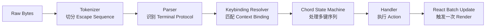
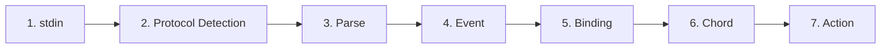
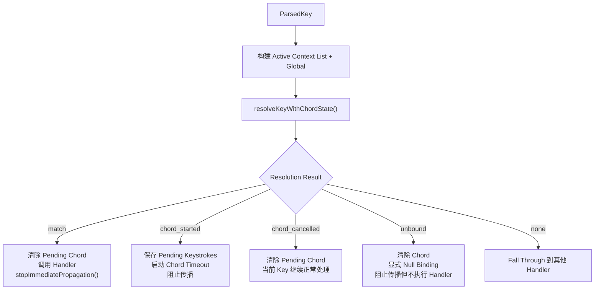
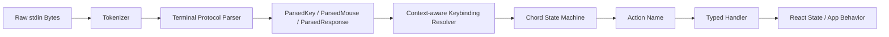

# 第十四章：输入与交互

> 原文：[Ch 14. Input and Interaction](https://claude-code-from-source.com/ch14-input-interaction/)


## 从原始字节到有意义的动作

当你在 Claude Code 中先按：

```text
Ctrl+X
```

再按：

```text
Ctrl+K
```

终端实际上只是发送了两段相隔大约 200 毫秒的字节序列。

第一段：

```text
0x18
```

也就是 ASCII：

```text
CAN
```

第二段：

```text
0x0B
```

也就是 ASCII：

```text
VT
```

这些字节本身并不携带“杀掉所有子智能体”这样的语义。

它们只表示：

> 控制字符。

真正的 Input System 必须识别：

1. 这两个控制字符在一个 Timeout Window 内连续到达；
2. 它们共同构成一个 Chord：

```text
ctrl+x ctrl+k
```

3. 该 Chord 映射到 Action：

```text
chat:killAgents
```

4. Action 最终终止所有正在运行的 Sub-agent。

---

## 一次按键背后经过了六套系统

从原始 Byte 到 Agent 被 Kill，中间至少有六层处理。



真正困难的地方，不是其中某一个模块特别复杂。

而是：

> Terminal Ecosystem 本身极其碎片化。

---

## Terminal 多样性带来的组合爆炸

不同 Terminal 会发送不同编码。

例如：

### iTerm2

可能发送 Kitty Keyboard Protocol Sequence。

### macOS Terminal

可能发送传统 VT220 Sequence。

### Ghostty over SSH

可能发送：

```text
xterm modifyOtherKeys
```

### tmux

可能：

- 吞掉；
- 转换；
- Passthrough；

其中任意一类 Sequence，具体取决于配置。

### Windows Terminal

在 VT Mode 上还有自己的边缘行为。

Input System 最终都必须把这些输入统一转换成正确的：

```text
ParsedKey
```

用户不应该需要知道：

> 自己当前的 Terminal 到底使用哪一种 Keyboard Protocol。

---

## 设计哲学：Progressive Enhancement + Graceful Degradation

Claude Code 的策略是：

> **能力允许时尽量增强，能力不足时优雅退化。**

在支持 Kitty Keyboard Protocol 的现代 Terminal 上，可以获得：

- 完整 Modifier Detection；
- 区分 `Ctrl+Shift+A` 与 `Ctrl+A`；
- Super / Cmd Key Reporting；
- 无歧义 Key Identification。

而在 Legacy Terminal + SSH 场景下，系统会退回最佳可用协议。

可能损失某些 Modifier Distinction，但核心能力仍然保留。

用户不会看到：

```text
Unsupported Terminal
```

这样的错误。

最多只是某些 Shortcut 不可用。

例如：

```text
ctrl+shift+f
```

可能无法用于 Global Search。

但：

```text
ctrl+r
```

History Search 仍然可以正常使用。

---

# Key Parsing Pipeline

Input 从：

```text
stdin
```

以 Byte Chunk 形式进入。

整体流水线可以表示为：



支持的 Keybinding Context 一共有 16 个。

例如：

```text
Global
Chat
Autocomplete
Confirmation
Scroll
Transcript
HistorySearch
Task
Help
MessageSelector
MessageActions
DiffDialog
Select
Settings
Tabs
Footer
```

---

# Tokenizer：最底层基础

Terminal Input 是一条连续 Byte Stream。

里面混杂：

- Printable Character；
- Control Code；
- Multi-byte Escape Sequence。

而且没有明确 Framing。

一次：

```text
stdin.read()
```

可能完整收到：

```text
\x1b[1;5A
```

也可能被拆成：

```text
\x1b
```

和：

```text
[1;5A
```

两次 Read。

这取决于：

- PTY；
- Scheduler；
- Byte Arrival Timing。

因此 Tokenizer 必须维护自己的 State Machine。

它会：

1. Buffer 不完整 Escape Sequence；
2. 判断是否已经完整；
3. 完整后再产出 Token。

---

## Escape Key 与 Escape Sequence 的歧义

看到单独：

```text
\x1b
```

时，系统无法立即知道它表示：

### 情况 A

用户真的按了：

```text
Escape
```

### 情况 B

它只是一个 CSI / Escape Sequence 的开头。

因此系统会：

1. 暂存 `\x1b`；
2. 启动一个约：

```text
50ms
```

的 Timer；
3. 如果没有后续 Byte，就把它当作 Escape Key；
4. 如果后续 Byte 到达，就继续组合 Sequence。

---

## 为什么 Flush 前还要检查 `stdin.readableLength`

假设 Event Loop 被某个任务阻塞超过 50ms。

实际上后续 Byte 已经进入 Kernel Buffer，只是 JavaScript 还没来得及 Read。

如果 Timer 到期就直接把：

```text
\x1b
```

Flush 成 Escape，就会错误拆分。

因此 Flush 前，Tokenizer 会检查：

```text
stdin.readableLength
```

如果 Kernel Buffer 中还有 Byte，Timer 会重新 Arm，而不是立刻 Flush。

这处理了：

> Event Loop Delay 导致的假 Timeout。

---

## Paste 使用更长 Timeout

普通 Escape Sequence 使用：

```text
50ms
```

左右 Timeout。

但 Paste 可能很大，而且分多块到达。

因此 Paste Timeout 延长到：

```text
500ms
```

---

# React Batching：Paste 100 字符只 Render 一次

一次 `stdin.read()` 中解析出来的所有 Key，会统一放进：

```text
reconciler.discreteUpdates()
```

中处理。

这样可以把 React State Update 批量合并。

假设用户 Paste：

```text
100 characters
```

如果每个 Character 都单独触发：

```text
State Update
→ Reconciliation
→ Commit
→ Yoga Layout
→ Render
→ Diff
→ Write
```

而每轮大约 5ms，那么：

```text
100 × 5ms = 500ms
```

Paste 会明显卡顿。

Batch 之后，只需要：

```text
一次约 5ms 的 Cycle
```

---

# stdin 管理

`App` Component 使用：

> Reference Counting

管理 Raw Mode。

任何 Component 需要 Raw Input 时都会调用：

```text
setRawMode(true)
```

Counter 加一。

不需要时调用：

```text
setRawMode(false)
```

Counter 减一。

只有 Counter 回到：

```text
0
```

时，才真正关闭 Raw Mode。

---

## 为什么必须 Reference Count

否则会出现经典 Terminal Bug：

```text
Component A 开启 Raw Mode
Component B 也开启 Raw Mode
Component A 关闭 Raw Mode
```

如果系统使用全局 Boolean：

```text
rawMode = false
```

那么 B 还在使用时，Input 突然就坏了。

Reference Count 可以正确表示：

> 到底还有多少 Consumer 依赖 Raw Mode。

---

# 第一次开启 Raw Mode 时发生什么

系统会依次：

1. 停止 Bootstrap 阶段的 Early Input Capture；
2. 设置 stdin Raw Mode；
3. 关闭 Line Buffering；
4. 关闭 Echo；
5. 关闭默认 Signal Processing；
6. Attach `readable` Listener；
7. 开启 Bracketed Paste；
8. 开启 Focus Reporting；
9. 开启 Extended Key Reporting；
10. 启用 Kitty Keyboard Protocol 与 xterm modifyOtherKeys。

关闭时，这些步骤按相反顺序撤销。

---

## 为什么关闭顺序重要

Extended Key Reporting 必须先关闭，再退出 Raw Mode。

否则 Terminal 可能继续发送 Kitty-encoded Sequence，而应用已经不再使用对应 Parser。

这会导致：

> Escape Sequence 泄漏到普通 Shell。

---

# 异常退出时的 Terminal Cleanup

系统通过：

```text
signal-exit
```

注册 `onExit` Handler。

即使进程因为：

```text
SIGTERM
SIGINT
```

等情况突然退出，也会尝试：

- Disable Raw Mode；
- Restore Terminal State；
- Exit Alternate Screen；
- Show Cursor。

如果没有这个 Cleanup，一个崩溃的 Claude Code 可能把 Terminal 留在：

```text
Raw Mode
No Cursor
No Echo
```

状态。

用户甚至看不到自己输入了什么，只能盲打：

```bash
reset
```

恢复。

---

# Multi-Protocol Support

Terminal 并不统一 Keyboard Encoding。

Claude Code 同时处理 5 类 Protocol / Input Family。

目的是：

> 不论用户在现代 Terminal、Legacy Terminal、SSH、tmux 还是 Windows 上，都尽量得到统一的 ParsedKey。

---

# 1. CSI u：Kitty Keyboard Protocol

这是现代 Keyboard Protocol。

格式：

```text
ESC [ codepoint [; modifier] u
```

例如：

```text
ESC[13;2u
```

表示：

```text
Shift+Enter
```

而：

```text
ESC[27u
```

表示没有 Modifier 的：

```text
Escape
```

Key Codepoint 本身可以明确识别按键。

因此不存在：

> Escape Key 和 Escape Sequence Prefix 的歧义。

Modifier Word 通过 Bit 编码：

- Shift；
- Alt；
- Ctrl；
- Super / Cmd。

---

## Kitty Protocol 的启用与检测

Startup 时，支持的 Terminal 会收到：

```text
ENABLE_KITTY_KEYBOARD
```

Exit 时发送：

```text
DISABLE_KITTY_KEYBOARD
```

系统还会发送 Query：

```text
CSI ? u
```

Terminal 返回：

```text
CSI ? flags u
```

`flags` 表示支持的 Protocol Level。

这是标准的 Query / Response Handshake。

---

# 2. xterm `modifyOtherKeys`

这是 Kitty 没有协商成功时的重要 Fallback。

典型使用场景：

- Ghostty over SSH；
- tmux；
- xterm；
- 环境变量没有完整透传的远程终端。

格式：

```text
ESC [ 27 ; modifier ; keycode ~
```

注意参数顺序与 CSI u 不同。

这里是：

```text
modifier
```

在：

```text
keycode
```

之前。

这是 Parser Bug 的高发点。

该模式可以通过：

```text
CSI > 4 ; 2 m
```

启用。

---

# 3. Legacy Terminal Sequence

这一层覆盖几十年 Terminal 历史积累下来的各种 Sequence：

- Function Key；
- Arrow Key；
- Numpad；
- Home；
- End；
- Insert；
- Delete；
- VT100；
- VT220；
- xterm Variation。

Parser 主要使用两个 Regex。

### `FN_KEY_RE`

匹配：

```text
ESC O
ESC N
ESC [
ESC [[
```

等 Function / Arrow Sequence 与 Modifier Variation。

### `META_KEY_CODE_RE`

匹配：

```text
ESC + 单个字母或数字
```

这是传统：

```text
Alt+key
```

编码。

---

## Legacy Protocol 最大问题：Ambiguity

例如：

```text
ESC [ 1 ; 2 R
```

根据上下文，可能表示：

- Shift+F3；
- Cursor Position Report。

Claude Code 使用 Private Marker 来区分。

Cursor Position Report 使用：

```text
CSI ? row ; col R
```

注意带：

```text
?
```

而 Modified Function Key 使用：

```text
CSI params R
```

没有 Private Marker。

因此系统会请求：

```text
DECXCPR
```

Extended Cursor Position Report，而不是标准 CPR。

Extended Form 更不容易歧义。

---

# Terminal Identification

Startup 时，Claude Code 会发送：

```text
XTVERSION
```

Query：

```text
CSI > 0 q
```

Terminal 返回类似：

```text
DCS > | name ST
```

这可以拿到 Terminal Name 与 Version。

---

## 为什么不用 `TERM_PROGRAM`

因为：

```text
TERM_PROGRAM
```

是 Environment Variable。

SSH 通常不会完整 Forward。

而 XTVERSION Response 是真正的 Terminal Protocol Response，可以穿过 SSH。

知道 Terminal Identity 后，Parser 就可以处理特定实现差异。

例如：

```text
xterm.js
```

也就是 VS Code Integrated Terminal，行为与 Native xterm 并不完全一样。

它返回的标识类似：

```text
xterm.js(X.Y.Z)
```

Parser 可以据此做 Quirk Handling。

---

# 4. SGR Mouse Event

Mouse Event 使用格式：

```text
ESC [ < button ; col ; row M/m
```

其中：

```text
M = press
m = release
```

Button Code：

```text
0 / 1 / 2
```

分别表示：

- Left；
- Middle；
- Right。

Wheel：

```text
64 / 65
```

Drag / Motion 会在 Code 中 OR 额外 Bit。

---

## Mouse Event 最终变成什么

Wheel Event 会被转换成：

```text
ParsedKey
```

这样 Scroll 可以直接走 Keybinding System。

Click 与 Drag 则变成：

```text
ParsedMouse
```

并送到 Selection Handler。

---

# 5. Bracketed Paste

Paste Content 会被 Terminal 包裹在：

```text
ESC [200~
```

与：

```text
ESC [201~
```

之间。

这中间的所有内容会被系统识别成：

```text
一个 ParsedKey
```

并标记：

```text
isPasted: true
```

无论内部包含什么 Escape Sequence，都不会再按 Keybinding 解释。

---

## 为什么 Bracketed Paste 是安全功能

假设用户 Paste 的 Code Snippet 中恰好包含 Byte：

```text
\x03
```

而这个 Byte 在普通 Raw Input 中代表：

```text
Ctrl+C
```

如果没有 Bracketed Paste，它可能错误触发：

```text
Interrupt
```

或者其他 Command。

而有了：

```text
isPasted: true
```

Keybinding Resolver 会跳过 Binding Matching。

Paste 永远按：

> Literal Text Input

处理。

---

# Parser 输出类型

最终 Parser 会把输入统一转换成一个干净的 Discriminated Union。

```typescript
type ParsedKey = {
  kind: 'key'

  name: string

  ctrl: boolean
  meta: boolean
  shift: boolean
  option: boolean
  super: boolean

  sequence: string

  isPasted: boolean
}

type ParsedMouse = {
  kind: 'mouse'

  button: number

  action:
    'press' | 'release'

  col: number
  row: number
}

type ParsedResponse = {
  kind: 'response'

  response:
    TerminalResponse
}
```

---

## `kind` Discriminant 的价值

Downstream Code 必须显式处理：

```text
key
mouse
response
```

这可以避免：

- Key 被误处理成 Mouse；
- Terminal Response 被误当作 Keypress。

---

## 为什么保存 Raw `sequence`

`ParsedKey` 会保留原始：

```text
sequence
```

用于 Debug。

当用户报告：

> Ctrl+Shift+A 没反应。

日志可以直接显示：

> Terminal 实际发送了哪些 Byte。

这样可以快速判断 Bug 位于：

- Terminal Encoding；
- Parser；
- Keybinding Config。

---

# TerminalResponse

Parser 还会识别 Terminal 自己对 Query 的 Response。

例如：

```typescript
type TerminalResponse =
  | {
      type: 'decrpm'
      mode: number
      status: number
    }
  | {
      type: 'da1'
      params: number[]
    }
  | {
      type: 'da2'
      params: number[]
    }
  | {
      type: 'kittyKeyboard'
      flags: number
    }
  | {
      type: 'cursorPosition'
      row: number
      col: number
    }
  | {
      type: 'osc'
      code: number
      data: string
    }
  | {
      type: 'xtversion'
      version: string
    }
```

它们不会进入普通 Input Handler。

而是路由到：

```text
TerminalQuerier
```

---

# Modifier Decoding

XTerm Convention 中，Modifier Word 计算方式为：

```text
1
+ (shift ? 1 : 0)
+ (alt ? 2 : 0)
+ (ctrl ? 4 : 0)
+ (super ? 8 : 0)
```

其中：

```text
meta
```

对应 Alt / Option。

```text
super
```

是独立字段，对应：

- macOS Cmd；
- Windows Super / Win。

这一区分很重要。

很多传统 Protocol 根本无法传递 Cmd-modified Key。

而 Kitty Protocol 可以明确报告 Super Modifier。

---

# stdin Gap Detector

如果超过：

```text
5 seconds
```

没有 Input，然后重新出现输入，系统会重新 Assert Terminal Mode。

这是为了处理：

- tmux Detach / Reattach；
- Laptop Sleep / Wake；
- Multiplexer / OS 重置 Keyboard Mode。

Re-assert 时会重新发送：

```text
ENABLE_KITTY_KEYBOARD
ENABLE_MODIFY_OTHER_KEYS
Bracketed Paste Enable
Focus Reporting Enable
```

否则：

> tmux 重新 Attach 后，Keyboard Protocol 可能静默退回 Legacy Mode。

用户的 Modifier Shortcut 会莫名其妙失效。

---

# Terminal I/O Layer

Parser 下面还有一层更结构化的 I/O Subsystem：

```text
ink/termio/
```

主要文件包括：

### `csi.ts`

Control Sequence Introducer。

负责：

- Cursor Movement；
- Erase；
- Scroll Region；
- Bracketed Paste；
- Focus Event；
- Kitty Keyboard Enable / Disable。

### `dec.ts`

DEC Private Mode。

负责：

- Alternate Screen Buffer 1049；
- Mouse Tracking 1000 / 1002 / 1003；
- Cursor Visibility；
- Bracketed Paste 2004；
- Focus Event 1004。

### `osc.ts`

Operating System Command。

负责：

- Clipboard，OSC 52；
- Tab Status；
- iTerm2 Progress Indicator；
- tmux / screen Multiplexer Wrapping。

### `sgr.ts`

Select Graphic Rendition。

负责 ANSI：

- Color；
- Bold；
- Italic；
- Underline；
- Inverse。

### `tokenize.ts`

Stateful Tokenizer。

负责 Escape Sequence Boundary Detection。

---

# Multiplexer Wrapping

Claude Code 运行在 tmux 中时，某些 Escape Sequence 必须穿透 tmux，到达外层 Terminal。

例如 Kitty Keyboard Negotiation。

tmux 使用：

```text
DCS Passthrough
```

格式类似：

```text
ESC P ... ST
```

转发它自己不理解的 Sequence。

`wrapForMultiplexer()` 会检测 Multiplexer Environment，并进行正确包装。

如果没有这层：

> Kitty Keyboard Mode 在 tmux 内可能静默失败。

用户只会看到：

> Ctrl+Shift Shortcut 不工作。

但不知道为什么。

---

# Event System

`ink/events/` 提供类似 Browser 的 Event Model。

支持：

- `KeyboardEvent`
- `ClickEvent`
- `FocusEvent`
- `InputEvent`
- `TerminalFocusEvent`
- Base `TerminalEvent`

每个 Event 都拥有：

```text
target
currentTarget
eventPhase
```

以及：

```text
stopPropagation()
stopImmediatePropagation()
preventDefault()
```

---

## Legacy EventEmitter 与新 DOM Event 并存

`InputEvent` 包装 `ParsedKey`，主要用于兼容旧的 EventEmitter Path。

新 Component 使用 DOM-style Keyboard Dispatch。

同一个 ParsedKey 会同时产生：

- 一个 `InputEvent` 给 Legacy Listener；
- 一个 `KeyboardEvent` 给 DOM-style Dispatcher。

这样可以逐步 Migration。

不用一次性重写所有 Component。

关键不变量是：

> stdin 中一次 Keypress，只会生成一个 ParsedKey。

两条 Event Path 都来自同一个 ParsedKey，因此不会出现语义分叉。


---

# Keybinding System

Keybinding System 把三个经常纠缠在一起的问题拆开：

1. 哪个 Key 触发哪个 Action；
2. Action 真正执行什么；
3. 当前哪些 Binding 应该生效。

也就是：

```text
Bindings
Handlers
Contexts
```

---

## Binding：声明式配置

默认 Binding 定义在：

```text
defaultBindings.ts
```

中。

结构是：

```text
KeybindingBlock[]
```

每一块都绑定到某个 Context。

例如：

```typescript
export const DEFAULT_BINDINGS:
  KeybindingBlock[] = [
  {
    context: 'Global',

    bindings: {
      'ctrl+c': 'app:interrupt',
      'ctrl+d': 'app:exit',
      'ctrl+l': 'app:redraw',
      'ctrl+r': 'history:search',
    },
  },

  {
    context: 'Chat',

    bindings: {
      'escape': 'chat:cancel',

      'ctrl+x ctrl+k':
        'chat:killAgents',

      'enter': 'chat:submit',

      'up':
        'history:previous',

      'ctrl+x ctrl+e':
        'chat:externalEditor',
    },
  },

  // ... 还有 14 个 Context
]
```

---

# Platform-specific Binding

不同平台的 Shortcut 差异会在 Binding Definition 阶段处理。

例如：

### Image Paste

macOS / Linux：

```text
ctrl+v
```

Windows：

```text
alt+v
```

因为 Windows 的：

```text
ctrl+v
```

通常被系统 Paste 占用。

### Mode Cycling

支持 VT Mode 的 Terminal：

```text
shift+tab
```

某些 Windows Terminal 场景：

```text
meta+m
```

Feature Flag 控制的 Binding，例如：

- Quick Search；
- Voice Mode；
- Terminal Panel；

也会在 Definition 阶段按条件加入。

---

# 用户自定义 Keybinding

用户可以通过：

```text
~/.claude/keybindings.json
```

覆盖默认 Binding。

Parser 支持多个 Modifier Alias。

例如：

```text
ctrl
control
```

表示同一个 Modifier。

Alt / Option：

```text
alt
opt
option
```

Cmd / Super：

```text
cmd
command
super
win
```

---

## Key Alias

例如：

```text
esc
```

会 Normalize 成：

```text
escape
```

```text
return
```

会 Normalize 成：

```text
enter
```

---

## Chord Notation

使用空格分隔 Step。

例如：

```text
ctrl+k ctrl+s
```

---

## `null` Action：显式 Unbind

用户可以设置：

```json
{
  "ctrl+t": null
}
```

这和：

> 根本没有定义 `ctrl+t`

不是一回事。

`null` 表示：

> 明确禁止默认 Binding 生效。

这很重要。

如果用户想把某个 Key 还给 tmux 或其他 Terminal Tool，就需要这种 Escape Hatch。

---

# Context：16 个活动范围

每一个 Context 代表一种 Interaction Mode。

| Context | 何时 Active |
|---|---|
| Global | 永远 |
| Chat | Prompt Input 获得 Focus |
| Autocomplete | Completion Menu 显示 |
| Confirmation | Permission Dialog 显示 |
| Scroll | Alt-screen 可滚动内容 |
| Transcript | Read-only Transcript Viewer |
| HistorySearch | `ctrl+r` Reverse Search |
| Task | 有 Background Task 运行 |
| Help | Help Overlay 显示 |
| MessageSelector | Rewind Dialog |
| MessageActions | Message Cursor Navigation |
| DiffDialog | Diff Viewer |
| Select | Generic Selection List |
| Settings | Config Panel |
| Tabs | Tab Navigation |
| Footer | Footer Indicator |

---

## 每次按键都重新构建 Context List

当 Key 到达时，Resolver 会根据当前 React Component State 构建 Active Context List。

然后：

1. 加上 Global；
2. Deduplicate；
3. 保留 Priority Order；
4. 查找 Matching Binding。

“Last Matching Binding Wins”。

因此用户 Override 可以自然压过 Default。

Context List 最多只有 16 个 String。

每次 Keypress 重建成本非常低。

因此系统不需要额外 Subscription Mechanism 来同步 Context。

---

# Nested Modal

Context 设计很好地解决了 Nested Modal。

假设某个 Background Task 正在运行。

因此：

```text
Task
```

Context Active。

此时弹出 Permission Dialog。

于是：

```text
Confirmation
```

也 Active。

两者都有某个 Key Binding 时，Confirmation 拥有更高优先级。

例如：

```text
y
```

会触发：

> Approve Permission。

而不是 Task Context 中的其他 Action。

Dialog 关闭后：

```text
Confirmation
```

自动失活。

Task Binding 恢复。

不需要写：

```text
if (dialogOpen && key === 'y') ...
```

这样的 Modal-specific Conditional Soup。

---

# Reserved Shortcut

并不是所有 Key 都能 Rebind。

系统分成 3 个 Reservation Tier。

---

## 1. Non-rebindable

Hardcoded Behavior。

包括：

```text
ctrl+c
ctrl+d
ctrl+m
```

### `ctrl+c`

Interrupt / Exit。

### `ctrl+d`

Exit。

### `ctrl+m`

在所有 Terminal 中基本与 Enter 等价。

重绑定会破坏 Enter 语义。

---

## 2. Terminal-reserved

系统会发 Warning。

包括：

```text
ctrl+z
ctrl+\
```

它们通常对应：

```text
SIGTSTP
SIGQUIT
```

理论上可以配置，但很多 Terminal 会在应用看到之前截获。

---

## 3. macOS-reserved

这些会直接报 Error。

例如：

```text
cmd+c
cmd+v
cmd+x
cmd+q
cmd+w
cmd+tab
cmd+space
```

这些 Shortcut 被 OS 截获，不会进入 Terminal Application。

允许用户配置它们，只会制造一个：

> 永远不会触发的 Binding。

所以加载配置时直接拒绝更合理。

---

# Key Resolution Flow

一个 Key 到达后的完整流程如下。



---

## Last Wins 的好处

假设 Default Binding 和 User Binding 都在：

```text
Chat
```

Context 定义：

```text
ctrl+k
```

Resolver 会按照 Definition Order 遍历，并保留最后一个 Match。

因此 User Binding 胜出。

这种策略不是启动时简单构造一张 Override Map，而是在 Match Time 解析。

优势是：

> Context-specific Override 可以自然组合。

用户可以只覆盖：

```text
Chat 中的 Enter
```

而不影响：

```text
Confirmation 中的 Enter
```

---

# Chord Support

```text
ctrl+x ctrl+k
```

属于 Chord。

它不是单键 Binding 的简单变体，而是一套需要时间状态的 Multi-step Interaction。

Resolver 使用显式 State Machine 管理。

---

## Chord State Machine

Key 到达时：

1. 追加到当前 Pending Chord Prefix；
2. 检查是否有任何 Binding 以这个 Prefix 开头；
3. 如果有，返回：

```text
chord_started
```

4. 如果完整 Chord 精确 Match，返回：

```text
match
```

5. 如果 Prefix 不再匹配任何 Chord，返回：

```text
chord_cancelled
```

---

# `ChordInterceptor`

Chord Wait State 时：

```text
ChordInterceptor
```

会拦截全部 Input。

Timeout：

```text
1000ms
```

如果第二个 Key 1 秒内没到，Chord Cancel。

第一段 Prefix 被丢弃。

---

## 为什么用 `pendingChordRef`

`KeybindingContext` 提供：

```text
pendingChordRef
```

用于同步读取 Chord State。

原因是 React State Update 是异步传播的。

如果第一个 Key 设置 Pending State 后，第二个 Key 极快到达，有可能第二个 Event 比 React 更新更早执行。

使用 Ref 可以保证：

> 第二个 Key 立即看到第一个 Key 已经进入 Pending Chord。

这是避免 Timing Bug 的关键。

---

# 为什么 `ctrl+x` 是好 Prefix

如果把：

```text
kill agents
```

绑定成：

```text
ctrl+k
```

会和 Readline 的：

```text
kill to end of line
```

冲突。

用户在 Terminal Text Input 中已经形成肌肉记忆。

使用：

```text
ctrl+x
```

作为 Prefix，类似 Emacs / Readline 自己的 Chord Convention。

这样就获得一块不容易与单键 Editing Shortcut 冲突的 Namespace。

---

# Chord Cancellation 的边缘行为

假设用户先按：

```text
ctrl+x
```

然后输入：

```text
a
```

而 `ctrl+x a` 并不是任何 Chord。

一个粗糙实现可能会：

1. ChordInterceptor 吞掉 `a`；
2. 发现 Chord 不匹配；
3. Cancel；
4. `a` 也消失了。

Claude Code 不这么做。

它会：

- 丢弃无效 Chord Prefix；
- 让不匹配的 `a` 继续进入普通 Input Processing。

结果：

> 用户只损失 `ctrl+x` Prefix，不会损失真正输入的 Character。

这与 Emacs-style Chord Prefix 的用户预期一致。

---

# Vim Mode

## State Machine

Vim Mode 使用纯状态机实现，并通过 TypeScript 做 Exhaustive Checking。

Type 本身就是 Documentation。

```typescript
export type VimState =
  | {
      mode: 'INSERT'
      insertedText: string
    }
  | {
      mode: 'NORMAL'
      command: CommandState
    }

export type CommandState =
  | {
      type: 'idle'
    }
  | {
      type: 'count'
      digits: string
    }
  | {
      type: 'operator'
      op: Operator
      count: number
    }
  | {
      type: 'operatorCount'
      op: Operator
      count: number
      digits: string
    }
  | {
      type: 'operatorFind'
      op: Operator
      count: number
      find: FindType
    }
  | {
      type: 'operatorTextObj'
      op: Operator
      count: number
      scope: TextObjScope
    }
  | {
      type: 'find'
      find: FindType
      count: number
    }
  | {
      type: 'g'
      count: number
    }
  | {
      type: 'operatorG'
      op: Operator
      count: number
    }
  | {
      type: 'replace'
      count: number
    }
  | {
      type: 'indent'
      dir: '>' | '<'
      count: number
    }
```

这是一个拥有 12 个 Variant 的 Discriminated Union。

---

## Exhaustive Checking

TypeScript 会强制所有：

```text
switch (CommandState.type)
```

处理全部 Variant。

如果未来新增一种 State，但某个 Switch 没处理：

> Compile Error。

这意味着 State Machine 很难出现：

- Dead State；
- Missing Transition。

类型系统会提前阻止。

---

## Impossible State 无法表示

每个 State 只携带下一步真正需要的数据。

例如：

### `operator`

只保存：

- Operator；
- Count。

### `operatorCount`

再增加：

- Digits。

### `operatorTextObj`

增加：

- Scope。

而 `find` State 不会携带 Operator，因为它根本没有 Pending Operator。

这使很多潜在 Bug 从：

> Runtime Validation

提前变成：

> Type System Impossible。

---

# Vim Transition Example

从：

```text
idle
```

开始。

按：

```text
d
```

进入：

```text
operator
```

再按：

```text
w
```

执行：

```text
delete + w motion
```

也就是：

```text
dw
```

如果按：

```text
d
```

两次：

```text
dd
```

执行 Line Delete。

如果：

```text
d2w
```

流程是：

```text
idle
→ d
→ operator
→ 2
→ operatorCount
→ w
→ delete next 2 words
```

如果：

```text
di"
```

则进入 Text Object Flow：

```text
delete inside quotes
```

每个中间状态只保存下一步所需 Context。

---

# Transition 作为 Pure Function

核心：

```text
transition()
```

会根据当前 State Type，分派到大约 10 个 Handler。

每个 Handler 返回：

```typescript
type TransitionResult = {
  next?: CommandState

  execute?: () => void
}
```

注意：

> Side Effect 不会在 Transition Function 内直接执行。

而是作为 Closure 返回。

---

## 为什么这样设计

Transition Function 可以保持 Pure：

```text
输入：
State + Key

输出：
Next State + Optional Effect
```

测试时只需要：

1. 喂 State；
2. 喂 Key；
3. Assert Next State。

Effect Closure 可以不执行。

因此 State Machine 不直接依赖：

- Editor State；
- Cursor Position；
- Buffer Content。

这些细节会在创建 Effect Closure 时 Capture。

这大幅提高可测试性。

---

# `fromIdle`

`fromIdle` 是 Vim Normal Mode 的主入口。

覆盖完整 Vim Vocabulary。

---

## Count Prefix

```text
1-9
```

进入：

```text
count
```

并累计 Digit。

`0` 比较特殊。

如果当前还没有 Count Digit：

```text
0
```

表示：

> Move to start of line。

只有已经有 Digit 时，0 才继续作为 Count。

---

## Operator

```text
d
c
y
```

进入：

```text
operator
```

等待 Motion 或 Text Object。

---

## Find

```text
f
F
t
T
```

进入：

```text
find
```

等待搜索 Character。

---

## G Prefix

```text
g
```

进入：

```text
g
```

State。

用于：

```text
gg
gj
gk
```

等复合 Command。

---

## Replace

```text
r
```

进入：

```text
replace
```

等待 Replacement Character。

---

## Indent

```text
>
<
```

进入：

```text
indent
```

例如：

```text
>>
<<
```

---

## Simple Motion

例如：

```text
h
j
k
l
w
b
e
W
B
E
0
^
$
```

立即移动 Cursor。

---

## Immediate Command

包括：

```text
x
~
J
p
P
D
C
Y
G
.
;
,
u
i
I
a
A
o
O
```

分别覆盖：

- Delete Char；
- Toggle Case；
- Join Line；
- Paste；
- Operator Shortcut；
- Go End；
- Dot Repeat；
- Find Repeat；
- Undo；
- Enter Insert Mode。

---

# Motion

Motion 是 Pure Function：

```text
Key
+
Cursor
+
Count
→
New Cursor Position
```

核心函数：

```text
resolveMotion()
```

它会应用 Motion `count` 次。

如果 Cursor 已经无法继续移动，就提前 Stop。

例如：

```text
3w
```

在 Line End，不会异常 Wrap。

而是在最后一个可到达 Word 停住。

---

# Motion 与 Operator 的三种 Range Semantics

## Exclusive

默认。

Destination Character 不包含在 Range 中。

例如：

```text
dw
```

删除到下一个 Word 开头之前。

不会删除下一个 Word 的首 Character。

## Inclusive

例如：

```text
e
E
$
```

Destination Character 包含在 Range。

例如：

```text
de
```

会删除到当前 Word 最后一个 Character。

## Linewise

例如：

```text
j
k
G
gg
gj
gk
```

与 Operator 组合时，Range 自动扩展为完整 Line。

例如：

```text
dj
```

会删除当前行和下一行。

不是只删两点之间的 Character。

---

# Operator

主要 Operator：

```text
delete
change
yank
```

### Delete

删除 Text，并保存进 Register。

### Change

删除 Text，然后进入 Insert Mode。

### Yank

只复制，不修改。

---

## `cw` 特例

Vim Convention 中：

```text
cw
```

并不完全等同于：

```text
c + w motion
```

它会到当前 Word End。

而不是像 `dw` 那样走到 Next Word Start。

Claude Code 也遵循这个惯例。

---

# `[Image #N]` Chip Snapping

一个很有意思的边缘处理。

如果 Word Motion 落进：

```text
[Image #3]
```

这类 Visual Chip 中间，Range 会自动扩展覆盖完整 Chip。

用户视觉上把它看作一个不可分割 Unit。

因此系统不允许：

> 删除半个 Image Reference。

Motion Layer 会把整个 Chip 当作一个 Word。

---

# Text Object

Text Object 的问题是：

> Cursor 当前“位于什么东西里面”？

---

## Word Object

包括：

```text
iw
aw
iW
aW
```

系统会按 Grapheme Segment Text，并分类成：

- Word Character；
- Whitespace；
- Punctuation。

### `i`

Inner，只选 Word 本身。

### `a`

Around，会包含周围 Whitespace。

优先取 Trailing Whitespace。

如果在 Line End，再退回 Leading Whitespace。

### Uppercase `W`

把任何连续 Non-whitespace Sequence 当成一个 Word。

不再按 Punctuation 分段。

---

## Quote Object

包括：

```text
i"
a"
i'
a'
i`
a`
```

在当前 Line 中寻找 Quote Pair。

Pair 按出现顺序配对：

```text
第 1 和第 2 个
第 3 和第 4 个
……
```

如果 Cursor 在某一对 Quote 之间，就选择它。

### `a`

包含 Quote Character。

### `i`

不包含 Quote Character。

---

## Bracket Object

包括：

```text
ib
i(
ab
a(
i[
a[
iB
i{
aB
a{
i<
a<
```

系统会使用 Depth Tracking 做匹配。

从 Cursor 向外搜索，维护 Nesting Count。

例如：

```text
foo((bar))
```

在 `bar` 里面执行：

```text
di(
```

正确删除：

```text
bar
```

而不是：

```text
(bar)
```

---

# Persistent State 与 Dot-repeat

Vim 还有一份跨 Command 保留的：

```text
PersistentState
```

它才是 Vim “像 Vim”的关键。

```typescript
interface PersistentState {
  lastChange:
    RecordedChange

  lastFind: {
    type: FindType
    char: string
  }

  register: string

  registerIsLinewise:
    boolean
}
```

---

## `lastChange`

每个 Mutating Command 都会记录为：

```text
RecordedChange
```

例如：

- Insert；
- Operator + Motion；
- Operator + Text Object；
- Operator + Find；
- Replace；
- Delete Char；
- Toggle Case；
- Indent；
- Open Line；
- Join。

`.` Command 会 Replay：

```text
lastChange
```

在当前 Cursor Position 重复同一编辑。

---

## `lastFind`

支持：

```text
;
,
```

### `;`

重复上一次 Find，方向相同。

### `,`

重复上一次 Find，但方向相反。

例如执行：

```text
fa
```

寻找下一个 `a`。

之后：

```text
;
```

继续向前找下一个 `a`。

而：

```text
,
```

会反向找前一个 `a`。

---

## Register

Yank 与 Delete 的 Text 会进入：

```text
register
```

如果 Register Content 以：

```text
\n
```

结尾，则：

```text
registerIsLinewise = true
```

这会改变 Paste Semantics。

### `p`

Linewise Content 插入当前行下方。

### `P`

插入当前行上方。

而不是简单插在 Cursor 前后。

---

# Virtual Scrolling

Long Session 会产生非常长的 Conversation。

Heavy Debugging Session 可能有：

```text
200+ Messages
```

每条都可能包含：

- Markdown；
- Code Block；
- Tool Result；
- Permission Record。

如果全部同时 Mount：

- React 会维护 200+ Component Subtree；
- DOM Tree 会有数千 Node；
- 每个 Node 还有 State / Effect / Memo Cache；
- Yoga 每 Frame 都要访问大量节点。

Terminal 会变得不可用。

---

# `VirtualMessageList`

它只 Render：

> Viewport 中可见 Message + 上下少量 Buffer。

例如几百条 Message 的 Conversation：

### 无 Virtualization

可能 Mount：

```text
500 React Subtrees
```

### 有 Virtualization

可能只有：

```text
15
```

这对：

- Markdown Parsing；
- Syntax Highlight；
- Yoga Layout；

都是数量级差异。

---

## VirtualMessageList 维护什么

### Height Cache

每条 Message 的 Height。

Terminal Column Count 变化时会 Invalidated。

### Jump Handle

用于 Transcript Search。

支持：

- Jump to Index；
- Next Match；
- Previous Match。

### Search Text Extraction

进入：

```text
/
```

Search 时，会提前 Warm Cache，把所有 Message 转成 Lowercase Search Text。

### Sticky Prompt Tracking

用户 Scroll 离开 Input 后，最后一次 Prompt Text 会显示在顶部作为 Context。

### Message Actions Navigation

提供 Cursor-based Message Selection，用于 Rewind Feature。

---

# `useVirtualScroll`

它根据：

```text
scrollTop
viewportHeight
cumulative message heights
```

计算：

> 当前到底应该 Mount 哪些 Message。

同时给 `ScrollBox` 设置 Clamp Bounds。

---

## 为什么需要 Clamp Bounds

Virtualized List 有一个经典 Race：

```text
连续 scrollTo
↓
Scroll Position 跑得比 React Async Render 更快
↓
目标内容还没 Mount
↓
出现空白 Screen
```

Clamp Bound 可以阻止 Scroll Window 越过当前 Virtual DOM 可表示范围。

避免 Blank Screen。

---

# Virtual Scroll 与 Markdown Cache 配合

Message Scroll 出 Viewport：

```text
React Subtree Unmount
```

Scroll 回来：

```text
React Subtree Remount
```

如果每次 Remount 都重新：

```text
marked.lexer()
```

用户来回滚动就会反复 Parse Markdown。

第 13 章中的 Module-level LRU Cache 正好解决这个问题。

它：

```text
500 entries
```

按 Content Hash Cache Token。

因此同一 Unique Message Content 最多 Parse 一次。

---

# `ScrollBox` Imperative API

通过：

```text
useImperativeHandle
```

暴露以下能力。

### `scrollTo(y)`

Absolute Scroll。

同时退出 Sticky-scroll Mode。

### `scrollBy(dy)`

把 Delta 累积到：

```text
pendingScrollDelta
```

由 Renderer 以受限速度 Drain。

### `scrollToElement(el, offset)`

通过：

```text
scrollAnchor
```

把 Position Read 延迟到 Render Time。

### `scrollToBottom()`

重新开启 Sticky-scroll Mode。

### `setClampBounds(min, max)`

限制 Virtual Scroll Window。

---

# Scroll Mutation 继续绕过 React

所有 Scroll Mutation 都直接改 DOM Node Property。

然后：

```text
scheduleRender()
```

不走 React Reconciler。

同时：

```text
markScrollActivity()
```

会告诉 Background Interval：

> 当前正在执行 Latency-sensitive Scroll，请让一帧。

例如 Spinner / Timer 在下一次 Tick 前会检查这个 Flag。

如果 Scroll Active，就延迟一帧。

这是一种 Cooperative Scheduling。

结果是：

> 即使后台有多个 Spinner 与 Timer，Scroll 仍然保持顺滑。

---

# 应用这些设计：Context-aware Keybinding System

Claude Code 的 Keybinding Architecture 很适合迁移到：

- Editor；
- IDE；
- Drawing Tool；
- Terminal Multiplexer；
- 任何 Modal Input Application。

核心原则如下。

---

## 原则一：Bindings 与 Handlers 分开

Binding 是 Data：

```text
哪个 Key
→
哪个 Action Name
```

Handler 是 Code：

```text
Action 真正做什么
```

分离以后：

- Binding 可以存 JSON；
- 用户可以自定义；
- Handler 留在拥有 State 的 Component 中。

例如用户可以把：

```text
ctrl+k
```

重新绑定到：

```text
chat:submit
```

完全不需要改 Component Code。

---

## 原则二：Context 必须是一等概念

不要维护一张 Flat Keymap。

应该定义多个可以动态 Active / Inactive 的 Context。

Dialog 打开：

```text
Confirmation Active
```

它的 Binding 优先于 Chat。

Dialog 关闭：

```text
Confirmation Inactive
```

Chat 自动恢复。

这样可以消灭散落在 Handler 中的大量：

```text
if (dialogOpen && ...)
```

---

## 原则三：Chord 是独立 State Machine

Multi-key Chord 不是 Single-key Binding 的特殊语法糖。

它需要：

- Pending State；
- Timeout；
- Cancellation；
- Prefix Matching。

因此应该显式建模。

`ChordInterceptor` 和 `pendingChordRef` 正是为这个问题存在。

---

## 原则四：尽早 Reserve，清楚提示

无法 Rebind 的 Key 应在：

> Config Load Time

就报错。

不要等 Runtime 才发现：

```text
ctrl+c 永远不会触发你的 Custom Action。
```

这种问题如果静默接受配置，只会变成难以理解的 Bug Report。

---

## 原则五：设计时考虑 Terminal Diversity

Platform-specific Difference 应该放在：

```text
Binding Definition
```

而不是 Handler。

例如：

```text
Image Paste
mac/linux = ctrl+v
windows   = alt+v
```

但最终都映射到同一个：

```text
image:paste
```

Handler。

这样测试只需要覆盖一个 Action Code Path。

而不是每个平台一套 Handler Branch。

未来出现新的 Terminal Quirk 时，也只改 Binding Definition。

---

## 原则六：一定要提供 Escape Hatch

`null` Unbinding 很小，却很重要。

例如用户在 tmux 中已经把：

```text
ctrl+t
```

用作 Tab Switch。

而 Claude Code 默认也占用了它。

用户可以写：

```json
{
  "ctrl+t": null
}
```

把这个 Key 还给 Multiplexer。

如果没有 Null Unbinding，用户只能：

- 把 Claude Code 的 Action 改绑到另一个不需要的 Key；
- 或修改 tmux Config。

两种体验都很差。

---

# Vim 的额外经验：让 Type System 强制状态机正确

12 Variant 的 `CommandState` Union 让遗漏 State 变成 Compile Error。

`TransitionResult` 把：

- State Change；
- Side Effect；

分开。

这让核心 State Machine 可以作为 Pure Function 测试。

如果 Application 有 Modal Input：

> 用 Discriminated Union 表示 Mode，并让 Compiler 做 Exhaustiveness Audit。

长期收益非常高。

---

## 与 Mutable Conditional 实现相比

如果用 Mutable State + Imperative Conditional 写 Vim，可能出现：

```typescript
if (
  mode === 'operator' &&
  pendingCount !== null &&
  isDigit(key)
) {
  // ...
}
```

这样的嵌套。

增加一个新 State，例如：

```text
Macro Recording
```

就必须人工审计所有 Branch。

而 Discriminated Union 会让所有不完整 Switch 在 Compile 阶段直接报错。

Compiler 替你完成审计。

---

# 输入系统更深层的设计原则

在每一层：

- Tokenizer；
- Parser；
- Keybinding Resolver；
- Vim State Machine；

Claude Code 都在尽可能早地把：

> Unstructured Input

转换成：

> Typed Structure。

流程是：

```text
Raw Bytes
    ↓
ParsedKey
    ↓
Action Name
    ↓
Typed Handler
```

每经过一层，可接受 State Space 都会进一步缩小。

而缩小后的边界由 TypeScript 强制。

到真正 Application Logic 时，原始歧义已经消失。

不会再反复问：

```text
如果 key undefined 呢？
如果这是 Mouse Response 呢？
如果这个 Modifier Combination 不可能呢？
```

因为这些 Impossible State 已经在上游被排除。

---

# 第 13 章与第 14 章其实讲的是同一个故事

第 13 章解决的是：

> 怎样每秒 60 次绘制 24,000 个 Cell？

第 14 章解决的是：

> 怎样把碎片化 Terminal Ecosystem 中的一串 Byte，可靠地变成有意义的 Action？

两者采用同一个原则：

> 把复杂度推到边界，并且只处理一次。

---

## Rendering System 消除 Work

通过：

- Dirty Flag；
- Blit；
- Damage Rectangle；
- Cell Diff；
- Patch Optimization。

不断删除无意义工作。

## Input System 消除 Ambiguity

通过：

- Tokenizer；
- Protocol Parser；
- Keybinding Resolver；
- Typed State Machine。

不断消除输入歧义。

结果是：

> Boundary Code 承担最脏、最复杂的工作，Downstream 获得干净、类型化、边界明确的数据。

Terminal 是 Chaos。

Application 是 Order。

Boundary Code 负责把 Chaos 变成 Order。

---

# 总结：两个系统，一套设计哲学

第 13 和第 14 章分别覆盖 Terminal Interface 的两个方向：

```text
Output
Input
```

它们关注点完全不同，却遵循相同架构原则。

---

## Interning 与 Indirection

Rendering System 把：

- Character；
- Style；
- Hyperlink；

Intern 到 Pool。

Hot Path 只比较 Integer。

Input System 则把 Escape Sequence 解析成：

```text
ParsedKey
```

之后下游只访问 Typed Field。

原始 Byte Pattern Matching 被封装在 Parser Boundary。

---

## 分层消除工作

Rendering Stack 叠加：

- Dirty Flag；
- Blit；
- Damage Rectangle；
- Cell-level Diff；
- Patch Optimize。

每层消灭一类不必要计算。

Input Stack 叠加：

- Tokenizer；
- Protocol Parser；
- Keybinding Resolver。

每层消灭一类歧义。

---

## Pure Function 与 Typed State Machine

Vim Mode 是 Pure State Machine。

Keybinding Resolver 可以理解成：

```text
(key, contexts, chordState)
→
resolutionResult
```

Rendering Pipeline 可以理解成：

```text
(DOM Tree, Previous Screen)
→
(New Screen, Patches)
```

真正 Side Effect 只发生在 Boundary：

- 写 stdout；
- Dispatch React；
- 执行 Handler。

核心逻辑尽量保持 Pure。

---

## Graceful Degradation

Rendering System 会适配：

- Terminal Size；
- Alt-screen；
- Synchronized Update Protocol。

Input System 会适配：

- Kitty Keyboard；
- xterm modifyOtherKeys；
- Legacy VT；
- Multiplexer Passthrough。

它们都不要求某一种 Terminal 才能运行。

Terminal 越现代，体验越强。

Terminal 越旧，则退回更基础能力。

---

# 本章总结

Claude Code 的 Input System，本质上是一条“去歧义流水线”。



它同时处理：

- Kitty Keyboard Protocol；
- xterm modifyOtherKeys；
- Legacy VT Sequence；
- SGR Mouse；
- Bracketed Paste；
- Terminal Query Response。

上层 Keybinding System 再通过：

- 16 个 Context；
- User Override；
- Reserved Shortcut；
- Chord；
- Null Unbinding；

把 Key 转换成稳定 Action。

Vim Mode 则进一步证明：

> 对复杂 Modal Interaction，显式 State Machine + Discriminated Union 比 Mutable Conditional 更可靠。

VirtualMessageList 和 Scroll Fast Path 则解决：

> 输入高频与长 Conversation 同时存在时，如何保持 Interaction Latency。

更大的结论是：

> 高质量交互系统不应该让业务逻辑直接面对原始环境的 Chaos。

应该尽早把不规则输入转换成：

- Typed；
- Normalized；
- Exhaustively Handled；

的结构。

这样 Downstream 才能简单、稳定、可测试。

第 13 章用同样思路把 Terminal Output 的复杂度锁在 Rendering Boundary。

第 14 章则把 Input 的复杂度锁在 Parsing Boundary。

两章合起来，正好形成 Claude Code Terminal UI 的完整闭环：

```text
Application State
    ↓
Render Boundary
    ↓
Terminal
    ↓
Input Boundary
    ↓
Typed Action
    ↓
Application State
```

下一章会离开 Terminal UI，进入 Protocol Layer：

> Claude Code 如何实现 MCP，让任何外部服务都能够成为 Agent 的一等 Tool。
