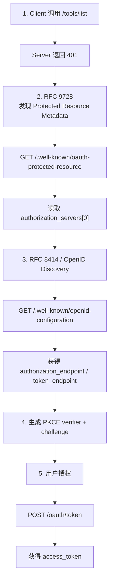
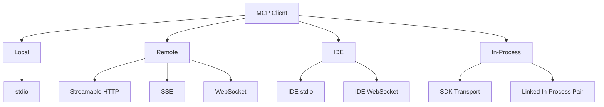

# 第十五章：MCP：通用工具协议

## 为什么 MCP 的意义超越 Claude Code

本书前面的章节几乎都在讲 Claude Code 自身内部的实现。

这一章不一样。

Model Context Protocol，也就是 MCP，是一个开放规范。任何 Agent 都可以实现它，而 Claude Code 的 MCP 子系统，是目前最完整的生产级客户端实现之一。

如果你正在构建一个需要调用外部工具的 Agent，无论：

- 使用什么语言；
- 使用什么模型；
- 运行在什么框架中；

本章中的很多模式都可以直接迁移。

MCP 的核心命题非常简单：

> **客户端负责发现和调用工具，服务端负责描述并执行工具。**

协议建立在 JSON-RPC 2.0 之上。

客户端首先发送：

```text
tools/list
```

来发现 Server 提供了什么工具。

随后使用：

```text
tools/call
```

真正执行某个工具。

服务端会为每个 Tool 描述：

- Name；
- Description；
- 输入 JSON Schema。

这就是最核心的 Contract。

其余所有内容：

- Transport Selection；
- Authentication；
- Config Loading；
- Tool Name Normalization；

都属于实现层工作。

真正困难的地方，不在协议本身，而在于：

> 怎样把一个很干净的 Spec，做成一个能经受真实世界网络、认证、配置和兼容性问题的生产系统。

Claude Code 的 MCP 实现主要分布在 4 个核心文件：

```text
types.ts
client.ts
auth.ts
InProcessTransport.ts
```

它们共同支持：

- 8 种 Transport；
- 7 种 Config Scope；
- 横跨 2 份 RFC 的 OAuth Discovery；
- 一层 Tool Wrapping，把 MCP Tool 转换成 Claude Code 内部统一的 `Tool` Interface。

包装完成之后，MCP Tool 与第 6 章介绍的 Built-in Tool 对模型来说几乎没有区别。

---

# 八种 Transport

任何 MCP Integration 的第一个设计问题都是：

> Client 到底怎么和 Server 通信？

Claude Code 支持 8 种 Transport Configuration。

| Transport | 类别 | 说明 |
|---|---|---|
| `stdio` | Local | 子进程通过 stdin/stdout 传输 JSON-RPC；未指定类型时的默认方案 |
| `sse` | Remote | 旧式 HTTP Transport；Client POST 请求，Server 通过 SSE Stream 推送响应 |
| `http` / Streamable HTTP | Remote | 当前规范推荐方案；POST 请求，可选 SSE Streaming Response |
| WebSocket | Remote | Full-duplex Bidirectional Communication，实际较少使用 |
| SDK Transport | In-process | SDK Embedded 场景，通过 stdin/stdout 控制消息 |
| IDE stdio | IDE | VS Code / JetBrains Extension 通过 stdio Channel 通信 |
| IDE WebSocket | IDE | IDE Remote Connection，运行时实现会区分 Bun / Node |
| In-Process | In-process | Linked Transport Pair，直接 Function Call，完整实现只有约 63 行 |

---

## 为什么 `stdio` 是默认值

如果 Config 没写：

```text
type
```

Claude Code 默认把它当成：

```text
stdio
```

这是为了兼容最早期的 MCP Config。

对于本地 Tool，例如：

- File System；
- Database；
- Custom Script；

`stdio` 往往也是最简单的选择：

- 不需要 Network；
- 不需要 OAuth；
- 只需要 Pipe。

---

## Remote Service 应该选什么

对于 Remote MCP Service：

```text
Streamable HTTP
```

是当前规范推荐方案。

```text
SSE
```

已经属于 Legacy Transport，但现实中仍然广泛部署。

WebSocket 提供 Full-duplex Channel，但实际使用频率比较低。

---

## Fetch Wrapper 为什么要分层

Claude Code 的 Fetch Wrapper 会一层套一层。

大致结构是：

```text
Timeout Wrapper
    ↓
Step-up Detection Wrapper
    ↓
Base Fetch
```

每一层只处理一个 Concern。

这是很典型的：

> Single Responsibility Wrapper Stack。

比在一个巨大 Fetch Function 里处理所有异常更容易测试和维护。

---

## Bun 与 Node 的 WebSocket 差异

`ws-ide` 路径会根据 Runtime 分支。

Bun 的：

```text
WebSocket
```

原生支持：

- Proxy Option；
- TLS Option。

Node 则需要：

```text
ws
```

Package。

这也是为什么同一种 Protocol 在不同 Runtime 下仍然需要不同实现细节。

---

# 配置加载与 Scope

MCP Server Config 会从 7 种 Scope 中加载，然后 Merge 与 Deduplicate。

| Scope | 来源 | 信任级别 |
|---|---|---|
| `local` | Working Directory 中的 `.mcp.json` | 需要用户批准 |
| `user` | `~/.claude.json` 中的 `mcpServers` | 用户管理 |
| `project` | Project-level Config | 项目共享设置 |
| `enterprise` | Managed Enterprise Config | 组织预批准 |
| `managed` | Plugin 提供的 Server | 自动发现 |
| `claudeai` | Claude.ai Web Interface | 已通过 Web 授权 |
| `dynamic` | Runtime / SDK 注入 | 程序动态添加 |

---

## Deduplication 不是按 Name，而是按内容

这点很重要。

两个 Server 即使名字不同，只要它们真正连接到同一个目标，就会被识别为同一个 Server。

系统使用：

```text
getMcpServerSignature()
```

计算 Canonical Signature。

### stdio Server

类似：

```text
stdio:["command","arg1"]
```

### Remote Server

类似：

```text
url:https://example.com/mcp
```

如果 Plugin 自动提供的 Server 与用户手动 Config 的 Server Signature 相同，Plugin 那份会被 Suppress。

这样可以避免：

> 同一个 MCP Server 因为名称不同被重复连接。

---

# Tool Wrapping：从 MCP Tool 到 Claude Code Tool

MCP Connection 成功后，Client 首先调用：

```text
tools/list
```

获取 Tool Definition。

然后每个 MCP Tool 都会转换成 Claude Code 内部统一的：

```text
Tool
```

Interface。

包装完成后，对模型而言：

> Built-in Tool 和 MCP Tool 基本不可区分。

整个 Wrapping 分 4 步。

---

## 1. Name Normalization

```text
normalizeNameForMCP()
```

会把不合法 Character 替换成：

```text
_
```

最终 Fully Qualified Name 格式为：

```text
mcp__{serverName}__{toolName}
```

这样可以：

- 避免 Tool Name Collision；
- 明确 Tool 来源；
- 满足 API 对 Tool Name 的字符约束。

---

## 2. Description Truncation

Tool Description 会被限制在：

```text
2,048 characters
```

原因很现实。

有些由 OpenAPI 自动生成的 MCP Server，曾经把：

```text
15KB - 60KB
```

内容塞进一个 `tool.description`。

这可能相当于单个 Tool 每轮消耗：

```text
约 15,000 Token
```

如果不做上限控制，Tool Description 本身就能把 Context Window 吃掉。

---

## 3. Schema Passthrough

MCP Tool 的：

```text
inputSchema
```

会直接传给 API。

Wrapping 阶段不会重新转换，也不会主动做复杂 Validation。

如果 Schema 本身有问题，错误会在：

```text
call time
```

暴露，而不是注册时。

这是一个较务实的选择：

> 注册阶段保持轻量，把真正执行相关的错误推迟到调用阶段。

---

## 4. Annotation Mapping

MCP Tool Annotation 会映射成内部行为 Flag。

例如：

### `readOnlyHint`

表示 Tool 是 Read-only。

Claude Code 可以据此允许：

> 并发执行。

这会直接影响第 7 章介绍的 Streaming Tool Executor。

### `destructiveHint`

表示 Tool 可能具有破坏性。

权限系统会进行更严格检查。

---

## Annotation 也是 Trust Boundary

这些 Annotation 是 MCP Server 自己声明的。

也就是说，一个恶意 Server 完全可以：

> 把破坏性 Tool 标记成 Read-only。

这是一个真实攻击面。

Claude Code 接受这项 Trade-off。

原因是：

- 用户已经主动连接这个 Server；
- 完全忽略 Annotation，又会让合法 Server 无法提供更好的 UX。

所以系统把：

> Server Metadata

视为一种经过用户授权后可接受的信任输入。

但工程上必须清楚：

> 这是 Trust Boundary，不是绝对事实。

---

# MCP Server 的 OAuth

Remote MCP Server 经常需要 Authentication。

Claude Code 实现了完整：

```text
OAuth 2.0 + PKCE
```

Flow，并支持：

- RFC-based Discovery；
- Cross-App Access；
- Error Body Normalization。

---

# OAuth Discovery Chain

完整流程可以表示为：



---

## 第一步：Authentication Required

Client 尝试访问：

```text
/tools/list
```

Server 返回：

```text
401 Unauthorized
```

这时系统才进入 OAuth Discovery。

也就是说：

> OAuth 是 Lazy 的。

如果 Server 不需要认证，就完全不会走这套流程。

---

## 第二步：Resource Discovery

按照 RFC 9728，Client 会请求：

```text
/.well-known/oauth-protected-resource
```

Server 可能返回：

```json
{
  "authorization_servers": [
    "https://auth.example.com"
  ]
}
```

系统取第一个 Auth Server。

---

## 第三步：Authorization Server Discovery

随后通过 RFC 8414 / OpenID Discovery 获取：

```text
/.well-known/openid-configuration
```

里面会包含：

```text
authorization_endpoint
token_endpoint
```

等 Endpoint。

---

## 第四步：PKCE

系统生成：

```text
code_verifier
```

通常是一个高熵随机字符串。

再计算：

```text
code_challenge = SHA256(code_verifier)
```

用户授权时发送 Challenge。

Token Exchange 时再提交 Verifier。

这样可以减少 Authorization Code 被截获后的利用风险。

---

## 第五步：Token Exchange

用户完成 Authorization 后，Client 调用：

```text
POST /oauth/token
```

得到：

```json
{
  "access_token": "eyJ..."
}
```

之后重新连接 MCP Server。

---

## `authServerMetadataUrl` Escape Hatch

现实世界的 OAuth Server 并不总是严格实现 RFC。

所以系统允许显式配置：

```text
authServerMetadataUrl
```

作为 Escape Hatch。

当 Server 两份 RFC Discovery 都不完整时，用户仍然可以手动指定 Metadata URL。

---

# Cross-App Access：XAA

如果 MCP Config 中包含：

```text
oauth.xaa: true
```

系统会使用 Federated Token Exchange。

简单理解：

> 一次 IdP Login，可以解锁多个 MCP Server。

这避免每个 Connector 都重复要求用户做一次 OAuth Login。

---

# OAuth Error Body Normalization

现实 OAuth Server 还经常违反协议。

Slack 是一个典型例子。

某些错误会：

```text
HTTP 200
```

返回。

但 JSON Body 中其实是 Error。

Claude Code 使用：

```text
normalizeOAuthErrorBody()
```

处理这种情况。

它会检查 2xx POST Response Body。

如果 Body：

- 符合 `OAuthErrorResponseSchema`；
- 但不符合 `OAuthTokensSchema`；

系统会把 Response 改写成：

```text
HTTP 400
```

这样下游可以按正常 OAuth Error 处理。

---

## Slack-specific Error Normalize

Slack 的一些非标准 Error Code：

```text
invalid_refresh_token
expired_refresh_token
token_expired
```

会被统一映射成标准：

```text
invalid_grant
```

这样上层 Retry / Refresh Logic 不需要认识每家 Provider 的私有 Error Code。

---

# In-Process Transport

并不是所有 MCP Server 都需要单独 Process。

`InProcessTransport` 允许 Server 与 Client 在同一个 Process 内运行。

核心实现非常小。

```typescript
class InProcessTransport
  implements Transport {

  async send(
    message: JSONRPCMessage,
  ): Promise<void> {
    if (this.closed) {
      throw new Error(
        'Transport is closed',
      )
    }

    queueMicrotask(() => {
      this.peer
        ?.onmessage
        ?.(message)
    })
  }

  async close():
    Promise<void> {
    if (this.closed) return

    this.closed = true

    this.onclose?.()

    if (
      this.peer &&
      !this.peer.closed
    ) {
      this.peer.closed = true
      this.peer.onclose?.()
    }
  }
}
```

整个文件只有大约：

```text
63 lines
```

---

## 为什么 `send()` 用 `queueMicrotask()`

如果 Request / Response 都完全同步 Function Call，递归链很容易不断增长。

使用：

```text
queueMicrotask()
```

把 Message Delivery 推到 Microtask Queue。

这样可以避免：

> 同步 Request / Response 循环导致 Stack Depth 问题。

---

## 为什么 `close()` 会级联给 Peer

如果一边关闭，另一边仍然认为 Connection Alive，就会出现：

```text
Half-open State
```

因此 `close()` 会同步把 Peer 标记为 Closed，并触发其 `onclose`。

Chrome MCP Server 与 Computer Use MCP Server 都使用这种 Pattern。


---

# Connection Management

## 五种 Connection State

每一个 MCP Server Connection 都处于以下五种状态之一：

```text
connected
failed
needs-auth
pending
disabled
```

### `connected`

连接成功，可以正常使用。

### `failed`

连接失败。

### `needs-auth`

需要 Authentication。

这个状态带有大约：

```text
15 minutes
```

的 TTL Cache。

它可以防止类似：

> 30 个 Server 同时发现 Token 过期，然后各自重复进行一次 Auth Discovery。

### `pending`

正在连接。

### `disabled`

当前被关闭，不参与连接。

---

# Session Expiry Detection

MCP 的 Streamable HTTP Transport 使用 Session ID。

如果 Server Restart，旧 Session 可能失效。

典型 Response 是：

```text
HTTP 404
```

并且 JSON-RPC Error Code：

```text
-32001
```

Claude Code 使用：

```text
isMcpSessionExpiredError()
```

同时检查这两个信号。

```typescript
export function
isMcpSessionExpiredError(
  error: Error,
): boolean {
  const httpStatus =
    'code' in error
      ? (error as any).code
      : undefined

  if (httpStatus !== 404) {
    return false
  }

  return (
    error.message.includes(
      '"code":-32001',
    ) ||
    error.message.includes(
      '"code": -32001',
    )
  )
}
```

这里有一个很 Pragmatic、但稍显脆弱的点：

> Error Code 是通过 String Inclusion 从 `error.message` 里找的。

不是 Structured Parsing。

---

## Session Expired 后怎么处理

一旦检测成功：

1. Clear Connection Cache；
2. 重新建立 Connection；
3. Tool Call Retry 一次。

不无限 Retry。

这和前面 Agent Loop 一样遵循：

> 所有 Recovery 都应该有明确上限。

---

# Batched Connections

MCP Server 连接也不是无限并行。

不同 Server 类型使用不同 Batch Size。

### Local Server

每批：

```text
3
```

原因是 Local Server 通常需要 Spawn Process。

同时启动太多 Process 可能耗尽：

- File Descriptor；
- Process Resource。

### Remote Server

每批：

```text
20
```

Remote Connection 更轻，主要是 Network I/O，因此允许更高并发。

---

## MCPConnectionManager

React Context Provider：

```text
MCPConnectionManager.tsx
```

负责连接 Lifecycle。

它会：

- 比较当前 Connection；
- 比较新的 Config；
- 新增应该连接的 Server；
- 断开已经被移除的 Server；
- 保持未变化 Connection。

本质上是：

> MCP Connection 的 Reactive Reconciler。

---

# Claude.ai Proxy Transport

```text
claudeai-proxy
```

Transport 展示了一种非常常见的 Agent Integration Pattern：

> 通过中间层连接第三方服务。

Claude.ai Subscriber 可以在 Web Interface 中配置 MCP Connector。

CLI 不直接处理 Vendor OAuth。

而是把请求路由到：

```text
Claude.ai Infrastructure
```

由后者：

- 管理 Vendor-side OAuth；
- 注入 Credential；
- 转发 MCP Request。

---

## Token Refresh 的并发问题

`createClaudeAiProxyFetch()` 会在 Request 发出时捕获：

```text
sentToken
```

而不是遇到 401 后再重新读取当前 Token。

原因是 Concurrent 401。

假设多个 Connector 同时得到：

```text
401
```

其中一个已经刷新 Token。

另一个稍晚进入 Retry Flow。

如果它不记住自己刚刚用的是哪个 Token，就无法判断：

> 当前全局 Token 是否已经被别人刷新过。

---

## ELOCKED Contention

系统还会处理一种情况：

> Refresh Handler 返回 `false`，但实际上另一个 Connector 已经抢到 Lockfile 并完成 Refresh。

也就是所谓：

```text
ELOCKED contention
```

因此：

> “我自己没刷新成功” 不等于 “Token 没被刷新”。

系统还会再检查一次当前 Credential，判断是否有并发 Refresh 已经发生。

这是典型的：

> Distributed-ish Concurrency Problem，即使所有东西都还在本地 Client 内。

---

# Timeout Architecture

MCP Timeout 是分层的。

每一层保护不同 Failure Mode。

| 层级 | 时间 | 防止的问题 |
|---|---:|---|
| Connection | 30s | Server 不可达或启动太慢 |
| Per-request | 60s，每个 Request 新建 | 避免复用已经过期的 Timeout Signal |
| Tool Call | 约 27.8 小时 | 允许合法的超长操作，同时仍有最终上限 |
| Auth | 每次 OAuth Request 30s | OAuth Server 不可达 |

---

## 为什么 Per-request Timeout 必须每次新建

早期实现曾在 Connection 创建时做：

```typescript
const signal =
  AbortSignal.timeout(60000)
```

然后所有 Request 都复用这个 Signal。

问题是：

> Timeout Signal 从创建那一刻就开始倒计时。

如果 Connection 空闲超过 60 秒，下一个 Request 刚开始时，Signal 已经 Expired。

于是 Request 会：

```text
立即 Abort。
```

修复方式是：

```text
wrapFetchWithTimeout()
```

在每一次 Request 上重新创建 Fresh Timeout Signal。

---

## `Accept` Header 的最后防线

`wrapFetchWithTimeout()` 还会最后再 Normalize：

```text
Accept
```

Header。

原因是某些：

- Runtime；
- Proxy；

可能在中间把它 Drop。

把 Header Normalization 放在最外层 Wrapper，可以作为 Last-step Defense。

---

# 把 MCP 集成到自己的 Agent：可以直接迁移的原则

## 1. 先从 `stdio` 开始

如果你自己控制 Tool Server：

> 不要一开始就上复杂 Remote Transport。

`StdioClientTransport` 已经可以处理：

- Spawn；
- Pipe；
- Kill。

一行 Config 加一个 Transport Class，就足以把本地工具接进 Agent。

等真正有 Remote Requirement，再增加 HTTP / OAuth。

---

## 2. Normalize Name，并截断 Description

Tool Name 应满足类似：

```text
^[a-zA-Z0-9_-]{1,64}$
```

MCP Tool 最好使用：

```text
mcp__{serverName}__{toolName}
```

作为 Fully-qualified Name。

这样可以避免 Collision。

Description 应强制限制：

```text
2,048 characters
```

因为 OpenAPI-generated Server 很容易把巨大 Schema Documentation 塞进去。

如果不限制，Prompt Token 会被白白消耗。

---

## 3. Authentication 要 Lazy

不要一连接 Server 就主动跑 OAuth。

正确方式是：

```text
先尝试请求
↓
Server 返回 401
↓
再进入 OAuth Discovery
```

因为大量：

```text
stdio Server
```

根本不需要 Auth。

Lazy Auth 可以保持普通路径简单、快速。

---

## 4. 自己控制的 Server 优先 In-Process

如果 MCP Server 本来就是你的应用内部模块，没有必要为了协议形式强行 Spawn 子进程。

可以使用：

```text
createLinkedTransportPair()
```

通过 In-process Transport 连接。

这样可以消除：

- Process Startup；
- Pipe；
- IPC Serialization 的一部分额外开销。

协议抽象仍然保留。

Transport 成本则几乎消失。

---

## 5. 尊重 Annotation，但别把它当绝对事实

```text
readOnlyHint
```

可以让 Tool 进入 Concurrent Execution。

```text
destructiveHint
```

可以提升权限审查。

这些 Annotation 很有价值。

但它们来自 Server。

因此必须明确：

> Metadata 本身也是 Trust Input。

---

## 6. Sanitise Tool Output

外部 MCP Server 返回的内容可能包含恶意 Unicode。

例如：

- Bidirectional Override；
- Zero-width Joiner；
- 其他能够改变视觉顺序或隐藏字符的控制字符。

这些内容可能误导：

- 用户；
- 模型；
- Log Viewer。

所以 Tool Output 应该在进入 Agent Context 前进行 Sanitization。

---

# MCP 的真正工程量在哪里

MCP Spec 本身非常小。

核心只有两件事：

```text
tools/list
tools/call
```

通过 JSON-RPC 2.0 交互。

但生产实现却需要处理：

```text
8 Transports
7 Config Scopes
2 OAuth RFCs
Tool Name Normalization
Description Budgeting
Session Recovery
Timeout Layering
Connection Batching
Runtime Differences
Proxy Token Refresh
Trust Boundary
```

这很好地说明了一个工程规律：

> **协议通常很简单，真正的复杂度来自协议与现实世界接触的边缘。**

---

# 本章总结

Claude Code 的 MCP 子系统，本质上做了三件事情。

第一，它把不同外部 Tool Provider 统一成一个协议。

```text
MCP Server
    ↓
tools/list
    ↓
Tool Definition
    ↓
Claude Code Tool Wrapper
    ↓
模型看到统一 Tool Interface
```

第二，它把通信方式抽象成 Transport。



第三，它把现实世界的不稳定性包在协议边界外。

包括：

- OAuth Discovery；
- Token Refresh；
- Config Scope；
- Duplicate Server；
- Connection State；
- Session Expiry；
- Timeout；
- Runtime Compatibility；
- Security Annotation。

对于真正使用 MCP 的 Agent 来说，上层最终只需要面对：

```text
一个名字
一个 Description
一个 JSON Schema
一次 Tool Call
```

这就是好协议层的价值：

> 底层可以非常复杂，但上层看到的 Contract 应该保持简单。

MCP 的意义也因此不局限于 Claude Code。

任何 Agent Framework，只要需要把外部 Service 变成 Tool，都可以采用同样结构：

```text
Discovery
→ Normalization
→ Permission
→ Invocation
→ Result
```

而不需要让 Agent 自己理解每个 Vendor 的 API、Transport 和 Authentication。

下一章会继续讨论当 Agent 真正离开 Localhost 后会发生什么：

> Claude Code 如何运行在 Cloud Container 中，如何接受 Web Browser 的远程指令，以及如何通过 Credential-injecting Proxy 隧道化 API Traffic。
