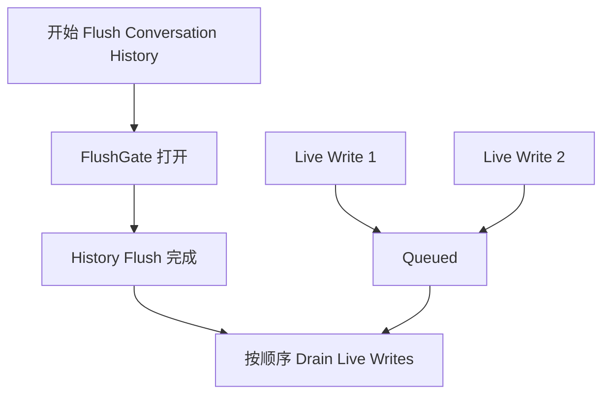
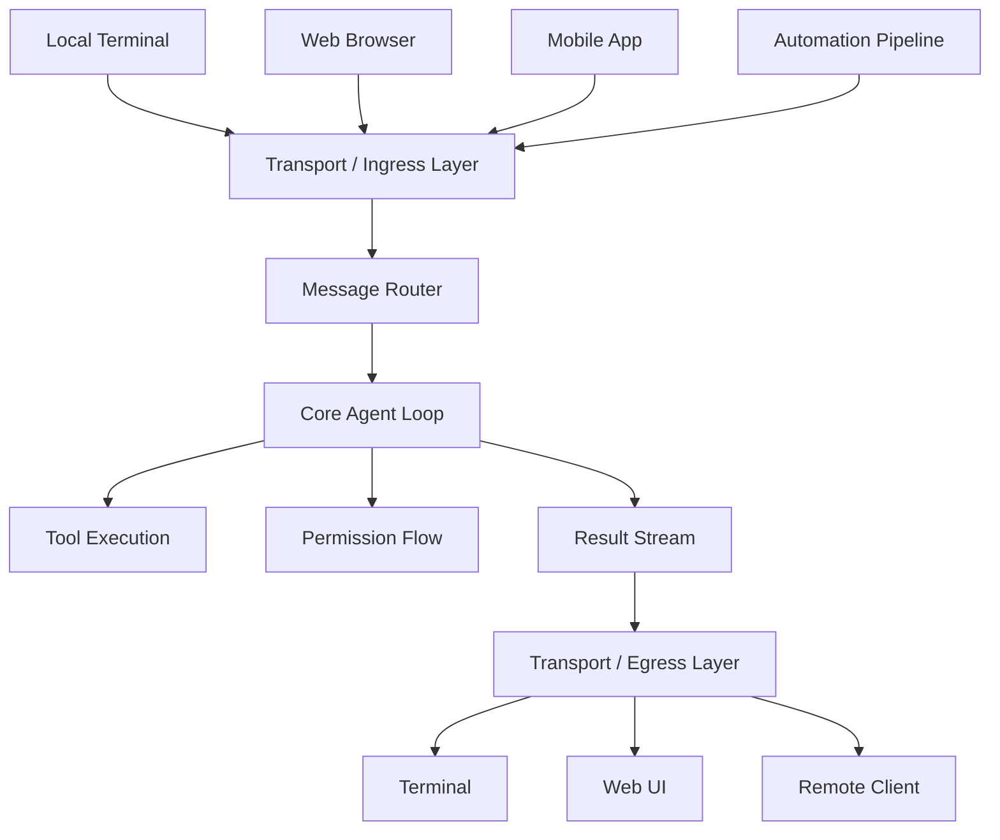

# 第十六章：远程控制与云端执行

## Agent 走出 Localhost

到目前为止，前面所有章节都默认 Claude Code 运行在代码所在的同一台机器上。Terminal 是本地的，File System 是本地的，模型响应会流式返回到一个同时拥有键盘和 Working Directory 的本地进程。

但只要你希望从浏览器远程控制 Claude Code、把它运行在 Cloud Container 中，或者把它作为服务暴露在局域网，这个假设就会立刻失效。Agent 需要能够接收来自 Web Browser、Mobile App 或自动化 Pipeline 的指令，把 Permission Prompt 转发给并不坐在 Terminal 前的人，并通过可能注入 Credential 或替 Agent 终止 TLS 的基础设施转发 API Traffic。

Claude Code 使用四套系统来解决不同的 Remote Topology。这些系统共享同一组设计哲学：**读和写是不对称的，重连应该自动发生，失败时应当优雅降级。**

---

# Bridge v1：Poll、Dispatch、Spawn

Bridge v1 是一套基于 Environment API 的 Remote Control System。当开发者运行：

```bash
claude remote-control
```

CLI 会向 Environments API 注册，持续 Poll 是否有新工作，并为每个 Session Spawn 一个 Child Process。

## 注册前的 Pre-flight Check

真正注册之前，系统会经过一整套检查，包括 Runtime Feature Gate、OAuth Token Validation、Organization Policy Check、Dead Token Detection，以及 Proactive Token Refresh。

如果同一个 Expired Token 连续失败三次，Dead Token Detection 会启用 Cross-process Backoff，避免多个进程围绕同一个无效 Token 疯狂重试。

Proactive Token Refresh 则会在真正注册之前主动刷新即将过期的 Token。原文指出，这项优化可以消除大约 9% 原本会在第一次 Registration 时失败的请求。

## Long-poll Loop

注册成功后，Bridge 会进入 Long Poll。Work Item 主要有两种。

第一种是 Session，其中包含一个 `secret` 字段，可能携带 Session Token、API Base URL、MCP Config 与 Environment Variable。

第二种是 Healthcheck，用于确认 Worker 仍然存活。

Long Poll 大多数时候可能没有工作。如果每次空 Poll 都打印日志，会产生大量噪音，因此系统只会每 100 次空 Poll 输出一次“当前没有工作”之类的日志。

## 每个 Session Spawn 一个 Child Process

收到 Session 后，Bridge 会启动一个独立的 Claude Code Child Process。父 Bridge 与 Child Process 之间通过 NDJSON 在 stdin/stdout 上通信。

Permission Request 会沿 Bridge Transport 转发到 Web Interface，用户可以在浏览器中 Allow 或 Deny。完整 Round-trip 大约必须在 10 到 14 秒内完成，否则 Permission Flow 会超时。

---

# Bridge v2：Direct Session + SSE

Bridge v2 去掉了 v1 中整层 Environments API，不再需要 Registration、Polling、Acknowledgment、Heartbeat 与 Deregistration。

v1 的核心假设是 Server 必须在 Dispatch Work 之前知道机器有什么能力。v2 则把整个 Lifecycle 压缩成三步。

## 第一步：Create Session

Client 使用 OAuth Credential 调用：

```http
POST /v1/code/sessions
```

创建 Session。

## 第二步：Connect Bridge

随后调用：

```http
POST /v1/code/sessions/{id}/bridge
```

Response 会返回：

```text
worker_jwt
api_base_url
worker_epoch
```

每调用一次 `/bridge`，Epoch 都会增加。换句话说，`/bridge` Call 本身就是 Registration，不再需要独立的 Register API。

## 第三步：Open Transport

读取使用 SSE，写入使用 `CCRClient`。也就是说，Read 与 Write 走不同 Transport。

系统使用 `ReplBridgeTransport` 把 Bridge v1 与 v2 包装成统一 Interface。因此上层 Message Handling 不需要知道当前到底是 v1 还是 v2，只需要面对同一套 Transport Contract。

## 401 后的无损重连

如果 SSE Connection 因为 401 断开，v2 不会直接让 Session 失败。它会重新调用 `/bridge` 获取新 Credential，重建 Transport，同时保留 Sequence Number Cursor，从上次位置继续读取。

这样 Credential Refresh 不会导致消息丢失。

Write Path 也不会从 Process-wide Environment Variable 读取 JWT，而是给每个 Transport Instance 自己的 `getAuthToken` Closure。这样多个 Remote Session 同时运行时，不会出现 Session A 的 JWT 泄漏到 Session B 的问题。

---

# FlushGate

Bridge v2 还要解决一个细微的 Ordering Problem。

建立连接后，Bridge 需要先把已有 Conversation History Flush 给 Remote Client。与此同时，Web Interface 可能已经开始发送 Live Write。

如果不控制顺序，就可能出现实时消息先到、旧历史后到的情况，从而打乱 Conversation Order。

`FlushGate` 会在 History Flush POST 期间把 Live Write 暂时放入 Queue，等 Flush 完成后再按照原始顺序 Drain。



这样可以保证历史消息永远先于实时消息出现。

---

# Token Refresh 与 Epoch Management

Bridge v2 会在 Worker JWT 过期前主动 Refresh。新的 Credential 会伴随新的 `worker_epoch`，告诉 Server：这是同一个 Worker，只是 Credential 已经更新。

如果 Server 返回 409，代表 Epoch 不一致。系统会同时关闭 Read / Write 两条连接，并让异常向上冒泡，由 Caller 重新建立整个 Bridge。

原因是 Epoch Mismatch 可能意味着同一个 Worker 出现两个彼此不一致的活跃连接，也就是 Split-brain。这种状态不能尝试勉强继续，必须直接重建。


---

# 消息路由与 Echo 去重

Bridge v1 与 v2 共用：

```text
handleIngressMessage()
```

作为中央路由器。

处理流程如下：

1. Parse JSON，并 Normalize Control Message Key；
2. 把 `control_response` 路由到 Permission Handler；
3. 把 `control_request` 路由到 Request Handler；
4. 检查 UUID 是否出现在 `recentPostedUUIDs` 中，用于 Echo Dedup；
5. 检查 UUID 是否出现在 `recentInboundUUIDs` 中，用于 Re-delivery Dedup；
6. 最后转发通过 Validation 的 User Message。

---

# `BoundedUUIDSet`：O(1) Lookup，固定内存

Bridge 会遇到一个典型问题：

> 一条 Message 可能在 Read Stream 中 Echo 回来，也可能在 Transport 切换时被重复投递。

系统使用一个固定容量的 FIFO Set：

```text
BoundedUUIDSet
```

来做 Dedup。

示意实现：

```typescript
class BoundedUUIDSet {
  private buffer: string[]
  private set: Set<string>
  private head = 0

  add(uuid: string): void {
    if (this.set.size >= this.capacity) {
      this.set.delete(
        this.buffer[this.head],
      )
    }

    this.buffer[this.head] = uuid
    this.set.add(uuid)

    this.head =
      (this.head + 1)
      % this.capacity
  }

  has(uuid: string): boolean {
    return this.set.has(uuid)
  }
}
```

系统同时维护两个 Instance。

每个容量都是：

```text
2000
```

这样可以得到：

```text
Lookup = O(1)
Memory = O(capacity)
```

不需要 Timer，也不需要 TTL。

Circular Buffer 负责持续淘汰最老 UUID。

这比一个不断增长的：

```text
Set
```

安全得多。

Unknown Control Request Subtype 也不会被静默忽略。

系统会返回 Error Response。

否则 Server 可能一直等待一个永远不会出现的 Response。

---

# 不对称设计：Persistent Read + HTTP POST Write

CCR Protocol 使用不对称 Transport。

### Read

通过 Persistent Connection：

- WebSocket；
- 或 SSE。

### Write

通过：

```text
HTTP POST
```

这种设计不是偶然。

而是直接反映了通信模式本身的不对称。

---

## Read 的特征

Read 通常是：

- 高频；
- 低延迟；
- Server Initiated。

模型 Streaming 时，可能每秒产生数百条小 Message。

这类流量最适合 Persistent Connection。

---

## Write 的特征

Write 通常是：

- 低频；
- Client Initiated；
- 需要明确 Acknowledgment。

可能只是每分钟几条 Message。

HTTP POST 可以天然提供：

- Reliable Delivery；
- UUID-based Idempotency；
- Load Balancer 友好性。

---

## 为什么不全部塞进一个 WebSocket

如果 Read 与 Write 都绑定到一个 WebSocket：

> Write Reliability 会和 Connection Lifecycle 强耦合。

例如写 Message 时 WebSocket 突然断开。

系统需要判断：

```text
消息没发出去？
还是已经发出去，只是 Ack 丢了？
```

然后必须增加更复杂的 Retry / Dedup Logic。

拆成两条 Channel 后：

- Read 可以独立 Reconnect；
- Write 可以独立 Retry；
- 两边可以使用最适合自己的语义。

---

# Remote Session Management

`SessionsWebSocket` 管理 CCR WebSocket 的 Client Side。

它的 Reconnection Strategy 会根据 Failure Type 区分处理。

| Failure | Strategy |
|---|---|
| `4003` Unauthorized | 立即停止，不 Retry |
| `4001` Session Not Found | 最多 Retry 3 次，Linear Backoff；在 Compaction 期间可能是临时状态 |
| 其他 Transient Error | Exponential Backoff，最多 5 次 |

这里的核心原则是：

> 不同 Failure Signal 应该对应不同 Retry Strategy。

Permanent Failure 不应该重试。

Transient Failure 可以重试。

Ambiguous Failure 则应该低次数重试。

---

## `isSessionsMessage()`

这个 Type Guard 的设计非常宽松。

它只要求：

> 输入是 Object，并且存在 String 类型的 `type` 字段。

为什么不用 Hardcoded Allowlist？

因为如果 Server 增加了新 Message Type，而 Client 还没有升级：

> 一个过于严格的 Allowlist 会直接静默丢弃新类型。

宽松 Parser 可以让未知类型继续向更高层传递，由后续逻辑决定如何处理。

---

# Direct Connect：Local Server

Direct Connect 是最简单的 Remote Topology。

Claude Code 自己作为 Server 运行。

Client 通过：

```text
WebSocket
```

直接连接。

不需要：

- Cloud Intermediary；
- OAuth Token。

---

## Session 的五种状态

Direct Connect Session 有 5 种 State：

```text
starting
running
detached
stopping
stopped
```

Metadata 会持久化到：

```text
~/.claude/server-sessions.json
```

因此 Server Restart 后仍然可以 Resume Session。

系统还使用：

```text
cc://
```

URL Scheme 为本地 Connection 提供统一 Address。

---

# Upstream Proxy：Container 中的 Credential Injection

Upstream Proxy 运行在 CCR Container 内。

它解决一个非常具体、也非常敏感的问题：

> 怎样把 Organization Credential 注入 Container 发出的 HTTPS Traffic，同时又不把 Credential 暴露给 Container 中可能执行的不可信命令？

Agent 可能因为 Prompt Injection 执行恶意 Shell Command。

因此 Secret Handling 必须非常谨慎。

---

# Setup Sequence

整个初始化顺序经过严格设计。

## 第一步：读取 Session Token

从：

```text
/run/ccr/session_token
```

读取。

---

## 第二步：禁止同 UID Ptrace

通过 Bun FFI 调用：

```text
prctl(PR_SET_DUMPABLE, 0)
```

这样可以阻止同一个 UID 下其他 Process 对当前 Process 做 `ptrace`。

为什么重要？

如果不做这一层，一个受到 Prompt Injection 的命令可能运行：

```bash
gdb -p $PPID
```

直接从 Parent Process Heap 中抓取 Session Token。

也就是说：

> 仅仅把 Token 从 Environment Variable 移到 Heap 并不安全，必须同时阻断 Process Memory Inspection。

---

## 第三步：下载 Upstream Proxy CA

系统下载 Proxy CA Certificate，并与 System CA Bundle 合并。

这样 Container 发出的 HTTPS Connection 可以信任 Credential-injecting Proxy。

---

## 第四步：启动本地 Relay

在一个 Ephemeral Port 上启动：

```text
CONNECT → WebSocket Relay
```

它负责把本地 HTTPS Tunnel 转发给 Upstream Infrastructure。

---

## 第五步：删除 Token File

完成初始化后：

```text
unlink /run/ccr/session_token
```

Token File 会被删除。

此时 Secret 只保存在 Process Heap 中。

这减少了后续 Shell Command 从 File System 偷 Token 的机会。

---

## 第六步：导出 Subprocess Environment

最后设置必要 Environment Variable，供 Agent 后续启动的 Subprocess 使用 Proxy。

---

# 为什么 Proxy 初始化 Fail Open

上述任意一步失败，系统不会直接 Kill 整个 Session。

而是：

> Disable Proxy，继续运行核心 Claude Code。

这是一个有意的 Trade-off。

Proxy 提供的是：

- Credential Injection；
- 某些 Integration 能力。

它不是核心：

- Model Inference；
- Tool Loop。

因此正确降级方式是：

```text
辅助能力不可用
≠
整个 Agent 不可用
```

这就是 Fail Open。

当然，这种策略只适用于 Auxiliary System。

如果失败的是安全核心本身，就不能照搬。

---

# Protobuf 手工编码

Tunnel 中传输的 Byte 会包装成：

```text
UpstreamProxyChunk
```

Protobuf Message。

Schema 极其简单：

```protobuf
message UpstreamProxyChunk {
  bytes data = 1;
}
```

Claude Code 没有为了这一条 Message 引入完整 Protobuf Runtime。

而是手写了大约 10 行 Encoder。

```typescript
export function encodeChunk(
  data: Uint8Array,
): Uint8Array {
  const varint: number[] = []

  let n = data.length

  while (n > 0x7f) {
    varint.push(
      (n & 0x7f) | 0x80,
    )

    n >>>= 7
  }

  varint.push(n)

  const out =
    new Uint8Array(
      1
      + varint.length
      + data.length,
    )

  out[0] = 0x0a

  out.set(
    varint,
    1,
  )

  out.set(
    data,
    1 + varint.length,
  )

  return out
}
```

其中：

```text
0x0a
```

表示：

```text
field 1
wire type 2
```

---

## 为什么手写比引库更合理

这里只有：

```text
一个字段
```

引入完整 Protobuf Runtime 会带来：

- Dependency；
- Supply Chain Risk；
- Bundle Size；
- Version Maintenance。

而这段 Bit Manipulation 本身极小、稳定、容易审计。

所以：

> 10 行手工实现的维护成本，比引入整套 Runtime 更低。

这是一个非常典型的“不要为了一个小问题引入一座城堡”的工程选择。


---

# 应用这些设计：如何设计 Remote Agent Execution

Claude Code 的 Remote Execution System 提供了几条可以直接迁移到其他 Agent Platform 的原则。

---

## 1. Read 与 Write Channel 分离

如果系统中的 Read 是：

- 高频；
- Streaming；
- Server Initiated；

而 Write 是：

- 低频；
- RPC 风格；
- Client Initiated；
- 需要 Ack；

那么没有必要强行使用同一 Transport。

Persistent Read Channel 与 HTTP Write Channel 可以：

- 各自优化；
- 各自 Retry；
- 各自恢复。

一个 Channel 的失败，不需要把另一个 Channel 一起拖下水。

---

## 2. Dedup Memory 必须有上限

任何 At-least-once Delivery System 都可能收到重复 Message。

如果使用一个无限增长：

```text
Set<UUID>
```

长期 Session 最终会出现 Memory Leak。

`BoundedUUIDSet` 模式提供：

```text
固定容量
+
O(1) Lookup
+
FIFO Eviction
```

这是一种非常通用的 Dedup Primitive。

---

## 3. Retry Strategy 应与 Failure Signal 成比例

不要写一个统一：

```text
retry 5 times
```

处理所有错误。

正确思路是区分：

### Permanent Failure

例如：

```text
Unauthorized
```

立即停止。

### Transient Failure

例如临时网络故障。

使用 Backoff Retry。

### Ambiguous Failure

例如 Session 可能刚好处在 Compaction / Migration 状态。

可以有限次数 Retry。

也就是说：

> Retry Policy 应该携带对错误语义的理解。

---

## 4. 对抗性环境中，Secret 应尽量只存在 Heap

CCR Container 可能执行不可信 Command。

因此 Token Lifecycle 是：

```text
File 中读取
    ↓
关闭 ptrace / dumpable
    ↓
Secret 进入 Process Heap
    ↓
删除 Token File
```

这样同时缩小两个攻击面：

- File System Secret Theft；
- Same-UID Process Memory Inspection。

当然，Heap-only 并不意味着 Secret 绝对安全。

它只是显著减少可利用面。

---

## 5. Auxiliary System 应 Fail Open

Upstream Proxy 是增强功能。

它失败时可能导致：

- 某些 Enterprise Integration 不可用；
- Credential Injection 不可用。

但核心 Agent 仍然可以工作。

因此它选择：

```text
Fail Open
```

这是一种重要的系统分级：

### Core System

失败可能必须 Fail Closed。

### Auxiliary System

失败最好 Gracefully Degrade。

如果所有外围 Feature 失败都直接 Kill 主 Session，系统会极其脆弱。

---

# 更深层原则：Agent Loop 不应该知道 Transport 在哪里

Remote Execution System 最重要的架构目标之一，是让第 5 章介绍的核心 Agent Loop 保持：

> Location Agnostic。

也就是说，它不应该关心：

- 指令来自 Local Keyboard；
- 来自 Web Browser；
- 来自 Mobile App；
- 来自 WebSocket；
- 来自 SSE；
- 来自 Cloud Pipeline。

它同样不应该关心结果最终：

- 显示在本地 Terminal；
- 写到 Remote Web UI；
- 发给另一个 Client。

Bridge、Direct Connect 与 Upstream Proxy 都是：

> Transport Layer。

而它们之上的：

- Message Handling；
- Tool Execution；
- Permission Flow；

应该保持一致。

可以表示为：



核心 `query()` 不需要因为用户换了入口而重新设计。

这也是为什么 Remote Control 可以在系统后期加入，而不需要重写 Agent Loop。

---

# 本章总结

Claude Code 的 Remote Execution Layer 主要解决四类问题：

```text
Remote Instruction Delivery
Credential / Auth
Connection Recovery
Cross-process / Cross-machine Transport
```

Bridge v1 使用：

```text
Environment Registration
+
Long Poll
+
Per-session Child Process
```

Bridge v2 则把它简化为：

```text
Create Session
+
Connect Bridge
+
SSE Read / HTTP Write
```

v2 的关键改进包括：

- `/bridge` 本身承担 Registration；
- Credential Refresh 可以无损重连；
- Sequence Cursor 避免漏消息；
- `FlushGate` 保证 History 与 Live Write 顺序；
- Epoch 防止 Split-brain；
- Per-instance Token Closure 避免 Session 间 Credential 泄漏。

消息层通过：

```text
BoundedUUIDSet
```

解决：

- Echo；
- Re-delivery；

并保持固定内存。

Remote Protocol 选择不对称 Transport：

```text
Read
→ Persistent SSE / WebSocket

Write
→ HTTP POST
```

让两种完全不同的 Traffic Pattern 各自获得更合理的可靠性模型。

Direct Connect 提供更简单的本地 Remote Server Topology。

Upstream Proxy 则解决 Cloud Container 中最敏感的问题之一：

> 如何让 Agent 使用 Organization Credential，却尽量不给 Prompt-injected Process 机会偷走 Credential。

它通过：

```text
读取 Token
→ 关闭 ptrace
→ 下载 CA
→ 启动 Relay
→ 删除 Token File
→ 导出 Proxy Environment
```

构建安全边界。

整章最值得迁移的架构思想可以压缩成一句话：

> **把“Agent 在哪里运行、用户在哪里输入、网络如何连接”限制在 Transport Boundary 内，不要让这些差异污染核心 Agent Loop。**

最终，Claude Code 的 Agent 可以仍然运行同一个：

```text
query()
```

但它的用户可能已经不在这台机器旁边。

这就是 Remote Control Layer 真正完成的事情：

> 它没有改变 Agent 的大脑，只是把 Agent 的神经延伸到了网络另一端。

下一章将进入另一个 Operational Concern：

> 性能。

也就是 Claude Code 如何在 Startup、Rendering、Search 和 API Cost 上，让每一个 Millisecond 和每一个 Token 都尽量物有所值。
