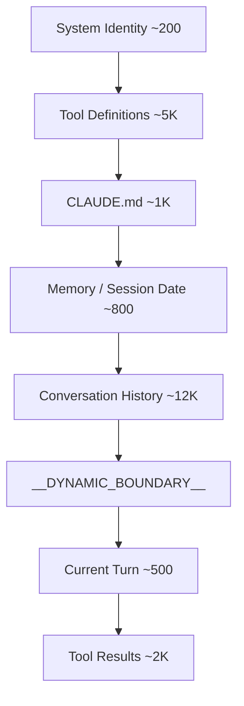
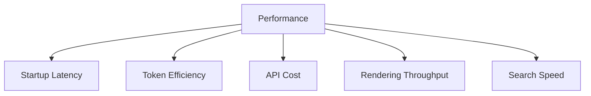

# 第十七章：性能：每一毫秒、每一个 Token 都重要

> 原文：[Ch 17. Performance — Every Millisecond and Token Counts](https://claude-code-from-source.com/ch17-performance/)


## 资深工程师的性能手册

在 Agentic System 中做性能优化，并不是一个问题，而是五个问题。

第一是 **启动延迟**，也就是从用户按下按键，到系统出现第一个真正有用的输出之间的时间。一个工具如果启动时显得迟钝，用户很容易直接放弃。

第二是 **Token 效率**，也就是 Context Window 里真正用于任务的内容，占总 Token 的比例。对于 Agent 来说，Context Window 往往是最紧缺的资源。

第三是 **API 成本**，也就是每一轮请求究竟花多少钱。Prompt Cache 理论上可以把成本降低约 90%，但前提是系统能够在连续多轮请求之间保持 Cache Stability。

第四是 **渲染吞吐量**，也就是 Streaming Output 时终端 UI 能维持多少 FPS。第 13 章已经讲过渲染架构，本章重点放在真正支撑高性能的测量与优化策略上。

第五是 **搜索速度**，也就是用户每敲一个字符时，系统在一个拥有 27 万条以上路径的 Codebase 中完成文件搜索需要多久。

Claude Code 会同时攻击这五个目标。

使用的手段从非常经典的：

- Memoization；
- Interning；
- Parallel I/O；

到一些更细致的技巧，例如：

- 26-bit Bitmap；
- Fuzzy Search 的 Score Bound；
- Prompt Cache Sticky Latch；
- Streaming Tool Executor。

需要特别说明的是，这些并不是“纸上谈兵”的优化。

Claude Code 自带 50 多个 Startup Profiling Checkpoint。

采样范围是：

```text
Internal User：100%
External User：0.5%
```

下面这些优化，都是由真实 Instrumentation 数据推动出来的，而不是工程师凭感觉猜出来的。

---

# 启动阶段：从毫秒里抠性能

## Module-level I/O Parallelism

入口文件：

```text
main.tsx
```

会有意违反一条很常见的工程规范：

> 不要在 Module Scope 做 Side Effect。

代码类似：

```typescript
profileCheckpoint(
  'main_tsx_entry',
)

startMdmRawRead()

startKeychainPrefetch()
```

`startMdmRawRead()` 会启动类似：

```text
plutil
reg query
```

的子进程。

`startKeychainPrefetch()` 会提前并行读取 macOS Keychain。

---

## 为什么要在 Module Scope 就发起 I/O

如果按照普通顺序同步读取两条 macOS Keychain Entry，大约会消耗：

```text
~65ms
```

如果等所有 Module Import 完成后再做，这 65ms 会直接叠加到 Critical Path 上。

Claude Code 选择：

> Module 开始加载时就把 I/O Promise 发出去。

接下来约：

```text
135ms
```

的 Module Loading 与 Keychain I/O 同时发生。

CPU 在做 Import 与 Module Evaluation。

OS 在后台等待 Keychain / Subprocess I/O。

最终，原本串行的时间被重叠了。

这是第 2 章 Startup Pipeline 思路的延续：

> CPU-bound 与 I/O-bound 工作不要排队，要重叠。

---

# API Preconnection

`apiPreconnect.ts` 会在初始化阶段提前向 Anthropic API 发一个：

```http
HEAD
```

Request。

目的不是获取业务数据，而是提前完成：

```text
TCP Handshake
+
TLS Handshake
```

这部分通常需要：

```text
100 - 200ms
```

如果等到用户发送第一条 Prompt 后才开始，会让 First Token Latency 直接增加这一段时间。

Claude Code 会把它与 Setup 工作重叠。

---

## Interactive Mode 下的额外优势

在 Interactive Mode 中，User 还会花时间打字。

因此 API Preconnect 的隐藏窗口几乎是无限的。

用户可能输入：

```text
修复 auth.ts 中的 null pointer
```

需要 2 秒。

而 Connection 在这 2 秒期间已经完全 Warm。

---

## Preconnect 的执行顺序

Preconnect 会在以下步骤之后执行：

```text
applyExtraCACertsFromConfig()
configureGlobalAgents()
```

这很重要。

否则提前 Warm 出来的 Connection 可能使用错误：

- CA；
- Proxy；
- Agent；
- Transport Config。

预热的连接必须和真正 API Call 使用同一套 Network Configuration。

---

# Fast Path 与 Deferred Import

CLI Entry Point 会给一些专门 Subcommand 提供 Early Return。

例如：

```text
claude mcp
```

不需要加载 React REPL。

```text
claude daemon
```

也不需要加载完整 Tool System。

Heavy Module 则通过：

```typescript
await import(...)
```

动态导入。

典型包括：

- OpenTelemetry；
- Event Logging；
- Error Dialog；
- Upstream Proxy。

其中 OpenTelemetry 本身大约：

```text
400KB
```

再加上约：

```text
700KB gRPC
```

如果当前 Session 不需要，就完全不应该为它支付 Startup Cost。

---

## LazySchema

Zod Schema 构建也会使用：

```text
LazySchema
```

推迟到：

> 第一次 Validation 真正发生时。

换句话说：

> Startup 只做“现在必须做的事”。

其余工作全部推迟到真正需要的时刻。

---

# 节省 Context Window 中的 Token

## Slot Reservation：默认 8K，必要时升级 64K

这是 Claude Code 中影响最大的单项 Context Optimization 之一。

API Request 会通过：

```text
max_output_tokens
```

预留一块输出空间。

很多 SDK 默认值是：

```text
32K - 64K
```

但 Production Data 表明，实际 Output Length 的：

```text
p99 = 4,911 tokens
```

也就是说，99% 的 Response 都不到 5K。

如果默认预留 32K 或 64K，相当于每一轮都在白白浪费：

```text
24,000 - 59,000 tokens
```

的 Context Capacity。

Claude Code 默认只预留：

```text
8,000 tokens
```

如果真的因为 Output Truncation 撞到上限，再干净地 Retry，并把上限升级到：

```text
64K
```

这种 Truncation 发生率小于：

```text
1%
```

---

## 对 200K Context 的收益

在一个：

```text
200K Context Window
```

里，这相当于增加约：

```text
12% - 28%
```

可用上下文。

而且几乎没有额外代价。

核心思想是：

> 不要为了极少数 Worst Case，让每一轮请求都支付 Worst Case Reservation。

---

# Tool Result Budgeting

Tool Result 也有明确 Budget。

| 限制 | 数值 | 用途 |
|---|---:|---|
| 单 Tool Character | 50,000 | 超过后完整结果 Persist 到磁盘 |
| 单 Tool Token | 100,000 | 大约对应 400KB Text 上限 |
| 单 Message Aggregate | 200,000 chars | 防止一轮中多个并行 Tool 一起把 Context 撑爆 |

最关键的是：

> Aggregate Budget。

如果只有 Per-tool Limit，没有 Aggregate Limit，那么模型执行：

```text
Read all files in src/
```

可能同时产生 10 个 Read。

每个返回：

```text
40K chars
```

单个都没有超过限制。

但总和已经达到：

```text
400K chars
```

足以把 Context Window 打穿。

---

# Context Window Sizing

默认 Context Window 是：

```text
200K tokens
```

通过 Model Name 后缀：

```text
[1m]
```

或者 Experiment Treatment，可以扩展到：

```text
1M tokens
```

当 Context 接近上限时，系统会使用前面章节介绍过的：

> 四层 Compaction System

逐步压缩旧内容。

Token Count 的锚点不是 Client Estimate，而是 API Response 中真实的：

```text
usage
```

字段。

因为 Server-side Count 还会包含或扣除：

- Prompt Cache Credit；
- Thinking Token；
- Server-side Transformation。

因此真正决定 Context Budget 时，Server Report 才是最可靠的 Ground Truth。

---

# 节省 API 成本

## Prompt Cache Architecture

Anthropic Prompt Cache 使用：

> Exact Prefix Matching。

如果 Stable Prefix 中间有一个 Token 改了，从那个位置往后的内容全部 Cache Miss。

因此 Claude Code 会非常刻意地把：

```text
Stable Content
```

放前面。

把：

```text
Volatile Content
```

放后面。

可以粗略表示为：



前半部分尽可能稳定并缓存。

后半部分允许每轮变化。

原文示例中，一轮大约：

```text
21.5K tokens
```

Cache Hit Rate：

```text
88%
```

成本：

```text
With Cache:    $0.066
Without Cache: $0.323
```

节省约：

```text
80%
```

即：

```text
$0.257 / turn
```

---

## Global Cache Scope

当：

```text
shouldUseGlobalCacheScope()
```

返回 True 时，Dynamic Boundary 之前的 System Prompt Entry 可以设置：

```text
scope: 'global'
```

这意味着：

> 两个使用同一 Claude Code Version 的不同用户，都可能共享同一份 Prefix Cache。

但如果存在 MCP Tool，Global Scope 会关闭。

原因是：

> MCP Schema 通常是每个用户独有的。

如果强行 Global Cache，反而会制造大量 Cache Fragmentation。

---

# Sticky Latch Field

系统使用 5 个 Sticky-on Field。

一旦在 Session 中变成 `true`，就保持 `true`。

| Latch Field | 防止的问题 |
|---|---|
| `promptCache1hEligible` | Session 中途 Overage 改变 Cache TTL |
| `afkModeHeaderLatched` | Shift+Tab 切换导致 Header 变化 |
| `fastModeHeaderLatched` | Cooldown 进入 / 退出连续 Bust Cache |
| `cacheEditingHeaderLatched` | Session 中途 Config Toggle 改 Cache Key |
| `thinkingClearLatched` | Cache Miss 后重新切 Thinking Mode 导致再次 Bust |

这些 Field 对应 Header 或 Request Parameter。

如果 Session 中途改变，可能破坏：

```text
50K - 70K tokens
```

缓存 Prefix。

系统宁可牺牲部分 Mid-session Toggle 灵活性，也要保护 Cache Stability。

---

# Session Date 也要 Memoize

代码类似：

```typescript
const getSessionStartDate =
  memoize(getLocalISODate)
```

为什么日期也要 Cache？

因为如果 Session 跨过午夜：

```text
2026-08-12
↓
2026-08-13
```

System Prompt 中日期改变，就会让整个 Prefix Cache 失效。

而对于 Agent 来说：

> Session 内日期旧一天通常只是 Cosmetic Error。

但 Cache Bust 会重新处理整个 Conversation。

因此：

> Cache Stability 比午夜自动更新时间更重要。

---

# Section Memoization

System Prompt Section 使用两层策略。

普通 Section：

```text
systemPromptSection(name, compute)
```

会 Cache 到：

```text
/clear
```

或：

```text
/compact
```

发生为止。

如果某个 Section 真正必须每 Turn Recompute，则必须显式使用：

```text
DANGEROUS_uncachedSystemPromptSection(
  name,
  compute,
  reason
)
```

这里最重要的不是技术，而是 Naming。

`DANGEROUS_` 会让 Code Review 中的 Cache-breaking Behavior 极其醒目。

而 Required `reason` 参数强迫开发者记录：

> 为什么这一段值得破坏 Cache？

这是一种通过 API Name 制造工程摩擦的治理方式。


---

# 节省 Rendering CPU

第 13 章已经详细介绍了 Rendering Architecture：

- Packed Typed Array；
- Pool-based Interning；
- Double Buffer；
- Cell-level Diff；
- Blit；
- Damage Rectangle。

本章更关注：

> 测量结果，以及根据运行环境自适应调整性能。

---

## 60 FPS Throttle

Terminal Renderer 默认通过：

```text
throttle(
  deferredRender,
  FRAME_INTERVAL_MS
)
```

控制在约：

```text
60 FPS
```

如果 Terminal Window 失去 Focus，也就是处于 Blur 状态，Frame Interval 会翻倍。

相当于降到：

```text
30 FPS
```

因为用户此时根本没有盯着这个窗口看。

继续花完整 60 FPS CPU 没有意义。

---

## Scroll Drain 更快

Scroll Drain Frame 使用：

```text
1 / 4 Frame Interval
```

也就是比普通 Rendering 更积极。

这是为了让用户主动 Scroll 时获得更低 Latency。

整体策略是：

> 用户真正能感知的操作给更多预算；不可见背景状态则降低频率。

---

# React Compiler

Claude Code 全局使用：

```text
react/compiler-runtime
```

自动 Memoize Component Render。

手写：

```text
useMemo
useCallback
```

很容易：

- 漏依赖；
- 多依赖；
- 忘记；
- 写错。

Compiler 则按构造方式自动产生 Memoization。

这减少了大量 Hot Render Path 上不必要计算。

---

## Pre-allocated Frozen Object

一些常见 Rendering Value 会提前构造并：

```text
Object.freeze()
```

这样每帧不需要重新分配相同 Object。

单看一帧，只省一个 Allocation 几乎没意义。

但在 Alt-screen Mode 中数千、数万 Frame 累积后，就会转化成：

- 更低 GC Pressure；
- 更稳定 Frame Time。

性能优化往往就是这种“每帧少一点”的长期复利。

---

# Search：同时节省内存与时间

Claude Code 的 Fuzzy File Search 会在：

> 用户每按一个 Key

时执行。

而 Codebase 可能拥有：

```text
270,000+ Paths
```

即使每个 Candidate 多花一点点 CPU，总成本都会被放大几十万倍。

系统使用 3 层主要优化，把 Search 控制在几毫秒内。

---

# 第一层：26-bit Bitmap Pre-filter

每条 Indexed Path 都预先生成一个 26-bit Bitmap。

每一 Bit 表示：

> 这个 Path 中是否存在某个小写字母 a-z。

伪代码：

```typescript
function buildCharBitmap(
  filepath: string,
): number {
  let mask = 0

  for (
    const ch
    of filepath.toLowerCase()
  ) {
    const code =
      ch.charCodeAt(0)

    if (
      code >= 97 &&
      code <= 122
    ) {
      mask |=
        1 << (code - 97)
    }
  }

  return mask
}
```

---

## Query 时的过滤

Query 也生成同样的：

```text
needleBitmap
```

然后只需要：

```typescript
if (
  (charBits[i] & needleBitmap)
  !== needleBitmap
) {
  continue
}
```

如果 Candidate Path 缺少 Query 中任意一个字母：

> 一次 Integer Compare 就直接淘汰。

完全不进入 String Matching。

---

## Rejection Rate

对于很宽泛的 Query，例如：

```text
test
```

大约可以提前拒绝：

```text
~10%
```

Candidate。

而包含 Rare Letter 的 Query，Pre-filter 可能直接淘汰：

```text
90%+
```

Candidate。

成本只有：

```text
4 bytes / path
```

对于：

```text
270,000 paths
```

大约只需要：

```text
~1MB
```

Memory。

这是一个非常漂亮的：

> 用极小空间换巨大 CPU Shortcut

的例子。

---

# 第二层：Score-bound Rejection

通过 Bitmap 的 Candidate 还不会立即进入完整 Fuzzy Scoring。

系统会先计算一个：

> Best-case Score Ceiling。

如果即使在最理想情况下，它也不可能超过当前 Top-K Threshold：

```text
直接跳过。
```

这样可以避免昂贵的：

- Boundary Score；
- CamelCase Bonus；
- Gap Score。

---

# Fused `indexOf()` Scan

真正匹配时，系统会把：

- Position Finding；
- Gap Bonus；
- Consecutive Bonus；

尽量融合到同一轮 Scan 中。

而寻找 Character Position 会使用：

```text
String.indexOf()
```

而不是手写 Character Loop。

原因是：

```text
JSC / Bun
V8 / Node
```

内部的 `indexOf()` 都已经有高度优化、甚至 SIMD Accelerated 的实现。

这体现一个重要原则：

> 不要为了“看起来底层”而手写比 Runtime 更慢的循环。

---

# 第三层：Async Indexing + Partial Queryability

大型 Codebase 构建完整 Search Index 也需要时间。

`loadFromFileListAsync()` 会大约每：

```text
4ms
```

工作后主动 Yield Event Loop。

这里不是按：

```text
每 N 条 Path
```

Yield。

而是按时间。

这样不同机器自动适应：

- 快机器一次处理更多 Path；
- 慢机器一次处理更少 Path。

---

## 两个 Promise

Index Loading 会返回两个 Promise。

### `queryable`

第一批 Chunk 建好后就 Resolve。

这意味着：

> Search Index 还没完全完成，但用户已经可以开始得到 Partial Result。

### `done`

完整 Index 完成后 Resolve。

因此从 File List 可用到用户能开始 Search，可能只需要：

```text
5 - 10ms
```

而不是等待几十万 Path 全部加载完。

---

## 为什么使用 `(i & 0xff) === 0xff`

系统需要周期性调用：

```text
performance.now()
```

判断是否已经工作超过约 4ms。

但每一个 Path 都调用 `performance.now()` 本身也有成本。

于是只在：

```typescript
(i & 0xff) === 0xff
```

时检查。

这相当于：

```text
每 256 个 Item 检查一次
```

但避免了 `% 256` 的额外操作。

属于一种极便宜的 Amortization Technique。

---

# Memory Relevance Side Query

第 11 章介绍的 Memory Recall，其实也是一种性能优化。

系统使用一个轻量 Sonnet Side Query，而不是主 Opus Model，选择：

> 当前真正应该加载哪些 Memory File。

Side Query 最大输出：

```text
256 tokens
```

成本非常低。

而一条无关 Memory File 本身可能有：

```text
2,000 tokens
```

只要 Side Query 成功阻止一条无关 Memory 进入 Context，它节省的 Context Token 就已经大于自身 API Cost。

所以这是：

> 用一次很便宜的小模型调用，避免大模型长期背着无关上下文。

---

# Speculative Tool Execution

`StreamingToolExecutor` 会在模型 Response 还没有完整结束时，就开始执行已经解析完成的 Tool Call。

Read-only Tool，例如：

```text
Glob
Grep
Read
```

可以并行。

Write Tool 则需要 Exclusive Access。

`partitionToolCalls()` 会把连续安全调用分组。

例如：

```text
[
  Read,
  Read,
  Grep,
  Edit,
  Read,
  Read
]
```

会变成：

```text
Batch 1:
[Read, Read, Grep]
Concurrent

Batch 2:
[Edit]
Serial

Batch 3:
[Read, Read]
Concurrent
```

这样工具执行可以与：

> 模型仍在生成 Response

重叠。

---

## Result Order 仍然保持原顺序

即使 Tool 实际完成顺序不同，结果仍然按照模型最初请求顺序 Yield。

原因是：

> Deterministic Model Reasoning 比“哪个工具先跑完就先展示”更重要。

如果 Bash Tool Error，Sibling Abort Controller 还会 Kill 同一并发组中的 Parallel Subprocess，避免无意义 Resource Waste。

---

# Streaming 与 Raw API

Claude Code 不使用 SDK 高层：

```text
BetaMessageStream
```

而直接处理 Raw Streaming API。

原因是 SDK Helper 会在每一个：

```text
input_json_delta
```

到达时调用：

```text
partialParse()
```

假设 Tool Input JSON 长度持续增长：

```text
1
2
3
...
n
```

每次都从头 Parse，累计成本接近：

```text
O(n²)
```

尤其对大型 File Edit Input，非常浪费。

Claude Code 选择：

1. 先累计 Raw String；
2. Block 完整后；
3. 只 Parse 一次。

---

# Streaming Watchdog

如果 Streaming Connection 长时间没有收到 Chunk，系统会触发：

```text
CLAUDE_STREAM_IDLE_TIMEOUT_MS
```

默认：

```text
90 seconds
```

Watchdog 会 Abort 并 Retry。

如果是 Proxy 导致 SSE Failure，还可以 Fallback 到非流式：

```text
messages.create()
```

这与第 4 章介绍的 Idle Watchdog 和 Non-streaming Fallback 一致。

---

# 应用这些设计：Agentic System 的性能原则

## 1. Audit Context Window Budget

检查：

```text
max_output_tokens Reservation
```

与实际：

```text
p99 Output Length
```

之间到底差多少。

这中间的 Gap，就是：

> 每轮被浪费掉的 Context。

应该设置较紧 Default。

真的 Truncate 时再 Escalate。

---

## 2. 把 Cache Stability 当架构约束

Prompt 中每个 Field 都应该先分类：

```text
Stable
or
Volatile
```

Stable 内容放前面。

Volatile 内容放后面。

任何 Conversation 中途改变 Stable Prefix 的行为，都应该被视为：

> 带美元成本的 Bug。

因为这不是单纯性能波动。

它会直接重新处理成千上万 Token。

---

## 3. Startup I/O 尽早并行

Module Loading 是 CPU-bound。

Keychain、Disk、Network Handshake 是 I/O-bound。

不要等 Import 完成再发 I/O。

正确方式是：

```text
先启动 I/O
↓
同时 Load Module
↓
真正需要结果时 Await
```

---

## 4. Search 前先做 Cheap Pre-filter

如果一个非常便宜的 Pre-filter 可以提前拒绝：

```text
10% - 90%
```

Candidate，那么它通常非常值得。

Claude Code 的 26-bit Bitmap 只需要：

```text
4 bytes / entry
```

却能大幅减少后续昂贵 String Scoring。

---

## 5. Measure Where It Matters

Claude Code 有：

```text
50+ Startup Checkpoints
```

采样：

```text
Internal: 100%
External: 0.5%
```

性能优化如果没有 Measurement：

> 就只是猜。

Startup Profiler 告诉你：

> 毫秒浪费在哪里。

API Usage 告诉你：

> Token 浪费在哪里。

Cache Hit Rate 告诉你：

> 钱浪费在哪里。

---

# 最后的观察：真正高级的是“知道优化哪里”

这一章中的大多数技术并不是什么神秘算法。

很多都是非常经典的 CS 基础：

- Bitmap；
- Circular Buffer；
- Memoization；
- Interning；
- Batching；
- Lazy Loading。

真正体现 Senior Engineering 的地方不是：

> 会不会这些技巧。

而是：

> 能不能通过数据知道它们应该用在哪里。

一个 26-bit Bitmap 本身不高级。

但你只有在知道 Fuzzy Search 每个 Keypress 要扫 27 万 Path 时，才知道：

> 这里值得花 1MB Memory 去换大量 CPU。

一个 Memoize Date 本身也不高级。

但只有知道：

> 午夜日期变化会 Bust 50K Token Prompt Cache

时，才会意识到这里竟然值得 Cache。

---

# 本章总结

Claude Code 的性能工作可以归纳为五条主战线：



在 Startup 上：

- Module-level I/O Parallelism；
- API Preconnect；
- Fast Path；
- Dynamic Import；
- LazySchema。

在 Token Efficiency 上：

- 8K Default Output Slot；
- 64K Truncation Escalation；
- Tool Result Budget；
- Server-side Token Count；
- Compaction。

在 API Cost 上：

- Prompt Stable Prefix；
- Dynamic Boundary；
- Global Cache Scope；
- Sticky Latch；
- Memoized Session Date；
- Section Memoization。

在 Rendering 上：

- 60fps Adaptive Throttle；
- Background 30fps；
- React Compiler；
- Frozen Render Value；
- 第 13 章的 Packed Buffer、Blit、Damage Rectangle。

在 Search 上：

- 26-bit Bitmap Pre-filter；
- Score Ceiling Rejection；
- Runtime-optimized `indexOf()`；
- Async Partial Index。

再加上：

- Memory Side Query；
- Speculative Tool Execution；
- Raw Streaming；
- Idle Watchdog。

这些优化共同体现的核心顺序是：

> **Measurement first, optimization second, always.**

先测。

再找到真正的瓶颈。

然后用最朴素、最可靠的技术消灭它。

很多时候，优秀性能工程并不需要更聪明的算法。

它需要的是一盏够亮的探照灯，先照出时间、Token 和钱到底漏在了哪里。
